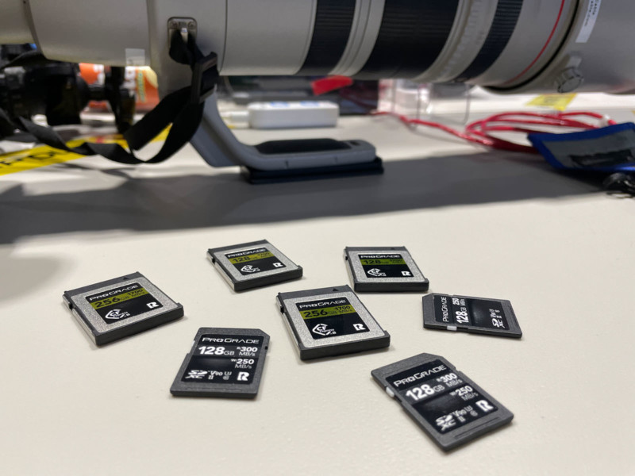
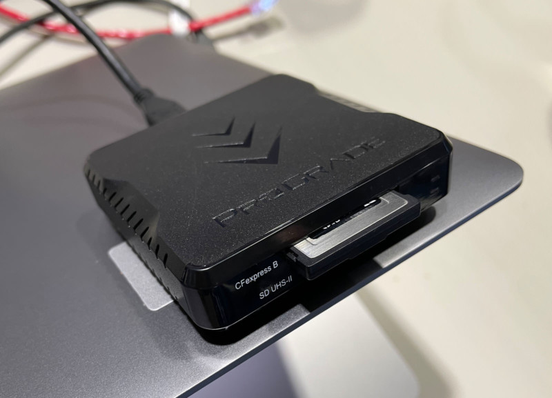
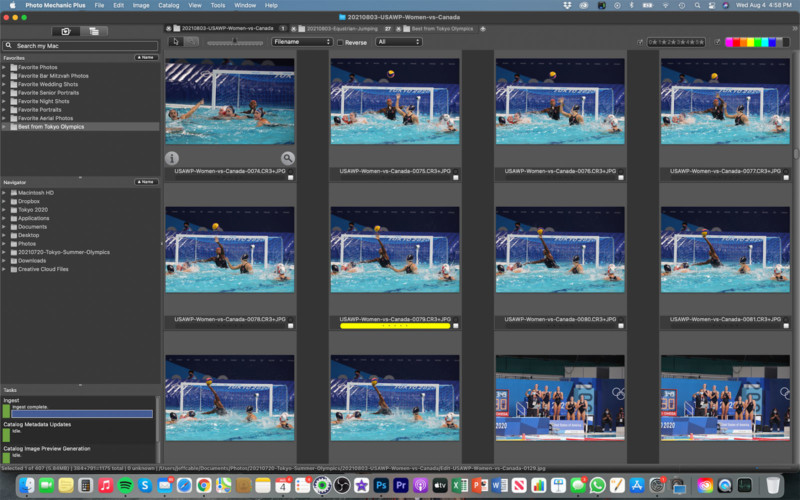
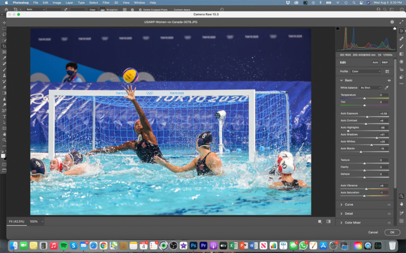
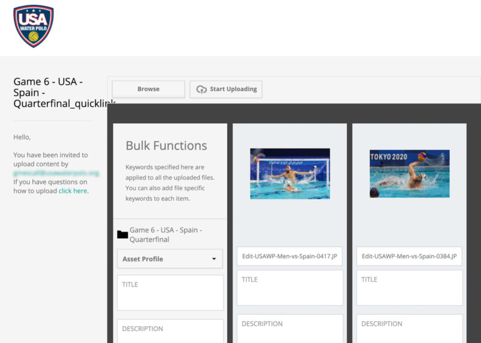
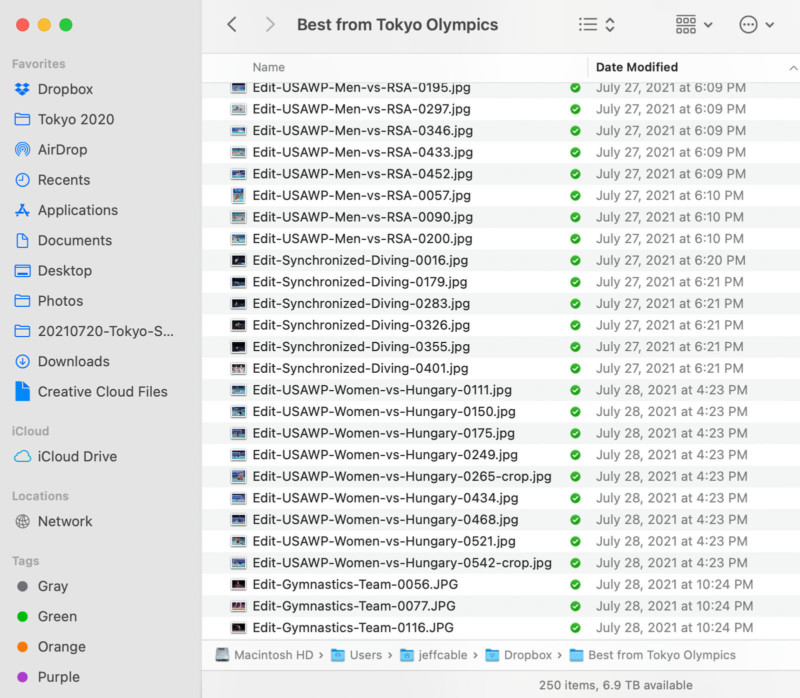
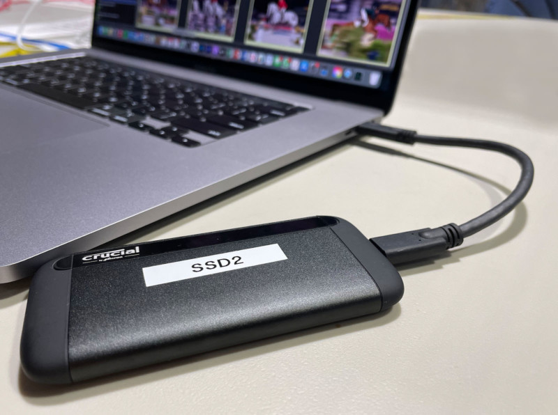

I was joking with someone yesterday about the craziness of the Olympics, and the pressures that we are all under during the Games. We were talking about how the world has different time zones and maybe they should add another just for the Olympics. For the media here, there is absolutely no consistency to our eating and sleeping patterns and time is just different.  

昨天我和某人开玩笑说奥运会的疯狂，以及我们在奥运会期间所承受的压力。 我们在谈论世界如何有不同的时区，也许他们应该为奥运会增加一个时区。 对于这里的媒体来说，我们的饮食和睡眠模式绝对没有一致性，只是时间不同而已。  

When a bus is 10 minutes late at home, it usually is no big deal, but here at the Olympics, when you are under deadlines all the time, ten minutes seems like an eternity. And those deadlines can be really daunting.

_**Editor’s note**: Photographer Jeff Cable has been covering the 2020 Tokyo Olympics and [documenting his journey on his fantastic personal blog](http://blog.jeffcable.com/)._

_**编者按** ：摄影师 Jeff Cable 一直在报道 2020 年东京奥运会，并 [在他出色的个人博客上记录了他的旅程](http://blog.jeffcable.com/) 。_

When I first photographed the Olympics, there really was no such thing as social media and the deadlines were in the hours, not the minutes. I remember being in Beijing and people were saying, take your time getting us images because it is still in the middle of the night back home. But those days are long gone, and we live in a world of immediacy.

当我第一次拍摄奥运会时，真的没有社交媒体这样的东西，截止日期是几小时，而不是几分钟。 我记得在北京的时候，人们说，慢慢来给我们拍照片，因为回到家还是半夜。 但那些日子早已一去不复返了，我们生活在一个即时的世界里。

The team does not want to wait for hours to get my photos, they want them as quickly as I can deliver them. And I am not alone in this. The media here are either working for entities that expect images right away, or they are freelance and competing to get their images picked up by the different news outlets around the world, therefore earning them an income.

团队不想等上几个小时才能拿到我的照片，他们希望我尽快交付照片。 我并不孤单。 这里的媒体要么为希望立即获得图像的实体工作，要么他们是自由职业者，竞相让世界各地不同的新闻媒体采用他们的图像，从而为他们赚取收入。

I am in a different situation, in that I do not upload my images to any of the wire services, I am shooting for the team and to post on the blog. But the team has high demands, and I don’t want to let them down. So I crank out my images as fast as I can.

我处于不同的情况，因为我没有将我的图像上传到任何有线服务，我正在为团队拍摄并发布在博客上。 但是团队要求很高，我不想让他们失望。 所以我尽可能快地制作我的图像。

The good news is that the new cameras have incredibly fast frame rates and I can shoot at up to 30 frames per second. The bad news is that, since I am shooting at these crazy fast burst rates, I end up with a lot more images when the competition is over. In a typical one-hour-long water polo game, it is not uncommon for me to shoot more than 2,000 images. And I need to go through all of them, find the best ones, retouch those and get them uploaded to the team FAST! And here is how I do it:

好消息是新相机的帧速率快得令人难以置信，我可以以每秒 30 帧的速度拍摄。 坏消息是，由于我以这些疯狂的快速连拍速度拍摄，比赛结束后我最终得到了更多的图像。 在典型的一小时水球比赛中，我拍摄超过 2,000 张图像的情况并不少见。 我需要检查所有这些，找到最好的，润饰它们并快速将它们上传到团队！ 我是这样做的：

## The Cameras and Memory Cards

## 相机和存储卡

I am shooting with Canon cameras, using a combination of the pre-production [Canon R3](https://www.adorama.com/car3.html?kbid=67085) and a [Canon R5](https://www.adorama.com/car5.html?kbid=67085). Both of these cameras are really fast, and both cameras write to CFexpress memory cards. These are the fastest memory cards on the market. Not only do they allow the camera to write to them quickly, but they also let me download the information very fast.

我正在使用佳能相机拍摄，结合使用预生产的 [佳能 R3](https://www.adorama.com/car3.html?kbid=67085) 和 [佳能 R5](https://www.adorama.com/car5.html?kbid=67085) 。 这两款相机都非常快，而且都写入 CFexpress 存储卡。 这些是市场上速度最快的存储卡。 它们不仅可以让相机快速写入它们，还可以让我非常快速地下载信息。

I am currently using ProGrade Digital memory cards and ProGrade Digital memory card readers which are the fastest and highest quality on the market. The other thing I like is that the ProGrade readers attach snap onto my laptop using a small magnet, so the reader is not dangling loosely by the cord.

我目前使用的是市场上速度最快、质量最高的 ProGrade Digital 存储卡和 ProGrade Digital 存储卡读卡器。 我喜欢的另一件事是 ProGrade 阅读器使用小磁铁将卡扣固定在我的笔记本电脑上，因此阅读器不会松散地挂在电源线上。

## The Download Process

## 下载过程

I am using a MacBook Pro 16″ from Apple and this laptop is really fast. I have two of the ProGrade Digital readers connected via USB-C and can usually download the 2,000+ images from any event in less than 3 minutes. I download all the images into [Photo Mechanic](https://home.camerabits.com/) because it is just blazing fast. Unlike other programs, I don’t have to wait for the images to render, I can just start jamming through them, I have yet to see any photographer at the Olympics who is not using this software. I usually start the download process, grab another bottle of water, run to the bathroom, and then come back to start the culling process.

我使用的是 Apple 的 MacBook Pro 16″，这款笔记本电脑速度非常快。 我有两个通过 USB-C 连接的 ProGrade Digital 阅读器，通常可以在不到 3 分钟的时间内从任何事件下载 2,000 多张图像。 我将所有图像下载到 [Photo Mechanic](https://home.camerabits.com/) 中，因为它速度非常快。 与其他程序不同，我不必等待图像渲染，我可以开始浏览它们，我还没有看到奥运会的摄影师没有使用这个软件。 我通常开始下载过程，再拿一瓶水，跑到洗手间，然后回来开始剔除过程。

## Culling the Images

## 剔除图像

Once everything is downloaded, I have two different workflow methods, depending on the urgency of the team.

下载所有内容后，我有两种不同的工作流程方法，具体取决于团队的紧迫性。

**1.** If the team needs a couple of images immediately, I will make a pass through the photos and color code the best of the best, and get to work on those right away. I have been doing this a long time and I can spot the keeper images really fast.

**1\.** 如果团队立即需要几张图片，我会把最好的照片和颜色代码传递给最好的，然后立即开始处理这些照片。 我已经这样做了很长时间，而且我可以非常快地发现守门员图像。

**2.** If I have a little more time, I make a really fast pass through all the images and tag the ones that are throw-aways. These images are either not sharp enough or not showing anything of value. There are times when I will fire off a burst of images because I am expecting a big play, and it never materializes. While I am going through and selecting the throw-aways, I am also color-coding the top images. To go through 2,000 images and make these selections takes me about 15 minutes. I then select all the tagged images and delete them. I then rename all the images (which takes seconds in Photo Mechanic) to something like “USAWP-Men-vs-Japan-0001”. I then filter out anything that is not color-coded and this leaves me with my keepers.

**2\.** 如果我有更多时间，我会非常快速地浏览所有图像并标记那些被丢弃的图像。 这些图像要么不够清晰，要么没有显示任何有价值的东西。 有时我会发出一连串的图像，因为我期待一场大戏，但它从未实现。 当我浏览并选择丢弃的图片时，我也在对最上面的图片进行颜色编码。 浏览 2,000 张图片并做出这些选择大约需要 15 分钟。 然后我选择所有标记的图像并删除它们。 然后我将所有图像（在 Photo Mechanic 中需要几秒钟）重命名为“USAWP-Men-vs-Japan-0001”之类的名称。 然后我过滤掉所有没有颜色编码的东西，这让我留给我的饲养员。

## Retouching the Images

## 修饰图像

Now that I am looking at only the top images that I have selected in Photo Mechanic, I start to determine which ones actually need to go to the team. I may have 60 images that were ranked high, but some might be redundant or not tell the story that they need. Heck, sometimes I have a killer image of the goalie but the ball is behind them, where they got scored on, and the team probably does not want to highlight that.

现在我只查看我在 Photo Mechanic 中选择的顶级图像，我开始确定哪些真正需要进入团队。 我可能有 60 张排名靠前的图片，但有些可能是多余的或者没有讲述他们需要的故事。 哎呀，有时我对守门员有一个杀手般的印象，但球在他们身后，他们得分的地方，而球队可能不想强调这一点。

So, I cruise through the top images and determine which ones will be retouched. If I only highlighted 25 or 30, I will retouch them all. In Photo Mechanic, I hit the “E” key and it automatically opens the image in Adobe Photoshop. I then make adjustments to the exposure, shadows, and highlights, crop the image if need be, and I will also straighten the photo if it is slightly crooked (which is almost all the time).

因此，我浏览最上面的图像并确定要修饰的图像。 如果我只突出显示 25 或 30，我将全部润色。 在 Photo Mechanic 中，我按下“E”键，它会自动在 Adobe Photoshop 中打开图像。 然后，我会调整曝光、阴影和高光，必要时裁剪图像，如果照片略微弯曲（几乎所有时间都是如此），我也会拉直照片。

I then save the new [JPEG file](https://petapixel.com/what-is-a-jpeg-file/) with “Edit-” in front of the file name. The Olympic Committee does not allow us to clone or make any changes to the images, because otherwise people might create images that do not reflect the reality of what we are seeing here.

然后我保存新的 [JPEG 文件](https://petapixel.com/what-is-a-jpeg-file/) ，在文件名前加上“Edit-”。 奥委会不允许我们克隆或对图像进行任何更改，否则人们可能会创建无法反映我们在这里看到的真实情况的图像。

## Upload the Images to the Team

## 将图像上传到团队

In the past, I created Dropbox folders for the team and uploaded all images to those folders. This year, USA Water Polo has me uploading directly to their new image cataloging system. If they need a couple of key images immediately, I can generally have them retouched and sent to them within 5 minutes. If I am delivering all the retouched images from the game (assuming I am delivering 25 or 30 photos), this can take about 20 minutes.

过去，我为团队创建了 Dropbox 文件夹并将所有图像上传到这些文件夹。 今年，美国水球让我直接上传到他们新的图像编目系统。 如果他们立即需要几张关键图片，我通常可以在 5 分钟内将它们润色并发送给他们。 如果我传送游戏中所有修饰过的图像（假设我传送 25 或 30 张照片），这可能需要大约 20 分钟。

When they are all retouched, I select all of them, [resize them](https://petapixel.com/how-to-resize-an-image-in-photoshop/) to 1800 pixels and upload them to the USAWP portal. When I get home from the Olympics, at some point I will upload all the full resolution files to them as well.

当它们全部被修饰后，我选择所有的，将它们 [调整](https://petapixel.com/how-to-resize-an-image-in-photoshop/) 到 1800 像素，并将它们上传到 USWAP 门户。 当我从奥运会回到家时，我也会在某个时候将所有完整分辨率的文件上传给他们。

## Selecting Images For Me

## 为我选择图像

Once I deliver images to the team, then I do a couple of other things with them. I take my ultimate favorites and move them to a Dropbox folder called “Best from Tokyo Olympics” so that I know they are safe in the cloud. I also take those same images and move them to [my website](https://www.jeffcable.com/tokyoolympics). Lastly, I take the images I want to use for the blog and I save those to 900 pixels with my watermark (also done in Photo Mechanic) and upload those to the blog site. I usually add the text later, while on a press bus or in my hotel room.

一旦我将图像交付给团队，我就会用它们做一些其他的事情。 我把我最喜欢的东西移到一个名为“东京奥运会精选”的 Dropbox 文件夹中，这样我就知道它们在云端是安全的。 我也拍了那些相同的图片并将它们移到 [我的网站上](https://www.jeffcable.com/tokyoolympics) 。 最后，我拍摄了我想用于博客的图像，并使用我的水印将它们保存为 900 像素（也在 Photo Mechanic 中完成），然后将它们上传到博客网站。 我通常稍后在媒体巴士上或在我的酒店房间里添加文本。

## Backing Up Here in Tokyo

## 在东京备份

Once I get back to my tiny little hotel room, I power up the MacBook Pro and connect a [2TB Crucial x8 SSD](https://www.adorama.com/ct2000x8ssd9.html?origterm=2TB+Crucial+x8+SSD&searchredirect=true&kbid=67085) to the laptop to back up the day’s images. I do this to at least two SSDs before I feel comfortable reformatting the ProGrade Digital cards for the next day. This way I have all the images in at least 3 places, once on the internal SSD of the laptop and on multiple SSDs.

回到酒店的小房间后，我打开 MacBook Pro 并将 [2TB Crucial x8 SSD](https://www.adorama.com/ct2000x8ssd9.html?origterm=2TB+Crucial+x8+SSD&searchredirect=true&kbid=67085) 连接到笔记本电脑以备份当天的图像。 在我觉得第二天重新格式化 ProGrade Digital 卡之前，我对至少两个 SSD 执行了此操作。 通过这种方式，我至少将所有图像放在 3 个位置，一次在笔记本电脑的内部 SSD 上，一次在多个 SSD 上。

## Permanently Backing Up

## 永久备份

When I get home from Tokyo, the first thing I will do (regardless of how tired I am) is take ALL the images from the Olympics and back them up to my Drobo 8D RAID system. This is a direct-attached hard drive system that is connected to my workstation. And then I will take all of those images and copy them over to my Drobo 810n NAS drive. This way they are backed up on my working drives for safekeeping. The cool thing is that my Drobo 810n remotely synchronizes every night at 11pm to another Drobo 810n that is located hundreds of miles away at my relative’s house in the Sacramento area. This way, if I ever have a fire or something bad happen at the house, I have every digital image I have ever taken that is stored off-site.

当我从东京回到家时，我要做的第一件事（不管我有多累）是拍摄奥运会的所有图像并将它们备份到我的 Drobo 8D RAID 系统。 这是连接到我的工作站的直连式硬盘驱动器系统。 然后我将拍摄所有这些图像并将它们复制到我的 Drobo 810n NAS 驱动器中。 通过这种方式，它们可以备份到我的工作驱动器上以便妥善保管。 很酷的是，我的 Drobo 810n 每晚 11 点都会与另一台 Drobo 810n 远程同步，该 Drobo 810n 位于数百英里外我在萨克拉门托地区的亲戚家中。 这样，如果我的房子发生火灾或发生一些不好的事情，我可以将我拍摄的所有数字图像都存储在场外。

All in all, this process does take a lot of brain processing power, and to do it numerous times a day is exhausting. But it is also fun to cull through images to see what I got after each shoot. Now I need to run — I have more images to go through.

总而言之，这个过程确实需要大量的大脑处理能力，而且每天做无数次很累。 但通过图像剔除以查看每次拍摄后我得到了什么也很有趣。 现在我需要跑步——我有更多的图像要处理。

___

_You can find more of Cable’s fantastic Olympics coverage and behind-the-scenes reports [on his blog](http://blog.jeffcable.com/)._

_找到更多 Cable 精彩的奥运会报道和幕后报道 [您可以在他的博客上](http://blog.jeffcable.com/) 。_

___

_**About the author**: Jeff Cable is a photographer based in the San Francisco Bay Area. You can find more of his work on his [website](http://www.jeffcable.com/), [Facebook](https://www.facebook.com/jeffcablephoto/), and [Instagram](https://www.instagram.com/jeffcablephotography/). This article was originally published [on Cable’s blog](http://blog.jeffcable.com/2021/08/my-photography-workflow-how-i-go.html)._

_**关于作者** ：Jeff Cable 是旧金山湾区的一名摄影师。 上找到他的更多作品 [您可以在他的网站](http://www.jeffcable.com/) 、 [Facebook](https://www.facebook.com/jeffcablephoto/) 和 [Instagram](https://www.instagram.com/jeffcablephotography/) 。 本文最初发表 [于 Cable 的博客](http://blog.jeffcable.com/2021/08/my-photography-workflow-how-i-go.html) 。_
