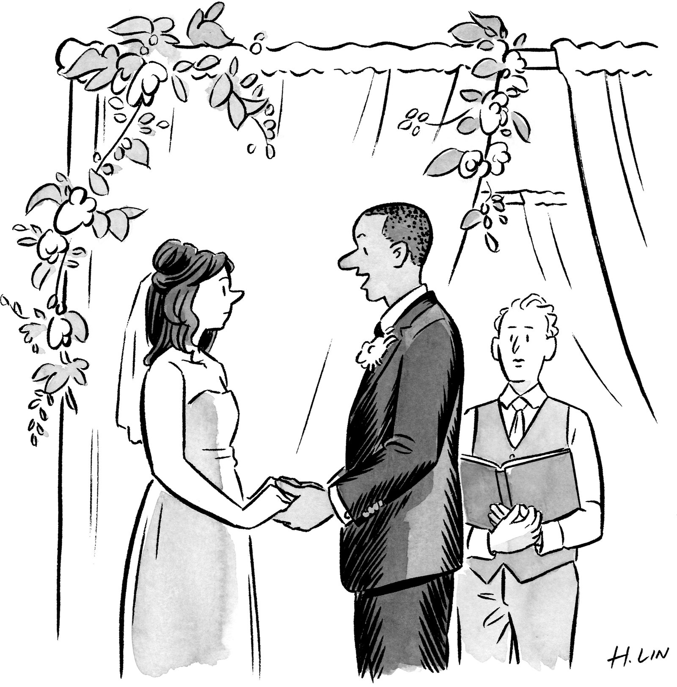
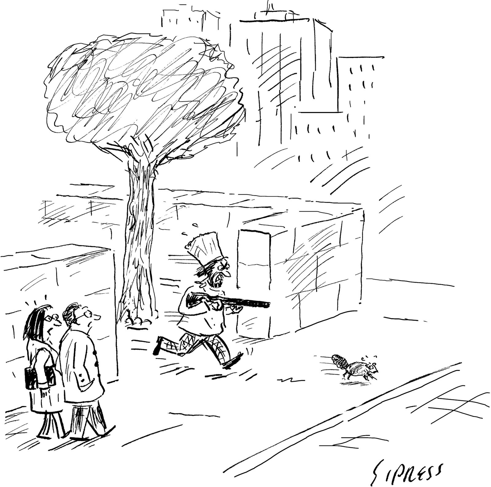

It was the Friday afternoon of Memorial Day weekend on Further Lane, the best street in Amagansett, the best town in the Hamptons, and the art dealer Larry Gagosian was bumming around his eleven-thousand-square-foot modernist beach mansion, looking pretty relaxed for a man who, the next day, would host a party for a hundred and forty people. A pair of French bulldogs, Baby and Humphrey, waddled about, and Gagosian’s butler, Eddie, a slim man with a ponytail and an air of informal professionalism, handed him a sparkling water. Gagosian sat down on a leather sofa in the living room, his back to the ocean view, and faced a life-size Charles Ray sculpture of a male nude, in reflective steel, and a Damien Hirst grand piano (bright pink with blue butterflies) that he’d picked up at a benefit auction some years back, for four hundred and fifty thousand dollars. On a coffee table before him was a ceramic Yoshitomo Nara ashtray the size of a Frisbee, decorated with a picture of a little girl smoking and the words “_too young to die_.”  

那是阵亡将士纪念日周末的周五下午，在阿莫甘西特最好的街道、汉普顿最好的小镇弗尔巷，艺术品经销商拉里·高古轩正在他那座 1.1 万平方英尺的现代主义海滩豪宅里闲逛，看上去很轻松。对于一个第二天要举办一百四十人聚会的人来说。一对法国斗牛犬，贝比和汉弗莱，摇摇晃晃地走来走去，高古轩的管家艾迪递给他一杯苏打水。高古轩坐在客厅的皮沙发上，背对着海景，面对着真人大小的查尔斯·雷 (Charles Ray) 男性裸体雕塑，采用反光钢制成，还有一架达米安·赫斯特 (Damien Hirst) 三角钢琴（亮粉色，带有蓝色蝴蝶）几年前，他在一次义卖会上以四十五万美元的价格买下了它。他面前的咖啡桌上放着一个飞盘大小的奈良美智陶瓷烟灰缸，上面装饰着一张小女孩抽烟的照片，上面写着“太年轻了，不能死”。

Gagosian is not a household name for most Americans, but among the famous and the wealthy—and particularly among the very wealthy—he is a figure of colossal repute. He is dubious of art dealers who refer to themselves as “gallerists,” which he regards as a pretentious euphemism that obscures the mercantile essence of the occupation. He has always favored a certain macho bluntness, and calls himself a dealer without apology. With nineteen galleries that bear his name, from New York to London to Athens to Hong Kong, generating more than a billion dollars in annual revenue, Gagosian may well be the biggest art dealer in the history of the world. He represents more than a hundred artists, living and dead, including many of the most celebrated and lucrative: Jenny Saville, [Anselm Kiefer](https://www.newyorker.com/magazine/2017/07/03/anselm-kiefers-beautiful-ruins), [Cy Twombly](https://www.newyorker.com/culture/the-art-world/cy-twombly-the-content-painter), [Donald Judd](https://www.newyorker.com/magazine/2020/03/09/the-cold-imperious-beauty-of-donald-judd). The business—which he owns without a partner or a shareholder or a spouse or children or anyone, really, to answer to—controls more than two hundred thousand square feet of prime real estate. All told, Gagosian has more exhibition space than most museums, and he shuttles among his outposts on his sixty-million-dollar Bombardier Global 7500 private jet. He’s been known to observe, with the satisfaction of Alexander the Great, “The sun never sets on my gallery.”  

对于大多数美国人来说，高古轩并不是一个家喻户晓的名字，但在名人和富人中——尤其是在非常富有的人中——他是一个享有盛誉的人物。他对自称为“画廊主”的艺术品经销商持怀疑态度，他认为这是一种自命不凡的委婉说法，掩盖了这一职业的商业本质。他一向喜欢表现出某种男子气概的直率，并且毫不歉意地称自己为经销商。从纽约到伦敦，从雅典到香港，有 19 家以他的名字命名的画廊，年收入超过 10 亿美元，高古轩很可能是世界历史上最大的艺术品经销商。他代表了一百多位在世和去世的艺术家，其中包括许多最著名和最赚钱的艺术家：珍妮·萨维尔、安塞姆·基弗、赛·托姆布雷、唐纳德·贾德。他拥有的这家企业没有合伙人、股东、配偶、子女或任何人，实际上，需要对其负责——控制着超过二十万平方英尺的优质房地产。总而言之，高古轩拥有比大多数博物馆更多的展览空间，并且他乘坐价值 6000 万美元的庞巴迪环球 7500 私人飞机在他的前哨站之间穿梭。众所周知，他曾说过令亚历山大大帝满意的一句话：“我的画廊里太阳永远不会落下。”

Traditionally, the model for dealers has been to bet on raw talents, and support these artists until work by some of them sells well enough to cover the bets made on all the others. Under the mega-gallery model that Gagosian pioneered, the top dealers don’t even bother with nascent artists. He has said plainly that an artist must achieve certain sales metrics before he’ll consider getting involved. Ellie Rines, who runs 56 Henry, a small gallery on the Lower East Side, told me, “What I can do that the big galleries can’t is that I spot someone who has potential. I say, ‘There’s something brewing here—the actual work may not be good, but there’s something tingling, it’s getting at something.’ ” Gagosian is content to let people like Rines do the wildcatting. Once they’ve discovered an unknown and nurtured her into a valuable commodity, he can lure the artist away with promises of more money, more support, and a bigger platform. When contemporaries describe Gagosian, they tend to summon carnivore analogies: a tiger, a shark, a snake. His own publicist once described him as “a real killer.”  

传统上，经销商的模式是押注于原始人才，并支持这些艺术家，直到其中一些艺术家的作品卖得足够好，足以覆盖所有其他艺术家的押注。在高古轩开创的巨型画廊模式下，顶级经销商甚至不关心新生艺术家。他明确表示，艺术家必须达到一定的销售指标，然后才会考虑参与其中。下东区一家小型画廊 56 Henry 的经营者埃莉·莱恩斯 (Ellie Rines) 告诉我：“我能做到大画廊做不到的事情就是发现有潜力的人。我说，‘这里正在酝酿一些东西——实际的工作可能并不好，但有一些令人兴奋的东西，它正在得到一些东西。’”高古轩很乐意让像莱恩斯这样的人进行野猫。一旦他们发现了一个未知的人并将她培养成一种有价值的商品，他就可以用更多的钱、更多的支持和更大的平台的承诺来引诱这位艺术家。当同时代的人描述高古轩时，他们往往会用肉食动物来比喻：老虎、鲨鱼、蛇。他自己的公关人员曾形容他是“一个真正的杀手”。

The languid calm that he exuded on the eve of the Amagansett party was that of a predator between meals. At seventy-eight, he remains tall and broad-shouldered, with a full head of white hair that he keeps trimmed close to the scalp, like a beaver pelt. Gagosian has blue eyes, which often flash with mirth—he has a quick, salty sense of humor—but they can just as suddenly go blank if he feels threatened or wants to be inscrutable. In conversation, these abrupt transitions from easy bonhomie to enigmatic hostility and back again can be jarring.  

阿玛甘塞特聚会前夕，他表现出的慵懒平静就像是两餐之间的掠食者。七十八岁的他仍然身材高大，肩膀宽阔，满头白发，他把头发修剪得紧贴头皮，就像海狸毛皮一样。高古轩有一双蓝眼睛，经常闪现出欢笑的光芒——他有一种快速、咸涩的幽默感——但如果他感到受到威胁或想要变得神秘莫测，他的眼睛也会突然变得空白。在谈话中，从轻松的友善到神秘的敌意然后再转回来的突然转变可能会让人感到不舒服。

“I vow to recount every weird dream I have with a generous amount of detail.”  

“我发誓要详细讲述我所做的每一个奇怪的梦。”

Cartoon by Hartley Lin Hartley Lin 的卡通

“I have a weakness for entertaining,” Gagosian told me. At seven the following morning, he explained, trucks would arrive with garden furniture, and his staff would mobilize. There would be barbecue. Pizza baked in an outdoor oven. An Aperol-spritz bar and a gelato truck. Even as a child, Gagosian recalled, he liked to “have people over to my place,” and to his many friends and customers and sycophants the yearly swirl of “Larry parties” has become its own exclusive social calendar. In addition to the Memorial Day party, there is a Labor Day party, also in Amagansett; a dinner at Art Basel, in Switzerland, every June; a one-night-only exhibition at Casa Malaparte, a cliffside house in Capri; birthday parties and pre-release film screenings and opening-night banquets; a New Year’s bash at his place in St. Barts; and a pre-Oscars party at his home in Los Angeles. The sheer magnitude of his overhead is a source of envy—and confusion. His close friend Glenn Fuhrman, a financier and art collector, told me, “I’ve had so many conversations with other dealers over the years who are just dumbstruck that Larry could possibly be making money. They say, ‘I know how _my_ business works—I don’t understand how he could be making a profit.’ ”  

“我有娱乐性的弱点，”高古轩告诉我。他解释说，第二天早上七点，卡车将带着花园家具抵达，他的员工也会动员起来。会有烧烤。在户外烤箱中烘烤的披萨。一家开胃酒酒吧和一辆冰淇淋车。高古轩回忆说，即使在孩提时代，他就喜欢“邀请人们到我家来”，对于他的许多朋友、顾客和谄媚者来说，每年一度的“拉里派对”已经成为他自己专属的社交日历。除了阵亡将士纪念日派对外，阿玛甘西特还举办劳动节派对；每年六月在瑞士巴塞尔艺术展举办的晚宴；卡萨马拉帕特 (Casa Malaparte) 举办的仅一晚的展览，这是卡普里岛悬崖边的房子；生日派对、预映电影放映和开幕晚宴；在他位于圣巴兹的住所举办的新年庆祝活动；以及在他洛杉矶的家中举办的奥斯卡前派对。他的开销之大令人羡慕，也令人困惑。他的密友格伦·福尔曼（Glenn Fuhrman）是一位金融家和艺术品收藏家，他告诉我：“多年来，我与其他经销商进行过多次交谈，他们都对拉里可能赚钱感到惊讶。他们说，‘我知道我的生意是如何运作的，但我不明白他如何盈利。’”

Gagosian vets each guest list with the vigilance of a night-club bouncer. Of the Memorial Day festivities, he said, “There’s nobody invited that I didn’t approve.” The crowd, he explained, would consist of “billionaires, artists, neighbors—mostly people I really know and am close to.” A pause, a wolfish grin. “Or want to be close to.” Derek Blasberg, a writer and fashion editor who has held a staff position at Gagosian’s gallery since 2014, told me, “Larry is a full-time gallerist and a part-time casting agent. He knows how to pull the right mix of people from worlds that are financially lucrative and creatively inspiring.” Blasberg is known for his friendships with models and actresses, which he chronicles on [a popular Instagram feed](https://www.instagram.com/derekblasberg/?hl=en). Often, Blasberg told me, Gagosian will call him and say, “I saw you with So-and-So. Can you invite them?”  

高古轩以夜总会保镖的警惕性审查每一位宾客名单。在谈到阵亡将士纪念日庆祝活动时，他说，“没有人被邀请是我不批准的。”他解释说，人群将包括“亿万富翁、艺术家、邻居——大部分是我真正认识和亲近的人。”停顿了一下，露出狼一般的笑容。 “或者说想要靠近。”德里克·布拉斯伯格 (Derek Blasberg) 是一位作家兼时尚编辑，自 2014 年以来一直在高古轩画廊担任职员，他告诉我：“拉里是一名全职画廊主，也是一名兼职选角经纪人。他知道如何从经济上有利可图且富有创造力的世界中吸引合适的人才组合。”布拉斯伯格因与模特和女演员的友谊而闻名，他在 Instagram 上的热门动态中记录了这些友谊。布拉斯伯格告诉我，高古轩经常打电话给他说：“我看到你和某某在一起。你能邀请他们吗？”

A Gagosian party requires adroit curation. Too many billionaires and it’ll be as dull as [Davos](https://www.newyorker.com/magazine/2012/03/05/magic-mountain-davos); too many artists and celebrities and who’s going to buy the art? Some years ago, a staffer planning a dinner for a Richard Prince opening wrote in an e-mail to colleagues, “Before Larry approves this list he would like to know if you have sold any art to these people.” That list included actors (Robert De Niro, Leonardo DiCaprio), fat-cat art collectors (Steve Cohen, Henry Kravis), and models (Gisele Bündchen, Kate Moss). Models are important, Gagosian once explained, because they “look good at a dinner table.”  

高古轩派对需要巧妙的策划。亿万富翁太多了，就会像达沃斯一样乏味；太多的艺术家和名人，谁会购买艺术品？几年前，一位为理查德·普林斯 (Richard Prince) 开幕式准备晚宴的员工在给同事的电子邮件中写道：“在拉里批准这份名单之前，他想知道您是否向这些人出售过任何艺术品。”该名单包括演员（罗伯特·德尼罗、莱昂纳多·迪卡普里奥）、肥猫艺术收藏家（史蒂夫·科恩、亨利·克拉维斯）和模特（吉赛尔·邦辰、凯特·莫斯）。高古轩曾经解释说，模特很重要，因为它们“在餐桌上看起来很漂亮”。

The beach house’s front door opened and Anna Weyant, Gagosian’s girlfriend, entered. She is petite and blond and was wearing oversized sunglasses and holding a half-finished beer. Her hair was wet and she greeted him warmly.  

海滨别墅的前门打开了，高古轩的女朋友安娜·维扬特走了进来。她身材娇小，金发碧眼，戴着超大墨镜，手里拿着一杯喝了一半的啤酒。她的头发湿漉漉的，热情地向他打招呼。

“Were you swimming?” Gagosian asked.  

“你游泳了吗？”高古轩问道。

“Yeah,” she said, smiling, before disappearing upstairs.  

“是的，”她微笑着说，然后消失在楼上。

At twenty-eight, Weyant is half a century younger than Gagosian. She is also one of his artists, and her work has sold at auction for more than a million dollars. One painting, an eerily sensual oil portrait of an upside-down young woman who is sticking out her tongue, hangs in the vestibule, between a Prince and a Twombly.  

韦扬特今年二十八岁，比高古轩年轻半个世纪。她也是他的艺术家之一，她的作品在拍卖会上售价超过百万美元。门厅里挂着一幅画，画的是一位倒立的年轻女子伸出舌头，画的是一位怪异性感的油画肖像，位于一位王子和一位托姆布雷之间。

Gagosian has been so successful selling art to the masters of the universe that somewhere along the line he stopped being their servant. “He’s _one_ of them,” Andy Avini, a senior director at the gallery, told me. In fact, for much of Gagosian’s clientele he is less a peer than an aspirational figure.  

高古轩如此成功地向宇宙的主人推销艺术，以至于他不再是他们的仆人。 “他是其中之一，”画廊的高级总监安迪·阿维尼 (Andy Avini) 告诉我。事实上，对于高古轩的大部分客户来说，他与其说是一个同行，不如说是一个有抱负的人物。

Unlike many luxury items, art works tend to be unique objects—“one of one,” in the parlance of the trade. The designer [Marc Jacobs](https://www.newyorker.com/magazine/2008/09/01/enchanted) told me, “Larry sells things that aren’t for sale.” Typically, the most coveted items become available only when the previous owner dies, or gets divorced, or goes bankrupt. An élite dealer like Gagosian, however, can sometimes wrest away a treasure by offering the owner—ideally someone he knows—a whopping premium. If you want the right kind of [Jasper Johns](https://www.newyorker.com/magazine/2021/10/11/jasper-johns-remains-contemporary-arts-philosopher-king) to round out your collection, you enlist Gagosian to help you find one hanging on somebody else’s wall, then make the owner an offer he can’t refuse. If he does refuse, double the offer. Then, if necessary, double it again. It is the super-rich equivalent of ordering off-menu.  

与许多奢侈品不同，艺术品往往是独特的物品——用行业术语来说就是“独一无二”。设计师马克·雅各布斯告诉我，“拉里卖的是非卖品。”通常，只有当前任主人去世、离婚或破产时，最令人垂涎的物品才会出现。然而，像高古轩这样的精英经销商有时可以通过向所有者（最好是他认识的人）提供巨额溢价来夺取宝藏。如果你想要合适的 Jasper Johns 作品来充实你的收藏，你可以请高古轩帮你找到一件挂在别人墙上的作品，然后向主人提出一个他无法拒绝的报价。如果他拒绝，就加倍出价。然后，如有必要，再次加倍。这相当于超级富豪们点菜单外的菜。

Gagosian, the businessman and collector Charles Saatchi, and the dealer Leo Castelli, in St. Barts in 1991.Photograph by Jean Pigozzi  

1991 年，高古轩、商人兼收藏家查尔斯·萨奇 (Charles Saatchi) 和经销商利奥·卡斯泰利 (Leo Castelli) 在圣巴茨。摄影：Jean Pigozzi

Gagosian maintains his influence by attending to the discreet status anxiety of the buyer who already has everything. Aaron Richard Golub, an attorney who represents galleries and wealthy collectors—and who has litigated against Gagosian on numerous occasions—told me, “People in the art world are incredibly insecure. The richest guy walks into the room. He wants a certain painting, but he can’t get it. Immediately, he’s insecure. That really is part of what Larry does. He exploits that.” A friend of Gagosian’s described attending a dinner at the dealer’s Manhattan town house, along with a fabulously wealthy tech founder, and witnessing a look of “real consternation” on the young man’s face as it dawned on him that, for all his money and power, he was not as connected as Gagosian, not as cultured, not as cool. Everybody was having a grand time, yet this potentate was experiencing an unspoken social demotion. Suddenly, he was a mere arriviste—a visitor at a club to which he didn’t belong. “It’s incredible,” Loïc Gouzer, a friend of Gagosian’s and a former co-chairman of contemporary art at Christie’s, marvelled. “He inverted this thing where normally the art dealers were trying to emulate their clients. Larry’s clients are trying to emulate _him_.”  

高古轩通过关注已经拥有一切的买家谨慎的地位焦虑来维持自己的影响力。代表画廊和富有收藏家的律师亚伦·理查德·戈卢布（Aaron Richard Golub）曾多次对高古轩提起诉讼，他告诉我：“艺术界的人们非常没有安全感。最富有的人走进房间。他想要某幅画，但他买不到。立刻，他就没有安全感了。这确实是拉里所做的一部分。他利用了这一点。”高古轩的一位朋友描述了他与一位极其富有的科技创始人一起参加经销商位于曼哈顿联排别墅的晚宴，并目睹了这位年轻人脸上的“真正的惊愕”表情，因为他意识到，尽管他拥有所有的金钱和权力，他不像高古轩那样有联系，不像高古轩那样有文化，不像高古轩那么酷。每个人都在享受着盛大的时光，但这位君主却在经历着不言而喻的社会降级。突然间，他变成了一名暴发户——一个他不属于的俱乐部的访客。 “这太不可思议了，”高古轩的朋友、佳士得当代艺术前联席主席卢伊克·古泽 (Loïc Gouzer) 惊叹不已。 “他颠覆了艺术品经销商通常试图效仿客户的做法。拉里的客户正在试图效仿他。”

Gagosian isn’t the first to pull off this transposition. He is a big reader, and one of his favored subjects is the life of [Joseph Duveen](https://www.newyorker.com/magazine/1951/09/29/the-days-of-duveen), the great dealer who helped assemble the collections of Andrew Mellon, J. P. Morgan, and other Gilded Age titans. There are several biographies of Duveen, Gagosian informed me, and he has “read ’em all.” According to [one of them](https://www.amazon.com/Duveen-Story-Most-Spectacular-Dealer/dp/1892145170?ots=1&slotNum=0&imprToken=ecc4f48b-152f-ccc3-c34&tag=thneyo0f-20&linkCode=w50), by S. N. Behrman, Duveen made a point of “showing his multimillionaire clients that he lived better than they did.”  

高古轩并不是第一个实现这种转变的人。他是一位大读者，他最喜欢的主题之一是约瑟夫·杜文的生活，这位伟大的商人帮助收集了安德鲁·梅隆、摩根大通和其他镀金时代巨头的藏品。高古轩告诉我，杜维恩的传记有几本，他“都读过”。其中一位作者 S. N. Behrman 表示，杜维恩强调“向他的百万富翁客户展示他比他们生活得更好”。

Numerous friends of Gagosian’s cautioned me not to mistake the merry-go-round of parties and galas and superyacht cruises for a life of sybaritic leisure. The dealer and collector Tico Mugrabi, who has made many deals with Gagosian, said, “The guy is always working, even when he’s having fun. This motherfucker works 24/7.” The British painter Jenny Saville, the most expensive living female artist, who has worked with Gagosian throughout her career, concurred: “Even if he’s having dinner, or if he’s on holiday on a boat, it’s not a holiday. All the fun dinners—they have a _reason_ for being fun.”  

高古轩的许多朋友告诫我不要将旋转木马般的派对、盛会和超级游艇巡航误认为是奢侈的休闲生活。与高古轩有过多次交易的经销商兼收藏家蒂科·穆格拉比 (Tico Mugrabi) 表示：“这家伙总是在工作，即使在玩得很开心的时候。这个混蛋24/7 都在工作。”英国画家珍妮·萨维尔（Jenny Saville）是身价最高的在世女艺术家，她在整个职业生涯中一直与高古轩合作，她也表示同意：“即使他正在吃晚饭，或者在船上度假，那也不是假期。所有有趣的晚餐——它们都有有趣的理由。”

Gagosian’s longtime friend Jean Pigozzi, a photographer and collector, described the parties as marketing showcases in disguise. “Larry’s a genius at finding these guys, then he brings them to his house, and people say, ‘Oh, perhaps _I_ should get a couple of Picassos.’ ” Once, Pigozzi recalled, he was at Gagosian’s Manhattan home with the French billionaire Bernard Arnault, and Arnault expressed enthusiasm for some art on display. “I told him, ‘Everything here is for sale. Don’t be nervous. You want to buy the chair? You can buy the chair. You want to buy the painting? Just ask! It’s all for sale.’ ” Gagosian insisted to me that he does not “sell art out of my house,” then allowed that he actually has. A true dealer knows that everything has a price, and the best way to raise the price of something is to say that you would never sell it.  

高古轩的老朋友、摄影师兼收藏家让·皮戈齐 (Jean Pigozzi) 将这些派对描述为变相的营销展示。 “拉里是发现这些人的天才，然后他把它们带到他家，人们会说，‘哦，也许我应该买几幅毕加索的作品。’”皮戈齐回忆道，有一次，他和这位法国亿万富翁一起在高古轩位于曼哈顿的家中。伯纳德·阿尔诺和阿尔诺对展出的一些艺术品表达了热情。 “我告诉他，‘这里的一切都可以出售。别紧张。你想买椅子吗？你可以买椅子。你想买这幅画吗？就问吧！一切都是为了出售。”高古轩向我坚称他不会“在我家里出售艺术品”，然后又承认他确实这么做了。真正的经销商知道任何东西都有价格，而提高某物价格的最好方法就是说你永远不会卖掉它。

As Gagosian likes to point out, he didn’t start life as an insider. He came of age in the San Fernando Valley, in a middle-class Armenian American family. His father, Ara, was a municipal accountant who later retrained as a stockbroker. The family never went to museums or emphasized the visual arts. But Gagosian’s parents both dabbled in show biz, performing in an Armenian theatre troupe, and his mother, Ann, had a small role in “Journey Into Fear,” a 1943 movie that was produced by [Orson Welles](https://www.newyorker.com/magazine/2015/12/07/the-shadow). Once, when Gagosian asked his mother what Welles had been like, she revealed that he’d taken her out for coffee. “And I said, ‘O.K., I don’t want to know any more,’ ” Gagosian recalled with a chuckle, adding, “My mom was attractive.”  

正如高古轩喜欢指出的那样，他并不是以内部人士的身份开始生活的。他在圣费尔南多谷的一个亚美尼亚裔美国中产阶级家庭长大。他的父亲阿拉是一名市政会计师，后来接受再培训成为一名股票经纪人。这家人从不去过博物馆，也不重视视觉艺术。但高古轩的父母都涉足演艺圈，在亚美尼亚剧团表演，他的母亲安 (Ann) 在 1943 年奥森·威尔斯 (Orson Welles) 制作的电影《恐惧之旅》(Journey Into Fear) 中扮演了一个小角色。有一次，当高古轩问他的母亲威尔斯怎么样时，她透露他带她出去喝咖啡。 “我说，‘好吧，我不想再知道了，’”高古轩笑着回忆道，并补充道，“我妈妈很有魅力。”

It wasn’t a happy childhood. Ara “liked to gamble, I think more than he should,” Gagosian said, and also “drank probably more than he should.” Gagosian rebelled as a teen-ager, and he told me that it was hard for his father “to discipline me, in a certain way, because _his_ life didn’t seem particularly disciplined.” Most of Ara’s stockbroking, Gagosian said, seemed to consist of “trying to talk his relatives into buying securities from him.” (Gagosian has a sister, Judy, who declined to be interviewed for this article.) One peculiarity of Gagosian’s origin story, at least in his telling, is that his early years had a notable deficit of the quality that has come to define his life: ambition. He attended U.C.L.A., where he studied English, joined the swim team, and did a little photography. But he dropped out twice and took six years to graduate. It was the sixties, and he was in no hurry: he was a good-looking guy who liked chasing girls and playing pool and getting stoned with his pals. There was a brief, ill-considered marriage, in Vegas, to a college girlfriend, Gwyn Ellen Garside. They divorced after sixteen days. It was “stupid” to marry so young, Gagosian says now. In the divorce papers, Garside explained that she’d married him with the false understanding that they would “have children” and “both work and save to be self-supporting and to build a future together.” Gagosian’s aimlessness was so pronounced that his father once said, in exasperation, “If you just do something with your life, _I’ll_ buy you pot.” (In 1969, the year Gagosian finally graduated, Ara died, of lung cancer. He was fifty-nine.)  

这并不是一个快乐的童年。高古轩说，阿拉“喜欢赌博，我想得比他应该的多”，而且“喝的酒可能比他应该喝的多”。高古轩十几岁的时候就叛逆，他告诉我，他的父亲很难“以某种方式管教我，因为他的生活似乎并不是特别有纪律。”高古轩说，阿拉的大部分股票经纪业务似乎都是“试图说服他的亲戚从他那里购买证券”。 （高古轩有一个妹妹朱迪，她拒绝接受本文的采访。）高古轩的起源故事的一个特点，至少在他的讲述中，是他早年的生活质量存在明显的缺陷，而这种质量后来决定了他的生活: 野心。他就读于加州大学洛杉矶分校，在那里学习英语，加入游泳队，还做了一些摄影。但他两次退学，花了六年才毕业。那是六十年代，他并不着急：他是一个英俊的小伙子，喜欢追女孩、打台球、和朋友一起喝醉。在维加斯，她与大学女友格温·艾伦·加赛德（Gwyn Ellen Garside）有过一段短暂且考虑不周的婚姻。十六天后他们离婚了。高古轩现在说，这么年轻就结婚是“愚蠢的”。加赛德在离婚文件中解释说，她嫁给他时错误地认为他们会“生孩子”，“既要工作又要存钱，才能自力更生，共同建设未来”。高古轩的漫无目的是如此明显，以至于他的父亲曾经愤怒地说：“如果你只是用你的生活做点什么，我就给你买大麻。” （1969 年，高古轩最终毕业的那一年，阿拉因肺癌去世。他当时五十九岁。）

After college came a string of menial jobs: in a record store; in a grocery store; the graveyard shift at a gas station. Then, through a cousin, Gagosian became an assistant at the William Morris Agency, answering phones and reading scripts. But he hated the airless corporate environment and the jockeying of his colleagues, likening the experience to “a knife fight in a phone booth.” He has occasionally suggested that he was fired by William Morris, but when I spoke to Michael Ovitz, who supervised him there, he insisted that Gagosian quit. “I tried to get him to stay!” Ovitz recalled, adding that he thinks Gagosian could have made a formidable agent. He noted of art dealing, “The vocations are similar. You’re buying and selling.”  

大学毕业后，我从事了一系列卑微的工作：在唱片店工作；在杂货店；加油站的夜班。然后，通过表弟，高古轩成为威廉·莫里斯经纪公司的助理，负责接听电话和阅读剧本。但他讨厌空气不流通的公司环境和同事们的争先恐后，将这种经历比作“电话亭里的刀战”。他偶尔会暗示自己被威廉·莫里斯解雇了，但当我与在那里监督他的迈克尔·奥维茨交谈时，他坚持让高古轩辞职。 “我试图让他留下来！”奥维茨回忆道，并补充说，他认为高古轩本可以成为一名令人敬畏的经纪人。他谈到艺术品交易时说：“职业是相似的。你在买卖。”

Gagosian started working as a parking attendant in Westwood. He didn’t mind the job, he says: it paid better than the ninety dollars a week he’d made at William Morris. Then one day, in a moment now enshrined in art-world lore, he noticed a street vender selling posters at the edge of the parking lot. If Gagosian possesses one secret weapon that has equipped him for success, it might be his disinhibition. He approached the vender. The posters were “schlock,” Gagosian told me—a kitten toying with a ball of yarn and other images you might find on the wall at a pediatrician’s office. But they seemed to be selling. So Gagosian proceeded to, in his words, “copy the guy’s business.” The posters came from a company called Ira Roberts of Beverly Hills, and Gagosian started buying directly from the firm and selling on his own. Art was an arbitrary choice, in his account: “If he’d been selling belt buckles, I might’ve tried to sell belt buckles.”  

高古轩开始在韦斯特伍德担任停车服务员。他说，他并不介意这份工作：它的薪水比他在威廉·莫里斯公司每周赚的九十美元还要高。然后有一天，在艺术界传说中的那一刻，他注意到一名街头小贩在停车场边缘出售海报。如果高古轩拥有一件让他取得成功的秘密武器，那可能就是他的抑制解除。他走近小贩。高古轩告诉我，这些海报很“劣质”——一只小猫正在玩弄毛线球，还有儿科医生办公室墙上可能会发现的其他图像。但他们似乎正在出售。因此，用高古轩的话说，“复制那家伙的生意”。这些海报来自一家名为 Ira Roberts of Beverly Hills 的公司，高古轩开始直接从该公司购买并自己销售。在他的描述中，艺术是一个任意的选择：“如果他一直在卖皮带扣，我可能会尝试卖皮带扣。”

By adding a cheap frame, he discovered, he could sell a two-dollar poster at a considerable markup, for fifteen bucks. He leased a little patio on Broxton Avenue, in Westwood, and sold framed posters to passersby. Gradually, Gagosian’s slacker instincts gave way to a more hard-nosed entrepreneurialism. He began letting local craftspeople sell leather goods and painted trinkets on the patio, in exchange for six dollars a day and ten per cent of their gross. In an optimistic flourish, he bestowed a name on his ad-hoc enterprise: the Open Gallery. In 1972, Gagosian told the Los Angeles _Times_, “It’s sort of a halfway house, halfway between having to be in business for yourself and being a stone-freak-do-nothing hippie.” Eventually, he hired a few people and moved indoors, opening a proper shop on Broxton. One early employee was the musician Kim Gordon, who, before she formed the band Sonic Youth, assembled thousands of picture frames for Gagosian. In [a 2015 memoir](https://www.amazon.com/Girl-Band-Memoir-Kim-Gordon/dp/006229590X?ots=1&slotNum=1&imprToken=ecc4f48b-152f-ccc3-c34&tag=thneyo0f-20&linkCode=w50), Gordon recalled him shouting at her when she worked too slowly, and noted, “He was erratic, and the last person on the planet I would have ever thought would later become the world’s most powerful art dealer.”  

他发现，通过添加一个廉价的框架，他可以以 15 美元的价格以相当大的加价出售一张两美元的海报。他在韦斯特伍德的布罗克斯顿大道上租了一个小露台，并向路人出售镶框海报。渐渐地，高古轩的懒惰本能让位于更加顽固的企业家精神。他开始让当地工匠在露台上出售皮革制品和彩绘小饰品，以换取每天六美元和总收入的百分之十。他乐观地为自己的临时企业起了一个名字：开放画廊。 1972年，高古轩告诉《洛杉矶时报》，“这有点像一个中途之家，介于必须为自己做生意和成为一个无所事事的嬉皮士之间。”最终，他雇了几个人搬进室内，在布罗克斯顿开了一家像样的商店。音乐家金·戈登 (Kim Gordon) 是一位早期员工，她在组建 Sonic Youth 乐队之前，为高古轩组装了数千个相框。在 2015 年的回忆录中，戈登回忆起，当她工作太慢时，他对她大喊大叫，并指出，“他不稳定，我没想到这个星球上的人后来会成为世界上最有权势的艺术品经销商。”

Cartoon by Jared Nangle 杰瑞德·南格尔 (Jared Nangle) 创作的卡通片

Ara Gagosian might never have made much money, Larry told me, but he always had “a nice car in the driveway.” At the start of Larry’s ascent, he also projected an image of success that was out of proportion to how well he was actually doing. From his first days in the business, stories circulated about unpaid bills, creditors chasing him, a repo man showing up for his car. Doreen Luko, an early staffer in L.A., told me that on payday Gagosian’s employees “literally ran to the bank in hopes that there would be money there for our paychecks—whoever got there first was going to get paid on time.” Mike Shatzkin, a U.C.L.A. classmate with whom he lived for a period during the seventies, told me that Gagosian sometimes walked out of a restaurant without paying the check. “I did it with him once, but it was a thing he did,” Shatzkin said. (Gagosian denies this.) One detail that has gone largely unreported in chronicles of Gagosian’s career is that, in 1969, he pleaded guilty to two felony charges of forgery, stemming from his use of someone else’s credit card. The card was “being passed around by a bunch of my friends,” he told me. “It was a stupid mistake.” He received a suspended sentence and probation.  

拉里告诉我，阿拉·高古轩可能永远赚不了多少钱，但他“车道上总是有一辆好车”。拉里在晋升之初，还展现出一种与他实际表现不成比例的成功形象。从他进入这个行业的第一天起，关于未付账单、债权人追捕他、回购人出现在他的汽车上的故事就流传开来。洛杉矶的一名早期员工多琳·卢科 (Doreen Luko) 告诉我，在发薪日，高古轩的员工“实际上是跑到银行，希望那里有钱可以支付我们的工资——无论谁先到那里，都能按时拿到工资。”迈克·沙茨金 (Mike Shatzkin)，加州大学洛杉矶分校七十年代与他住过一段时间的同学告诉我，高古轩有时会不付账单就走出餐馆。 “我和他一起做过一次，但这是他做的事情，”沙茨金说。 （高古轩否认了这一点。）在高古轩职业生涯的编年史中基本上没有报道的一个细节是，1969 年，他因使用他人的信用卡而承认了两项伪造罪重罪。他告诉我，这张卡片“被我的一群朋友传阅”。 “这是一个愚蠢的错误。”他被判处缓刑和缓刑。

Sensing an opportunity to make a bigger mark, Gagosian began carrying fine art, mostly prints and photographs. The actor Steve Martin told me, “When he had his poster shop in Westwood, I went in. I was a novice art collector and he was a novice art dealer.” Martin and other young Hollywood types who were starting to collect would get drawn in by something in the window and find themselves in conversation with the eager, gregarious proprietor. Gagosian had no training in art history, but the business he’d stumbled into was one for which he was preternaturally suited. He had a keen sense of aesthetics and design, and what fellow-connoisseurs describe as a near-photographic visual memory. He also was a quick learner. “Next to his bed, he had these stacks of art books,” a woman he briefly dated around this time, Xiliary Twil, recalled. “He was really studying.” One day in the mid-seventies, Gagosian was paging through a magazine and came across a series of photographs he liked—moody black-and-white shots by the New York photographer Ralph Gibson. Gagosian cold-called Gibson and announced, “I’ve got this gallery.” How about a West Coast exhibition?  

高古轩意识到有机会取得更大的成就，开始经营美术作品，主要是版画和照片。演员史蒂夫·马丁告诉我，“当他在韦斯特伍德开海报店时，我进去了。我是一个新手艺术品收藏家，他是一个新手艺术品经销商。”马丁和其他开始收藏的好莱坞年轻人会被橱窗里的东西吸引，并发现自己正在与热心、合群的店主交谈。高古轩没有受过艺术史方面的训练，但他偶然涉足的行业却是他异常适合的行业。他对美学和设计有着敏锐的感觉，以及鉴赏家所说的近乎摄影的视觉记忆。他学东西也很快。 “他的床边有成堆的艺术书籍，”他当时短暂约会过的一位女士 Xiliary Twil 回忆道。 “他真的在学习。”七十年代中期的一天，高古轩翻阅一本杂志，发现了一系列他喜欢的照片——纽约摄影师拉尔夫·吉布森拍摄的喜怒无常的黑白照片。高古轩给吉布森打电话并宣布：“我已经拥有了这个画廊。”西海岸展览怎么样？

“In those days, I was selling prints for two hundred dollars,” Gibson told me. “So I said, ‘O.K., but you’d have to buy three or four as a guarantee.’ ” Gagosian flew to New York with a check. Gibson was represented there by Leo Castelli, the legendary dealer who had nurtured the careers of Jasper Johns, Frank Stella, and Roy Lichtenstein. “In those days, Leo was just the Pope,” Gibson recalled. He introduced Gagosian to Castelli, and “Leo took a liking to him.”  

“那时候，我的印刷品售价为 200 美元，”吉布森告诉我。 “所以我说，‘好吧，但你必须买三到四张作为保证。’”高古轩带着一张支票飞往纽约。吉布森 (Gibson) 的代表是利奥·卡斯泰利 (Leo Castelli)，这位传奇经销商曾培育过贾斯珀·琼斯 (Jasper Johns)、弗兰克·斯特拉 (Frank Stella) 和罗伊·利希滕斯坦 (Roy Lichtenstein) 的职业生涯。 “在那些日子里，利奥只是教皇，”吉布森回忆道。他把高古轩介绍给了卡斯泰利，“利奥很喜欢他”。

Castelli, then in his late sixties, had grown up in Trieste and come to America during the Second World War. A debonair man with courtly manners, he was a lifelong art lover who didn’t become a full-time dealer until he was middle-aged. He spoke five languages and was so devoted to his artists that he supported many of them with generous stipends. Gagosian began spending more time in New York, and cultivated a friendship with the older dealer over long lunches at Da Silvano. The photographer Dianne Blell once joked that Gagosian chased Castelli around “like a puppy.” At one point, Gagosian presented him with a gold Patek Philippe watch. Patty Brundage, who spent decades working for Castelli, told me, “Leo was always looking at other people to kind of keep him new, to make him vital, and I think Larry was one of those people.” In “[Leo and His Circle](https://www.amazon.com/Leo-His-Circle-Life-Castelli/dp/1400044278?ots=1&slotNum=2&imprToken=ecc4f48b-152f-ccc3-c34&tag=thneyo0f-20&linkCode=w50),” a biography by Annie Cohen-Solal, Gagosian posited that his impatience with art-world pretense may have endeared him to Castelli: “I did not do a lot of blah-blah-blah. I think my bluntness appealed to him.”  

卡斯泰利当时六十多岁，在的里雅斯特长大，第二次世界大战期间来到美国。他是一位温文尔雅、彬彬有礼的男人，一生热爱艺术，直到中年才成为一名全职经销商。他会说五种语言，并且非常热爱他的艺术家，因此他为他们中的许多人提供了慷慨的津贴。高古轩开始在纽约度过更多的时间，并在达西尔瓦诺的长时间午餐中与这位年长的经销商建立了友谊。摄影师黛安·布莱尔 (Dianne Blell) 曾开玩笑说，高古轩“像小狗一样”追赶卡斯泰利。有一次，高古轩赠送给他一枚百达翡丽金表。帕蒂·布伦戴奇（Patty Brundage）在卡斯泰利（Castelli）工作了数十年，她告诉我，“利奥总是在寻找其他人，让他保持新鲜感，让他充满活力，我认为拉里就是其中之一。”在安妮·科恩-索拉尔（Annie Cohen-Solal）的传记《利奥和他的圈子》（Leo and His Circle）中，高古轩认为，他对艺术界伪装的不耐烦可能让卡斯泰利对他产生了喜爱：“我没有做太多废话。我认为我的直率吸引了他。”

One day, Castelli and Gagosian were crossing West Broadway when Castelli greeted an unassuming-looking gentleman in his fifties who was walking by.  

有一天，卡斯泰利和高古轩穿过西百老汇时，卡斯泰利向路过的一位五十多岁、外表谦逊的绅士打招呼。

“Who was that?” Gagosian asked.  

“那是谁？”高古轩问道。

“That was [Si Newhouse](https://www.newyorker.com/news/postscript/samuel-i-newhouse-jr-the-longtime-owner-of-the-new-yorker-and-chairman-of-conde-nast-has-died-at-eighty-nine). He can buy anything he wants.”  

“那是斯·纽豪斯。他可以买任何他想要的东西。”

Gagosian doubled back and introduced himself. “Give me your number,” he suggested, without an ounce of blah-blah-blah. It was one of the most fateful introductions of his life.  

高古轩回头做了自我介绍。 “给我你的电话号码，”他建议道，没有任何废话。这是他一生中最重要的介绍之一。

Castelli specialized in what is known as the primary market: he guided the careers of living artists and sold their new work in exchange for a commission. He took pride in spotting talent in chrysalis. “When I first saw the work of Johns and Stella, I was bowled over,” he told an interviewer in 1987. Castelli, who said that he dealt art chiefly “because of its groundbreaking importance,” regarded the commercial side of his profession as secondary. When Gagosian initially ventured beyond poster-hawking, he had no relationships with artists, so he couldn’t be a primary dealer in the Castelli mold. But what he did have was a gallery in Los Angeles, access to an untapped ecosystem of West Coast collectors, and something that Castelli decidedly lacked: chutzpah. The art dealer Irving Blum knew both men during this era, and he told me, “Leo was really aristocratic and civilized. And Larry”—he laughed—“Larry was a tiger.” Castelli, who had no gallery of his own in California, began consigning works to Gagosian, including pieces by Frank Stella. Gagosian established a reputation for showing top artists who already had representation in New York. “I’m a very bad salesman and Larry is a very good salesman,” Castelli conceded, with a gentle caveat about his more brazen protégé: “Of course, he wouldn’t be as scrupulous as I am in advising one of my clients _not_ to buy a painting because it’s not good enough for them.” He added, “He also knows how to deal with very rich people.”  

卡斯泰利专注于所谓的一级市场：他指导在世艺术家的职业生涯，并出售他们的新作品以换取佣金。他为在蛹中发现人才而感到自豪。 “当我第一次看到约翰斯和斯特拉的作品时，我被震撼了，”他在 1987 年告诉采访者。卡斯泰利说他主要从事艺术“因为它具有开创性的重要性”，他认为他的职业的商业方面是次要的。当高古轩最初涉足海报兜售之外时，他与艺术家没有任何关系，因此他不可能成为卡斯泰利模型的主要经销商。但他确实拥有的是洛杉矶的一家画廊、接触西海岸收藏家尚未开发的生态系统的机会，以及卡斯泰利明显缺乏的东西：厚颜无耻。艺术品经销商欧文·布鲁姆 (Irving Blum) 认识这个时代的这两个人，他告诉我：“利奥确实很有贵族气质，而且很文明。而拉里”——他笑道——“拉里是一只老虎。”卡斯泰利在加利福尼亚州没有自己的画廊，他开始将作品委托给高古轩，其中包括弗兰克·斯特拉的作品。高古轩因展示已经在纽约有代表的顶级艺术家而享有盛誉。 “我是一个非常糟糕的推销员，而拉里是一个非常好的推销员，”卡斯泰利承认道，同时对他更厚颜无耻的门徒提出了一个温和的警告：“当然，他不会像我一样一丝不苟地为我的一位客户提供建议。不买一幅画，因为这对他们来说不够好。”他补充道，“他也知道如何与非常富有的人打交道。”

Gagosian and the artist Cy Twombly, in St. Petersburg, Russia, in 2003.Photograph by Jean Pigozzi  

2003 年，高古轩和艺术家 Cy Twombly 在俄罗斯圣彼得堡。摄影：Jean Pigozzi

In pursuing a very rich clientele, Gagosian carved out a different niche from Castelli’s—one that harked back to Duveen’s relationships with the robber barons. The secondary market involves the buying and selling of previously owned work. Castelli had little interest in it, and in the mid-twentieth century—when Americans were creating the most dazzling art—the secondary business was perceived as a backwater by some dealers. It was also considered a bit distasteful: Duveen had often supplied his nouveau-riche clients by obtaining Old Master paintings from noble European families that had fallen on hard times.  

为了吸引非常富有的客户，高古轩开辟了一个与卡斯泰利不同的利基市场——这个利基市场让人回想起杜维恩与强盗大亨的关系。二级市场涉及购买和出售以前拥有的作品。卡斯泰利对此没什么兴趣，而在二十世纪中叶，当美国人创造出最耀眼的艺术品时，二级业务被一些经销商视为一潭死水。这也被认为有点令人反感：杜文经常通过从陷入困境的欧洲贵族家庭获得古典大师的画作来为他的暴发户客户提供服务。

By the nineteen-eighties, however, a new generation of wealthy Americans was eager to assemble great collections—and what they desired most was contemporary art. Si Newhouse had a media empire, and for more than three decades he was the owner of this magazine. (His family still owns Condé Nast, the parent company of _The New Yorker._) He was also obsessed with twentieth-century art. On Saturday mornings, a car ferried him from his town house, on East Seventieth Street, to the galleries of SoHo. He had a sharp eye and a ready checkbook, and before long Gagosian could be seen squiring him on these excursions.  

然而，到了十九世纪八十年代，新一代富有的美国人渴望收集伟大的收藏品，而他们最想要的是当代艺术。斯纽豪斯拥有一个媒体帝国，三十多年来他一直是这本杂志的所有者。 （他的家族仍然拥有《纽约客》的母公司康泰纳仕集团。）他还痴迷于二十世纪的艺术。周六早上，一辆车把他从位于东七十街的联排别墅载到苏豪区的画廊。他目光敏锐，准备好了支票簿，不久之后就可以看到高古轩在这些短途旅行中陪伴着他。

While Gagosian was on the rise, he occasionally championed promising young artists. When he saw the work of [Jean-Michel Basquiat](https://www.newyorker.com/magazine/2005/04/04/young-fun) for the first time—at a 1981 group show in SoHo, organized by the dealer Annina Nosei—he bought three pieces on the spot. The following year, he mounted Basquiat’s first show in L.A., where he had opened a bigger, nicer gallery. (Basquiat stayed at Gagosian’s house in Venice, along with Basquiat’s girlfriend at the time, a not yet famous [Madonna](https://www.newyorker.com/tag/madonna).) But the main service that Gagosian provided for Newhouse wasn’t scouting out the primary market; it was being his detective on the secondary market. The œuvres of even the most renowned artists are inconsistent. Masterpieces are rare and often hard to find. No central registry records the owners, locations, and prices of art works. Being a good secondary dealer requires knowing which people are collectors, where they live, what hangs inside their houses—and whether they might be induced to part with any of it. Gagosian excelled at what Douglas Cramer, a soap-opera producer and an early client, once called “the hunt.”  

在高古轩崛起的同时，他偶尔也会支持有前途的年轻艺术家。当他第一次看到 Jean-Michel Basquiat 的作品时——1981 年，在 SoHo 举办的一场由经销商 Annina Nosei 组织的群展上——他当场买了三件作品。第二年，他在洛杉矶举办了巴斯奎特的首场展览，并在那里开设了一家更大、更好的画廊。 （巴斯奎特住在高古轩位于威尼斯的家中，同行的还有巴斯奎特当时的女友，一位尚未出名的麦当娜。）但高古轩为纽豪斯提供的主要服务并不是物色初级市场；而是高古轩为纽豪斯提供的主要服务。这是他在二级市场上的侦探。即使是最知名的艺术家的作品也不一致。杰作非常罕见，而且往往很难找到。没有中央登记处记录艺术品的所有者、地点和价格。作为一名优秀的二级经销商，需要了解哪些人是收藏家、他们住在哪里、他们的房子里挂着什么——以及他们是否可能会被诱导放弃其中的任何东西。高古轩擅长于肥皂剧制作人兼早期客户道格拉斯·克莱默（Douglas Cramer）曾经所说的“狩猎”。

Like a secret society, the art market was governed by obscure social codes, and Gagosian was so unbound in his energies and so shameless in his tactics that he immediately attracted notice and controversy. The telephone was his instrument of choice, and he often made upward of a hundred cold calls a day, sniffing out the location of an art work, lining up buyers, then haggling with the owners until the work shook free. The artist [Jeff Koons](https://www.newyorker.com/magazine/2007/04/23/the-turnaround-artist), who first encountered him in this period, and went on to work with him for many years, told me that the young Gagosian infused the market with a thrilling sense of possibility: significant art that had been “locked up” suddenly became accessible. One reason that Gagosian knew where so much noteworthy twentieth-century art was hidden is that he had access to a treasure map, in the form of Castelli. “I could give him a lot of information on where the paintings were,” Castelli once acknowledged. “Because I sold most of them.”  

就像一个秘密社团一样，艺术市场受到晦涩难懂的社会规范的控制，而高古轩的精力如此不受束缚，他的策略又如此无耻，以至于他立即引起了人们的注意和争议。电话是他选择的工具，他经常每天打上百个电话，探寻一件艺术品的位置，为买家排队，然后与业主讨价还价，直到艺术品摆脱束缚。艺术家杰夫·昆斯（Jeff Koons）在这一时期第一次见到他，并与他合作了多年，他告诉我，这位年轻的高古轩给市场注入了一种令人兴奋的可能性：突然被“锁定”的重要艺术作品变得可以访问。高古轩知道这么多值得关注的二十世纪艺术品藏在哪里的原因之一是他能够获得一张卡斯泰利形式的藏宝图。 “我可以向他提供很多关于画作所在位置的信息，”卡斯泰利曾经承认。 “因为大部分都是我卖掉的。”

Nosei told me that, during Gagosian’s parvenu years, he sometimes talked his way into parties and showed up at dinners to which he wasn’t invited. When we met in Amagansett, he mentioned that, in the eighties, he’d ventured into the house we were sitting in while the owner was throwing a party. Friends he was staying with at the time were invited, he told me, so he tagged along. “There wasn’t a place for me at the table, so I ate over there,” he said, indicating a side garden. He developed a reputation for wandering away from the festivities at private homes, taking clandestine Polaroids of any impressive art that he spied on the walls, and then offering those works to his collectors. A few days after a party, he would telephone the hosts and startle them with the news that he had a buyer who was very interested in the Matisse above their living-room sofa. His hunger, aggressiveness, and stamina were so conspicuous that people in SoHo began referring to him as GoGo.  

诺塞告诉我，在高古轩暴发户的岁月里，他有时会通过演讲参加聚会，并出现在他没有被邀请参加的晚宴上。当我们在阿玛甘西特见面时，他提到，在八十年代，当房主举办派对时，他冒险走进了我们所坐的房子。他告诉我，当时和他住在一起的朋友受到了邀请，所以他也跟着一起去。 “桌子上没有我的位置，所以我在那里吃饭，”他指着一个侧花园说道。他因远离私人住宅的庆祝活动而闻名，他偷偷拍下了他在墙上发现的任何令人印象深刻的艺术品，然后将这些作品提供给他的收藏家。聚会结束几天后，他会给主人打电话，得知有一位买家对客厅沙发上的马蒂斯作品非常感兴趣，这让他们大吃一惊。他的饥饿感、攻击性和耐力是如此引人注目，以至于苏豪区的人们开始称他为“GoGo”。

Gagosian has denied surreptitiously photographing art works and offering them for sale without authorization, but there is ample evidence that he did just that. Douglas Cramer [told the _Times_](https://www.nytimes.com/2009/03/08/business/08larry.html), “I was in Larry’s office once and I saw Polaroids of pieces that were in _my home_.” Indeed, a version of this gambit (minus the Polaroids) remains part of Gagosian’s repertoire. Marc Jacobs told me about a dinner he once hosted at his apartment in Paris; among the guests was Gagosian. Several days later, Gagosian called Jacobs and proposed buying two paintings in the apartment—a John Currin and an Ed Ruscha. As it happened, Jacobs was about to build a new house, in New York, and needed money, so they quickly came to terms. “The deal was he would pay immediately,” Jacobs recalled. “Somebody came and picked up the paintings three days later, and the money was in my account. Done.”  

高古轩否认偷偷拍摄艺术品并未经授权出售它们，但有充分证据表明他确实这么做了。道格拉斯·克莱默 (Douglas Cramer) 告诉《泰晤士报》，“有一次我在拉里的办公室里，看到了我家里的宝丽莱照片。”事实上，这种策略的一个版本（除去宝丽来照片）仍然是高古轩作品的一部分。马克·雅各布斯 (Marc Jacobs) 向我讲述了他曾经在巴黎公寓举办的一次晚宴；客人中有高古轩。几天后，高古轩打电话给雅各布斯，提议在公寓里买两幅画——约翰·柯林的一幅和埃德·拉斯查的一幅。碰巧，雅各布斯正要在纽约建造一座新房子，并且需要资金，所以他们很快就达成协议了。 “协议是他会立即付款，”雅各布斯回忆道。 “三天后有人来拿走了这些画，钱就到了我的账户上。完毕。”

In 1985, Gagosian relocated to New York and opened a gallery on Twenty-third Street, in Chelsea, which at the time was considered a deeply inauspicious location. (He has always possessed a genius for real estate—the investment paid off handsomely.) It can be difficult these days to recall how polarizing a figure he was when he first swept into the city. Then, even more so than now, people wondered about his finances: How could he afford to live so lavishly and pay so much for pictures? Did he have a secret backer? Gagosian has always denied it. (Newhouse, for his part, said that _he_ was not Gagosian’s backer, but he once noted, “There are moments when I wish I were.”) Rumors circulated—without any apparent foundation—that Gagosian might be fronting for arms merchants, or in league with drug traffickers. His sudden success had prompted hostility and suspicion in the business, and he portrayed the scuttlebutt as a calculated effort to undermine him. In [a 1989 interview](https://www.villagevoice.com/2019/04/12/7-days-larry-gagosian-arts-bad-boy/), he lamented that “people don’t have anything better to do than make up gossip,” adding, “I’m not going to stop making money to squelch rumors.”  

1985年，高古轩搬到纽约，并在切尔西的第二十三街开设了一家画廊，当时那里被认为是一个非常不吉利的地方。 （他一直拥有房地产方面的天赋——投资获得了丰厚的回报。）如今，人们很难回忆起当他第一次涌入这座城市时，他是一个多么两极分化的人物。当时，人们甚至比现在更想知道他的财务状况：他怎么能过上如此奢侈的生活，花这么多钱买照片呢？他有秘密靠山吗？高古轩一直否认这一点。 （纽豪斯则表示，他不是高古轩的支持者，但他曾经指出，“有时候我希望自己是。”）有谣言流传——没有任何明显的根据——高古轩可能会为军火商打掩护，或者与毒贩勾结。他的突然成功引起了业界的敌意和怀疑，他将这种流言蜚语描述为一次有计划的破坏他的努力。在 1989 年的一次采访中，他感叹“人们没有什么比编造八卦更好的事了”，并补充道，“我不会停止赚钱来平息谣言。”

One widespread story at the time was that Gagosian liked to make lewd telephone calls to women. In a 1986 diary entry, Andy Warhol alluded to these accounts, writing, “Larry, I don’t know, he’s really weird, he got in trouble for obscene phone calls and everything.” (In the 1996 book “[True Colors: The Real Life of the Art World](https://www.amazon.com/True-Colors-Real-Life-World/dp/0871137259?ots=1&slotNum=3&imprToken=ecc4f48b-152f-ccc3-c34&tag=thneyo0f-20&linkCode=w50),” by Anthony Haden-Guest, Gagosian responded, “He called _me_ weird. Warhol!”) The gossipy art magazine _Coagula_ once expressed surprise that such allegations hadn’t slowed Gagosian’s ascent, noting, “Despite persistent rumors about dirty money and dirty phone calls, Larry Gagosian continues to fill his stable with big names.”  

当时流传的一个故事是，高古轩喜欢给女性打电话。安迪·沃霍尔 (Andy Warhol) 在 1986 年的一篇日记中提到了这些事情，他写道：“拉里，我不知道，他真的很奇怪，他因为猥亵电话之类的事情而惹上麻烦。” （在安东尼·哈登-盖斯特 1996 年出版的《本色：艺术世界的真实生活》一书中，高古轩回应道：“他说我很奇怪。沃霍尔！”）八卦艺术杂志《Coagula》曾对此类指控没有被提及表示惊讶。放慢了高古轩的上升速度，他指出，“尽管有关脏钱和肮脏电话的谣言不断，拉里·高古轩仍然继续在他的马厩里塞满大人物。”

During this period, Gagosian developed an enduring reputation as a Lothario. He dated many glamorous women, including the model Veronica Webb and the dancer Catherine Kerr; he and Kerr were briefly engaged, but days before the wedding he called it off. (“Cold feet.”) On more than one occasion, he told people, “When women meet me, they either want to fuck me or throw up on me.” An item from _Coagula_ in 1995 described a woman who allegedly called the police because Gagosian had been sending “a chauffeur-driven limousine to her pad every night, which patiently waits for her to emerge, kidnapping-style.” (Gagosian denied to me that he ever did this, pointing out, “It’s _expensive_ to send a limousine.”)  

在此期间，高古轩赢得了“色狼”的持久声誉。他与许多迷人的女性约会过，包括模特维罗妮卡·韦伯和舞者凯瑟琳·克尔；他和克尔曾短暂订婚，但在婚礼前几天他取消了订婚。 （“临阵退缩。”）他不止一次告诉人们，“当女人见到我时，她们要么想操我，要么呕吐在我身上。” 1995 年 Coagula 的一篇文章描述了一名女子，据称她报了警，因为高古轩“每天晚上都会派一辆由司机驾驶的豪华轿车到她的住所，耐心地等待她出现，就像绑架一样。” （高古轩向我否认他曾经这样做过，并指出，“派一辆豪华轿车很贵。”）

“Your screenplay is amazing. It’s fresh, original, like nothing we’ve ever seen before, but we can fix that.”  

“你的剧本太棒了。它是新鲜的、原创的，就像我们以前从未见过的那样，但我们可以解决这个问题。”

Cartoon by Matthew Diffee  

马修·迪菲的漫画

“Talk to anyone you want—talk to people who don’t like me, I don’t care,” Gagosian told me when I first proposed writing about him, before catching himself and saying that maybe I shouldn’t talk to his “ex-girlfriends.” When I mentioned that I might be duty-bound to do so, Gagosian gave a little laugh, looked at me without blinking, and said, “I hope you have a good legal department.” He dismissed the stories about obscene phone calls as “complete horseshit.” He suggested that the rumors had originated with a woman who worked as an art adviser and was unaccountably upset with him, even though “I never had anything to do with her.” He wouldn’t tell me who the woman was.  

当我第一次提议写关于他的文章时，高古轩告诉我：“和任何你想说话的人——和不喜欢我的人说话，我不在乎。”然后他发现自己也许不应该和他说话。前女友。”当我提到我可能义不容辞地这样做时，高古轩微微一笑，眼睛一眨不眨地看着我，说：“我希望你有一个很好的法律部门。”他将有关猥亵电话的报道斥为“完全是胡说八道”。他表示，谣言源自一位担任艺术顾问的女士，她对他莫名其妙地感到不安，尽管“我从来没有和她有任何关系”。他不肯告诉我那个女人是谁。

I spoke to someone—not an art adviser—who said that she’d received such a phone call. She didn’t want to be named, she told me, because “Larry is very powerful and the art world is very small.” But she described an incident, in New York in the early eighties, in which she and her husband attended a party, and were introduced to Gagosian. They chatted only briefly, but then Larry came back and, looking at her intensely, asked her to tell him her name again. She told him, and he repeated it a few times, then walked off. Later that night, she and her husband were asleep in bed when the telephone rang. Her husband answered and a man asked for her by name. When the woman took the phone, the caller said a series of sexual things. “I hung up, and immediately we said, ‘It must have been Larry,’ ” she recalled. “It was so blatant. He could have waited a week, and I wouldn’t have figured it out.” It was only after this incident, the woman said, “that I started hearing from others, ‘Oh, he’s sort of known for doing that.’ ” (I also spoke to the husband, who corroborated this account, and to a friend of the woman’s, who remembers her recounting this experience four decades ago.)  

我和一个人——不是艺术顾问——交谈过，她说她接到过这样的电话。她告诉我，她不想透露姓名，因为“拉里非常有权势，而艺术界却很小。”但她描述了八十年代初在纽约发生的一件事，当时她和丈夫参加了一个聚会，并被介绍给高古轩。他们只聊了一会儿，但拉里回来了，目光专注地看着她，请她再说一遍她的名字。她告诉了他，他重复了几遍，然后走开了。那天晚上，当她和丈夫正在床上睡觉时，电话铃响了。她的丈夫接了电话，一名男子叫出了她的名字。当女子接起电话时，打电话的人说了一系列色情的话。 “我挂了电话，我们立即说，‘一定是拉里，’”她回忆道。 “这太明目张胆了。他本可以等一个星期，而我却想不出来。”这名女子说，直到这件事发生后，“我才开始听到其他人说，‘哦，他是因为这样做而出名的。’”（我还与证实了这一说法的丈夫以及她的一位朋友交谈过。那位女士的，她记得她讲述了四十年前的这段经历。）

When I told Gagosian about my conversation with the woman, without sharing her identity, he said, flatly, “Not true. Never happened. Never. I’m not that kind of guy.” In any case, the consensus among people who say that Gagosian made harassing phone calls is that he stopped. I did not hear so much as a rumor about this sort of conduct occurring at any point in the past twenty-five years.  

当我告诉高古轩我和那个女人的谈话，但没有透露她的身份时，他直截了当地说：“不是真的。从来没有发生过。绝不。我不是那种人。”无论如何，那些说高古轩打过骚扰电话的人一致认为他已经停止了。在过去的二十五年里，我没有听到任何关于此类行为发生的谣言。

As the business grew, Gagosian lost his patina of disreputability. He built a base of top-tier clients, and often played them off one another. The Chelsea gallery’s first show was an exhibition of Pop art from the collection of Burton and Emily Tremaine, a Connecticut couple with a sheet-metal fortune. Gagosian had established this relationship with his usual brio, looking up the Tremaines in the phone directory, then cold-calling them and offering to buy a Brice Marden painting that they owned. Gagosian befriended the couple, and soon they were entrusting more of their art to him. In his recollection, Burton would call and say, “Larry, we got too much art, we need some cash,” and he’d reply, “I’m your guy.” The Tremaines owned [Piet Mondrian](https://www.newyorker.com/magazine/2022/10/03/the-mysteries-of-mondrian-hans-janssen-piet-mondrian-a-life)’s final painting, “[Victory Boogie Woogie](https://upload.wikimedia.org/wikipedia/commons/thumb/8/87/Piet_Mondriaan_Victory_Boogie_Woogie.jpg/1280px-Piet_Mondriaan_Victory_Boogie_Woogie.jpg),” and Gagosian told them that he thought he could get eleven million dollars for it. He then telephoned Si Newhouse and sold him the painting for exactly that amount. (After the sale, Newhouse said of Gagosian, “I think he has a refined eye. But at the level I’m dealing with, his eye is less important. It doesn’t take an eye to sell Mondrian’s ‘Victory Boogie Woogie.’ It takes a willing buyer and a willing seller and someone like Larry to bring them together.”)  

随着业务的增长，高古轩失去了名誉上的光辉。他建立了一批顶级客户群，并经常与他们竞争。切尔西画廊的首场展览是伯顿和艾米丽·特里梅因 (Burton Tremaine) 和艾米丽·特里梅因 (Emily Tremaine) 收藏的波普艺术展，这对夫妇来自康涅狄格州，拥有钣金财富。高古轩与他一贯的热情建立了这种关系，在电话簿中查找特里梅因，然后给他们打电话，并提出购买他们拥有的一幅布莱斯·马登的画作。高古轩与这对夫妇成了朋友，很快他们就把更多的艺术作品托付给了他。在他的回忆中，伯顿会打电话说：“拉里，我们的艺术品太多了，我们需要一些现金，”他会回答说：“我是你的人。”特里梅因家族拥有皮特·蒙德里安的最后一幅画《胜利布吉·乌吉》，高古轩告诉他们，他认为他可以通过这幅画获得一千一百万美元。然后他打电话给斯·纽豪斯，并以同样的价格将这幅画卖给了他。 （拍卖结束后，纽豪斯谈到高古轩时说：“我认为他有一双精致的眼睛。但在我所处理的层面上，他的眼睛不那么重要。出售蒙德里安的《胜利布吉伍吉》不需要眼睛。” ’需要一个愿意的买家和一个愿意的卖家以及像拉里这样的人才能将他们聚集在一起。”）

In 1990, the owner of the Amagansett house was getting divorced, and Gagosian bought it, for eight million dollars. He bought a carriage house, with its own lap pool, on the Upper East Side. He bought a Ferrari. He also leased a big new gallery space in the Parke-Bernet building, on Madison Avenue. Allan Schwartzman, who was then a journalist and is now an art adviser, recalls meeting with Gagosian shortly after he signed the lease. The new space was still under construction, and they stood in the vestibule, looking out at the wealthy men and women of the Upper East Side walking by, like salmon running thick in a river. “He was clocking which men of extreme high net worth and which existing or potential art collectors were passing by, saying, ‘There goes So-and-So,’ ” Schwartzman said. “He knew _who everyone was_. He saw them before they knew him. That kind of aggressiveness and that eagle sharpness for who mattered—there was no precedent for that. That’s the eye of an industrialist. That’s someone who was seeking to build a massive financial empire.”  

1990年，阿玛甘塞特房子的主人离婚了，高古轩以800万美元的价格买下了它。他在上东区买了一座马车房，配有自己的游泳池。他买了一辆法拉利。他还在麦迪逊大道的 Parke-Bernet 大楼租了一个新的大型画廊空间。艾伦·施瓦茨曼（Allan Schwartzman）当时是一名记者，现在是一名艺术顾问，他回忆起在签署租约后不久与高古轩的会面。新的空间还在建设中，他们站在门厅里，看着上东区的富有男女走过，就像河里的鲑鱼一样。施瓦茨曼说：“他正在记录哪些净资产极高的人以及哪些现有或潜在的艺术品收藏家经过，并说，‘某某人走了’。” “他知道每个人是谁。在他们认识他之前，他就看到了他们。那种对谁都重要的侵略性和鹰般的锐利——这是没有先例的。这是实业家的眼睛。那个人正在寻求建立一个庞大的金融帝国。”

The Gagosian gallery is still headquartered in the Parke-Bernet building, and now takes up two whole floors. There’s a retail shop on the ground floor, which sells art books, prints, and T-shirts, offering the more budgetarily constrained consumer a little piece of the action. In what seems unlikely to have been an accident of design, you must pass through the gift shop in order to access Kappo Masa, the high-end restaurant that occupies the building’s basement, and is billed as a “collaboration” between Gagosian and the renowned Japanese chef Masayoshi Takayama. This was where I first met with Gagosian, for lunch in January. He was sitting at a prominent table in the wood-panelled, art-filled space, framed by an open kitchen where great flames occasionally ignited, like petroleum flares. The place was boisterous, and he greeted passing supplicants with the smiling disengagement of a village mayor. (“Hi, how ya doing? Maybe I’ll see you in Paris.”) He still lives nearby, but in 2015 he sold the carriage house, for eighteen million dollars, and moved into the Harkness Mansion, a twenty-thousand-square-foot domicile that he bought for thirty-six million dollars and then subjected to an exacting multiyear renovation. (He wanted a swimming pool on the roof.) It’s a lot of house, he concedes, but at the time he bought it he was dating Chrissie Erpf, a longtime employee, and she had four children, so he wanted enough space to accommodate her family. Then they broke up. Now Gagosian shares it with Anna Weyant, whom he started seeing in 2021, and their respective dogs, along with some staff. The house, which was renovated with an eye for entertaining, can comfortably seat fifty people at a dinner.  

高古轩画廊的总部仍然位于帕克-伯内特大楼，现在占据了整整两层楼。一楼有一家零售店，出售艺术书籍、印刷品和 T 恤，为预算更有限的消费者提供一点机会。这似乎不太可能是设计上的意外，您必须穿过礼品店才能进入位于大楼地下室的高端餐厅 Kappo Masa，该餐厅被宣传为高古轩与著名餐厅的“合作”。日本厨师高山正义。这是我第一次见到高古轩的地方，一月份共进午餐。他坐在一个镶着木板、充满艺术气息的空间里一张显眼的桌子旁，周围是一个开放式厨房，厨房里偶尔会燃起大火，就像石油火炬一样。现场一片喧闹，他以村长般的微笑迎接路过的恳求者。 （“嗨，你好吗？也许我会在巴黎见到你。”）他仍然住在附近，但在 2015 年，他以 1800 万美元的价格卖掉了马车房，搬进了哈克尼斯大厦，这是一座价值两万美元的豪宅。他以三千六百万美元购买了这座平方英尺的住所，然后进行了长达数年的严格整修。 （他想要在屋顶上建一个游泳池。）他承认，房子很大，但在他买下它时，他正在和长期雇员 Chrissie Erpf 约会，她有四个孩子，所以他想要足够的空间来容纳她的家人。然后他们分手了。现在，高古轩与他在 2021 年开始约会的安娜·韦扬特 (Anna Weyant) 以及他们各自的狗以及一些工作人员分享了这些内容。这所房子经过翻修，注重娱乐性，可以舒适地容纳 50 人享用晚餐。

When Gagosian established his gallery, he disdained formal meetings—he finds bureaucracy and protocol dull. To increase sales, he hired several people to join him as “directors,” but he treated them a bit like those crafts peddlers in Westwood who had paid a commission to sell trinkets on his patio. Directors were given a phone and a computer and instructions to sell. There was no mentoring from Gagosian, and little lateral collaboration. A senior director in London, Millicent Wilner, once observed, “There’s no hierarchy. There’s Larry—and everyone else.”  

当高古轩建立他的画廊时，他鄙视正式的会议——他发现官僚主义和礼节乏味。为了增加销量，他雇佣了几个人加入他的“总监”行列，但他对待他们的方式有点像韦斯特伍德那些支付佣金在他的露台上出售小饰品的工艺品小贩。董事们得到了一部电话和一台电脑以及出售说明。没有高古轩的指导，横向合作也很少。伦敦的一位高级主管米利森特·维尔纳 (Millicent Wilner) 曾经说过：“没有等级制度。有拉里——还有其他人。”

Gagosian telephones his directors all day. If he can’t reach them, he will call them ten times. He will call their spouses. He will send company-wide e-mails demanding to know why people haven’t picked up the phone. When _he_ won’t be reachable for any length of time, an e-mail is sent out: “Larry will be unavailable between 3 and 4:30 today.” By implication, he is accessible the rest of the time—and he expects the same of his underlings. Because the business is commission-driven, and still dominated by its charismatic owner, competition among directors can be ferocious. “There’s a lot of money on the table,” a source who has worked at the gallery told me, explaining that directors can make ten per cent of the gallery’s profit on a sale. The directors “are Larry’s children,” the person said, “and they all want to look the best in their father’s eyes.”  

高古轩整天给他的董事们打电话。如果联系不到他们，他会打电话给他们十次。他会打电话给他们的配偶。他将向全公司范围内的人发送电子邮件，要求了解人们为何没有接听电话。当他在一段时间内无法联系到时，就会发送一封电子邮件：“拉里将在今天 3 点到 4 点 30 分之间无法联系到。”言下之意是，他在其余时间都是可以接近的——他也希望他的下属也能如此。由于该业务是佣金驱动的，并且仍然由富有魅力的所有者主导，因此董事之间的竞争可能会非常激烈。 “桌子上有很多钱，”一位曾在画廊工作过的消息人士告诉我，他解释说，画廊董事可以从拍卖中获得画廊利润的百分之十。该人士表示，董事们“都是拉里的孩子，他们都想在父亲眼中表现得最好。”

Other mega-galleries—Zwirner, Hauser & Wirth, Pace—are family operations. Gagosian has no kids. Having built this global colossus, he is now besieged by speculation about what will become of it when he’s no longer in charge. Kappo Masa was noisy, and Gagosian, who has become hard of hearing but does not wear a hearing aid, kept tilting his head so that I could repeat things. He is very well preserved for seventy-eight, but he recently had cataract surgery to fix one of his famously discerning eyes (“I couldn’t read a fucking book”), and the other eye has an underlying condition that can’t be corrected. Late last year, the gallery announced the appointment of a new board, a characteristically starry assortment of cultural and business types: Sofia Coppola, the film director; J. Tomilson (Tom) Hill, the former vice-chairman of Blackstone Group. Because Gagosian is such an object of fixation in rarefied circles, the press framed this reshuffle in corporate governance as a moment of Shakespearean portent. [The \_Times](https://www.nytimes.com/2022/11/16/arts/design/larry-gagosian-gallery-art-succession.html):\_ “_Without Heirs, Larry Gagosian Finally Plans for Succession_.”  

其他大型画廊——卓纳画廊、豪瑟沃斯画廊、佩斯画廊——都是家族经营的。高古轩没有孩子。在建立了这个全球巨头之后，他现在被各种猜测所困扰，猜测当他不再掌权时，它会变成什么样子。割烹正很吵，听力不好但没有戴助听器的高古轩一直歪着头让我重复。他已经七十八岁了，身体保养得很好，但他最近做了白内障手术，以修复他那双以洞察力着称的眼睛（“我他妈的书都看不懂”），而另一只眼睛则患有无法治愈的潜在疾病。已更正。去年年底，画廊宣布任命一个新的董事会，该董事会由文化和商业类型的明星组成：电影导演索菲亚·科波拉 (Sofia Coppola)； J. Tomilson (Tom) Hill，黑石集团前副主席。由于高古轩是少数圈子里的一个固定对象，媒体将这次公司治理的重组描述为莎士比亚的预兆时刻。 《泰晤士报》：“没有继承人，拉里·高古轩终于计划继承。”

“I did it! I solved the crossword! And I’m only two hours late for work!”  

“我做到了！我解决了填字游戏！我上班只迟到了两个小时！”

Cartoon by Johnny DiNapoli  

约翰尼·迪纳波利的卡通

At lunch, Gagosian bristled at this characterization. “That’s not really what drives this,” he said. “I don’t see it, per se, as succession planning.” He assured me that he has no plans to retire or to even step back a little. “I enjoy what I do,” he said, adding, “I don’t know what else _to_ do.”  

午餐时，高古轩对这种描述感到愤怒。 “这并不是真正的推动因素，”他说。 “我并不认为它本身就是继任计划。”他向我保证，他没有退休的计划，甚至没有稍微退一步的计划。 “我喜欢我所做的事情，”他补充道，“我不知道还能做什么。”

Gagosian, who eats at Kappo Masa several times a week, ordered grilled yellowtail and a seaweed salad. He was affable and charming but noticeably guarded. He will happily repeat anecdotes that he’s told a thousand times (Basquiat and Madonna, etc.), but he greets any questions about his motivations or his psychology, or about his clients or the particulars of his business, with the stone-faced implacability of a secret agent. This may be the natural result of running an operation that is reflexively discreet: Gagosian reaps huge profits from asymmetries of information. But, fundamentally, he does not seem to be an introspective person. In Michael Shnayerson’s 2019 book, “[Boom: Mad Money, Mega Dealers, and the Rise of Contemporary Art](https://www.amazon.com/Boom-Money-Mega-Dealers-Contemporary/dp/1610398408?ots=1&slotNum=4&imprToken=ecc4f48b-152f-ccc3-c34&tag=thneyo0f-20&linkCode=w50),” a director recalls asking Gagosian if he might write a memoir. Gagosian’s response was that he avoids self-reflection, because that is how you “lose your edge.” The late art critic Peter Schjeldahl once [observed](https://www.nytimes.com/2009/03/08/business/08larry.html), “We think of genius as being complicated. But geniuses have the fewest moving parts. . . . Gagosian is simple. He’s basically a shark, a feeding machine.”  

高古轩每周在割烹玛莎餐厅吃几次饭，他点了烤鰤鱼和海藻沙拉。他和蔼可亲、迷人，但明显很谨慎。他会很高兴地重复他已经讲过一千遍的轶事（巴斯奎特和麦当娜等），但他会以冷酷无情的态度迎接任何有关他的动机或心理、或有关他的客户或他的业务细节的问题。一名秘密特工。这可能是本能地谨慎经营的自然结果：高古轩从信息不对称中获取巨额利润。但从根本上来说，他似乎并不是一个内省的人。在迈克尔·施奈森 (Michael Shnayerson) 2019 年出版的著作《繁荣：疯狂金钱、超级经销商和当代艺术的崛起》中，一位导演回忆起曾询问高古轩是否可以写一本回忆录。高古轩的回应是，他避免自我反思，因为那样你就会“失去优势”。已故艺术评论家彼得·谢尔达尔（Peter Schjeldahl）曾经评论道：“我们认为天才是复杂的。但天才的活动部件最少。 。 。 。高古轩很简单。他基本上是一条鲨鱼，一台喂食机器。”

That may be true, but Gagosian is also a scholar of appearances, and he told me that the image many people have of him is unfair. In contrast to his mentor, Castelli, he has been seen as more of a collector’s dealer than an artist’s dealer—a view that Gagosian considers a caricature. Of course, in the early days he _only_ represented collectors. One innovation that even Gagosian’s detractors credit him for is holding museum-quality historical shows in a commercial gallery. He did this out of necessity, he explained: “We had no artists!” In 1995, he mounted a [Rubens](https://www.newyorker.com/magazine/2005/02/07/rubenessence) show, and later the [Picasso](https://www.newyorker.com/magazine/1957/03/09/picasso-profile-the-surprise-of-the-century) biographer John Richardson became a consultant for the gallery. Hiring a scholar was unconventional but clever. Richardson curated a series of landmark Picasso shows, including a 2009 exhibition in Chelsea of the painter’s late pictures, which drew an estimated hundred thousand people. The novelty of such events, in theory, was that in most cases the work on display was borrowed, and not for sale. But to assume that Gagosian was motivated purely by his love for Picasso or by his civic good will would be to miss his grasp of the subtle physics of the business. The historical shows were advertisements for the gallery, affiliating the Gagosian name with some of the greatest artists of all time. And often there _was_ a thing or two for sale. On the gallery floor, it might have been all reverential appreciation for the brushstrokes, but a Gagosian director once divulged that Larry was also “aggressively negotiating in the back room.” (Deals were made on some of those late Picassos.) As for the relationship with Richardson, Irving Blum told me, “Larry was playing the long game,” adding, “He understood the involvement that John had with members of the Picasso family. He thought he could get a certain amount of material through that conduit.” Richardson died in 2019. The gallery now has relationships with several Picasso heirs. In the end, Blum said, he “got much more than he ever thought he could.”  

这也许是真的，但高古轩也是一位外表学者，他告诉我，很多人对他的印象是不公平的。与他的导师卡斯泰利相反，他更多地被视为收藏家的经销商，而不是艺术家的经销商——高古轩认为这种观点是讽刺。当然，早期他只代表收藏家。就连高古轩的批评者也称赞他的一项创新是在商业画廊举办博物馆级别的历史展览。他这样做是出于必要，他解释说：“我们没有艺术家！” 1995年，他举办了鲁本斯画展，后来毕加索传记作者约翰·理查森成为画廊的顾问。聘请学者是非常规的做法，但却很聪明。理查森策划了一系列具有里程碑意义的毕加索展览，其中包括 2009 年在切尔西举办的毕加索晚期作品展，估计吸引了数十万人。从理论上讲，此类活动的新颖之处在于，大多数情况下展出的作品都是借来的，而不是为了出售。但如果认为高古轩的动机纯粹是出于对毕加索的热爱或他的公民善意，那就等于忽视了他对这一行业微妙物理原理的把握。历史展览是画廊的广告，将高古轩的名字与一些有史以来最伟大的艺术家联系在一起。通常有一两件东西可以出售。在画廊的地板上，可能都是对笔触的虔诚欣赏，但高古轩的一位导演曾经透露，拉里也在“在后面的房间里积极谈判”。 （已对一些已故毕加索进行了交易。）至于与理查森的关系，欧文·布鲁姆告诉我，“拉里正在打持久战，”并补充道，“他理解约翰与毕加索家族成员的关系。 他认为他可以通过那个管道获得一定数量的材料。”理查森于 2019 年去世。该画廊现在与毕加索的几位继承人有关系。布鲁姆说，最终，他“得到的比他想象的要多得多。”

Gagosian eventually amassed a stable of living artists, pursuing them as relentlessly as he had hunted for privately held masterpieces. One of the first major figures he went after, back in the eighties, was the Abstract Expressionist Cy Twombly. The artist, who died in 2011, was then in his late fifties and dividing his time between Lexington, Virginia, and the port city of Gaeta, south of Rome. Gagosian telephoned him in Italy incessantly. Nicola Del Roscio, the president of the Cy Twombly Foundation, told me that for a while Twombly greeted these intrusions by immediately hanging up. Finally, on one occasion, Twombly picked up and Gagosian said, “It’s the crazy Armenian—don’t put down the phone!” Twombly was so amused that he decided to hear Gagosian out.  

高古轩最终聚集了一批在世艺术家，像寻找私人收藏的杰作一样不懈地追求他们。早在八十年代，他追随的第一批重要人物之一就是抽象表现主义画家赛·托姆布雷（Cy Twombly）。这位艺术家于 2011 年去世，当时年近五十，经常往返于弗吉尼亚州列克星敦和罗马南部港口城市加埃塔之间。高古轩不断地给远在意大利的他打电话。赛·托姆布雷基金会 (Cy Twombly Foundation) 主席尼古拉·德尔·罗西奥 (Nicola Del Roscio) 告诉我，托姆布雷有一段时间会立即挂断电话来应对这些入侵。最后，有一次，托姆布雷接起电话，高古轩说道：“是那个疯狂的亚美尼亚人——别放下电话！”托姆布雷被逗乐了，他决定听听高古轩的说法。

It was the beginning of an extraordinary relationship. “I loved Cy,” Gagosian told me. Twombly began exhibiting at the gallery in 1986, and in the subsequent two decades he experienced the kind of late flowering that most artists can only dream of—big, vigorous canvasses that Gagosian sometimes sold days after they were finished. In another pioneering move, Gagosian opened international galleries—starting with London, Rome, and Paris—and he often inaugurated them with a show of new Twomblys. “It was an incredible collaboration,” Del Roscio said. “They almost were trying to outdo each other, like a game.” These new Twombly paintings often sold for five million dollars. “Naturally, there is also a financial interest—why not?” Del Roscio said. “Money is at the base of everything.” Gagosian sometimes jokes that “overhead is the mother of invention,” and it’s not an exaggeration to say that his gallery’s international expansion was subsidized largely by Twombly. Gagosian had secured a commission rate of about thirty per cent, so if he sold ten paintings at an opening he could pocket fifteen million dollars.  

这是一段非凡关系的开始。 “我爱赛，”高古轩告诉我。托姆布雷于 1986 年开始在画廊举办展览，在随后的二十年里，他经历了大多数艺术家只能梦想的那种晚熟——高古轩有时在完成几天后就出售大型、充满活力的画布。高古轩的另一项开创性举措是，他开设了国际画廊——从伦敦、罗马和巴黎开始——他经常以托姆布雷的新作品展览来为这些画廊揭幕。 “这是一次令人难以置信的合作，”德尔罗西奥说。 “他们几乎想超越对方，就像一场游戏一样。”这些新托姆布雷的画作常常以 500 万美元的价格售出。 “当然，还有经济利益——为什么不呢？”德尔罗西奥说道。 “金钱是一切的基础。”高古轩有时会开玩笑说“开销是发明之母”，毫不夸张地说，他的画廊的国际扩张很大程度上是由托姆布雷资助的。高古轩获得了大约百分之三十的佣金，所以如果他在开幕时卖出十幅画，他就可以赚到一千五百万美元。

When Leo Castelli died, in 1999, Gagosian inherited a number of artists and collectors. (In a public conversation at the 92nd Street Y, Gagosian was asked what he had absorbed from Castelli. He replied, “I absorbed a lot of his, uh, clients.”) In 2001, a little over a year after Gagosian expanded to London, the city’s dominant dealer, Anthony d’Offay, retired, and Gagosian inherited yet more, including the sculptor Rachel Whiteread. He also poached artists with abandon. One advantage of having satellite galleries is that he could offer shows in other cities to artists who already had New York representation, just as he had introduced Ralph Gibson’s work to Los Angeles. Gagosian scorns any suggestion that luring artists away from other dealers is unsporting, and resents any dealer—[David Zwirner](https://www.newyorker.com/magazine/2013/12/02/dealers-hand) is a favorite example—who tries “to burnish his ethics on my hide.” Gagosian may be tetchy about this subject because these days he suffers the occasional defection himself: Yayoi Kusama left for Zwirner; Julian Schnabel left for Pace. It’s fair to say, though, that one way Gagosian has transformed the art business is by normalizing poaching. Many artists have clearly absorbed the idea that loyalty is sentimental and that, in a free market, they should always keep an eye out for a better deal.  

1999年，里奥·卡斯泰利去世后，高古轩继承了一批艺术家和收藏家。 （在第 92 街 Y 的一次公开谈话中，高古轩被问到他从卡斯泰利那里吸收了什么。他回答说，“我吸收了他的很多，呃，客户。”）2001 年，即高古轩扩张到伦敦，这座城市的主要经销商安东尼·德奥菲退休了，高古轩继承了更多，包括雕塑家雷切尔·怀特雷德。他还肆无忌惮地挖走艺术家。拥有卫星画廊的优势之一是，他可以在其他城市为已经在纽约有代表的艺术家举办展览，就像他将拉尔夫·吉布森的作品介绍到洛杉矶一样。高古轩对任何认为吸引艺术家远离其他艺术经纪人的说法嗤之以鼻，并且憎恨任何试图“在我的外表上磨砺他的道德观”的艺术经纪人——卓纳画廊就是一个最喜欢的例子。高古轩可能对这个话题很暴躁，因为这些天他自己也偶尔会遭受背叛：草间弥生前往卓纳画廊；朱利安·施纳贝尔前往佩斯。不过，公平地说，高古轩改变艺术行业的一种方式就是使偷猎行为正常化。许多艺术家显然已经接受了这样的观念：忠诚是感性的，在自由市场上，他们应该时刻关注更好的交易。

When Schnabel quit the gallery, in 2016, he said, “I wanted to have a more human relationship with the person who was representing my work,” adding, “You want somebody to be on the other end of the line.” The sheer size of Gagosian’s current roster means that he cannot visit every studio or attend every opening, and this can generate anxiety and resentment. Even with his own artists, he must contend with the Gagosian reputation. In 2011, the artist Mike Kelley, who was represented by Gagosian before his death, [told the magazine _Artillery_](https://artillerymag.com/mike-kelley-part-2/), “Larry Gagosian, I know, doesn’t care about my work. It’s like, you’re there as long as he can make money off you.”  

当施纳贝尔在 2016 年离开画廊时，他说，“我想与代表我作品的人建立更人性化的关系，”并补充道，“你希望有人在电话的另一端。”高古轩目前的名册规模庞大，意味着他无法参观每个工作室或参加每个开幕式，这可能会产生焦虑和怨恨。即使有自己的艺术家，他也必须与高古轩的声誉抗衡。 2011年，高古轩生前代理的艺术家迈克·凯利(Mike Kelley)告诉《炮兵》杂志，“我知道，拉里·高古轩并不关心我的作品。就像，只要他能从你身上赚钱，你就在那里。”

Nonetheless, many of Gagosian’s artists adore him. The front yard of the Amagansett house features a work by Richard Serra, who began showing at the gallery in 1983. His mammoth sculptures of weatherproof steel pose devilish logistical challenges: Andy Avini, the senior director, recalls a day when a huge curved sheet of steel was waiting to be installed for a show in Chelsea, and downtown skateboarders turned it into an improvised half-pipe. Gagosian offers artists commercial rewards, but he also helps them expand their ambitions, through big budgets and big spaces. The gallery has to approve expensive projects, and Serra once said of him, “He’s never told me no.”  

尽管如此，高古轩的许多艺术家都很崇拜他。阿玛甘塞特住宅的前院展出了理查德·塞拉 (Richard Serra) 的一件作品，他于 1983 年开始在画廊展出。他的巨大的防风雨钢雕塑对后勤工作提出了严峻的挑战：高级总监安迪·阿维尼 (Andy Avini) 回忆起有一天，一块巨大的弧形板材切尔西的一场演出正在等待安装钢材，市中心的滑板爱好者将其变成了临时的半管。高古轩为艺术家提供商业回报，但他也通过大预算和大空间帮助他们扩大抱负。画廊必须批准昂贵的项目，塞拉曾经这样评价他：“他从来没有告诉过我不。”

Jenny Saville, who joined Gagosian in 1997, admitted to me that she was attracted by the illustrious lineup: “It was a gallery that showed Twombly and Serra, and Larry saw me as a peer in that way. I was twenty-six years old. What’s not to like?” There was a heady sense, she continued, not simply of graduating to that pantheon of esteem but also of entering into conversation with her heroes. Once, she got to help hang a Twombly show in New York. On another occasion, Gagosian arranged for her to spend an afternoon in the East Hampton studio of [Willem de Kooning](https://www.newyorker.com/magazine/2011/09/26/shifting-picture), which had remained essentially untouched since his death, a few years earlier. She passed the hours studying the master’s long palette knives. “I probably had ten years of development that day,” she said.  

1997 年加入高古轩的珍妮·萨维尔 (Jenny Saville) 向我承认，她被这些杰出的阵容所吸引：“这是一家展示托姆布雷和塞拉作品的画廊，拉里在这方面将我视为同行。那年我二十六岁。有什么不喜欢的？”她继续说，有一种令人陶醉的感觉，不仅是从受人尊敬的万神殿毕业，而且是与她的英雄进行对话。有一次，她在纽约帮忙举办托姆布雷秀。还有一次，高古轩安排她在威廉·德·库宁位于东汉普顿的工作室度过一个下午，自几年前他去世以来，这里基本上没有受到任何影响。她花了几个小时研究大师的长调色刀。 “那天我可能已经成长了十年，”她说。

Gagosian entertaining at his Manhattan home, in 2016. The guests included the curator Thomas Campbell, Steve Martin, and Woody Allen.Photograph by Jean Pigozzi  

2016 年，高古轩在曼哈顿的家中举办招待会。嘉宾包括策展人托马斯·坎贝尔、史蒂夫·马丁和伍迪·艾伦。摄影：Jean Pigozzi

The painter Cecily Brown, who grew up in England, told me that when her stepmother first met Gagosian she said, “He’s so _American_.” He was like someone “you would see on TV when you were little,” Brown continued. “The looks. The attitude. Very male.” In the early years, Gagosian often visited Brown’s studio. “He had a knack for finding the oddball thing,” she remembered. “There’s always the obvious favorite, but sometimes the artist has a secret favorite, and I’d often find that Larry would home in on the oddball work in the corner and say, ‘That’s a good painting.’ ” Gagosian is not given to flowery disquisitions when commenting on a work of art, preferring instead to render a clipped verdict: “She’s a good painter.” “Not his best.” For all his avaricious energy and negotiating prowess, Brown believes, Gagosian couldn’t have accomplished what he has without “that brilliant eye.”  

在英国长大的画家塞西莉·布朗告诉我，当她的继母第一次见到高古轩时，她说：“他太美国人了。”他就像“你小时候会在电视上看到的人”，布朗继续说道。 “外表。态度。很有男人味。”早年，高古轩经常参观布朗的工作室。 “他有找到奇怪事物的本领，”她回忆道。 “总有明显的最爱，但有时艺术家有一个秘密的最爱，我经常发现拉里会专注于角落里的奇怪作品并说，‘那是一幅好画。’”高古轩不喜欢在评论一件艺术作品时，她会进行华丽的论文探讨，而更愿意做出简短的结论：“她是一位好画家。” “不是他最好的。”布朗相信，尽管高古轩拥有贪婪的精力和谈判能力，但如果没有“那双明亮的眼睛”，他就不可能取得今天的成就。

When Gagosian first took on Brown, he told her, “Your paintings are too cheap for my customers.” He’d propose higher prices, Brown would balk, and they’d argue until they met somewhere in the middle. Brown left the gallery in 2014, after fifteen years there, and told me that she did so only because it was time for a change. But others suggested to me that the gallery may have placed too much emphasis on selling Brown’s work to plutocrat collectors, and not enough on placing it in museums. “I heard she thinks my gallery has become too commercial,” Gagosian told me. (Brown, now at Paula Cooper, currently has a solo show at the Met.)  

当高古轩第一次接触布朗时，他告诉她：“你的画对我的顾客来说太便宜了。”他提出更高的价格，布朗会犹豫，他们会争论，直到在中间某个地方达成一致。布朗在画廊呆了 15 年后，于 2014 年离开了画廊，她告诉我，她这样做只是因为是时候做出改变了。但其他人向我建议，画廊可能过于重视将布朗的作品出售给富豪收藏家，而没有足够重视将其放置在博物馆中。 “我听说她认为我的画廊变得太商业化了，”高古轩告诉我。 （布朗现在在保拉·库珀（Paula Cooper）工作，目前在大都会艺术博物馆举办个展。）

There’s no question that Gagosian cares deeply about art. Like a lot of high-end collectors, he rhapsodizes about what it’s like to “live with” art, suggesting that it’s one thing to appreciate a painting in a museum or at somebody else’s dinner party but a whole other plane of experience to wake up each day and see a Lichtenstein or a Warhol. For many years, Gagosian had Picasso’s last finished painting above his bed. When I excused myself to use the bathroom at the Amagansett house, he instructed me, with practiced nonchalance, to “take a hard right at the Damien Hirst pill painting.”  

毫无疑问，高古轩非常关心艺术。像许多高端收藏家一样，他对“与艺术共存”的感觉赞不绝口，认为在博物馆或别人的晚宴上欣赏一幅画是一回事，但醒来时却是完全不同的体验。每天都会看到一个利希滕斯坦或沃霍尔。多年来，高古轩的床头都挂着毕加索最后一幅完成的画作。当我借口去阿莫甘塞特家的浴室时，他以一种习惯性的冷淡态度指示我“在达米恩·赫斯特的药丸画上猛烈地右击”。

Then again, what does it mean to live with something if not to take it for granted? Gagosian’s quasi-spiritual register often recedes in the face of more mechanistic concerns. Jean Pigozzi mused, “Sometimes it’s a bit depressing to be with all these guys, because they don’t really say, ‘Oh, this is an incredible painting and the colors are fabulous and it was influenced by Renoir.’ It’s more, ‘Well, this is seven million dollars, but Steve Cohen has bought one that sold for seven and a half, and there’s one that’s coming to auction that could reach nine.’ Sometimes they forget that it’s _art_.”  

话又说回来，如果不认为某事是理所当然的，那么与它一起生活意味着什么？面对更多机械性的担忧，高古轩的准精神范畴常常会消退。让·皮戈齐若有所思地说，“有时和这些人在一起有点令人沮丧，因为他们并没有真正说，‘哦，这是一幅令人难以置信的画，色彩美妙，而且受到雷诺阿的影响。’更重要的是，”好吧，这是七百万美元，但史蒂夫·科恩买了一件，售价是七块半，还有一件即将拍卖，价格可能会达到九块。’有时他们会忘记这是艺术品。”

Saville made a similar observation. “Larry loves art, but he also loves money in a way that I just don’t understand,” she said. “I remember there being a de Kooning painting, and we were both going to see it. I was devouring the brush marks, and I could see he was devouring the price tag.” In an interview for a 2012 PBS documentary about [David Geffen](https://www.newyorker.com/magazine/1998/02/23/the-many-lives-of-david-geffen), the billionaire media impresario and art collector, Gagosian acknowledged that Geffen has a real eye, and loves art, and loves _living_ with the art and blah-blah-blah—but then he observed that Geffen was also a master at treating art as an asset. After all, Gagosian pointed out, “it’s money on the walls.”  

萨维尔也做出了类似的观察。 “拉里热爱艺术，但他也以一种我无法理解的方式热爱金钱，”她说。 “我记得有一幅德库宁的画，我们都要去看看。我正在吞噬刷痕，我可以看到他正在吞噬价格标签。”在 2012 年 PBS 一部关于亿万富翁媒体经理兼艺术收藏家大卫·格芬 (David Geffen) 的纪录片的采访中，高古轩承认格芬有一双真正的眼睛，热爱艺术，喜欢与艺术一起生活，但随后他观察到格芬也是一位将艺术视为资产的大师。高古轩指出，毕竟“这是墙上的钱”。

“I’m just looking in my apartment in New York at how many pictures I’ve bought that he’s been involved in,” David Geffen said, when I reached him on the phone. He counted out loud: “One, two, three . . . no, he wasn’t involved in that . . . four, five, six. I mean, six pictures in my apartment. I’m sitting here in my living room and I’m looking at this Twombly triptych. I had seen it at this house Larry used to have.”  

当我通过电话联系大卫·格芬时，他说：“我只是在纽约的公寓里看看我买了多少张他参与的照片。”他大声数着：“一，二，三。 。 。不，他没有参与其中。 。 。四、五、六。我的意思是，我公寓里有六张照片。我坐在客厅里，看着这幅托姆布雷三联画。我在拉里曾经住过的房子里见过它。”

Gagosian remarked to me once, about Duveen and Castelli, “It sounds egotistical, but I’m a little bit of a combination between those two. We represent some of the most important living artists, but we also have a very, very robust secondary-market business.” The strategy is to skim the cream off the top of both markets. He is able to maintain this enviable position through his relationships with top collectors. Gagosian may have strong bonds with some of his artists, but he has more in common with the collectors. Their interactions are sometimes combustible, but that’s inevitable, given the money at stake and the egos involved. “I’ve spent an incredible amount of money buying pictures from Larry,” Geffen told me. “At any given moment, I may feel like I’ve overpaid for something. But in the end I’ve never overpaid for anything. For me, they’ve been incredibly good investments. Most of the money I’ve given away, which is well over a billion dollars, I financed by selling paintings that I owned.”  

高古轩曾经对我谈到杜维恩和卡斯泰利时说：“这听起来有点自负，但我有点介于两者之间。我们代理了一些最重要的在世艺术家，但我们也拥有非常非常强劲的二级市场业务。”我们的策略是从两个市场中汲取精华。他能够通过与顶级收藏家的关系保持这一令人羡慕的地位。高古轩可能与他的一些艺术家有着密切的联系，但他与收藏家有更多的共同点。他们的互动有时很容易爆发，但考虑到所涉及的金钱和自负，这是不可避免的。 “我花了很多钱从拉里那里购买照片，”格芬告诉我。 “在任何特定时刻，我都可能觉得自己为某件事付出了过高的代价。但最终我从来没有为任何东西多付过钱。对我来说，它们是非常好的投资。我捐出的大部分钱（远远超过十亿美元）都是通过出售我拥有的画作来筹集的。”

Part of the reason Geffen’s bets have paid off so extravagantly is that Gagosian’s tenure in the business has coincided with a period of staggering growth in the price of contemporary art. In 1980, when Burton and Emily Tremaine sold a 1958 Jasper Johns painting, “[Three Flags](https://whitney.org/collection/works/1060),” to the Whitney for a million dollars, the deal made headlines, because it was the first known instance in which a work by a living artist had broken seven figures. In 2010, Steve Cohen purchased a different Johns flag painted in 1958—for a hundred and ten million dollars. Gagosian has acknowledged that the market he first flourished in, during the late eighties, was so overhyped that it was “like tulip mania, like a Ponzi thing.” There were subsequent dips, to be sure, but, as he pointed out to me, “each peak has been higher than the one that preceded it.” In 2012, he opened a gallery on the grounds of Le Bourget airport, outside Paris, where his clients can buy art upon landing in their private jets.  

格芬的赌注之所以获得如此丰厚的回报，部分原因在于高古轩在该行业的任期恰逢当代艺术价格惊人增长的时期。 1980 年，伯顿和艾米丽·特里梅因 (Burton and Emily Tremaine) 以 100 万美元的价格将贾斯珀·琼斯 (Jasper Johns) 1958 年的画作《三面旗》(Three Flags) 卖给了惠特尼博物馆，这笔交易成为了头条新闻，因为这是已知的第一起在世艺术家的作品被打破的例子。七个数字。 2010 年，史蒂夫·科恩 (Steve Cohen) 以 1.1 亿美元的价格购买了另一面 1958 年绘制的约翰斯旗帜。高古轩承认，他在八十年代末首次蓬勃发展的市场被过度炒作，以至于“就像郁金香狂热，就像庞氏骗局”。当然，随后也出现了下跌，但是，正如他向我指出的那样，“每个峰值都比之前的峰值更高。” 2012 年，他在巴黎郊外的布尔歇机场开设了一家画廊，他的客户可以在私人飞机降落后购买艺术品。

Even during downturns, he has found ways to thrive. After the Dow dropped in 1990, Geffen—still as liquid as the day is long—swooped in looking for bargains. According to Gagosian, staff at the Madison Avenue gallery used to joke that when Geffen stopped by it meant that they would “make payroll this month.” During this period, Si Newhouse and his wife, Victoria, moved into an airy apartment overlooking the East River. “I remember going there with Larry,” Pigozzi recalled. “Larry said, ‘Don’t you find the view a bit boring? Why do you need so many windows?’ ” (Windows, Pigozzi explained, “are the enemy of the art dealer.”) The Newhouses sold off part of their collection to Geffen, including many paintings that Gagosian had helped the couple acquire. For these art works, Gagosian landed a repeat commission. “I don’t like to sell paintings to museums,” he has quipped. “Then I can’t get them back.”  

即使在经济低迷时期，他也找到了蓬勃发展的方法。 1990 年道琼斯指数下跌后，格芬（Geffen）在漫长的时间里仍然保持流动性，开始寻找便宜货。据高古轩称，麦迪逊大道画廊的工作人员常常开玩笑说，当格芬路过时，这意味着他们“这个月要发工资了”。在此期间，斯·纽豪斯和他的妻子维多利亚搬进了一套俯瞰东河的通风公寓。 “我记得和拉里一起去那里，”皮戈齐回忆道。 “拉里说，‘你不觉得这个景色有点无聊吗？为什么需要这么多窗户？’”（皮戈齐解释说，窗户“是艺术品经销商的敌人。”）纽豪斯夫妇将部分收藏卖给了格芬，其中包括高古轩帮助这对夫妇获得的许多画作。对于这些艺术作品，高古轩再次获得了委托。 “我不喜欢把画卖给博物馆，”他打趣道。 “那我就没法把它们找回来了。”

“These days, it’s all about local ingredients.”  

“如今，一切都与当地食材有关。”

Cartoon by David Sipress 大卫·西普莱斯 (David Sipress) 的卡通片

Serial commissions became common for Gagosian as more and more wealthy people started to regard art as a category of investment. He maintained a small club of extremely affluent collectors who repeatedly mixed up their asset allocations—trading among themselves, through him. In 2003, Steve Cohen bought a [Jackson Pollock](https://www.newyorker.com/magazine/2015/12/21/the-dripping-point) drip painting from Geffen for fifty million dollars. Three years later, Gagosian asked Geffen if he’d ever sell a de Kooning he owned, “[Woman III](https://upload.wikimedia.org/wikipedia/en/e/e7/Woman3.jpg).” Geffen said, “I suppose, if you got me a hundred and forty million.” Cohen bought it that day. The reverse dynamic occurred in 2020, after Cohen spent $2.4 billion to acquire the Mets baseball team. “Perhaps Steve’s in the mood to sell,” Geffen said to Gagosian, who then orchestrated Geffen’s purchase of a Giacometti sculpture from Cohen, for a hundred and forty-seven million dollars. This is a lucrative situation in which to serve as middleman. As Geffen put it, “If Larry represents the owner, and you want it, you’ve got to buy it from him.” And, as Gagosian recognized, the competitive drive of self-made billionaires does not exactly go into remission once they’ve made a fortune. “What did Karl Marx say? Money creates taste,” he once joked. (In fact, he was quoting an ironic truism by the artist Jenny Holzer.)  

随着越来越多的富人开始将艺术视为一种投资类别，系列委托对高古轩来说变得很常见。他维持着一个由极其富裕的收藏家组成的小俱乐部，这些收藏家不断地混合资产配置——通过他在他们之间进行交易。 2003年，史蒂夫·科恩以五千万美元从格芬购买了一幅杰克逊·波洛克的滴画。三年后，高古轩问格芬是否愿意出售他拥有的德库宁的《女人三号》。格芬说：“我想，如果你给我一亿四千万的话。”科恩那天买了它。 2020 年，科恩斥资 24 亿美元收购大都会棒球队后，情况发生了逆转。 “也许史蒂夫想卖掉，”格芬对高古轩说道，随后高古轩策划了格芬以 1.47 亿美元的价格从科恩手中购买了贾科梅蒂的雕塑。在这种情况下，充当中间人是有利可图的。正如格芬所说，“如果拉里代表所有者，而你想要它，你就必须从他那里购买。”而且，正如高古轩所认识到的那样，白手起家的亿万富翁的竞争动力在他们发了财之后并不会完全缓解。 “卡尔·马克思说了什么？金钱创造品味，”他曾经开玩笑说。 （事实上，他引用了艺术家珍妮·霍尔泽（Jenny Holzer）的一句具有讽刺意味的老生常谈。）

Gagosian’s efforts to ensnare prospective customers sometimes became comical. In 1989, the magazine _7 Days_ [described him](https://www.villagevoice.com/2019/04/12/7-days-larry-gagosian-arts-bad-boy/) prowling around a benefit, then spying a wealthy collector from the Midwest: “The collector, cut from his group of friends like a steer from its herd, was almost pinned against the wall.” More recently, a billionaire couple were scheduled to attend a wedding in the Hamptons and inquired, through a mutual friend, whether they could borrow Gagosian’s house for the weekend. They had one question about the accommodations: was there an infrared sauna? Gagosian, no doubt understanding the boundless upside of such a visit, said, “Of course”—and hurriedly had one installed.  

高古轩为吸引潜在顾客而做出的努力有时会变得滑稽。 1989 年，《7 Days》杂志描述了他在一次慈善活动中徘徊，然后监视了一位来自中西部的富有的收藏家：“这位收藏家就像一头小公牛被赶出了牛群，几乎被钉在了墙上。”最近，一对亿万富翁夫妇计划参加汉普顿的一场婚礼，并通过一位共同的朋友询问是否可以借用高古轩的房子过周末。他们对住宿有一个疑问：有红外线桑拿吗？高古轩无疑了解这次访问的无限好处，他说：“当然”，并赶紧安装了一个。

He seems also to have intuited that a certain kind of overindulged potentate is so unaccustomed to being told no that rejection can actually become an enticement. Tico Mugrabi told me about a pilgrimage that he and Gagosian made, along with two other collectors, Aby Rosen and Harry Lis, to see Twombly in Italy. “These guys are willing to spend big money on paintings,” Mugrabi said. But, when they got to Gaeta, the three collectors found themselves stuck for days on a yacht that Gagosian had chartered, moored next to an unsightly naval base. At breakfast, Gagosian would announce, “I’ve got to go to the studio.”  

他似乎还凭直觉意识到，某种过度放纵的统治者是如此不习惯被告知“不”，以至于拒绝实际上可能成为一种诱惑。蒂科·穆格拉比 (Tico Mugrabi) 向我讲述了他和高古轩以及另外两位收藏家阿比·罗森 (Aby Rosen) 和哈里·利斯 (Harry Lis) 前往意大利拜访托姆布雷的朝圣之旅。 “这些人愿意在绘画上花大钱，”穆格拉比说。但是，当他们到达加埃塔时，三位收藏家发现自己在高古轩租用的一艘游艇上被困了好几天，游艇停泊在一个难看的海军基地旁边。早餐时，高古轩会宣布：“我要去工作室。”

“Take us with you!” the collectors would demand.  

“带我们一起去吧！”收藏家会要求。

“I can’t,” he would reply. Each day, Gagosian returned with vivid reports of the magic he’d witnessed, exclaiming, “The paintings are incredible!”  

“我不能，”他会回答。每天，高古轩都会带着他所目睹的魔法的生动报告回来，并惊叹道：“这些画太不可思议了！”

“You son of a bitch!” Mugrabi said. “We’re sitting in this port and you have the audacity to not take us to the studio?” Reflecting on it now, he told me, “This is how Larry was able to lift the market: ‘I can’t show you the painting.’ Then he shows you the painting.”  

“你这个王八蛋！”穆格拉比说道。 “我们就坐在这个港口，你竟然厚颜无耻不带我们去演播室？”现在回想起来，他告诉我，“拉里就是这样提振市场的：‘我不能给你看这幅画。’然后他给你看这幅画。”

By conjuring an atmosphere of unpredictability and intrigue, Gagosian imbues the dealing process with excitement—and creates a sense that when an opportunity finally presents itself you must seize it immediately, and at any cost. J. Tomilson Hill, who is a major collector, told me that when he started buying from Gagosian, in the nineties, he would go to the gallery and, in a private room reserved for V.I.P.s, spot something new on the wall. “I’d say, ‘Larry, is that for sale?’ And he’d say, ‘Yes, I’ve got it until Tuesday.’ ” The identity of the seller and the details of this short-term consignment could be anyone’s guess, but the message was clear: Move fast. “We bought our first Picasso painting from him in that manner,” Hill said. “Our first [Francis Bacon](https://www.newyorker.com/magazine/2021/05/24/francis-bacons-frightening-beauty), too.”  

高古轩通过营造一种不可预测和阴谋的氛围，让交易过程充满兴奋，并营造出一种感觉，即当机会最终出现时，你必须立即抓住它，不惜一切代价。 J. 托米尔森·希尔 (J. Tomilson Hill) 是一位重要的收藏家，他告诉我，当他在九十年代开始从高古轩购买艺术品时，他会去画廊，在为贵宾保留的私人房间里，在墙上发现一些新东西。 “我会说，‘拉里，这个要出售吗？’他会说，‘是的，周二之前我都会收到它。’”卖家的身份和这批短期寄售的详细信息可能是任何人都在猜测，但信息很明确：行动要快。 “我们以这种方式从他那里购买了第一幅毕加索的画作，”希尔说。 “也是我们的第一个弗朗西斯·培根。”

Gagosian complained to me that, these days, many collectors have an art consultant and want to do things by committee. With a dismissive shrug, he murmured, “Those people don’t get my first call.” He told me that he prefers collectors who are quick and decisive and who trust their own taste. But it has long been suggested that many of Gagosian’s collectors simply ape _his_ taste. In 1984, the cantankerous art critic Robert Hughes bemoaned the new generation of collectors: “Most of the time, they buy what other people buy. They move in great schools, like bluefish, all identical.” Indeed, many prominent collections now reflect the sensibility of Gagosian: a Twombly, a Ruscha, perhaps a Serra. “I sometimes wonder how everyone can agree that a certain work of art is collectible,” Steve Martin told me, dryly. But the market’s confidence in Gagosian’s aesthetic judgment is such that he has taken one of the most notoriously subjective, eye-of-the-beholder human experiences and turned it into a matter of Apollonian objectivity. In the 2008 book “[The $12 Million Stuffed Shark: The Curious Economics of Contemporary Art](https://www.amazon.com/Million-Stuffed-Shark-Economics-Contemporary/dp/0230620590?ots=1&slotNum=5&imprToken=ecc4f48b-152f-ccc3-c34&tag=thneyo0f-20&linkCode=w50),” Don Thompson quotes a former Gagosian staffer who claims that when the gallery tells a client, “Larry said you need this for your collection,” the client sometimes blurts “I’ll take it!” before asking what the work costs or looks like.  

高古轩向我抱怨说，现在很多收藏家都有艺术顾问，想通过委员会来做事。他不屑地耸耸肩，低声说道：“那些人不会接到我的第一个电话。”他告诉我，他更喜欢行动迅速、果断、相信自己品味的收藏家。但长期以来，人们一直认为高古轩的许多收藏家只是模仿他的品味。 1984 年，脾气暴躁的艺术评论家罗伯特·休斯 (Robert Hughes) 对新一代收藏家发出了哀叹：“大多数时候，他们买别人买的东西。它们像蓝鱼一样成群结队地游动，全都一模一样。”事实上，现在许多著名的藏品都反映了高古轩的感性：托姆布雷的作品、鲁沙的作品，或许还有塞拉的作品。 “我有时想知道如何每个人都同意某件艺术品具有收藏价值，”史蒂夫·马丁冷冷地告诉我。但市场对高古轩的审美判断的信心如此之大，以至于他将一种最臭名昭著的主观、旁观者的人类体验转变为阿波罗式的客观性。在 2008 年出版的《价值 1200 万美元的毛绒鲨鱼：当代艺术的好奇经济学》一书中，唐·汤普森 (Don Thompson) 引用了一位前高古轩员工的话说，当画廊告诉客户时，“拉里说你需要这个来收藏”，客户有时会这样说。脱口而出“我接受！”在询问工作成本或情况之前。

Such fealty may seem crazy, but from a purely financial standpoint it might make sense. Even with secondary sales, Gagosian can demand a hefty commission—sometimes fifteen per cent—but the mere fact that he is the dealer endorsing and selling a work may well enhance its value. The artist Mark Kostabi once suggested that, whereas Gagosian started his career by adding a cheap metal frame to inflate a poster’s price, eventually it was his own imprimatur that justified the markup. As Kostabi put it, “_He’s_ the frame.” The more you pay for a work, Gagosian has said, the more likely it is that your investment will retain its value. That sentiment may seem nakedly self-interested, but it’s also often true.  

这种忠诚可能看起来很疯狂，但从纯粹的财务角度来看，这可能是有道理的。即使进行二次销售，高古轩也可以要求高额佣金——有时是百分之十五——但仅仅因为他是认可和销售一件作品的经销商，就很可能会提高其价值。艺术家马克·科斯塔比(Mark Kostabi)曾表示，虽然高古轩的职业生涯是通过添加廉价金属框架来抬高海报的价格开始的，但最终是他自己的认可证明了涨价的合理性。正如科斯塔比所说，“他就是框架。”高古轩表示，你为一件作品支付的费用越多，你的投资保值的可能性就越大。这种情绪可能看起来赤裸裸的自私，但往往也是事实。

Diego Marroquin, a dealer who is friends with Gagosian, told me that collectors “know they’re paying more with Larry, and they know they’re not getting transparency, and they’re still happy to do it.” He added, “I’ve tried to sell the exact same painting to the exact same collector, and failed—and that person then went and bought it from Larry, with a significant premium on top.”  

高古轩的朋友迭戈·马罗昆（Diego Marroquin）是一位经销商，他告诉我，收藏家“知道他们在拉里身上付出了更多的钱，他们知道他们没有获得透明度，但他们仍然很乐意这样做。”他补充道，“我曾试图将完全相同的画作卖给同一位收藏家，但失败了——然后那个人从拉里那里买了这幅画，并支付了很高的溢价。”

An art-world source told me about a conversation he once had with Si Newhouse, in which Newhouse indicated he’d heard that the owner of a particularly coveted Robert Rauschenberg painting was willing to sell it for about thirty-two million dollars. The source, who was aware of the Rauschenberg’s availability, gently corrected Newhouse: the real price was closer to twenty-five million. “No,” Newhouse insisted. “It’s definitely thirty-two.” The point of the anecdote was not that Gagosian might have jacked up the price to fleece Newhouse, my source insisted, but that “Newhouse _wanted_ it to be worth more.”  

一位艺术界消息人士告诉我，他曾经与斯·纽豪斯进行过一次谈话，纽豪斯在谈话中表示，他听说一幅特别令人垂涎的罗伯特·劳森伯格画作的主人愿意以大约三千二百万美元的价格出售它。消息人士知道劳森伯格的可用性，温和地纠正了纽豪斯：实际价格接近 2500 万美元。 “不，”纽豪斯坚持道。 “肯定是三十二了。”我的消息来源坚称，这则轶事的要点并不是高古轩可能抬高了价格来敲诈纽豪斯，而是“纽豪斯希望它更值钱”。

Walk into a high-end art gallery and you will usually find that prices aren’t displayed. You must inquire, and that feels gauche. Already, you are on the back foot, conditioned by the imperious aura of exclusivity. Legally, the gallery must tell you the cost of an art work, but employees generally give you the runaround first. At Gagosian, the fetish for discretion is so strong that the gallery’s staffers are sometimes left in the dark about transactions. Though employees are typically informed via e-mail when a work is consigned or sold, there is also a secret list of especially sensitive or exclusive offerings. This information is not widely shared, in part because buyers are less interested in works that have been too “exposed”; as in real estate, the longer something is on the market, the less alluring it is.  

走进一家高端艺术画廊，你通常会发现不显示价格。你必须询问，这感觉很粗俗。由于排他性的专横光环，你已经处于不利地位。从法律上讲，画廊必须告诉你艺术品的价格，但员工通常会先告诉你。在高古轩，对谨慎的迷恋是如此强烈，以至于画廊的工作人员有时对交易一无所知。尽管当作品被委托或出售时，员工通常会通过电子邮件收到通知，但还有一份特别敏感或独家产品的秘密清单。这一信息并未被广泛分享，部分原因是买家对过于“暴露”的作品不太感兴趣；就像房地产一样，某种东西在市场上停留的时间越长，它的吸引力就越小。

This lack of transparency is one reason that the construction of value in the art world can be so opportunistic and imprecise. Most publicly reported prices come from auctions, which are estimated to account for less than twenty per cent of the art market. Further complicating matters, there is widespread market manipulation. _The Economist_ has [described](https://www.economist.com/1843/2011/11/18/a-one-man-art-market) Andy Warhol as a “one-man Dow Jones,” because his work is seen as a bellwether for the contemporary-art market. But Tico Mugrabi and his family have effectively cornered the market on Warhol. They own about a thousand works by the artist, and are constantly buying and selling his paintings—regulating supply to keep prices high. They describe themselves, without irony, as “market-makers.” Mugrabi told me, “For me, this is _inventory_. If you’re dealing in currencies, and you see the dollar trading low, and you believe in the dollar, you buy dollars.” When a Warhol comes up at auction, the Mugrabis often bid on it—either to acquire it or just to boost the price. They collaborate with Gagosian in such strategizing and will subtly coördinate with him, bidding on works together in order to mitigate their risk. “We’re always sitting very close to each other in the auction,” Mugrabi told me. “Sometimes, with just a nod, we will agree we should buy it.”  

缺乏透明度是艺术界价值建构如此机会主义和不精确的原因之一。大多数公开报道的价格来自拍卖，估计拍卖占艺术品市场的比例不到百分之二十。更复杂的是，普遍存在市场操纵行为。 《经济学人》将安迪·沃霍尔描述为“道琼斯独行者”，因为他的作品被视为当代艺术市场的风向标。但蒂科·穆格拉比和他的家人实际上垄断了沃霍尔的市场。他们拥有这位艺术家的大约一千件作品，并不断买卖他的画作——调节供应以保持高价。他们毫不讽刺地将自己描述为“做市商”。穆格拉比告诉我，“对我来说，这就是库存。如果你进行货币交易，你看到美元走低，并且你相信美元，你就会买入美元。”当沃霍尔的作品出现在拍卖会上时，穆格拉比家族经常出价——要么是为了收购它，要么只是为了提高价格。他们与高古轩合作制定这样的战略，并会与他巧妙地协调，共同竞标作品，以降低风险。 “在拍卖会上我们总是坐得很近，”穆格拉比告诉我。 “有时，只需点头，我们就会同意应该购买它。”

According to Bloomberg, the global art market is a sixty-five-billion-dollar industry, yet it remains largely unregulated. A former federal prosecutor who has litigated art-market cases said of the Mugrabis’ control over the Warhol market, “If this were any other asset class, someone would be looking at it from an antitrust perspective, or conflict of interest, or breach of fiduciary duty.” In 2014, the _Hastings Law Journal_ published [an article](https://repository.uclawsf.edu/hastings_law_journal/vol66/iss1/7/), by Nicole Dornbusch Horowitz, called “Price Fixing the Priceless? Discouraging Collusion in the Secondary Market,” which suggested that the government might want to investigate such behavior. In a footnote, Horowitz disclosed that, before attending law school, she worked as an art administrator for Tico Mugrabi’s father, Jose.  

据彭博社报道，全球艺术市场是一个价值 650 亿美元的产业，但它在很大程度上仍然不受监管。一位曾对艺术市场案件提起诉讼的前联邦检察官谈到穆格拉比家族对沃霍尔市场的控制时表示，“如果这是任何其他资产类别，有人会从反垄断、利益冲突或违反规则的角度来看待它。”信托义务。” 2014 年，《黑斯廷斯法律杂志》发表了 Nicole Dornbusch Horowitz 撰写的一篇文章，题为《定价无价？阻止二级市场串通”，这表明政府可能希望调查此类行为。霍洛维茨在脚注中透露，在进入法学院之前，她曾为蒂科·穆格拉比的父亲何塞担任艺术管理员。

In 1992, the satirical magazine _Spy_ described Gagosian as an “art trafficker.” Although he clearly revels in the slippery customs of the bazaar, he takes umbrage at the implication that there is anything unseemly about what he does. Even after he became a success, he recalled to me, his mother frowned upon his vocation: “She told me, ‘I had lunch with my girlfriends. One said her son is a doctor. Another said her son is a lawyer. I just kept my mouth shut.’ ” He paused. “She could see that I was making money—and she was benefitting from that—but she never said, ‘Well, great, honey, I’m so glad you found something you love.’ ” (She died in 2005.) People close to Gagosian have sometimes been taken aback by his cloak-and-dagger tradecraft. Veronica Webb, the model who dated him, once told _New York_ about a time when a helicopter landed on the lawn. Gagosian told her that he had to go and look at a painting. “When I asked him which collector and which painting, he wouldn’t tell me,” she said. (Gagosian maintains that this whole episode never happened.) Buyers often don’t know who the seller is, and vice versa—if they did, they might well cut out the dealer. In any particular exchange, Gagosian might commission the artist, the buyer, and the seller—and not disclose a conflict of interest to any of them. He commissions his artists differently. The standard arrangement in the primary market is a fifty-fifty split between the artist and the dealer, but some artists, including Richard Prince and Damien Hirst, can command a larger share. Such accommodations are bespoke—and secret—but Gagosian confirmed to me that “in general” there is a “range within a narrow band.”  

1992年，讽刺杂志《间谍》将高古轩描述为“艺术贩运者”。尽管他明显陶醉于集市的滑稽习俗，但他对自己的行为有任何不体面的暗示感到不满。他向我回忆道，即使在他取得成功之后，他的母亲仍然对他的职业皱眉：“她告诉我，‘我和女朋友们共进午餐。有人说她的儿子是一名医生。另一位说她的儿子是一名律师。我只是闭嘴。’”他停顿了一下。 “她可以看到我在赚钱——她也从中受益——但她从来没有说过，‘好吧，亲爱的，我很高兴你找到了自己喜欢的东西。’”（她于 2005 年去世。）接近高古轩的人有时会被他隐秘的交易技巧吓到。与他约会的模特维罗妮卡·韦伯（Veronica Webb）曾经向《纽约》讲述了有一次一架直升机降落在草坪上的经历。高古轩告诉她他必须去看一幅画。 “当我问他哪位收藏家和哪幅画时，他不告诉我，”她说。 （高古轩坚称这整个事件从未发生过。）买家通常不知道卖家是谁，反之亦然——如果他们知道，他们很可能会排除经销商。在任何特定的交易中，高古轩可能会委托艺术家、买家和卖家，并且不会向他们中的任何人披露利益冲突。他以不同的方式委托他的艺术家。一级市场的标准安排是艺术家和经销商之间各占五五十，但包括理查德·普林斯和达米安·赫斯特在内的一些艺术家可以占据更大的份额。这种住宿是定制的——而且是秘密的——但高古轩向我证实，“一般来说”存在“一个狭窄范围内的范围”。

In a deposition some years ago, Gagosian resisted the idea that he should be constrained by fiduciary obligations. “I never get asked the question ‘Are you representing both sides?’ ” he said, while acknowledging that he often does represent both the buyer and the seller, without revealing this to either party. When the attorney deposing him asked whether he feels any “duty of loyalty” to the seller, it was as if Gagosian, on some fundamental level, hadn’t understood the question. “I just don’t think about it in terms of—in those terms,” he said.  

在几年前的一份证词中，高古轩拒绝接受受信托义务约束的观点。 “我从来没有被问过这样的问题：‘你代表双方吗？’”他说，同时承认他经常同时代表买方和卖方，但没有向任何一方透露这一点。当罢黜他的律师问他是否对卖家有任何“忠诚义务”时，高古轩在某种程度上似乎没有理解这个问题。 “我只是不从这些方面来考虑，”他说。

Litigation occasionally offers a glimpse of the shadowy backroom aspects of the trade. In the nineties, the billionaire financier Ronald Perelman became a friend and client of Gagosian’s. They vacationed together and invested in an East Hampton restaurant, Blue Parrot. Over time, Perelman bought approximately two hundred pieces of art from Gagosian and, he has said, came to think of him as a “trusted art adviser.” Then they went to war. The trouble started in 2010, when Perelman arranged to purchase from Gagosian a Popeye sculpture, in black granite, by Jeff Koons. The market for Koons was so overheated that, when Perelman agreed to pay four million dollars for the work, it didn’t exist yet. Nevertheless, he committed to making five installments of eight hundred thousand dollars each, the last of which would be due when the work was delivered to his home, a year and a half later. Koons fell behind schedule, however, and, when it became clear that he wouldn’t meet the delivery date, Perelman decided that he didn’t want the Popeye anymore. But, rather than simply ask for his money back, Perelman demanded a premium, claiming that, because the value of Koons’s work rises so quickly, the Popeye was now worth more than the original price, even unfinished. Gagosian, for his part, didn’t want to take the sculpture back, because Koons—a canny and flagrantly corporate impresario who worked as a commodities trader before becoming a full-time artist—had a side agreement stipulating that he was entitled to a fifty-per-cent commission if the work was resold within five years, and eighty per cent of the profit if it was resold before it was finished.  

诉讼有时能让我们一睹交易背后的阴暗面。九十年代，亿万富翁金融家罗纳德·佩雷尔曼成为高古轩的朋友和客户。他们一起度假，并投资了东汉普顿的一家餐厅 Blue Parrot。随着时间的推移，佩雷尔曼从高古轩购买了大约两百件艺术品，他说，逐渐将他视为“值得信赖的艺术顾问”。然后他们就开战了。麻烦始于 2010 年，当时佩雷尔曼安排从高古轩购买杰夫·昆斯 (Jeff Koons) 创作的黑色花岗岩大力水手雕塑。昆斯的市场如此过热，以至于当佩雷尔曼同意支付 400 万美元购买这部作品时，它还不存在。尽管如此，他还是承诺分五期付款，每期八十万美元，最后一笔将在一年半后作品送到他家时支付。然而，昆斯的进度落后于计划，而且当他明显无法满足交付日期时，佩雷尔曼决定不再想要大力水手了。但是，佩雷尔曼并没有简单地要求退款，而是要求溢价，声称由于昆斯作品的价值上涨得如此之快，《大力水手》现在的价值已经超过了原价，即使是未完成的作品。就高古轩而言，他不想收回这座雕塑，因为昆斯——一位精明而明目张胆的公司经理，在成为一名全职艺术家之前曾担任过商品交易员——有一项附带协议规定，他有权获得如果作品在五年内转售，则收取百分之五十的佣金；如果在作品完成之前转售，则收取百分之八十的利润。

Perelman sued Gagosian, and the Popeye was only one item on his list of grievances. Another was a blue Twombly canvas, “Leaving Paphos Ringed with Waves,” which he’d spotted in the gallery one day in 2011. When Perelman asked what the painting cost, Gagosian told him eight million dollars. Perelman offered six, but Gagosian wouldn’t budge. Perelman kept thinking about the painting, however, and a week or so later he offered to pay up. Too late, Gagosian said—he’d just sold it to someone else. But sometime later Gagosian came back to him and said that the new owner, whose identity he didn’t disclose, would sell the Twombly to Perelman—for $11.5 million. After some further haggling, Perelman, who had balked at paying eight million dollars, agreed to pay $10.5 million, and the Twombly was finally his.  

佩雷尔曼起诉高古轩，大力水手只是他的不满清单中的一项。另一幅是托姆布雷的蓝色画布《让帕福斯被波浪包围》，这是他 2011 年的一天在画廊里看到的。当佩雷尔曼问这幅画价值多少钱时，高古轩告诉他 800 万美元。佩雷尔曼提出了六件，但高古轩不肯让步。然而，佩雷尔曼一直在思考这幅画，大约一周后，他提出付款。高古轩说，太晚了——他刚刚把它卖给了别人。但过了一段时间，高古轩回去找他，并表示新主人（他没有透露其身份）将以 1150 万美元的价格将托姆布雷卖给佩雷尔曼。经过一番讨价还价，原本不愿支付 800 万美元的佩雷尔曼同意支付 1,050 万美元，托姆布雷号终于是他的了。

What Perelman did not know was that the other party in this transaction was the Mugrabi family. Tico Mugrabi told me that his family bought the Twombly from Gagosian for $7.25 million. Then, he continued, “Larry calls me and says, ‘Do you want to sell that painting?’ I said, ‘We just bought it!’ ” Tico maintains that the Mugrabis didn’t know the buyer’s identity. But, in the resale to Perelman, his family made a profit of two million dollars, and Gagosian got a million-dollar commission. When Perelman learned that he’d bought the painting from the Mugrabis—Gagosian’s frequent collaborators—he was incensed. The Mugrabis had never even physically taken possession of the Twombly, so it looked to Perelman as though Gagosian had colluded with the family on a shakedown.  

佩雷尔曼不知道的是，这笔交易的对方是穆格拉比家族。蒂科·穆格拉比 (Tico Mugrabi) 告诉我，他的家人以 725 万美元的价格从高古轩 (Gagosian) 手中买下了托姆布雷 (Twombly)。然后，他继续说道，“拉里打电话给我说，‘你想卖掉那幅画吗？’我说，‘我们刚刚买了它！’”蒂科坚称穆格拉比家族并不知道买家的身份。但是，在转售给佩雷尔曼的过程中，他的家人获利了200万美元，而高古轩则获得了100万美元的佣金。当佩雷尔曼得知他是从高古轩的经常合作者穆格拉比家族那里买下这幅画时，他非常愤怒。穆格拉比家族甚至从未实际拥有托姆布雷庄园，因此在佩雷尔曼看来，高古轩似乎与该家族串通一气，进行了勒索。

Perelman is no stranger to litigation: he has engaged in legal battles with his own brother, numerous erstwhile business partners, and one of his four ex-wives. In this instance, he was pursuing a novel legal theory—that an art dealer should have a duty of loyalty to the people he is representing. But mainly Perelman was indignant. He [told the _Times_](https://www.nytimes.com/2014/10/19/business/the-feud-thats-shaking-gallery-walls.html) that Gagosian “is the most charming guy in the world,” adding, “Everyone thinks when they’re doing business with him they’re the one guy being treated honestly.” This was a crusade, he promised. “Art is such a beautiful thing,” he told the paper. “But it’s been sullied by an ugly business.” In the lawsuit he filed, in New York, Perelman accused Gagosian of “undervaluing works when purchasing them, overvaluing them when selling them, and pocketing the substantial differential.”  

佩雷尔曼对诉讼并不陌生：他曾与自己的兄弟、众多昔日的商业伙伴以及他的四位前妻之一进行过法律斗争。在这种情况下，他正在追求一种新颖的法律理论——艺术品经销商应该对其所代表的人民负有忠诚的义务。但佩雷尔曼主要是感到愤怒。他告诉《泰晤士报》，高古轩“是世界上最有魅力的人”，并补充道，“每个人都认为，当他们与他做生意时，他们是唯一受到诚实对待的人。”这是一场十字军东征，他承诺道。 “艺术是一件如此美丽的事情，”他告诉报纸。 “但它被丑陋的生意玷污了。”佩雷尔曼在纽约提起的诉讼中指责高古轩“在购买作品时低估作品价值，在出售作品时高估作品价值，并将巨额差价收入囊中”。

That description may seem shady, but it’s also an apt characterization of what an art dealer does. Stefania Bortolami, who worked for Gagosian for several years and now runs her own gallery, in Tribeca, told me about a Lichtenstein she once handled for him. When the gallery was trying to acquire the painting, Gagosian disparaged it, saying, “It was a good year, but this is one of the worst I’ve seen.” Having established the lesser value of this Lichtenstein, the gallery bought it “cheap,” Bortolami said. Shortly afterward, she continued, “I hear Larry talking about it with another client as if it’s the best painting that Lichtenstein had ever done.” (Gagosian said that this account was “malicious speculation,” adding, “You don’t stay in business doing things like that.”)  

这种描述可能看起来很可疑，但这也是对艺术品经销商所做工作的恰当描述。斯特凡妮娅·博托拉米 (Stefania Bortolami) 为高古轩工作了几年，现在在翠贝卡经营着自己的画廊，她向我讲述了她曾经为他处理过的一幅利希滕斯坦作品。当画廊试图收购这幅画时，高古轩贬低了它，说：“这是美好的一年，但这是我见过的最糟糕的一年。”博尔托拉米说，在确定了这件利希滕斯坦作品的价值较低后，画廊以“廉价”的价格购买了它。不久之后，她继续说道，“我听到拉里和另一位客户谈论这幅画，好像这是利希滕斯坦做过的最好的画作。” （高古轩表示，这个账户是“恶意猜测”，并补充道，“你不会继续做这样的事情。”）

Whatever the merits of Perelman’s suit, there was something striking about his decision to speak up: the strong implication of his legal filings was that Gagosian had become so powerful in the art world that other aggrieved parties were too afraid to push back. Gagosian denied wrongdoing and moved to dismiss the suit, calling Perelman a “deadbeat” and a “bully.” It was difficult to identify, in this ugly dustup, the sympathetic party. “This is a crazy case to have going on,” the judge overseeing the matter declared, suggesting that the two moguls would be better served hashing out their differences over a cocktail in the Hamptons.  

无论佩雷尔曼的诉讼有何道理，他的决定有一些惊人的地方：他的法律文件强烈暗示高古轩在艺术界已经变得如此强大，以至于其他受害方不敢反击。高古轩否认有不当行为，并驳回诉讼，称佩雷尔曼是“赖账者”和“恶霸”。在这场丑陋的争斗中，很难确定哪一方是同情者。负责此案的法官宣称：“这是一起疯狂的案件。”他建议，两位大亨最好在汉普顿喝一杯鸡尾酒来解决他们的分歧。

Perelman’s case was ultimately dismissed. When I asked Gagosian about it, he didn’t mask his sense of vindication. “It was complete bullshit,” he said. “And he completely lost.” But Perelman continued nursing a grudge. In 2018, the film producer Joel Silver sued Gagosian, alleging delays involving an eight-million-dollar Koons sculpture, but dropped the suit after court papers revealed that his legal bills were being covered by a secret backer: Ron Perelman.  

佩雷尔曼的案件最终被驳回。当我向高古轩询问此事时，他并没有掩饰自己的辩护感。 “这完全是胡说八道，”他说。 “而他彻底输了。”但佩雷尔曼仍然怀恨在心。 2018 年，电影制片人乔尔·西尔弗 (Joel Silver) 起诉高古轩，指控其延误涉及价值 800 万美元的昆斯 (Koons) 雕塑，但在法庭文件显示高古轩的法律费用由秘密支持者罗恩·佩雷尔曼 (Ron Perelman) 承担后，电影制片人乔尔·西尔弗 (Joel Silver) 撤销了诉讼。

Then something interesting happened. Perelman—who at his height was worth nearly twenty billion dollars—had a run of financial misfortune. In 2022, his company, Revlon, declared bankruptcy. Suddenly, he needed to offload some art. Perelman, whose collection was long on the artists Gagosian especially knew how to sell, put up the white flag.  

然后发生了一些有趣的事情。佩雷尔曼在鼎盛时期身家近 200 亿美元，但他却遭遇了一连串的财务危机。 2022年，他的公司露华浓(Revlon)宣布破产。突然，他需要卸下一些艺术品。佩雷尔曼举起了白旗，他的收藏长期集中在高古轩艺术家的作品上，尤其懂得如何销售。

“We’ve patched things up,” Gagosian told me, with an air of regal magnanimity. “In the last couple of years,” he continued, twisting the knife, “he’s been quite _motivated_ to sell . . . which I’m sure you’ve read about.” According to Gagosian, they have since done “a lot of business.” He added, “I like Ronald—he’s an acquired taste, some people might say, but I always liked the guy.”  

“我们已经把事情修补好了，”高古轩带着一种帝王般的宽宏气度告诉我。 “在过去的几年里，”他继续说道，扭动刀子，“他一直非常积极地出售……。 。 。我相信你已经读过。”据高古轩称，他们已经做了“很多生意”。他补充道，“我喜欢罗纳德——有些人可能会说，他是后天养成的品味，但我一直喜欢这个人。”

When I reached Perelman recently, he had jettisoned his righteous armor and seemed ready to wallow in self-abasement. He’d acted “more out of emotion than out of fact,” he told me. “In retrospect, if I wasn’t so bugged by all of the issues, I shouldn’t have filed the lawsuit.” What precisely had bugged him? “I don’t even remember.” Why had he financed the Joel Silver lawsuit in 2018? Initially, Perelman denied having done this. When I informed him I was looking at a legal document indicating that he had, he pleaded temporary senility: “I don’t remember that lawsuit.” Apart from this minor blip, his friendship with Gagosian had been beautiful, he assured me. “We’ve been doing business very successfully for the last couple of years, with no problems.” In Amagansett, Gagosian mentioned that Perelman was back on the guest list for Memorial Day.  

当我最近到达佩雷尔曼时，他已经抛弃了正义的盔甲，似乎准备陷入自卑之中。他告诉我，他的行为“更多是出于情感，而不是出于事实”。 “回想起来，如果我没有被所有问题困扰，我就不应该提起诉讼。”究竟是什么困扰了他？ “我都不记得了。”他为何在 2018 年资助乔尔·西尔弗 (Joel Silver) 诉讼？最初，佩雷尔曼否认曾这样做过。当我告诉他我正在查看一份表明他已经看过的法律文件时，他以暂时衰老为借口：“我不记得那场诉讼了。”他向我保证，除了这个小插曲之外，他与高古轩的友谊一直很美好。 “过去几年我们的业务一直非常成功，没有出现任何问题。”在阿玛甘塞特，高古轩提到佩雷尔曼又回到了阵亡将士纪念日的嘉宾名单上。

The art world is a mercenary place where grudges often give way to expedience. In Phoebe Hoban’s 1998 book, “[Basquiat: A Quick Killing in Art](https://www.amazon.com/Basquiat-Quick-Killing-Phoebe-Hoban/dp/0670854778?ots=1&slotNum=6&imprToken=ecc4f48b-152f-ccc3-c34&tag=thneyo0f-20&linkCode=w50),” the photographer Paige Powell recalls a conversation about Gagosian with Andy Warhol: “I was terrified of Larry, with Andy telling me all of these stories about how he was making obscene phone calls. And then Andy did a show with him, and when I asked why he was doing it after terrifying me for years about this guy, he said, ‘Oh, well, it’s cash and carry.’ ”  

艺术界是一个唯利是图的地方，怨恨常常让位于权宜之计。在菲比·霍班 (Phoebe Hoban) 1998 年出版的书《巴斯奎特：艺术中的快速杀戮》中，摄影师佩吉·鲍威尔 (Paige Powell) 回忆起与安迪·沃霍尔 (Andy Warhol) 谈论高古轩的对话：“我对拉里感到害怕，安迪告诉我所有这些关于他如何制作淫秽作品的故事。电话。然后安迪和他一起做了一场演出，当我问他多年来一直因为这个家伙而吓唬我之后为什么还要这么做时，他说，‘哦，好吧，这是现金和随身携带。’”

Gagosian and the sculptor Richard Serra, in New York in 1993.Photograph by Jean Pigozzi  

高古轩和雕塑家理查德·塞拉，1993 年在纽约。摄影：Jean Pigozzi

One small feature of Gagosian’s business that he is particularly proud of is his publishing operation. His company is now one of the world’s largest publishers of art books, he told me, with some six hundred titles. In financial terms, the books are “a loser,” he acknowledged. But they are characteristically sumptuous, and artists and collectors love them. The gallery also publishes a magazine, _Gagosian Quarterly_, with interviews and essays featuring artists and others in Gagosian’s orbit. The magazine runs advertising from luxury brands, he noted, “and the advertisers are many of our customers—Prada, Gucci, Vuitton.” Derek Blasberg, who helps produce the _Quarterly_, gave me some copies, pointing out that the gallery’s publications “spread Larry’s gospel of making contemporary art such a desirable and fabulous commodity.”  

高古轩业务中令他特别引以为傲的一个小特点就是出版业务。他告诉我，他的公司现在是世界上最大的艺术书籍出版商之一，拥有大约六百种书籍。他承认，从财务角度来看，这些书是“失败者”。但它们的特点是奢华，深受艺术家和收藏家的喜爱。该画廊还出版一本杂志《高古轩季刊》，刊登对艺术家和高古轩圈内其他人的采访和文章。他指出，该杂志刊登了奢侈品牌的广告，“广告商是我们的许多客户——普拉达、古驰、威登。”帮助制作《季刊》的德里克·布拉斯伯格（Derek Blasberg）给了我一些副本，并指出画廊的出版物“传播了拉里的福音，让当代艺术成为一种令人向往和美妙的商品。”

Paging through [the Winter 2017 issue](https://issuu.com/gagosianquarterly/docs/gg_magnov2017_001-168_zmag), I noticed a Q. & A. between Gagosian and his friend Woody Allen. The interview was published shortly before Allen’s adopted daughter Dylan Farrow wrote [an op-ed](https://www.latimes.com/opinion/op-ed/la-oe-farrow-woody-allen-me-too-20171207-story.html), for the Los Angeles _Times_, accusing the movie industry of ignoring her claim that Allen had sexually abused her. (Allen vigorously denies the accusation.) Gagosian and Allen go back a long way: Allen’s wife, Soon-Yi Previn, once worked at the gallery, and Allen attended Gagosian’s seventy-eighth-birthday party. In the Q. & A., Allen tells a humorous anecdote. It begins, “You and I had dinner at Stresa in Paris and we talked about all getting together with Roman Polanski”—the celebrated film director who has avoided the United States since 1978, six months after he pleaded guilty to unlawful sex with a minor. Allen was acquainted with Polanski, he notes, but Gagosian knew him “very well.” Two weeks later, Gagosian called Allen and said, “Do you want to have dinner with Roman?” Plans were made for a gathering at Roman’s house. When Allen arrived at the address, he was startled by the grandeur of the home: “I’m sitting there thinking, ‘How well do his movies do? My God, he must have made a fortune.’ ” But when their host appeared, Allen exclaimed, “That’s not Roman.” At this point, the transcript in the _Quarterly_ notes, “\[laughter\].” There had been a misunderstanding: the house belonged not to Roman Polanski but to [Roman Abramovich](https://www.newyorker.com/magazine/2022/03/28/how-putins-oligarchs-bought-london), the Russian oligarch. In 2022, Abramovich was sanctioned by the U.K. and the European Union in connection with Russia’s invasion of Ukraine. (His lawyers have recently challenged the E.U. sanctions in court.)  

翻阅 2017 年冬季刊，我注意到高古轩和他的朋友伍迪·艾伦之间的问答。这篇采访发表前不久，艾伦的养女迪伦·法罗为《洛杉矶时报》撰写了一篇专栏文章，指责电影业忽视了她关于艾伦性虐待她的说法。 （艾伦极力否认这一指控。）高古轩和艾伦的渊源可以追溯到很久以前：艾伦的妻子宋伊·普雷文（Soon-Yi Previn）曾在画廊工作，艾伦参加了高古轩的七十八岁生日聚会。在问答中，艾伦讲述了一个幽默的轶事。开头是“你和我在巴黎斯特雷萨吃晚饭，我们谈论了与罗曼·波兰斯基的聚会”——这位著名电影导演自 1978 年以来一直避开美国，六个月后他承认与未成年人发生非法性行为。 。他指出，艾伦很熟悉波兰斯基，但高古轩“非常了解”他。两周后，高古轩打电话给艾伦说：“你想和罗曼一起吃晚饭吗？”计划在罗曼家里举行一次聚会。当艾伦到达地址时，他被房子的宏伟所震惊：“我坐在那里想，‘他的电影卖得怎么样？天啊，他一定发了大财了。’”但是当他们的主人出现时，艾伦惊呼道：“那不是罗马人。”此时，《季刊》的文字记录写道：“\[笑声\]。”这其中存在一个误会：这座房子不属于罗曼·波兰斯基，而是属于俄罗斯寡头罗曼·阿布拉莫维奇。 2022年，阿布拉莫维奇因俄罗斯入侵乌克兰而受到英国和欧盟的制裁。 （他的律师最近在法庭上对欧盟制裁提出质疑。）

One way that Gagosian has insulated himself from the ups and downs of the art economy is by seeking out emerging markets. During the two-thousands, a generation of post-Soviet oligarchs—many of whom had amassed fortunes by purchasing formerly state-owned assets in dubious transactions—became eager buyers of art. Victoria Gelfand, a Belarus-born director at Gagosian who was then based in London, began cultivating them. Incredibly, between 2004 and 2008, Russian buyers were responsible for almost half of Gagosian’s business worldwide, according to the _Times_. “You can e-mail a painting to Moscow and they e-mail you back the money, instantly!” Gagosian enthused in a 2008 interview. When the global financial crisis hit, later that year, Russian commissions kept coming in. Gagosian mounted a flashy exhibition at a former chocolate factory in Moscow. The timing was awkward: Russia had recently invaded its neighbor Georgia. But gallery staff vowed that this distraction wouldn’t dampen the mood, assuring a reporter that international clients hadn’t “canceled their trips because of the attack.”  

高古轩使自己免受艺术经济起伏的影响的一种方法是寻找新兴市场。在两千年间，一代后苏联寡头——其中许多人通过可疑交易购买前国有资产而积累了财富——成为了艺术品的热切买家。出生于白俄罗斯、当时常驻伦敦的高古轩导演维多利亚·盖尔范德 (Victoria Gelfand) 开始培养它们。据《泰晤士报》报道，令人难以置信的是，2004 年至 2008 年间，俄罗斯买家占据了高古轩全球近一半的业务。 “你可以通过电子邮件将一幅画发送到莫斯科，他们会立即通过电子邮件将钱退还给你！”高古轩在 2008 年的一次采访中充满热情。同年晚些时候，当全球金融危机袭来时，俄罗斯委托不断前来。高古轩在莫斯科一家前巧克力工厂举办了一场华丽的展览。时机很尴尬：俄罗斯最近入侵了邻国格鲁吉亚。但画廊工作人员发誓，这种干扰不会影响气氛，并向记者保证国际客户并没有“因为袭击而取消行程”。

Abramovich, along with his then girlfriend, Dasha Zhukova, began collecting on an enormous scale. According to _The Art Newspaper_, in a single week he spent a hundred and twenty million dollars at auction, buying a Francis Bacon triptych and a Lucian Freud. In 2015, Abramovich and Gagosian threw a New Year’s Eve party together, in St. Barts, that was reportedly attended by Chris Rock, Lana Del Rey, and Jon Bon Jovi. Abramovich wasn’t the only oligarch Gagosian did business with. He became friends with the financier Mikhail Fridman, whom the European Union [has described](https://eur-lex.europa.eu/legal-content/EN/TXT/PDF/?uri=CELEX:32022R0336) as having “strong ties to the administration of Vladimir Putin.” (Fridman’s attorneys have denied that this is true.)  

阿布拉莫维奇和他当时的女友达莎·朱科娃开始大规模收藏。据《艺术报》报道，他在一周内就在拍卖会上花费了 1.2 亿美元，购买了弗朗西斯·培根的三联画和卢西安·弗洛伊德的一幅作品。 2015年，阿布拉莫维奇和高古轩在圣巴特一起举办了一场新年前夜派对，据报道克里斯·洛克、拉娜·德雷和乔恩·邦·乔维都出席了派对。阿布拉莫维奇并不是唯一与高古轩有生意往来的寡头。他与金融家米哈伊尔·弗里德曼成为朋友，欧盟称他“与弗拉基米尔·普京政府有着密切的联系”。 （弗里德曼的律师否认这是真的。）

Last year, after Russia invaded Ukraine, the New York _Post_ ran a story characterizing Gagosian as “the official art dealer of the Russian oligarchy,” citing his relationships with “Bond villain” types such as Abramovich, Fridman, and the Putin associate Mikhail Piotrovsky, who directs the Hermitage Museum. The U.S. Treasury Department’s Financial Crimes Enforcement Network released a [warning](https://www.fincen.gov/sites/default/files/2022-03/FinCEN%20Alert%20Russian%20Elites%20High%20Value%20Assets_508%20FINAL.pdf) that the art market is “attractive for money laundering by illicit actors, including sanctioned Russian elites,” and federal prosecutors began subpoenaing auction houses.  

去年，俄罗斯入侵乌克兰后，《纽约邮报》发表了一篇报道，将高古轩描述为“俄罗斯寡头政治的官方艺术品经销商”，并援引他与阿布拉莫维奇、弗里德曼和普京助手米哈伊尔·皮奥特洛夫斯基等“邦德恶棍”的关系。 ，艾尔米塔什博物馆馆长。美国财政部金融犯罪执法网络发布警告称，艺术品市场“对包括受制裁的俄罗斯精英在内的非法行为者洗钱具有吸引力”，联邦检察官开始传唤拍卖行。

Shortly after the invasion of Ukraine, an e-mail went out to Gagosian employees. It said that “you absolutely cannot sell to a sanctioned person,” the source who has worked at the gallery told me. “You cannot sell to their fake business in Liechtenstein. You cannot jeopardize the gallery to sell to these people.” Suddenly, the mantra was “Know Your Customer.” But this directive seemed a little disingenuous—if there is one thing Larry Gagosian has always known, it is his customers. When I asked him about Abramovich, he shrugged and said, “He’s a nice guy.” There was a bit of a language barrier, but they enjoyed hanging out. “He came over to my carriage house and bought, like, half of the things in my house,” he continued, then emphasized, “When I was selling to him, there was no sanction. There was no war.”  

入侵乌克兰后不久，一封电子邮件发给了高古轩的员工。曾在画廊工作过的消息人士告诉我，上面写着“你绝对不能把作品卖给受制裁的人”。 “你不能向他们在列支敦士登的假冒企业出售产品。你不能为了卖给这些人而危害画廊。”突然间，口头禅是“了解你的客户”。但这一指令似乎有点不诚实——如果说拉里·高古轩一直都知道一件事，那就是他的顾客。当我向他询问阿布拉莫维奇时，他耸耸肩说：“他是个好人。”尽管存在一些语言障碍，但他们很享受闲逛。 “他来到我的马车房，买了我家里一半的东西，”他继续说道，然后强调，“当我卖给他时，没有任何制裁。没有发生战争。”

From our conversations, I got the sense that Gagosian does not feel particularly burdened by such ethical conundrums, and that he adheres to a simple rule. If it’s illegal for him to do business with someone, he won’t. Otherwise, it is not for him to parse the moral credentials of potential buyers. He has sold art to Sam Waksal, who pleaded guilty to securities fraud, bank fraud, obstruction of justice, and perjury; Peter M. Brant, who served six weeks in federal prison on charges related to tax documents, then celebrated his release with a dinner at Gagosian’s house; Leon Black, who stepped down as the board chairman at _MoMA_ after artists protested his close financial ties to the serial child predator Jeffrey Epstein; and Steve Cohen, whose hedge fund pleaded guilty to so much insider trading that it had to pay a $1.8-billion fine. (In 2004, Gagosian himself—along with his gallery—paid four million dollars to settle a federal lawsuit over unpaid taxes.) In recent years, Gagosian has also been doing a lot of business in the United Arab Emirates, a country with an appalling record on human rights and an appealing quantity of collectors.  

从我们的谈话中，我感觉到高古轩并没有因为这种道德难题而感到特别沉重，而且他遵守一个简单的规则。如果他与某人做生意是违法的，他就不会做。否则，他就无法解析潜在买家的道德资格。他曾将艺术品卖给 Sam Waksal，而 Sam Waksal 承认犯有证券欺诈、银行欺诈、妨碍司法公正和伪证罪；彼得·M·布兰特 (Peter M. Brant) 因与税务文件有关的指控而在联邦监狱服刑六周，随后在高古轩家举办晚宴庆祝出狱。莱昂·布莱克 (Leon Black)，在艺术家抗议他与连环儿童掠夺者杰弗里·爱泼斯坦 (Jeffrey Epstein) 的密切经济关系后，辞去了现代艺术博物馆董事会主席的职务；史蒂夫·科恩 (Steve Cohen) 的对冲基金承认犯有大量内幕交易罪，以至于不得不支付 18 亿美元的罚款。 （2004 年，高古轩本人及其画廊支付了 400 万美元，以了结一场有关未缴税款的联邦诉讼。）近年来，高古轩也在阿拉伯联合酋长国开展了大量业务，这个国家的经济状况令人震惊。人权记录和收藏家数量颇具吸引力。

I asked Gagosian if there is anyone he would refuse to deal with on ethical grounds. He said that he might not do business with a “convicted murderer,” but that he doesn’t want to draw such lines when it comes to lesser allegations. “If the money is correct, if the transaction is correct, I’m not going to be a moral judge,” he said. Gagosian pointed out, rightly, that he wasn’t alone in having done business with the oligarchs: “Everybody did—the auction houses, the top dealers.”  

我问高古轩他是否会出于道德原因拒绝与任何人打交道。他说，他可能不会与“被定罪的杀人犯”做生意，但他不想在涉及较轻的指控时划清界限。 “如果钱是正确的，如果交易是正确的，我就不会成为道德法官，”他说。高古轩正确地指出，他并不是唯一一个与寡头做生意的人：“每个人都这样做——拍卖行、顶级经销商。”

In [a 2019 interview](https://news.artnet.com/market/art-2020-powerful-art-dealers-share-what-to-expect-in-the-new-year-stefania-bortolami-1705641) with Artnet, Stefania Bortolami, the Tribeca gallerist, declared, “There’s not enough ‘good money’ in the world to sustain this art world.” She speculated that “very few artists are going to have the guts to say no to millions of dollars.”  

在 2019 年接受 Artnet 采访时，翠贝卡画廊老板 Stefania Bortolami 宣称，“世界上没有足够的‘好钱’来维持这个艺术世界。”她推测“很少有艺术家有勇气拒绝数百万美元。”

Cartoon by Pia Guerra and Ian Boothby  

皮亚·格拉 (Pia Guerra) 和伊恩·布思比 (Ian Boothby) 创作的卡通片

The art market is a star system like any other, and most artists, including many very good ones, do their work and live their lives far from the galaxy of Gagosian. If they are lucky enough to have representation, their work is shown by small or midsize galleries. Being supported by a mega-gallery like Gagosian is a gift, but it’s complicated: such artists must produce work while this rowdy bacchanal of late capitalism plays out around them.  

艺术市场和其他市场一样是一个明星系统，大多数艺术家，包括许多非常优秀的艺术家，都在远离高古轩银河系的地方工作和生活。如果他们足够幸运有代表性，他们的作品就会在中小型画廊展出。得到像高古轩这样的大型画廊的支持是一份礼物，但这很复杂：这些艺术家必须在晚期资本主义的喧闹狂欢在他们周围上演时创作作品。

In a 1989 interview, Gagosian spoke with impolitic frankness to Anthony Haden-Guest about the ways money can ruin an artist. Some artists get “really fucked up” by financial success, Gagosian said, and “start getting interested in antique furniture and wine and adding another wing to the house in the Hamptons.” (Money creates taste for artists as much as for their patrons, it would seem.) Such artists also become burdened with a new set of expectations, Gagosian continued: “You’ve got to keep the dealer happy. You’ve got to keep the pipeline loaded. And the marketplace doesn’t tolerate a lot of experimentation.”  

在 1989 年的一次采访中，高古轩以不礼貌的坦率向安东尼·哈登-格斯特讲述了金钱如何毁掉艺术家。高古轩说，一些艺术家因经济上的成功而“彻底崩溃”，并“开始对古董家具和葡萄酒产生兴趣，并在汉普顿的房子里增加了另一侧翼。” （金钱似乎为艺术家和他们的赞助人创造了品味。）这些艺术家也背负着一系列新的期望，高古轩继续说道：“你必须让经销商高兴。你必须保持管道加载。而且市场不允许进行大量的实验。”

For some artists closely associated with Gagosian, there is no apparent disconnect between the clamor of materialism and the art work itself. Admirers of Koons might claim that his glossily reflective sculptures of balloon toys are embedded with a sly social commentary on their multimillion-dollar price tags, and, for both the artist and his collectors, there must be some consolation in the idea that they’re in on the joke. Last year, Damien Hirst had a show at a Gagosian gallery in London. Jonathan Jones, a critic at the _Guardian_, [wrote](https://www.theguardian.com/artanddesign/2022/mar/09/this-is-art-for-the-penthouses-of-oligarchs-damien-hirst-natural-history-review), “This is art for the penthouses of oligarchs who look out of their windows and ask who really cares about all those pieces of meat walking about down there.”  

对于一些与高古轩关系密切的艺术家来说，物质主义的喧嚣与艺术作品本身之间并没有明显的脱节。昆斯的崇拜者可能会声称，他的气球玩具的光泽反光雕塑在其数百万美元的标价标签上嵌入了狡猾的社会评论，而且，对于艺术家和他的收藏家来说，他们一定会感到一些安慰。开个玩笑。去年，达明安·赫斯特在伦敦高古轩画廊举办了一场展览。 《卫报》的评论家乔纳森·琼斯写道：“这是寡头顶层公寓的艺术，他们向窗外望去，问谁真正关心那些在下面走来走去的肉块。”

But for other artists it can be unsettling to be reminded that some of your most devoted collectors are people whose politics and life styles you find repugnant. “I don’t actually think any work by a living artist should be more than a million dollars,” Cecily Brown once [told the _Financial Times_](https://www.ft.com/content/05b385dc-7925-11ea-9840-1b8019d9a987). “I think it’s sick. It’s out of control. It’s about big-dick contests.” Brown, whose paintings have sold at auction for more than six million dollars, has acknowledged that a relentless focus on prices could be inhibiting. “I can’t come in here painting, thinking, ‘Oh, this is worth . . . ’ ” Part of her process, she continued, is to sometimes destroy her work along the way. “I don’t think ‘This could be $350,000’ before I slash it.”  

但对于其他艺术家来说，一想到你最忠实的收藏家中的一些人的政治和生活方式让你感到反感，可能会感到不安。 “实际上，我认为在世艺术家的任何作品都不应该超过 100 万美元，”塞西莉·布朗曾对英国《金融时报》表示。 “我认为它有病。它已经失控了。这是关于大鸡巴的比赛。”布朗的画作在拍卖会上售价超过 600 万美元，他承认，对价格的持续关注可能会产生抑制作用。 “我不能来这里画画，心想，‘哦，这值得……’。 。 。 ’”她继续说，她的过程的一部分就是有时会毁掉她的工作。 “在我削减之前，我不认为‘这可能是 35 万美元’。”

Jenny Saville said that she finds it easy to leave the pressures and perversions of commerce at the studio door. In 2018, her monumental nude self-portrait “[Propped](https://www.sothebys.com/en/auctions/ecatalogue/2018/history-of-now-collection-david-teiger-l18623/lot.6.html)” sold at Sotheby’s for $12.4 million—the most ever paid for a work by a living female artist. Of course, this was the secondary market, so Saville saw none of that upside herself. But higher resale statistics generally drive up your prices in the primary market. Even so, Saville told me that such benchmarks are extrinsic to her artistic process. “It wasn’t a better painting the day after the auction than it was the day before,” she said. “The noise—I got rid of all that very young. I learned quickly that that’s not where it’s at. It’s a rainy Tuesday, and you’re making a certain mark in a certain way. That’s all that matters.”  

珍妮·萨维尔 (Jenny Saville) 表示，她发现很容易将商业的压力和扭曲留在工作室门口。 2018 年，她的纪念性裸体自画像《Propped》在苏富比拍卖行以 1240 万美元的价格售出，这是在世女性艺术家作品中成交价最高的作品。当然，这是二级市场，所以萨维尔自己看不到任何好处。但较高的转售统计数据通常会推高一级市场的价格。即便如此，萨维尔告诉我，这样的基准对于她的艺术过程来说是外在的。 “拍卖后第二天，这幅画并不比前一天更好，”她说。 “噪音——我很小的时候就摆脱了所有这些噪音。我很快就意识到事情并非如此。这是一个下雨的星期二，你正在以某种方式留下某种印记。这才是最重要的。”

I wondered how easy it was for other artists to maintain true north amid the powerful magnetic forces of the marketplace—to keep experimenting, to prevent their creative energies from becoming dissipated by their own wealth. (The _Guardian_ review of the Hirst show—a survey of the formaldehyde-filled vitrines he’s been making for three decades—lamented the artist’s “progress from raw young punk to pretentious money-lover.”) Then again, Picasso didn’t exactly live like a monk, and he remained protean and vital until his death. Nearly five hundred years ago, Giorgio Vasari wrote about the lavish prices the great artists of the Renaissance commanded, and the manner in which they jockeyed for wealthy sponsors. Perhaps it was ever thus. In Twombly’s later years, when he was ill with cancer, Gagosian offered his private jet so that the artist could travel between Virginia and Italy in comfort. In Gagosian’s telling, Twombly would say, “The only two things I like are painting and flying on Larry’s plane.”  

我想知道其他艺术家在市场强大的磁力中保持正确的方向是多么容易——不断尝试，防止他们的创造力被自己的财富所消耗。 （《卫报》对赫斯特展览的评论——对他三十年来制作的充满甲醛的玻璃柜的调查——感叹这位艺术家“从原始的年轻朋克到自命不凡的金钱爱好者的进步。”）话又说回来，毕加索并没有真正生活过。就像一个僧侣一样，直到去世，他仍然充满变化和活力。大约五百年前，乔治·瓦萨里 (Giorgio Vasari) 写到了文艺复兴时期伟大艺术家的高价，以及他们争取富有赞助商的方式。或许从来都是这样。在托姆布雷晚年，当他患癌症时，高古轩提供了他的私人飞机，以便艺术家可以舒适地往返于弗吉尼亚和意大利之间。在高古轩的讲述中，托姆布雷会说：“我唯一喜欢的两件事就是绘画和乘坐拉里的飞机。”

One explanation for Gagosian’s continued dominance after five decades in the industry is that, for a white man of a certain generation, he has been surprisingly adept at shifting with the times. He still has the vibe of a nineteen-eighties corporate raider, and he pointed out to me, more than once, that he is “not very P.C. by nature.” Yet he hasn’t been cancelled, or sidelined as a dinosaur. And soon after stories emerged online, in 2020, alleging predatory sexual conduct by one of his longtime directors, Sam Orlofsky, Gagosian fired him, and sent the gallery’s staff a memo saying that such behavior wouldn’t be tolerated. “I didn’t see it coming, I really didn’t,” he told me. He knew that Orlofsky had a certain life style (“Sometimes I couldn’t get him on the phone till three in the afternoon”) but maintains he had no inkling that his trusted director might have been harassing women—including staffers at the gallery. Gagosian might disdain bureaucracy, but by 2018 he had come to recognize that a muscular H.R. division was needed to keep everyone on track. (Orlofsky did not respond to requests for comment.)  

高古轩在业内五十年后仍保持主导地位的一个解释是，对于某一代的白人来说，他出人意料地善于与时俱进。他仍然具有 19 世纪 80 年代企业掠夺者的氛围，他不止一次向我指出，他“不太有个人电脑”。自然地。”然而他并没有被取消，也没有像恐龙一样被边缘化。 2020 年，网上出现有关指控其长期董事萨姆·奥尔洛夫斯基 (Sam Orlofsky) 实施掠夺性性行为的故事后不久，高古轩解雇了他，并向画廊工作人员发送了一份备忘录，表示不会容忍此类行为。 “我没有预见到它的到来，我真的没有预见到，”他告诉我。他知道奥尔洛夫斯基有一种特定的生活方式（“有时我要到下午三点才能给他打电话”），但坚称他完全不知道他信任的导演可能一直在骚扰女性——包括画廊的工作人员。高古轩可能鄙视官僚主义，但到 2018 年，他开始认识到需要一个强大的人力资源部门来让每个人都走上正轨。 （奥尔洛夫斯基没有回应置评请求。）

The past several years have occasioned an overdue reckoning on questions of race and representation in the art world, and Gagosian has made moves that many people I spoke to praised as shrewd. In 2021, he hired Antwaun Sargent, a young Black writer and curator. Gagosian was uncharacteristically forthright about his motivation. “I may not see things as well as I saw things 20 or 30 years ago,” he [told the _Times_](https://www.nytimes.com/2021/06/23/arts/design/gagosian-antwaun-sargent-social-works.html), adding, “With somebody like Antwaun, I’m able to refresh my perspective.” Like John Richardson before him, Sargent was an unconventional hire; he’d never worked as a dealer. Sargent, who told me that he has a “pretty good barometer around tokenism,” sensed that Gagosian was sincere in his intentions, and he immediately warmed to the no-bet-too-big ethos of the gallery. For the début show, in Beverly Hills, of the Black painter Honor Titus—a series of paintings depicting tennis courts—Sargent got Gagosian to subsidize the construction of an actual tennis court on the gallery floor. The paintings sold. Sargent felt pressure not just to show Black artists but to make deals. “I joined a gallery, not a museum,” he said. “The tokenism thing would be to say, ‘O.K., Antwaun, tell me your ideas. You don’t have to worry about sales.’ Instead, they said, ‘Hey, you want to do shows? You’ve got to sell those shows.’ ”  

过去几年，人们对艺术界的种族和代表性问题进行了迟来的反思，高古轩的举措被我采访过的许多人称赞为精明。 2021 年，他聘请了年轻的黑人作家兼策展人安特万·萨金特 (Antwaun Sargent)。高古轩一反常态地直率地讲述了他的动机。他对《泰晤士报》表示：“我对事物的看法可能不如 20 或 30 年前那么好。”他补充道，“有了像安特万这样的人，我能够刷新我的观点。”与之前的约翰·理查森一样，萨金特是一位非常规的雇员。他从来没有当过经销商。萨金特告诉我，他对“象征主义有一个相当好的晴雨表”，他感觉到高古轩的意图是真诚的，他立即对画廊的“不赌太大”的精神产生了热情。为了在比佛利山庄举办黑人画家奥诺·泰特斯的首次展览——一系列描绘网球场的画作——萨金特请高古轩资助在画廊地板上建造一个真正的网球场。画卖了。萨金特感受到的压力不仅是展示黑人艺术家的作品，还有达成交易的压力。 “我加入的是画廊，而不是博物馆，”他说。 “象征性的做法就是说，‘好吧，Antwaun，告诉我你的想法。你不必担心销量。”相反，他们说，“嘿，你想做演出吗？你必须卖掉这些节目。’”

The decision to sign Anna Weyant could also be construed as an example of Gagosian’s ability to adapt. Weyant, who grew up in Calgary and graduated from the Rhode Island School of Design, in 2017, is one of those fledgling talents originally boosted by Ellie Rines, of 56 Henry. As recently as 2019, Rines was selling drawings of Weyant’s on a beach towel at an art fair in the Hamptons, for four hundred and fifty dollars each. But, after selling one piece to Larry Gagosian, Weyant ended up moving to a larger gallery, Blum & Poe (“I was absolutely heartbroken,” Rines said), which raised her prices considerably. Gagosian and Weyant became romantically involved after he started collecting her work but before she left Blum & Poe to join his gallery, and both have been circumspect about discussing their relationship. From the outside, it is easy to suppose that this improbable liaison involves a familiar transaction. But unlike Susan Alexander—the hopeless vocalist in “Citizen Kane” who is promoted to the opera stage by her powerful older lover—Weyant has unquestionable skill. (“She’s a good painter,” Gagosian told me, with his usual linguistic economy.) And Rines, who remains friends with Weyant, said she believes that Weyant’s bond with Gagosian is genuine. Invoking the “mischievous” quality of Weyant’s art—lush studies of female figures, in the manner of Balthus or Currin—Rines said, “She kind of likes to be naughty and subversive, and there’s something naughty and subversive about being with Larry.” The _Wall Street Journal_, laying it on a bit thick, [described Weyant](https://www.wsj.com/articles/anna-weyant-paintings-larry-gagosian-11655482365) as the “millennial Botticelli,” and there’s little doubt that wealthy collectors in Gagosian’s circle have fuelled the vertiginous escalation of her prices. The _Journal_ quoted Gagosian saying, “I’m just trying to protect her from the big bad wolves.” Talk about being in on the joke.  

签约 Anna Weyant 的决定也可以被视为高古轩适应能力的一个例子。 Weyant 在卡尔加里长大，2017 年毕业于罗德岛设计学院，是最初由 56 岁亨利的埃莉·莱恩斯 (Ellie Rines) 培养的初出茅庐的天才之一。就在 2019 年，Rines 还在汉普顿的一次艺术博览会上出售 Weyant 在沙滩巾上的画作，每幅售价 450 美元。但是，在将一件作品卖给拉里·高古轩 (Larry Gagosian) 后，韦扬特最终搬到了一家更大的画廊 Blum & Poe（“我绝对心碎了，”莱恩斯说），这大大提高了她的价格。高古轩和韦扬特在他开始收藏她的作品之后、她离开布鲁姆与坡加入他的画廊之前就开始了恋爱关系，两人在讨论他们的关系时都非常谨慎。从外部来看，很容易认为这种不太可能的联系涉及到一项熟悉的交易。但与《公民凯恩》中绝望的歌手苏珊·亚历山大（Susan Alexander）被强大的年长情人提升到歌剧舞台不同，韦恩特拥有无可置疑的技巧。 （“她是一位优秀的画家，”高古轩用他一贯的语言经济告诉我。）莱恩斯仍然是韦扬特的朋友，她说她相信韦扬特与高古轩的联系是真诚的。莱恩斯援引韦扬特艺术的“顽皮”品质——以巴尔蒂斯或柯林的方式对女性人物进行了大量研究——说，“她有点喜欢顽皮和颠覆性，而和拉里在一起就有一些顽皮和颠覆性的东西。” 《华尔街日报》夸大其词，将韦扬特描述为“千禧一代的波提切利”，毫无疑问，高古轩圈子里的富有收藏家推动了她的价格急剧上涨。 《华尔街日报》援引高古轩的话称：“我只是想保护她免受大灰狼的侵害。”谈论开玩笑。

Late last year, Weyant had a solo show at Gagosian on Madison Avenue. A centerpiece of the exhibition was a large painting of a blond woman, standing on one foot with her arms outstretched; her toes graze a disembodied face lying horizontally at the bottom of the frame—her own face—as if she were pirouetting on it. The model for the painting, Sophia Cohen, is a friend of Weyant’s, and happens to be an associate director at the gallery. Sophia is also Steve Cohen’s daughter. Of course, museums are filled with portraits of noblemen’s daughters. But, as I gazed at the painting, it seemed that Weyant was saying the quiet part out loud.  

去年年底，Weyant 在麦迪逊大道高古轩画廊举办了个展。展览的中心展品是一幅巨幅画作，画中一位金发女子单脚站立，双臂张开。她的脚趾擦过水平躺在画面底部的一张没有实体的脸——她自己的脸——就好像她正在上面旋转一样。这幅画的模特索菲亚·科恩 (Sophia Cohen) 是韦扬特的朋友，同时也是画廊的副总监。索菲亚也是史蒂夫·科恩的女儿。当然，博物馆里摆满了贵族女儿的肖像。但是，当我凝视这幅画时，韦扬特似乎正在大声说出安静的部分。

Issy Wood is a thirty-year-old artist and musician in London. She paints a range of objects (cars, clocks) and details of human figures (teeth are a favorite), and often works on velvet. Her art has a febrile air of detachment. In early 2020, she had a show at a small gallery in New York, which Loïc Gouzer, the former Christie’s executive, attended. “Larry needs your number,” he told her afterward. Gagosian was interested in her work, and arranged to visit her studio, in East London. “It was bizarre,” Wood told me. “This was the guy that, for better or for worse, built the world that I live in as a young artist, and especially as a young painter, and he wanted to come to my disgusting studio.” When he arrived, he moved quietly among the works and didn’t say much. “He was shopping,” Wood said. “Like it was Harrods.”  

伊西·伍德 (Issy Wood) 是伦敦一位三十岁的艺术家和音乐家。她画了一系列物体（汽车、钟表）和人物细节（最喜欢牙齿），并经常在天鹅绒上作画。她的艺术有一种超然的狂热气息。 2020 年初，她在纽约的一家小画廊举办了一场展览，佳士得前高管卢伊克·古泽 (Loïc Gouzer) 也参加了这场展览。 “拉里需要你的电话号码，”他后来告诉她。高古轩对她的作品很感兴趣，并安排参观她位于伦敦东部的工作室。 “这很奇怪，”伍德告诉我。 “无论好坏，这个人构建了我作为一名年轻艺术家，尤其是作为一名年轻画家生活的世界，他想来我恶心的工作室。”他到达后，静静地在作品间走动，没有多说什么。 “他正在购物，”伍德说。 “就像哈罗德百货公司一样。”

Gagosian started buying her paintings and displaying them at his home in New York. Top collectors—as attentive as stock pickers to his tastes—noticed, and suddenly her paintings were selling on the secondary market for more than a quarter of a million dollars. “I could feel the hotness of Larry having approved my work,” she recalled. She attributes the surge, in part, to prospectors having heard that she might soon be joining Gagosian—which would drive her prices higher still. “It was insider trading,” she said, sardonically. “It’s an industry with no rules.” She met with Gagosian a few more times, including at the Ritz in Paris. Wood, who is sober, was put off when he urged her to drink and take ketamine. (He says that he was aware of Wood’s sobriety and would “never make such a suggestion,” and denied that he takes ketamine himself.)  

高古轩开始购买她的画作并在纽约的家中展出。顶级收藏家——就像选股者一样关注他的品味——注意到了，突然间，她的画作在二级市场上的售价超过了 25 万美元。 “我能感受到拉里批准我的工作的热情，”她回忆道。她将价格飙升部分归因于探矿者听说她可能很快就会加入高古轩，这将进一步推高她的价格。 “这是内幕交易，”她讽刺地说。 “这是一个没有规则的行业。”她又与高古轩见过几次面，其中包括在巴黎的丽兹酒店。伍德当时是清醒的，但当他敦促她喝酒和服用氯胺酮时，她却被推迟了。 （他说他知道伍德的清醒，并且“永远不会提出这样的建议”，并否认他自己服用氯胺酮。）

Gagosian told Wood that he wanted to mount a show of her work. It was unnerving to be on the receiving end of a charm offensive from “someone who has kind of transcended having to charm,” she observed. “It felt like a necessary inconvenience to him.” She was still procrastinating over whether to commit to a show when the pandemic began. Gagosian seems to hate being alone, and now his famous ability to convene was curtailed. He spent much of the lockdown in Amagansett. Tico Mugrabi and his wife stayed in the guest house, and he told me that, even at the height of the pandemic, Larry never stopped thinking about business.  

高古轩告诉伍德，他想举办一场她的作品展。她观察到，受到“一个已经超越了必须魅力的人”的魅力攻势的接收端是令人不安的。 “这对他来说是一种必要的不便。”疫情开始时，她仍在犹豫是否要参加一场演出。高古轩似乎讨厌独处，现在他著名的召集能力被削弱了。封锁期间他大部分时间都在阿玛甘西特度过。蒂科·穆格拉比和他的妻子住在宾馆，他告诉我，即使在疫情最严重的时候，拉里也从未停止思考生意。

Gagosian started texting Wood, who was alone in London and feeling isolated herself, and calling her, often multiple times a day. She came to savor these exchanges, and gradually they developed a bond. “I loved speaking to Larry,” she said. To talk to him “was to be in touch with an era I was never a part of—these stories he would tell, with varying degrees of lucidity.” She sent him photographs of works in progress, which he greeted with his standard, nearly monosyllabic affirmations. (Responding to a painting of a faucet: “I love faucets.”) Even so, he had “amazing taste,” she thought, and he could be very funny, and she admired the fact that he was not some to-the-manner-born dandy. “He was also really vulnerable, I think,” she continued. “He’s an extrovert and I think he was very bored.”  

高古轩开始给独自一人在伦敦、感到孤立无援的伍德发短信，并给她打电话，通常一天好几次。她开始品味这些交流，渐渐地他们之间建立了联系。 “我喜欢和拉里说话，”她说。与他交谈“就等于接触了一个我从未参与过的时代——他会以不同程度的清晰度讲述这些故事。”她给他发了一些正在创作的作品的照片，他用标准的、几乎单音节的肯定语来迎接。 （回应一幅水龙头的画：“我喜欢水龙头。”）尽管如此，她认为他有“惊人的品味”，而且他可能很有趣，而且她钦佩他不是一个...出身的花花公子。 “我认为他也非常脆弱，”她继续说道。 “他是一个外向的人，我认为他很无聊。”

Once travel restrictions eased, Wood visited New York. Gagosian offered to throw her a party, and suggested that she invite a bunch of friends. After she produced a provisional guest list, one of his assistants informed her that, apart from the music producer Mark Ronson, Gagosian didn’t recognize the names. Wood felt a momentary flush of embarrassment that her friends weren’t more famous. Gagosian, the assistant wrote, was “happy to host them but would like a little background to familiarize himself.” So Wood supplied him with bios.  

旅行限制放松后，伍德访问了纽约。高古轩提出为她举办一个派对，并建议她邀请一群朋友。在她制作了一份临时嘉宾名单后，他的一位助手告诉她，除了音乐制作人马克·罗森之外，高古轩不认识这些名字。伍德因为她的朋友们没有更出名而感到一阵尴尬。这位助理写道，高古轩“很高兴接待他们，但想要一些背景知识来熟悉一下。”所以伍德为他提供了个人简介。

Gagosian’s town house, decorated in the sterile fashion of today’s super-rich, resembles an event space in an exceedingly nice hotel: zero clutter, few personal effects. The party’s guest list ended up being a combination of his friends and Wood’s. It was the first in-person celebration many of them had been to since the pandemic began, and the mood was energetic. “I got a little taste of what it would be like to be a Gagosian artist,” Wood recalled. “It was very comforting to be around someone who is having that good a time all of the time.” Weyant was there. Eddie, the butler, served food. Everyone smoked indoors. Lichtenstein, Mondrian, Picasso. Warhol’s “[Triple Elvis](https://upload.wikimedia.org/wikipedia/en/5/58/Andy_Warhol_Triple_Elvis.jpg)” over the fireplace. “Larry would keep insisting that I loosen up,” Wood recalled. “He’s, like, an old guy, and he had some crumbs down his shirt and he got so drunk and was making less and less sense, and was screaming at his staff to play Aerosmith.” She paused. “I wasn’t thinking, I hope this is my life.” (Gagosian denies that he was drunk or requested Aerosmith.)  

高古轩的联排别墅以当今超级富豪的朴素时尚装饰，就像一家非常漂亮的酒店的活动空间：零杂乱，几乎没有个人物品。聚会的嘉宾名单最终是他的朋友和伍德的朋友的组合。这是自大流行开始以来，他们中的许多人第一次参加现场庆祝活动，气氛热烈。 “我尝到了成为一名高古轩艺术家的滋味，”伍德回忆道。 “和一个一直享受美好时光的人在一起真是太令人欣慰了。”韦扬特就在那里。管家埃迪负责提供食物。每个人都在室内吸烟。利希滕斯坦、蒙德里安、毕加索。壁炉上方挂着沃霍尔的《猫王三重》。 “拉里会一直坚持让我放松，”伍德回忆道。 “他就像一个老家伙，他的衬衫上沾满了一些面包屑，他喝得酩酊大醉，说话越来越没有道理，还对他的工作人员大喊让他们玩史密斯飞船。”她停了下来。 “我没想过，我希望这就是我的生活。” （高古轩否认自己喝醉了，也否认自己曾请求《史密斯飞船》。）

Afterward, Gagosian and Wood continued to discuss the idea of her joining the gallery, but her reservations were intensifying. “Maybe he’s good at speaking to artists _once_ they’re rich,” she said. “But I’ve never seen him do a really good job building a career from the ground up.” The matter came to a head when the two met again at his town house. They sat at an oversized table. An Olympic swimming event played on a silent TV. Wood wanted to know about the gallery’s long-term future, so she asked, “What will happen when you die?”  

随后，高古轩和伍德继续讨论她加入画廊的想法，但她的保留态度却愈演愈烈。 “也许他擅长与富有的艺术家交谈，”她说。 “但我从未见过他从头开始建立自己的职业生涯，做得非常好。”当两人在他的联排别墅再次见面时，事情达到了紧要关头。他们坐在一张超大的桌子旁。静音电视上正在播放奥运会游泳比赛。伍德想知道画廊的长远未来，所以她问道：“你死后会发生什么？”

“What the fuck is wrong with you?” Gagosian exploded. “Talking about my death when we’re trying to have a meeting!” Wood now concedes that this wasn’t very diplomatic. But she wanted an answer, and she was “pissed at him.”  

“你到底怎么了？”高古轩爆炸了。 “当我们想开会的时候谈论我的死！”伍德现在承认这不太外交。但她想要一个答案，而且她“生他的气”。

Gagosian told Wood that he wasn’t going anywhere. It may have been that he was succumbing to an affliction that is common among megalomaniacal plutocrats: an inability to imagine a world in which he no longer exists. His friend Diego Marroquin told me that he once proposed that Gagosian sell his building in Chelsea and lease back the ground-floor gallery. Gagosian said that if he did so he’d insist on a fifty-year lease. “I said, ‘Larry, it doesn’t work. You’re not going to be around!’ ”  

高古轩告诉伍德他哪儿也不去。他可能正在屈服于狂妄自大的富豪中常见的一种痛苦：无法想象一个他不再存在的世界。他的朋友迭戈·马罗昆告诉我，他曾提议高古轩卖掉他在切尔西的大楼，然后租回底层画廊。高古轩表示，如果他这样做，他会坚持五十年的租约。 “我说，‘拉里，这行不通。你不会在身边的！’”

Gagosian protested to Wood, “I’m in the best shape of my life. No one understands your work like I do. I want to make you a star.” When she wasn’t won over by this line of argument, he pivoted, saying, “I’ve done so much for you!” He mentioned that he’d bought her work—he owns about ten pieces—and displayed it in his house. As Gagosian was raising his voice, Wood noticed that Eddie had tactfully exited the room. Eventually, she excused herself to go to the bathroom. She sat on the edge of the toilet, staring at the room’s elegant marble design, in no hurry to return. Then her phone lit up with a text from Gagosian, and then another, and then another. He had sent the same text three times (by accident, she thinks):  

高古轩向伍德抗议道：“我正处于一生中最好的状态。没有人像我一样理解你的工作。我想让你成为明星。”当她没有被这种论点说服时，他转而说：“我为你做了很多！”他提到他买了她的作品——他拥有大约十件——并将其展示在自己的房子里。当高古轩提高声音时，伍德注意到埃迪已经巧妙地退出了房间。最后，她借口去洗手间。她坐在厕所边上，盯着房间里优雅的大理石图案，没有急着回去。然后她的手机亮了，收到一条来自高古轩的短信，然后是另一条，然后是另一条。他已经将同一条短信发送了三次（她认为是偶然的）：

> The other galleries you are considering will most likely go out of business before my demise.  
> 
> 您正在考虑的其他画廊很可能会在我去世之前倒闭。

When Wood came out of the bathroom, Eddie informed her that Gagosian had gone to take a nap. She left the town house and ended up joining a smaller gallery, Michael Werner. “I think she’s a talented woman,” Gagosian told me. “Why she went sideways like that I have no idea.” He seemed genuinely hurt and exasperated, and wondered aloud why she would “bite the hand that feeds her.” But he repeated several times that she is a good painter. In Amagansett, before I ever broached the subject of Wood, Gagosian had shown me a small canvas of two Marilyn Monroes that she had painted, and said, proudly, “A friend of mine gave me this, as a gift.”  

当伍德从浴室出来时，埃迪告诉她高古轩已经去小睡了。她离开了联排别墅，最终加入了一家较小的画廊 Michael Werner。 “我认为她是一位才华横溢的女性，”高古轩告诉我。 “我不知道她为什么这样侧身。”他似乎真的感到受伤和愤怒，并大声地想知道为什么她会“咬住喂她的手”。但他多次重复说她是一位好画家。在阿玛甘塞特，在我提出伍德这个话题之前，高古轩就给我看了她画的两幅玛丽莲·梦露的小画布，并自豪地说：“这是我的一个朋友送给我的礼物。”

Gagosian’s board meets twice a year, at the town house. “Everybody sits around one big table,” Glenn Fuhrman, who is a member, told me. People make presentations on technology, business, fashion. Jenny Saville, who is also on the board, said, “It’s a big think tank for him.” But nobody seems to believe that the board could take over should he die or retire.  

高古轩的董事会每年在联排别墅举行两次会议。 “每个人都围坐在一张大桌子旁，”会员格伦·福尔曼 (Glenn Fuhrman) 告诉我。人们就技术、商业、时尚进行演讲。董事会成员珍妮·萨维尔 (Jenny Saville) 表示：“这对他来说是一个很大的智库。”但似乎没有人相信如果他去世或退休，董事会可以接管。

Can Gagosian survive without Larry? When evaluating art, he has tried to pinpoint not just the works that might retain value but the ones that will endure—the masterpieces that will outlive us all. There are those who believe that the gallery could come to resemble a luxury brand: Chanel after Coco. There has been speculation in recent years of a possible acquisition by the French conglomerate L.V.M.H. (Gagosian says that it isn’t happening.)  

没有拉里，高古轩还能生存吗？在评估艺术时，他不仅试图找出那些可能保留价值的作品，而且还试图找出那些能够经久不衰的作品——那些比我们所有人都更长寿的杰作。有些人认为画廊可能会变得像一个奢侈品牌：继可可之后的香奈儿。近年来，有人猜测法国企业集团 L.V.M.H. 可能会收购该公司。 （高古轩说这并没有发生。）

The Gagosian brand unquestionably has tremendous value, and a desirable international footprint, but so much of what has made the gallery thrive is Larry’s own network and eye and persona. The art historian Avis Berman once described him by twisting a line from “[Coriolanus](https://www.amazon.com/Coriolanus-Folger-Shakespeare-Library-William/dp/1982157372/?ots=1&slotNum=7&imprToken=ecc4f48b-152f-ccc3-c34&tag=thneyo0f-20&linkCode=w50)”: “He was the author of himself and he had no other kin.” Jean Pigozzi put it in starker terms, saying, “If one day Larry goes, or retires, or whatever, I don’t know what you’re _buying_.”  

高古轩品牌无疑拥有巨大的价值和令人向往的国际影响力，但让画廊蓬勃发展的很大程度上是拉里自己的网络、眼睛和人物形象。艺术史学家阿维斯·伯曼（Avis Berman）曾歪曲《科利奥兰纳斯》中的一句话来描述他：“他是他自己的作者，他没有其他亲属。”让·皮戈齐 (Jean Pigozzi) 用更严厉的话说，“如果有一天拉里离开，或者退休，或者发生什么，我不知道你会买什么。”

It’s similarly unclear what will happen to Gagosian’s personal collection, which includes a breathtaking assortment of twentieth-century masterpieces. When I asked Tico Mugrabi what might become of these works, he joked, “He wants to take it with him and do what the Egyptians do.” Gagosian could set up his own museum, like the late Eli Broad, whose collection is now housed in a sleek white structure twelve miles east of the Los Angeles patio where Larry once peddled posters. (Broad acquired some eight hundred works—forty per cent of his collection—through Gagosian.) Among the very wealthy, a private foundation has become a fashionable way to present art and get a tax writeoff at the same time. These supposedly public-facing collections can be farcically inaccessible. Peter M. Brant, Gagosian’s friend and client, opened one location of the Brant Foundation Art Study Center down the road from his Greenwich, Connecticut, estate, in a converted 1902 farm building that formerly housed an indoor tennis court. The collection is tax exempt, despite admitting visitors by appointment only and having no signage welcoming the public. (When I tried to plan a visit to the Greenwich location, earlier this summer, I learned that it is “temporarily closed.”)  

同样不清楚高古轩的个人收藏会发生什么，其中包括一系列令人惊叹的二十世纪杰作。当我问蒂科·穆格拉比这些作品可能会变成什么样子时，他开玩笑说，“他想带着它，做埃及人做的事情。”高古轩可以建立自己的博物馆，就像已故的伊莱·布罗德（Eli Broad）一样，他的藏品现在存放在洛杉矶露台以东十二英里处的一栋光滑的白色建筑中，拉里曾经在那里兜售海报。 （布罗德通过高古轩购买了大约八百件作品——占他收藏的百分之四十。）在非常富有的人中，私人基金会已经成为一种流行的方式来展示艺术，同时获得税收减免。这些本应面向公众的藏品实际上却难以访问。高古轩的朋友兼客户彼得·M·布兰特 (Peter M. Brant) 在他位于康涅狄格州格林威治的庄园附近开设了布兰特基金会艺术研究中心，该中心位于一栋 1902 年改建的农场建筑内，该建筑以前是一个室内网球场。尽管仅通过预约接待游客并且没有欢迎公众的标牌，但这些藏品是免税的。 （今年夏天早些时候，当我试图计划参观格林威治地点时，我得知它“暂时关闭”。）

Patty Brundage’s sister Susan, who also worked for Leo Castelli, told me, “In our day, you had collectors, but they anticipated making gifts to the museums. They weren’t building temples to themselves.” These temples, however, may be preferable to the fate of much art that is treated like an asset. Some major collectors now buy and sell art so frequently, and in such enormous quantity, that little of it gets displayed at all. Several years ago, the Mugrabis had a legal dispute with a fine-art storage company in New Jersey, and it emerged that the family had stashed nearly fourteen hundred works there. The [Geneva Freeport](https://www.newyorker.com/magazine/2016/02/08/the-bouvier-affair)—a tax-free zone in Switzerland where art is stored, for a fee, in climate-controlled, highly secure facilities—is thought to contain more than fifty billion dollars’ worth of art and antiquities, including works by van Gogh, Picasso, and Leonardo da Vinci. It would be one of the biggest museums in the world if it were open to the public. “More and more art disappears into loading bays in Switzerland,” Irving Blum told me. One perverse outcome of the hysterical inflation of art prices in the past half century is that great works end up reduced to stock lists, packing orders, lines on a piece of paper.  

帕蒂·布伦戴奇 (Patty Brundage) 的妹妹苏珊 (Susan) 也曾为利奥·卡斯泰利 (Leo Castelli) 工作过，她告诉我：“在我们这个时代，有收藏家，但他们期望向博物馆赠送礼物。他们并不是为自己建造寺庙。”然而，这些寺庙可能比许多被视为资产的艺术品的命运更好。现在，一些主要收藏家如此频繁地买卖艺术品，而且数量如此之大，以至于几乎没有什么艺术品被展出。几年前，穆格拉比家族与新泽西州的一家艺术品储藏公司发生了法律纠纷，结果发现该家族在那里藏匿了近 1400 件艺术品。日内瓦自由港是瑞士的一个免税区，这里的艺术品被存放在气候可控、高度安全的设施中，但需付费。据信，这里藏有价值超过 500 亿美元的艺术品和古董，其中包括梵高的作品、毕加索和达芬奇。如果向公众开放，它将成为世界上最大的博物馆之一。 “越来越多的艺术品消失在瑞士的装卸区，”欧文·布鲁姆告诉我。过去半个世纪，艺术品价格歇斯底里的膨胀带来的一个反常后果是，伟大的作品最终沦为库存清单、包装订单、一张纸上的线条。

There is an extraordinary scene in the 2018 documentary “The Price of Everything” in which [Gerhard Richter](https://www.newyorker.com/magazine/2020/03/16/the-dark-revelations-of-gerhard-richter) walks into a show of his work at the Marian Goodman gallery. “I would prefer to see it in a museum,” he says, surveying his paintings. “Not in a private collection.” Gesturing to one of his canvasses, he murmurs, “It’s not good when this is the value of a house. It’s not fair. I like it, but it’s not a house.” With a shrug and a laugh, he says, “Money is dirty.”  

2018 年的纪录片《万物有价》中有一个非同寻常的场景，格哈德·里希特走进玛丽安·古德曼画廊的作品展。 “我更愿意在博物馆里看到它，”他一边说，一边审视着自己的画作。 “不属于私人收藏。”他指着自己的一幅画布，低声说道：“这就是房子的价值，这可不好。这不公平。我喜欢它，但这不是房子。”他耸耸肩，笑着说：“钱是肮脏的。”

It is a nice sentiment. But Richter is now one of the most expensive living artists—a single painting can sell for thirty million dollars or more. Most museums cannot afford to buy a Richter. During our lunch at Kappo Masa, Gagosian told me that he would like to see his own collection end up in a museum that is accessible to the general public. If he follows through on this impulse, it will be a gesture rich in irony—because elevating private interests, private parties, and private ownership may be his ultimate legacy in the art world. Recently, the Whitney Museum sold the building it had occupied for decades at Madison and Seventy-fifth, not far from Gagosian headquarters. The new owner is Sotheby’s. ♦  

这是一种美好的情感。但里希特现在是身价最高的在世艺术家之一——一幅画可以卖到三千万美元甚至更多。大多数博物馆买不起里希特的作品。我们在割烹玛莎共进午餐时，高古轩告诉我，他希望看到自己的藏品最终出现在一个向公众开放的博物馆中。如果他按照这种冲动行事，这将是一种充满讽刺意味的姿态——因为提升私人利益、私人政党和私人所有权可能是他在艺术界的最终遗产。最近，惠特尼博物馆出售了位于麦迪逊和距离高古轩总部不远的七十五号已经占用了几十年的建筑。新主人是苏富比拍卖行。 ❖

Gagosian at home in Manhattan. He has an extensive personal art collection. Paintings, left to right: Piet Mondrian’s “Composition I” (1920); Roy Lichtenstein’s “Blonde Waiting” (1964); Ed Ruscha’s “Burning Gas Station” (1965-66). Sculptures, left to right: Henry Moore’s “Rocking Chair No. 3” (1950); Jeff Koons’s “Violet-Ice (Kama Sutra)” (1991); Moore’s “Family Group” (1945).Photograph by Tina Barney for The New Yorker; Art works © 2023 Mondrian/Holtzman Trust; Reproduced by permission of the Henry Moore Foundation (2); © Estate of Roy Lichtenstein; © Ed Ruscha; © Jeff Koons  

高古轩在曼哈顿的家中。他拥有丰富的个人艺术收藏。绘画，从左到右：皮特·蒙德里安的《构图 I》（1920）；罗伊·利希滕斯坦的《金发等待》(1964)；艾德·拉斯查（Ed Ruscha）的《燃烧的加油站》（1965-66）。雕塑，从左到右：亨利摩尔的“摇椅三号”（1950）；杰夫·昆斯的《紫冰（爱经）》（1991）；摩尔的《家庭团体》（1945 年）。摄影：蒂娜·巴尼 (Tina Barney) 为《纽约客》拍摄；艺术作品 © 2023 Mondrian/Holtzman Trust；经亨利摩尔基金会许可转载 (2)； © 罗伊·利希滕斯坦的遗产； ©埃德·拉斯查； ©杰夫·昆斯
