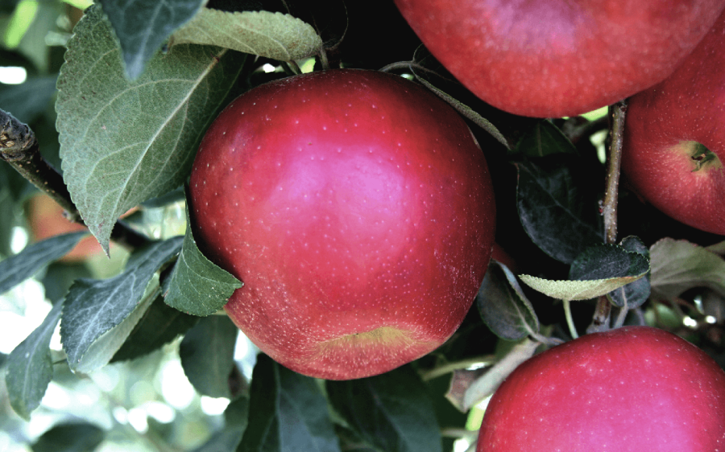
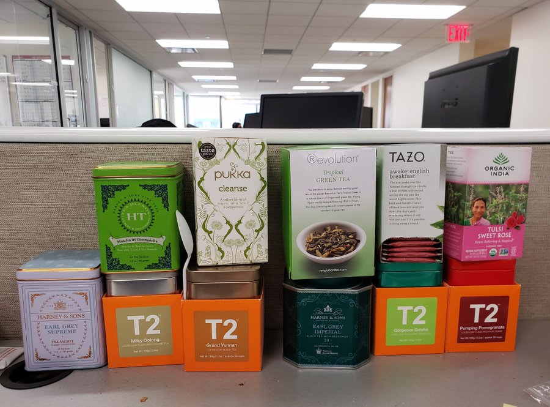

A couple of weeks ago [Venkatesh](https://www.ribbonfarm.com/about/) challenged his followers to brainstorm at least 100 tweets on a topic via live responses. Since I’m not an expert on anything in particular, I decided to simply see if I can come up with 100 discrete pieces of life advice in a day.  

几周前，Venkatesh 向他的追随者发起挑战，要求他们通过现场回复集思广益，就某个主题发布至少 100 条推文。由于我不是任何特定领域的专家，所以我决定简单地看看我是否可以在一天内提出 100 条独立的生活建议。

This off-the-cuff game turned into perhaps the most successful creative project I’ve ever done. The thread was viewed by tens of thousands of people, received thousands of likes, and gained me hundreds of Twitter followers. I didn’t know there was such thirst for random life-advice, nor that I would be the one to tap the kegs. And now my blog readers get the expanded, edited, organized, and illustrated collection.  

这个即兴游戏可能成为我做过的最成功的创意项目。该帖子被成千上万的人浏览，收到了数千个点赞，并为我赢得了数百名 Twitter 粉丝。我不知道人们如此渴望随机的生活建议，也不知道我会成为那个敲开小桶的人。现在，我的博客读者可以获得经过扩展、编辑、组织和插图的收藏。

[The good life](https://putanumonit.com/category/life/) is a frequent subject on Putanumonit. I aimed for this thread to be an inspiration to myself as well, writing down many things that I think I should do but haven’t gotten around to yet. I tried to steer a middle course between over-generalized [Navalisms](https://medium.com/@noahmadden/navalism-quotes-perceptions-by-naval-ravikant-a5fd60ac5788) and too-specific tips on the particular brand of chapstick that will change your life. May these inspire you to live your best life or to mock me in funny ways in the comments.   

美好生活是Putanumonit 上经常出现的话题。我的目标是通过这篇文章来激励自己，写下许多我认为应该做但还没有抽出时间做的事情。我试图在过于笼统的海军主义和关于将改变你的生活的特定品牌唇膏的过于具体的提示之间找到一条中间路线。愿这些激励你过上最美好的生活，或者在评论中以有趣的方式嘲笑我。

## Meta 元

#### 1

Any life advice that isn’t given to you personally is not designed to be followed to the letter. Try to resonate with the philosophy that generates it instead. Remember that directional advice (e.g., “be more …”) [may need to be reversed](https://slatestarcodex.com/2014/03/24/should-you-reverse-any-advice-you-hear/) before consumption.  

任何不是亲自提供给您的生活建议都不能被严格遵循。尝试与产生它的哲学产生共鸣。请记住，在消费之前可能需要颠倒方向性建议（例如“更多……”）。

#### 2

Collect feedback from everybody. Play games with close friends where you have to give each other constructive criticism and ways to improve. Collect anonymous feedback from internet strangers on [Admonymous](https://admonymous.co/yashkaf).   

收集大家的反馈。与亲密的朋友一起玩游戏，你们必须互相给予建设性的批评和改进的方法。在 Admonymous 上收集互联网陌生人的匿名反馈。

#### 3

Stop lurking; write that comment. You know the saying about letting people suspect you’re dumb rather than opening your mouth and removing all doubt? Fuck that. We know you’re dumb. You get less dumb by saying things and getting feedback.  

停止潜伏；写下该评论。你知道这样一句话吗：让人们怀疑你是愚蠢的，而不是张开嘴消除所有怀疑？他妈的。我们知道你很蠢。通过说出事情并获得反馈，你会变得不那么愚蠢。

#### 4

Learn some improv, at least to get the basic gist of it. Take a class or [read Impro](https://www.goodreads.com/book/show/306940.Impro). Improv mindset is a great way to approach many social situations including most interactions on the internet. A good comment/reply often starts with “yes, and”.  

学习一些即兴表演，至少了解它的基本要点。参加课程或阅读 Impro。即兴思维是应对许多社交场合（包括互联网上的大多数互动）的好方法。一个好的评论/回复通常以“是的，并且”开头。

#### 5

Don’t nitpick, that’s the opposite of good improv. You think that the categories in this post are arbitrary? A piece of advice doesn’t apply to your special situation? You’re probably right, but writing this in a comment will just make readers annoyed and make you frustrated when nobody responds.  

不要挑剔，这与良好的即兴表演相反。您认为这篇文章中的类别是任意的吗？一条建议不适用于您的特殊情况？你可能是对的，但在评论中写下这些只会让读者感到恼火，并且当没有人回应时会让你感到沮丧。

## Mind 头脑

#### 6

[There](https://open.spotify.com/show/3qv8BS1HzrgKpDnXSlYWWL) [are](https://www.econtalk.org/) [more](https://www.dancarlin.com/hardcore-history-series/) [great](https://www.theguardian.com/football/series/footballweekly) [podcasts](https://conversationswithtyler.com/) [than](http://rationallyspeakingpodcast.org/) [you’ll](https://samharris.org/) [ever](https://www.patreon.com/colinslaststand/posts?tag=Sacred%20Symbols) [have](https://fs.blog/the-knowledge-project/) [the](https://anchor.fm/intellectualexplorersclub) [time](https://www.aqr.com/Insights/Podcasts) to listen to. If it sucks after 10 minutes, skip half an hour ahead. Still boring? Delete and move on. Obviously, do the same for books.  

精彩的播客比您有时间聆听的还要多。如果10分钟后感觉很糟糕，就提前半小时跳过。还无聊吗？删除并继续。显然，对书籍也做同样的事情。

#### 7

Free will. The anthropic principle. Solipsism. The simulation hypothesis. Moral realism. They’re fun to argue about through the night but don’t judge anyone too much based on the positions they take and don’t treat any of them too seriously as guides to actually living your life. It should all add up to normalcy in the end.   

自由意志。人择原理。唯我论。模拟假设。道德现实主义。整夜争论很有趣，但不要根据任何人所采取的立场过多地评判他们，也不要太认真地对待他们中的任何一个，将其视为实际生活的指南。最终一切都应该恢复正常。

#### 8

Find a medium of expression and express yourself publicly [every day for three months](https://twitter.com/visakanv/status/1204622097428803584). If you’re good with words, write 100 Tweets. An artist — post 100 sketches on Instagram. Music/dance person — 100 TikToks.  

寻找一种表达媒介，在三个月内每天公开表达自己。如果您擅长文字，请写 100 条推文。一位艺术家 — 在 Instagram 上发布 100 张草图。音乐/舞蹈人 — 100 个 TikTok。

#### 9

Tell a bad joke or a pun as soon as you think of it, even if it’s just to your exasperated spouse or coworker. It takes 20 bad jokes to think of a single good one, and you only start making good jokes once you remove the unconscious [filter stifling your generative brain](https://www.lesswrong.com/posts/i42Dfoh4HtsCAfXxL/babble).   

只要你想到一个糟糕的笑话或双关语，就立即讲出来，即使只是对你恼怒的配偶或同事说。需要 20 个糟糕的笑话才能想出一个好笑话，只有当你去除了抑制大脑生成能力的无意识过滤器时，你才能开始讲好笑话。

#### 10

If you can’t give it up completely, try to constrain the bandwidth of how much you hear about politics. Don’t start your day with the front page of the Times. Unfollow anyone whose posts are more than 20% about politics or the outrage du jour. And don’t jump into online arguments, it’s vice masquerading as virtue.  

如果你不能完全放弃它，试着限制你听到政治的频率。不要从《泰晤士报》的头版开始新的一天。取消关注任何帖子中涉及政治或时事愤怒的内容超过 20% 的人。不要在网上争论，这是伪装成美德的恶行。

#### 11

Binge a show/video game for a couple of weeks, then take a break from TV for a couple of weeks. Trying to limit yourself to an hour a day is less fun and more addictive.  

连续几周观看节目/视频游戏，然后休息几周。试图将自己每天限制在一个小时之内，不仅没有乐趣，而且更容易上瘾。

#### 12

Should you watch that movie / play that game / read that book? Use the ratio:  

你应该看那部电影/玩那个游戏/读那本书吗？使用比例：

(\[# who rated it 5/5\] + \[# who rated it 1/5\]) / \[# who rated it 3/5\].  

（\[# 评分者 5/5\] + \[# 评分者 1/5\]）/\[# 评分者 3/5\]。

This doesn’t [apply to everything](https://putanumonit.com/2016/02/03/015-dating_1/), but it applies to many things, including media. There are too many options out there to waste time on mediocrity, and everything great will be divisive.  

这并不适用于所有事情，但它适用于很多事情，包括媒体。有太多的选择，不能把时间浪费在平庸的事情上，一切伟大的事情都会引起分歧。

#### 13

Unless one of them is your friend or boss, you should spend 100x less time thinking and talking about billionaires than you currently do.   

除非其中一位是你的朋友或老板，否则你思考和谈论亿万富翁的时间应该比现在少 100 倍。

#### 14

Facebook is for event invites only, not for scrolling. The people you met offline are not going to be the people posting the best stuff online, so the timeline content is worse than what you’d get on Twitter/Reddit/blogs. And the algorithm is designed to fuck with your brain.   

Facebook 仅用于活动邀请，不可滚动。你在线下遇到的人不会是在网上发布最好内容的人，所以时间线内容比你在 Twitter/Reddit/博客上看到的内容更糟糕。该算法的设计就是为了玩弄你的大脑。

#### 15

Don’t keep watching a bad TV show just because your friends are talking about it, it’s a terrible time trade-off. You can read a recap or even better — bring up richer topics of conversations.  And don’t pay money for [bad](https://www.rottentomatoes.com/m/captain_marvel) [movies](https://www.rottentomatoes.com/m/star_wars_the_rise_of_skywalker) just because “everyone is watching them”. Doing so is defecting against your friends since they’ll now have to watch it to not feel left out.  

不要因为你的朋友在谈论一个糟糕的电视节目而继续观看它，这是一个可怕的时间权衡。你可以阅读摘要，甚至更好——提出更丰富的对话主题。不要仅仅因为“每个人都在看”就花钱买烂电影。这样做就是背叛你的朋友，因为他们现在必须观看它才不会感到被排除在外。

#### 16

Habits are reinforced by your habitual environment. That’s a big part of why retreats work: they take you away from your usual surroundings and people. If you want to start meditating, doing pushups, intermittent fasting, etc, try starting on a vacation where the new circumstances make it easier to integrate new habits.   

习惯会因习惯的环境而强化。这就是静修之所以有效的一个重要原因：它们让你远离平常的环境和人。如果你想开始冥想、做俯卧撑、间歇性禁食等，可以尝试从一个假期开始，新的环境让你更容易融入新的习惯。

#### 17

Are you really going to give up on expressing yourself, learning from mistakes, attracting like-minded people, building a reputation, and changing the world because someone may someday try to cancel you? They can smell the fear, you know.   

你真的会因为有一天有人试图取消你而放弃表达自己、从错误中学习、吸引志同道合的人、建立声誉和改变世界吗？你知道，他们能闻到恐惧的味道。

#### 18

You just read 1000 words. Close your eyes and count to 10 to break the dopamine loop and make sure that reading a listicle is really the thing you want to be doing most right now. If not, this post will still be here when you get back.  

你刚刚读了1000字。闭上眼睛，数到 10，以打破多巴胺循环，并确保阅读列表文章确实是您现在最想做的事情。如果没有，当你回来时这篇文章仍然在这里。

## Body 身体

#### 19

Humans are made to walk. Set up your life to encourage walking by acquiring soft-soled shoes, good audiobooks, and/or a dog.  If you’re not enjoying walking and not getting your 10,000 steps you can get there with good design choices.   

人类生来就是要走路的。通过购买软底鞋、好的有声读物和/或狗来设置你的生活，鼓励步行。如果您不喜欢步行并且没有完成 10,000 步，您可以通过良好的设计选择来实现这一目标。

#### 20

Wrestle while [naked and covered in coconut oil](https://touchandplay.org/liquid-love/).   

赤身裸体并涂上椰子油进行摔跤。

#### 21

[Buy a $20 bar of soap](https://putanumonit.com/2016/05/11/shopping-for-happiness/) on Amazon just to see how it feels. If it doesn’t do much for you, go back to $4 bars. Liquid soap has a low ceiling, so don’t bother.   

在亚马逊上买一块 20 美元的肥皂，只是为了看看感觉如何。如果它对你没有多大帮助，那就回到 4 美元的金条。液体肥皂的上限很低，所以不用费心。

#### 22

Shower in the evening instead of the morning. You’ll sleep much better when you’re clean, your muscles are relaxed, and your body cools after a warm shower. And if you don’t sweat at night (keep the bedroom cool) you’ll be clean in the morning.   

晚上洗澡，而不是早上。当你干净、肌肉放松、洗完热水澡后身体凉爽时，你会睡得更好。如果您晚上不出汗（保持卧室凉爽），那么早上就会干净。

#### 23

Doctors are fallible humans, they have biases and make mistakes. It’s your job to be educated about your diagnoses and the drugs you are prescribed. If you’re confused, ask for details or a second opinion.   

医生是容易犯错的人，他们有偏见，也会犯错误。您的工作就是了解您的诊断和您所开的药物。如果您感到困惑，请询问详细信息或第二意见。

#### 24

In ⚽/🎾/🏓/🏐 , keep your eye on the center of the ball through the hit. The goal/court/table doesn’t move, only the ball does.  

在 ⚽/🎾/🏓/🏐 中，击球时请注意球的中心。球门/球场/桌子不会移动，只有球会移动。

#### 25

Keep fresh fruit around. Even if you end up throwing a couple apples out once in a while, it’s hugely valuable to have a tasty fruit closer at hand than junk food.  

随身携带新鲜水果。即使你偶尔会扔掉几个苹果，但手边有一个美味的水果比垃圾食品更有价值。

#### 26

In case you missed it, humanity has fully optimized apples. Snapdragon, Zestar and Cosmic Crisp if you can find them, Honeycrisp or SweeTango as backup, Fuji in a pinch. All other cultivars are a distraction.   

如果你错过了，人类已经全面优化了苹果。 Snapdragon、Zestar 和 Cosmic Crisp（如果你能找到的话），Honeycrisp 或 SweeTango 作为备用，富士在紧要关头。所有其他品种都会让人分心。

#### 27

Get massages, give massages. You don’t have to know what you’re doing to make someone feel great. Use scentless oil, or simple moisturizer if the recipient is not going to shower afterward.   

按摩，按摩。你不必知道自己在做什么才能让别人感觉很棒。如果接收者之后不打算洗澡，请使用无味油或简单的保湿霜。

#### 28

The #1 measure of an exercise program should be “is this fun enough to keep me coming back to the gym?” I don’t care how “efficient” HIIT is, it’s for masochists.   

锻炼计划的第一衡量标准应该是“这是否足够有趣，足以让我回到健身房？”我不在乎 HIIT 有多“有效”，它是为受虐狂准备的。

#### 29

If you’re not waking up at sunrise on purpose, your bedroom should be dim when you wake. Put up blackout curtains and get rid of all electronic lights.  

如果您不是故意在日出时醒来，那么当您醒来时，您的卧室应该是昏暗的。拉上遮光窗帘并去掉所有电子灯。

#### 30

Do you know what a sex toy in your butt feels like? You should at least find out.   

你知道屁股里的性玩具是什么感觉吗？你至少应该弄清楚。

#### 31

Most sexually active Americans have two things: [herpes](https://www.cdc.gov/nchs/products/databriefs/db304.htm) (often undiagnosed and unsymptomatic), and fear of herpes (often irrational and unfounded). It’s not part of most standard STD screens because most people get more psychological pain from finding out than the virus itself ever caused. If you decide to check and you have it: congratulations, you don’t have to worry about catching the type you have and getting an outbreak.  

大多数性活跃的美国人都有两件事：疱疹（通常未被诊断且无症状），以及对疱疹的恐惧（通常是非理性且毫无根据的）。它不是大多数标准性病筛查的一部分，因为大多数人发现后所遭受的心理痛苦比病毒本身造成的还要多。如果您决定检查并且感染了：恭喜您，您不必担心感染您所感染的类型并爆发。

#### 32

If you’re not obese, have you considered that losing 20 pounds will not actually solve all your problems? If you can’t lose weight easily, keep your weight stable and work on the insecurities that make you scared to take your shirt off.  

如果你不肥胖，你有没有想过减掉20磅并不能真正解决你所有的问题？如果您无法轻松减肥，请保持体重稳定，并克服那些让您不敢脱掉衬衫的不安全感。

#### 33

Once in a while, try eating only [a short list of simple foods](https://putanumonit.com/2018/11/27/peanut-butter/) for several days. For example, carrots+almonds+yogurt+water. You’ll eat less without being hungry, and afterward you’ll savor flavorful foods a lot more.  

偶尔尝试连续几天只吃一小部分简单的食物。例如，胡萝卜+杏仁+酸奶+水。你会吃得更少而不感到饥饿，然后你会品尝到更多美味的食物。

#### 34

You wouldn’t clean mud off a leather couch with dry toilet paper, would you? The same applies in the bathroom. In a pinch, you can just splash some water on regular toilet paper.  

你不会用干卫生纸清除皮沙发上的泥土，对吗？这同样适用于浴室。必要时，您可以在普通卫生纸上泼一些水。

#### 35

Learn how caffeine and alcohol affect you. I know people whose quality of sleep improved dramatically once they stopped having coffee with friends after lunch; it turned out they are metabolizing coffee very slowly and it affected them 10 hours later.   

了解咖啡因和酒精如何影响您。我认识一些人，一旦他们在午饭后停止与朋友喝咖啡，他们的睡眠质量就会显着改善。事实证明，他们对咖啡的代谢非常缓慢，10 小时后就影响了他们。

#### 36

When you wake up to a long day on not enough sleep, start with tea instead of a triple espresso. You want to pace your caffeine intake throughout the day instead of crashing at 1 pm.   

当您在漫长的一天中睡眠不足醒来时，请先喝茶而不是三重浓缩咖啡。您想要控制全天的咖啡因摄入量，而不是在下午 1 点猛烈摄入。

#### 37

Play a competitive team sport to make friends and practice [masculine virtues](https://putanumonit.com/2019/01/26/masculine-virtues/). But don’t show up if you’re not ready for 100% effort — your teammates can tell.   

参加竞技性的团队运动来结交朋友并实践男性美德。但如果你还没有准备好 100% 的努力，就不要出现——你的队友可以看出来。

#### 38

Not a single hungry child in Africa was helped by you finishing a meal you didn’t enjoy.  

在非洲，没有一个饥饿的孩子会因你吃完一顿你不喜欢的饭菜而得到帮助。

## Stuff 东西

#### 39

If you’re moving chargers and cables around the house, you need to buy more chargers and cables. A girl in every port, a USB-C in every room.   

如果您要在房子周围移动充电器和电缆，则需要购买更多充电器和电缆。每个端口都有一个女孩，每个房间都有一个 USB-C。

#### 40

Expensive personal lube is worth every penny. Same for hot sauce. Just don’t get the bottles mixed up.   

昂贵的个人润滑油物有所值。辣酱也一样。只是不要把瓶子弄混了。

#### 41

Old: buy 20 of the same pair of black socks so you don’t have to worry about matching. Bold: buy 20 colorful pairs and don’t worry about matching.  

旧款：买20双同款黑袜子，这样就不用担心搭配问题了。大胆：买20双颜色鲜艳的鞋，不用担心搭配问题。

#### 42

Ask people to stop giving you non-consumable gifts. A physical thing that’s not exactly what you need costs more in storage and opportunity cost than it’s worth.   

要求人们停止向您赠送非消耗性礼物。不完全是您需要的物理事物的存储成本和机会成本高于其价值。

#### 43

Buy some cryptocurrency, maybe 2-3% of your net worth. [Barbell investing](https://en.wikipedia.org/wiki/Barbell_strategy) makes sense. As a bonus, checking Coinbase every day provides the same excitement as checking social media but takes a lot less time.  

购买一些加密货币，也许是你净资产的 2-3%。杠铃投资是有道理的。作为奖励，每天查看 Coinbase 可以提供与查看社交媒体相同的兴奋感，但花费的时间要少得多。

#### 44

Every week at the grocery store buy one ingredient you’re not sure what to do with. Try eating it raw if you haven’t been able to figure out where to incorporate it.  

每周都会在杂货店购买一种你不知道该如何处理的原料。如果您不知道在哪里添加它，请尝试生吃它。

#### 45

If you’re meeting a friend for lunch who makes less than half your income, you should pick a place in your price range and pay for both of you. And if a friend who makes double offers to do the same, accept it graciously.   

如果你要和一位朋友共进午餐，而他的收入还不到你的一半，你应该在你的价格范围内选择一个地方，并支付你们两人的费用。如果一个朋友再次提出同样的要求，请慷慨地接受。

#### 46

Try a much harder mattress. Try a much softer mattress. They all have 100-day free trials now, there’s no excuse for spending thousands of hours on a less-than-perfect mattress.  

尝试使用更硬的床垫。尝试使用更软的床垫。现在他们都有 100 天的免费试用期，没有理由在不完美的床垫上花费数千小时。

#### 47

Becoming a tea connoisseur is as fun as becoming a whiskey connoisseur but much much cheaper. Craft beer snobbery is in the middle price-wise but can veer dangerously close to obnoxious hipsterism. Start a tea club at work, it’s an excuse to chill and socialize deliciously.  

成为一名茶鉴赏家与成为一名威士忌鉴赏家一样有趣，但便宜得多。精酿啤酒的势利在价格上处于中等水平，但可能危险地接近令人讨厌的时髦主义。在工作中创办一个茶俱乐部，这是一个放松和愉快社交的借口。

#### 48

Cars are getting both more reliable and more complicated, so the payoff to learning car maintenance is getting worse. It’s reasonable to buy a second-hand car and own it for years without needing to fix anything yourself.  

汽车变得越来越可靠，也越来越复杂，因此学习汽车维护的回报越来越差。购买二手车并拥有它多年而不需要自己修理任何东西是合理的。

#### 49

Learn to make one cocktail really well and always keep the ingredients at home. It impresses people, and no one ever expects you to pull off a second one. My go-to: [cucumber elderflower gimlet](https://cookieandkate.com/cucumber-elderflower-gimlet/).   

学习如何调制一款真正出色的鸡尾酒，并始终将原料放在家里。它给人们留下了深刻的印象，没有人指望你能完成第二次。我的首选：黄瓜接骨木花钻头。

#### 50

Any <$100 purchase that may turn into a hobby is worth it even if the hit rate is low. Sports equipment, a musical instrument, art supplies, etc. If it doesn’t catch on, gift it to a friend.   

任何可能变成爱好的 100 美元以下的购买都是值得的，即使命中率很低。运动器材、乐器、美术用品等。如果不受欢迎，可以送给朋友。

#### 51

Order weird clothes off the internet. It doesn’t make economic sense for anyone to open a shop of “J-pop streetwear” or “African athleisure” in your town, but someone from South China will send them to you for cheap. It’s easier to stand out by being weird than by spending more on the same style that everyone around you wears.  

从网上订购奇怪的衣服。对于任何人来说，在你的城镇开一家“日本流行街头服饰”或“非洲运动休闲”商店没有经济意义，但来自中国南方的人会以便宜的价格将它们寄给你。通过怪异来脱颖而出比花更多钱购买周围每个人都穿的同一种款式更容易脱颖而出。

#### 52

Do blind tastings of wines, then just keep buying the $10 bottle you like best. Novelty is good, but let’s be honest: you can’t really tell different Malbecs apart that much.   

盲品葡萄酒，然后继续购买你最喜欢的 10 美元一瓶。新奇固然好，但说实话：你无法真正区分不同的马尔贝克葡萄酒。

#### 53

An espresso machine with all the functions (grinder, milk steamer, etc) not only makes better coffee but also provides you with a meaningful, multi-step ritual to start your day with.   

具有所有功能（研磨机、蒸奶器等）的浓缩咖啡机不仅可以制作出更好的咖啡，还可以为您提供有意义的、多步骤的仪式来开始新的一天。

## Place 地方

#### 54

Have sex in a public park at 1 am. 10% chance of getting caught = 10x erotic excitement.  

凌晨 1 点在公园做爱。 10% 被抓住的机会 = 10 倍的色情兴奋。

#### 55

Do vacations where you just spend two weeks in a city. You’ll run out of touristy things to do and discover the climbing gyms, live shows, art classes that you’ll love. You’ll also be forced to start actually chatting with the locals.  

去一个城市度假，只待两周。您将耗尽旅游景点的乐趣，并探索您喜欢的攀岩馆、现场表演和艺术课程。您还将被迫开始与当地人实际聊天。

#### 56

Tinder is a terrible dating app in the US but an excellent way to find a dinner buddy while abroad. Make it explicit that this is what you’re looking for.   

Tinder 在美国是一款糟糕的约会应用程序，但却是在国外寻找晚餐伙伴的绝佳方式。明确表明这就是您正在寻找的东西。

#### 57

If you love dogs but can’t own one, volunteer to walk a neighbor’s dog once a week. Dogs should be part of the share economy.  

如果您喜欢狗但无法养狗，请自愿每周遛一次邻居的狗。狗应该成为共享经济的一部分。

#### 58

Put more light in your house. More. [Still more](https://www.lesswrong.com/posts/yPLr2tnXbiFXkMWvk/an-equilibrium-of-no-free-energy#iv_).  

给你的房子增加更多的光线。更多的。还有更多。

#### 59

If you’re bored at home on a Tuesday and hate it, move to Brooklyn. If you’re stuck on another crowded subway and hate it – move to a small town in the mountains. The city you live in has a massive impact on your life. And if you’re single, consider also the dating market and gender ratio of singles.  

如果你周二在家感到无聊并且讨厌它，那就搬到布鲁克林吧。如果你被困在另一条拥挤的地铁里并且讨厌它——那就搬到山里的小镇。你居住的城市对你的生活有着巨大的影响。如果您是单身，还要考虑约会市场和单身人士的性别比例。

#### 60

Yes, moving to a new city will make you restart your social life from scratch. [But is that a bad thing](https://www.ribbonfarm.com/2019/05/08/predictable-identities-9-how-to-change/)? Are you sure you have the best reputation / social role / circle of friends you could have?   

是的，搬到一个新的城市会让你从头开始你的社交生活。但这是一件坏事吗？您确定您拥有最好的声誉/社会角色/朋友圈吗？

#### 61

Travel with a [hiking backpack](https://www.osprey.com/us/en/featured/anti-gravity/), not wheeled luggage. You want to be moving freely, not to be tied down to a heavy box dragging behind you.   

携带远足背包旅行，而不是带轮行李箱。你想要自由移动，而不是被束缚在身后拖着的沉重箱子上。

#### 62

There are way more fruits in the world than you know about. When you travel to South America or Asia buy a couple of each at the market and try them.   

世界上的水果比你知道的要多得多。当您去南美洲或亚洲旅行时，在市场上各买一些并尝试一下。

#### 63

Put art on all your walls. If you can’t afford originals, [buy prints](https://www.icanvas.com/). Can’t afford prints, buy posters. The selection criterion is a piece that you can stare at for at least 10 minutes the first time you see it. When you find better art, take down the old stuff.   

把艺术品挂在所有的墙上。如果买不起原件，就买印刷品。买不起印刷品，就买海报。选择的标准是你第一次看到它时能盯着至少10分钟的作品。当你发现更好的艺术品时，就把旧的东西拿下来。

#### 64

If you live in a big city it’s fine not to cook. The cooks at the Mexican spot on the corner are better than you and appreciate your patronage.   

如果你住在大城市，不做饭也没关系。街角墨西哥餐厅的厨师比你更好，并且感谢你的惠顾。

## The Soul 心灵

#### 65

[Give meditation a 50 hour trial](https://tasshin.com/blog/meditation-tips-for-a-lifetime-of-practice/) with a good app or guidebook. If it ain’t your thing, give it up  

使用好的应用程序或指南进行 50 小时的冥想试用。如果这不是你的事，就放弃它

P.S. The best places to meditate are churches and cathedrals.  

附：冥想的最佳场所是教堂和大教堂。

#### 66

Participate in exactly one riot in your life.   

参与你生命中的一场骚乱。

#### 67

Before lying or doing something unethical, consider the real possibility that you and everyone you know will live for hundreds of years with enhanced memory and reputation tracking.   

在撒谎或做一些不道德的事情之前，请考虑一下您和您认识的每个人都可能通过增强的记忆力和声誉追踪而活上数百年的真实可能性。

#### 68

[Read Emily Dickinson](https://www.bartleby.com/113/1022.html), her poems are both poignant and immediately accessible. Memorize five, they’re quite short.  

阅读艾米莉·狄金森，她的诗既凄美又容易理解。记住五个，它们很短。

#### 69

Nice!  好的！

Keep making this joke, happiness is built up of simple pleasures.  

继续开这个玩笑吧，幸福是由简单的快乐组成的。

#### 70

Most great music [is made outside your country](https://twitter.com/yashkaf/status/1202692162523189262) and in other languages.  

大多数伟大的音乐都是在国外用其他语言创作的。

#### 71

In any giant museum, your goal should be to spend 5+ minutes with 10 amazing works, not 5 seconds with 1,000. If it’s the Louvre, one of those should be Guérin’s “The Return of Marcus Sextus”.  

在任何大型博物馆中，您的目标应该是花 5 分钟以上的时间欣赏 10 件令人惊叹的作品，而不是 5 秒的时间欣赏 1,000 件作品。如果是卢浮宫，其中之一应该是盖兰的《马库斯·塞克斯图斯归来》。

#### 72

When you’re home alone, blast some music and dance. Don’t think about any particular moves, just focus on the music. Then do the exact same thing when you’re at a dance party.  

当你独自在家时，播放一些音乐和舞蹈。不要考虑任何特定的动作，只需专注于音乐。然后当你在舞会上做同样的事情。

#### 73

Stand in the shower and repeat out loud “My opinions on guns, taxes and immigration have no impact on the world” until inner peace arrives.   

站在淋浴间大声重复“我对枪支、税收和移民的看法对世界没有影响”，直到内心平静到来。

#### 74

Once in a while let yourself cry, fight, scream, and eat your boogers. That shit worked in kindergarten, there’s no reason to completely give up on it now.  

偶尔让自己哭泣、打斗、尖叫，然后吃掉鼻屎。这在幼儿园很有效，现在没有理由完全放弃它。

#### 75

Set a pile of bills on fire. Watch your partner kiss someone. Bomb at an open mic. Observe in precise detail how you feel. You will learn that there is much more complexity to your emotions than “this is bad and painful”. You’ll also surprise yourself with how you react.  

放火烧一堆钞票。观察你的伴侣亲吻某人。开放麦克风的炸弹。精确地观察你的感受。您将了解到，您的情绪比“这很糟糕且痛苦”要复杂得多。你也会对自己的反应感到惊讶。

#### 76

Take MDMA once a year, at home, with a person you care about.  

每年与您关心的人一起在家中服用一次摇头丸。

#### 77

Study [an ancient mythology](https://putanumonit.com/2019/05/21/lonelinesses/) in depth and find [a god to channel](http://www.catb.org/~esr/writings/dancing.html).  

深入研究古代神话并寻找神灵来引导。

#### 78

Every “spiritual” thing is worth trying at least once: Sunday mass, holotropic breathwork, any sort of ritual. They have purposes and benefits that can’t be explained ahead of time to a skeptic, and that can be enjoyed even if you don’t buy in to any of the underlying ideology.   

每一件“精神”的事情都值得至少尝试一次：周日弥撒、全息呼吸、任何形式的仪式。它们的目的和好处无法提前向怀疑论者解释，即使您不接受任何潜在的意识形态，也可以享受它们。

#### 79

## Career 职业

#### 80

You won’t get money, status, fun, impact, and career capital at the same job. Pick two, get the rest elsewhere in your life.  

你不会在同一份工作中获得金钱、地位、乐趣、影响力和职业资本。选择两个，把剩下的放在你生活的其他地方。

#### 81

Don’t put money in savings accounts, let alone CDs, let alone secured CDs. These are all scams. [You should own mostly stocks](https://putanumonit.com/2017/02/10/get-rich-slowly/), but if you want [a low-yield-low-volatility investment](https://putanumonit.com/2019/06/03/get-rich-real-slowly/) you can get a better rate with no lockup or fees at online brokerages.   

不要将钱存入储蓄账户，更不用说存入 CD，更不用说存入担保 CD。这些都是骗局。您应该主要持有股票，但如果您想要低收益、低波动性的投资，您可以在网上经纪公司获得更好的利率，无需锁定或收取费用。

#### 82

If you’re thinking about doing that degree, think twice. If it’s a PhD, think ten times. Can you start doing now what you hope to do with the credential and get where you want in fewer years while also making money? Also underrated: dropping out of grad school one year in.  

如果您正在考虑攻读该学位，请三思而后行。如果是博士学位，请思考十次。您现在可以开始做您希望用证书做的事情，并在更短的时间内达到您想要的目标，同时还能赚钱吗？同样被低估的是：一年后从研究生院退学。

#### 83

It’s fine to eat lunch alone. Catching up with co-workers every day doesn’t do much beyond what you’d get from catching up once a week. A good podcast is more interesting than your best colleague. Also, you don’t want your main friend group to be contingent on everyone remaining employed at the same place indefinitely.  

午饭一个人吃也不错。每天与同事交流并没有比每周一次的交流有多大作用。一个好的播客比你最好的同事更有趣。此外，你也不希望你的主要朋友群体取决于每个人都无限期地留在同一个地方。

#### 84

If you’ve been waiting for months for someone to create an event and invite you, whether it’s a book discussion or a BDSM orgy, just throw one yourself. Most social scenes suffer from lack of initiative, not excess.  

如果您已经等待了几个月，等待有人创建一个活动并邀请您，无论是书籍讨论还是 BDSM 狂欢，您自己举办一个即可。大多数社交场景都缺乏主动性，而不是过度。

#### 85

You can wear the same outfit to the office two days in a row. Your boss won’t notice. Your colleagues won’t notice. The only people who’ll notice are those who have a crush on you so this is a good way to find out who those are.  

你可以连续两天穿同样的衣服去办公室。你的老板不会注意到。你的同事不会注意到。唯一会注意到的人是那些暗恋你的人，所以这是找出他们是谁的好方法。

#### 86

At work, if someone wants to set up a meeting or call, don’t accept until they send a clear agenda or a list of questions/topics. If you need someone’s time, send a clear agenda and list ahead of time. Meetings should not be about deciding what the meeting should be about.  

在工作中，如果有人想要安排会议或通话，请在他们发送明确的议程或问题/主题列表之前不要接受。如果您需要某人的时间，请提前发送明确的议程和清单。会议不应该是为了决定会议的内容。

#### 87

When looking for employers, perhaps your first priority should be whether they’re raking in cash. No friendly culture, creative freedom, or generous package can survive long in an unprofitable business. You’re investing your time and energy in an employer so think like an investor.   

在寻找雇主时，也许你的首要任务应该是他们是否能赚到钱。任何友好的文化、创造性的自由或慷慨的包装都无法在一个不盈利的企业中长期生存。您将时间和精力投入到雇主身上，因此请像投资者一样思考。

#### 88

If someone could really use several hours of your help, ask them to [hire you at a fair price](https://putanumonit.com/donate/). Do the same when you need help. There are amazing win-wins to be had.   

如果有人确实需要你几个小时的帮助，请让他们以合理的价格雇用你。当你需要帮助时也这样做。可以实现惊人的双赢。

## Relationships 人际关系

#### 89

Put a reminder on your phone to call your grandma. Ask her to tell you about some of the dumbest shit she has done in her life.   

在手机上设置提醒，给奶奶打电话。让她告诉你她一生中做过的一些最愚蠢的事情。

#### 90

Talk to people on flights, starting at the boarding gate. Everyone is bored and alienated in airports, and you get the chance to meet people far outside your normal circles. Offer people gummy bears to break the ice.   

从登机口开始与航班上的人员交谈。每个人在机场都感到无聊和疏远，而你有机会结识远离正常圈子的人。为人们提供小熊软糖来打破僵局。

#### 91

If your spouse, friend, or family member has a dumb but not strictly harmful habit, try thinking of it as their artistic expression instead of using facts and logic to fail to talk them out of it.   

如果你的配偶、朋友或家人有一个愚蠢但并非严格有害的习惯，请尝试将其视为他们的艺术表达，而不是用事实和逻辑来说服他们改掉它。

#### 92

Sex doesn’t have to be symmetrically satisfying every time. Some nights are just for giving, some are just for receiving. Same for relationships in general.   

性爱不必每次都对称地令人满意。有些夜晚只是为了给予，有些夜晚只是为了接受。对于一般关系来说也是如此。

#### 93

Take a tab of acid and hang out with a 5-year-old as equals.   

服用一片迷幻药，并与 5 岁的孩子平等地出去玩。

#### 94

[Interview people you know](https://putanumonit.com/category/interview/), even if they’re not famous or experts in any particular thing. Just write down 10 questions and hit _record_. You’ll learn a lot and deepen the relationship.   

采访你认识的人，即使他们并不出名，也不是某一特定领域的专家。只需写下 10 个问题即可创下记录。你会学到很多东西并加深关系。

#### 95

If you have too little social life, wake up at 10 am every day to have energy in the evening. Too many people bothering you — wake up at 5 am to enjoy some alone time in the morning.   

如果你的社交生活太少，每天早上10点起床，晚上就有精力了。太多人打扰你——早上 5 点起床，享受早晨独处的时光。

#### 96

Your parents can handle hearing about your crazy life, dumb mistakes, and weird opinions. How will they learn to respect you as an adult if you don’t believe in your own story enough to share it?  

你的父母可以处理听到你疯狂的生活、愚蠢的错误和奇怪的观点。如果你对自己的故事没有足够的信心来分享，他们如何学会尊重你作为一个成年人？

#### 97

If you’re not having fun on dates, think of something you enjoy and do that as a date. Painting class dates, hiking dates, ping pong dates, board game dates…  

如果你在约会中没有乐趣，那就想一些你喜欢的事情，然后把它当作约会的对象。绘画课日期、徒步旅行日期、乒乓球日期、棋盘游戏日期……

#### 98

At any big party or event, your goal should be to make 2-3 connections, not to collect 500 business cards or Facebook friends. Throw quarterly gatherings with only the most recent friends you’ve made to consolidate the relationships and get them to meet each other.   

在任何大型聚会或活动中，您的目标应该是建立 2-3 个联系，而不是收集 500 张名片或 Facebook 好友。每季度只与最近结识的朋友举行聚会，以巩固关系并让他们互相认识。

#### 99

Unless the guests haven’t seen each other in more than a year, parties with an agenda are much better than general hangouts. Some ideas: silent party, [deep question party](https://twitter.com/yashkaf/status/1198683296965763073), touch/cuddle party, relating games party, art/performance party.   

除非客人已经一年多没有见面，有议程的聚会比一般的聚会要好得多。一些想法：沉默派对、深度提问派对、触摸/拥抱派对、相关游戏派对、艺术/表演派对。

#### 100

Promise people you’ll do 100 of something (like writing pieces of life advice) even if you’re not entirely sure you can do it. Then do 109. Overpromise AND overdeliver.  

向人们承诺你会做 100 件事（比如写一些人生建议），即使你不完全确定自己能做到。然后执行 109。过度承诺并超额交付。

#### 101

Make friends from [as many subcultures and worldviews](https://putanumonit.com/2018/11/20/deluks917-on-online-communities/) as you can. A Mormon friend, an SJW friend, a transhumanist friend, a crystal healing friend, an 8chan friend, a hard normie friend, etc.   

尽可能多地结交来自亚文化和世界观的朋友。摩门教朋友、SJW 朋友、超人类主义者朋友、水晶治疗朋友、8chan 朋友、硬派朋友等等。

#### 102

Try to meet [your online friends offline](https://putanumonit.com/meet/). It’s always incredibly cool to see in person someone you’ve built a connection with and imagined a lot of things about over the internet.  

尝试离线与在线朋友见面。亲自见到与您建立联系并通过互联网想象了很多事情的人总是非常酷的。

#### 103

Learn to be OK with nudity and to disentangle it from shame and sexuality. Go to a nudist lodge, or just throw a nude non-sexual party with your trusted friends.  

学会接受裸体，并将其与羞耻和性行为区分开来。去裸体主义者小屋，或者只是和你信任的朋友举办一个裸体的非性派对。

#### 104

Yes, manic pixie dream girls and insouciant bad boys are interesting. But have you tried dating sincere, honest, and responsible people who actually care about you?   

是的，狂躁的精灵梦女孩和漫不经心的坏男孩很有趣。但你是否尝试过与真诚、诚实、负责任、真正关心你的人约会呢？

#### 105

“I know we were just introduced, but I forgot your name.”  

“我知道我们刚刚被介绍，但我忘记了你的名字。”

“I saw the email you sent me last month, I just procrastinated and forgot to respond.”  

“我看到了你上个月发给我的邮件，我只是拖延了时间，忘记回复了。”

“This is the best effort I was realistically going to make.”  

“这是我实际上所能做出的最大努力。”

Try it, it’s liberating. 尝试一下，它是一种解放。

#### 106

If you think you’re running 10 minutes late, text to say you’ll be 15 minutes late. That way the other person gets one disappointment and one pleasant surprise. Most people do the opposite: they say they’re 5 minutes late when it’s 10 and end up annoying the other and looking like total fools.  

如果您认为自己迟到了 10 分钟，请发短信告知您将迟到 15 分钟。这样对方就会得到一种失望和一种惊喜。大多数人的做法恰恰相反：他们在 10 点的时候说自己迟到了 5 分钟，结果却惹恼了对方，看起来像个十足的傻瓜。

### And Finally 最后

#### 107

Giving life advice to an anonymous crowd on the internet is an act of service, but giving life advice to a single person’s face is often a brash power move. Same for challenging someone’s model of the world. Remember that every act of communication has two sides and a context.   

在互联网上向匿名人群提供生活建议是一种服务行为，但当着一个人的面提供生活建议往往是一种鲁莽的权力举动。挑战某人的世界模型也是如此。请记住，每一次沟通行为都有两个方面和一个背景。

#### 108

Write things online, even if you’re not qualified to write them, even if you think that no one will care. I started this thread on a lark, but ended up making friends, practicing creative brainstorming, gaining followers, and coming up with ways to improve my own life.   

在网上写东西，即使你没有资格写它们，即使你认为没有人会关心。我一时兴起写了这个帖子，但最终结交了朋友，练习了创造性的头脑风暴，赢得了追随者，并想出了改善自己生活的方法。

#### 109

[Follow me on Twitter](https://twitter.com/yashkaf) for more life advice, bad puns, and lukewarm takes.  

在 Twitter 上关注我，获取更多生活建议、糟糕的双关语和不冷不热的言论。
