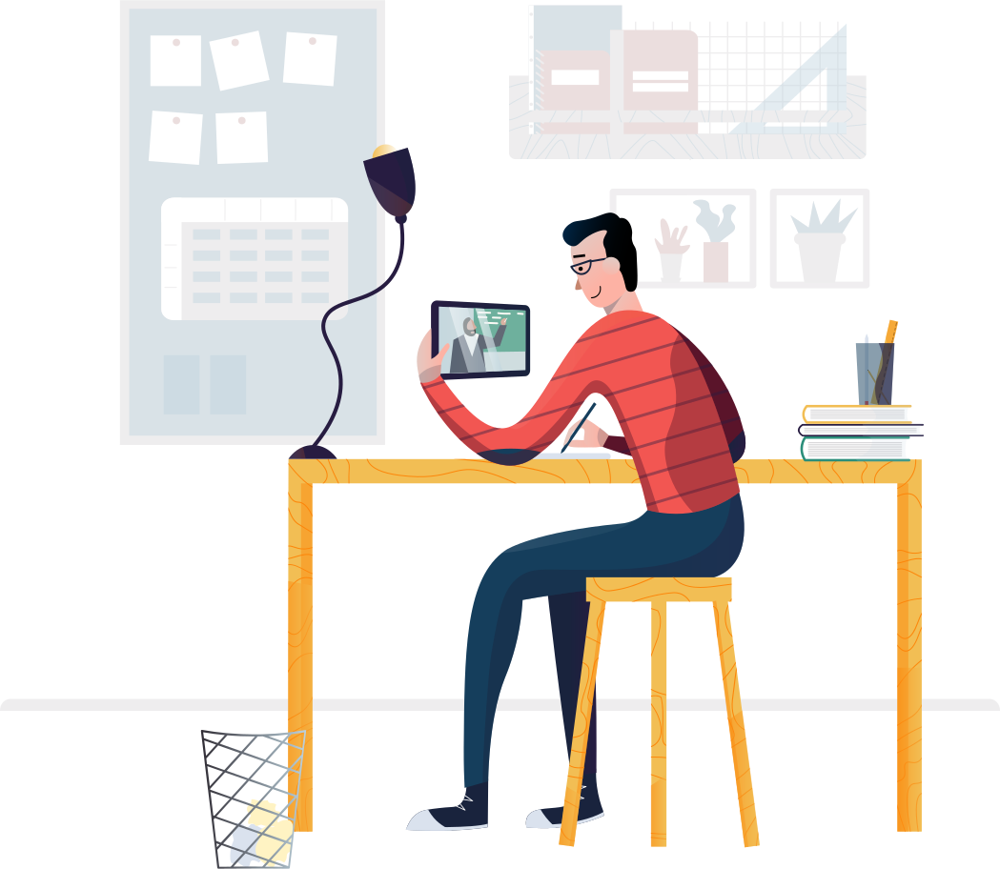
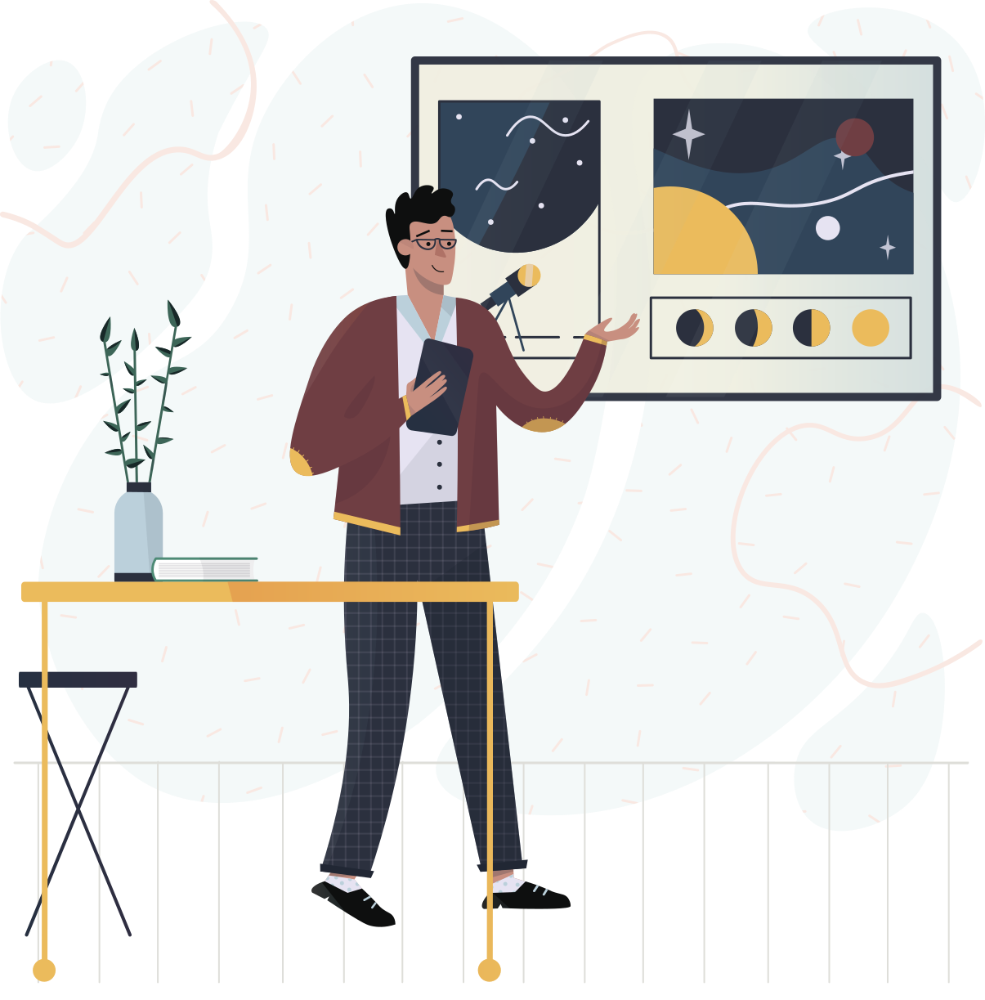
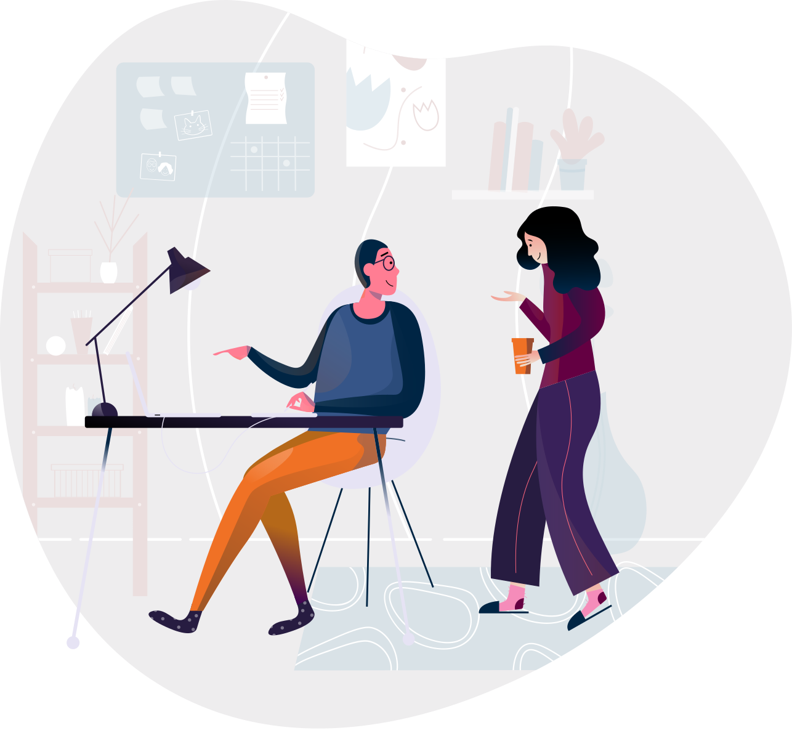

This is a summary of everything I know about being the type of father who generates wealth. I’m only 27, so I still have a lot to learn.  

这是我所知道的关于成为创造财富的父亲的一切的总结。我才27岁，我还有很多东西要学。

I chose the title because I learned all of this as a father. This advice is applicable to anyone, though most references are directed to fathers.  

我选择这个标题是因为我作为一名父亲了解了这一切。这个建议适用于任何人，尽管大多数参考文献都是针对父亲的。

## Introduction 介绍

As a father (and a husband), your duty is to protect and provide for your family.  

作为父亲（和丈夫），您的责任是保护和供养您的家庭。

If your family is poor it’s your fault. If your family is sick it’s your fault. If your family is falling apart it’s your fault.  

如果你的家庭很穷，那是你的错。如果你的家人生病了，那是你的错。如果你的家庭破裂了，那是你的错。

Don’t worry. It’s not all bad news. Because this is all in your control.  

不用担心。这并不都是坏消息。因为这一切都在你的掌控之中。

You have a means to reverse it. Consider the antithesis:  

你有办法扭转它。考虑一下对立面：

If your family is wealthy it’s your fault. If your family is healthy it’s your fault. If your family is thriving it’s your fault.  

如果你的家庭很富有，那就是你的错。如果你的家人健康，那是你的错。如果你的家庭兴旺发达，那是你的错。

That’s better. 这样更好。

A father sets the tone for the house. Good or bad.  

父亲为这个家定下了基调。是好是坏。

A good father will introduce discipline, healthy habits, and be true to his word. A bad father will instill fear, neglect, be unreliable, and be unfaithful to his word.  

一个好父亲会引入纪律、健康的习惯，并信守诺言。一个坏父亲会灌输恐惧、忽视、不可靠、不信守诺言的观念。

The one thing you have control over as a human being is how you respond to any and every situation.  

作为一个人，你可以控制的一件事就是你如何应对任何情况。

How you operate, how you behave, how you respond reflects in the home.  

你的运作方式、行为方式、反应方式都会反映在家里。

So, if you are falling apart your home will be falling apart. If you are healthy your home will be healthy. If you are true to your word your home will be truthful and honest.  

所以，如果你倒塌了，你的家也会倒塌。如果你健康，你的家就会健康。如果您信守诺言，您的家就会真实而诚实。

Everything. Starts. With. You.  

一切。开始。和。你。

Do you see how this works?  

你明白这是如何运作的吗？

I’m telling you this because it is **good news**. As the head of your household, you hold the key to the future of your family.  

我告诉你这个是因为这是个好消息。作为一家之主，您掌握着家庭未来的钥匙。

You can build wealth that will provide for you and your family. All while having a thriving marriage and children.  

您可以积累财富来养活您和您的家人。同时拥有幸福的婚姻和孩子。

Not only can you build wealth, but you can do so in a way that requires little maintenance and upkeep.  

您不仅可以积累财富，而且可以通过几乎不需要维护和保养的方式来实现。

This allows you to spend time doing the things that make you thrive. It gives you the flexibility to raise your family the way you want to.  

这可以让你花时间做那些让你茁壮成长的事情。它让您可以灵活地按照您想要的方式抚养您的家庭。

Corporate America, college institutions, modern media outlets, and previous generations have brainwashed us into following traditional paths of income.  

美国企业、大学机构、现代媒体和前几代人已经给我们洗脑，让我们走传统的收入道路。

Graduate high-school, go to college, get a job, buy a house, save for retirement, spend all your other money.  

高中毕业，上大学，找工作，买房子，为退休储蓄，花掉所有其他的钱。

This path leads you to massive debt. Struggling at it’s worst, and being at the mercy and volatility of an employer at best.  

这条路会导致你背负巨额债务。在最坏的情况下挣扎，在最好的情况下受到雇主的摆布和波动。

It leaves you powerless to be able to build the lifestyle you want to build for your family.  

它让你无力打造你想要为家人打造的生活方式。

What if there was another way? What if you, as a father, could change the trajectory of your family? What if you could introduce true wealth and freedom into your family tree?  

如果还有别的办法怎么办？如果你作为一名父亲可以改变你家庭的轨迹怎么办？如果您可以将真正的财富和自由引入您的家谱会怎么样？

What if you could have a thriving marriage, well-behaved prosperous children, and more than enough income to support your needs and interests?  

如果你能拥有美满的婚姻、乖巧富裕的孩子以及足够的收入来满足你的需求和兴趣，那会怎样呢？

Not only can you take care of your family’s needs and expand your financial bandwidth, but you can also build a lifestyle of contributing to other people who have invested in you or that are in need around you.  

您不仅可以照顾家人的需求并扩大您的财务带宽，还可以建立一种为其他投资于您或您周围有需要的人做出贡献的生活方式。

> “Shallow men believe in luck. Strong men believe in cause and effect.”  
> 
> “浅薄的人相信运气。坚强的人相信因果。”
> 
> -   Ralph Waldo Emerson 拉尔夫·沃尔多·爱默生

Living for others is a sure-fire way to grow your income and give you the motivation to capture the potential you have as an income generating father.  

为他人而活是增加收入的必由之路，并让您有动力发挥作为创收父亲的潜力。

Being disciplined about your time allows you to reclaim time you wasted before you had children.  

严格控制自己的时间可以让您收回在生孩子之前浪费的时间。

Not only can you spend more time working on the things you love, you can spend more time dedicated to your family.  

您不仅可以花更多的时间做自己喜欢的事情，还可以花更多的时间奉献给家人。

Anyone can build wealth as a father. But you can’t stay the same person you are now. This is the process to changing levels in your life:  

作为父亲，任何人都可以积累财富。但你不能保持现在的样子。这是改变你生活水平的过程：

1.  You have to change your thinking.  
    
    你必须改变你的想法。
2.  Thinking different changes your actions.  
    
    不同的想法会改变你的行动。
3.  Acting different changes your results.  
    
    采取不同的行动会改变你的结果。

This process is ongoing and does not stop until your life ends. There is always a higher level you can achieve. There is always more you can do. There is always more you can learn.  

这个过程持续进行，直到你的生命结束才停止。您总是可以达到更高的水平。您总是可以做更多事情。你总是可以学到更多东西。

This guide has three main sections. Changing your thinking, changing your actions, and changing your results.  

本指南分为三个主要部分。改变你的想法，改变你的行动，改变你的结果。

We’ll also discuss how to do this as a father — who has limited time, and several other obligations.  

我们还将讨论作为一名父亲如何做到这一点——他的时间有限，而且还有其他几项义务。

This article is about tapping into the calling on your life as a father. You’re meant to be wealthy. You’re meant be healthy. You’re meant to be thriving. And so is your family.  

这篇文章是关于探索作为一名父亲对你生活的召唤。你注定会变得富有。你应该保持健康。你注定要蓬勃发展。你的家人也是如此。

Lets get started. 让我们开始吧。

## Where it all started  

一切开始的地方

“He’s only one. He’s not going to remember not getting any presents for his birthday, right?” I said to my wife, as we looked over our personal finances.  

“他只是一个人。他不会记得没有收到任何生日礼物，对吧？”当我们查看个人财务状况时，我对妻子说道。

Another month had gone by. Another month of debt increase. Every month 110% of our income flows out before it even came into our bank account. Every month that extra money went on a credit card.  

又一个月过去了。债务又增加了一个月。每个月我们收入的 110% 在进入我们的银行账户之前就已经流出了。每个月多余的钱都会存入信用卡。

We’re a normal suburban millennial couple. We graduated high school, went to college and got bachelor’s degrees, got married and had a child. I had a job. She stayed home to raise our baby boy.  

我们是一对普通的郊区千禧一代夫妇。我们高中毕业，上大学并获得学士学位，结婚生子。我有工作。她留在家里抚养我们的男婴。

We had a combined debt of almost $200k. Student loans, a couple of cheap cars and a few credit cards. Every month half of our income kept debt lenders happy. The rest went to groceries and rent.  

我们的总债务接近 20 万美元。学生贷款、几辆廉价汽车和几张信用卡。每个月我们一半的收入都让债主满意。其余的则用于购买杂货和租房。

I had a decent job. I made close to $80k as a software engineer at a large company. That was a good income compared to the cost of living in my area. It would have been plenty for a family that didn’t have so much debt.  

我有一份体面的工作。作为一家大公司的软件工程师，我的收入接近 8 万美元。与我所在地区的生活成本相比，这是一笔不错的收入。对于一个没有那么多债务的家庭来说，这已经足够了。

It was the debt that broke me. The eternal knowledge that I would never be able to pay it off in my lifetime.  

是债务让我崩溃了。永恒的知识是我一生中永远无法还清这笔钱。

When you’re in that spot, there are only two ways out.  

当你处于那个位置时，只有两条出路。

Take it head on and do what it takes, or quit.  

迎难而上，做该做的事，否则就放弃。

Luckily, I decided to get out of the hole I dug for myself. It’s the hardest thing I’ve ever done, and I didn’t do it the right way. I know better now.  

幸运的是，我决定走出自己给自己挖的坑。这是我做过的最困难的事情，而且我没有以正确的方式去做。我现在更了解了。

I wasn’t always so obsessed with providing an incredible income for my family. I used to be more normal. Employed. Brainwashed.  

我并不总是那么痴迷于为我的家人提供令人难以置信的收入。我以前比较正常。受雇了。被洗脑了。

Six months before my first child was born something happened in me. There was an urgency.  

在我的第一个孩子出生前六个月，我身上发生了一些事情。事情很紧急。

A sense that things were not right. A sense that I needed to take life serious.  

感觉事情不对劲。一种我需要认真对待生活的感觉。

I don’t know where that sense came from. I charge it to the Holy Spirit. I needed to step into my calling as a father. I needed a wake-up call.  

我不知道这种感觉从何而来。我把它交托给圣灵。我需要承担起作为一名父亲的使命。我需要一个叫醒电话。

Everything in life up to that point was casual. Finances. Marriage. Health. Friendships. I was coasting through life. Ignoring any inclination of things trending in the wrong direction.  

在那之前，生活中的一切都是随意的。财政。婚姻。健康。友谊。我的生活顺风顺水。忽略任何事物向错误方向发展的倾向。

That casual approach is what led us into massive amounts of debt, obligation, and regret.  

这种随意的态度导致我们背负了大量的债务、义务和遗憾。

I went crazy. I needed to take action but I didn’t know how. I needed more time but I didn’t know where to find it. I’ve always been in to tech, so I decided then and there that I would be an app developer.  

我疯了。我需要采取行动，但我不知道该怎么做。我需要更多时间，但我不知道在哪里可以找到它。我一直热衷于科技，所以我当时就决定要成为一名应用程序开发人员。

Is being an app developer my calling? No, but it was my ticket out. My one-way out of the hole we created.  

成为应用程序开发人员是我的使命吗？不，但那是我的票。我走出我们创造的洞的单行道。

At the time, I would get up around 8 AM and head straight to work at my day-job. I’d wake up in a frenzy and get out the door as quick as I could. No good habits or routines in sight.  

当时，我会在早上 8 点左右起床，然后直接去上班。我会在疯狂中醒来并尽快走出家门。看不到良好的习惯或惯例。

But then, I was aware that I needed to change that. I started getting up earlier every week by a half-hour. I worked my way all the way to getting up at 5 AM every morning.  

但后来，我意识到我需要改变这一点。我开始每周早起半小时。我一直努力工作到每天早上5点起床。

I needed time to get in the Bible. I needed time to learn. I needed time to think. I needed time to write.  

我需要时间来了解圣经。我需要时间学习。我需要时间思考。我需要时间来写作。

This was how I made time.  

我就是这样打发时间的。

It destroyed me physically and mentally. I was a walking zombie. My productivity levels were at an all-time low.  

它摧毁了我的身体和精神。我是一个行走的僵尸。我的生产力水平处于历史最低水平。

But I was working. I was doing. I was paving a new path. I was rewiring my brain.  

但我当时正在工作。我在做。我正在开辟一条新道路。我正在重新连接我的大脑。

I spent several months each learning web-development, SEO, copywriting, design, writing, and more. I was gaining so much knowledge. Practicing every day. Trying to build businesses on the internet.  

我花了几个月的时间学习网络开发、搜索引擎优化、文案、设计、写作等等。我获得了很多知识。每天都在练习。尝试在互联网上建立业务。

My son was born, and he would work along-side me in the mornings. As parents, we had no idea what we were doing back then, so he didn’t sleep too well the first few months. He would sleep next to me in the mornings while I worked and learned.  

我的儿子出生了，他早上会和我一起工作。作为父母，我们不知道当时在做什么，所以最初几个月他睡得不好。早上我工作和学习时，他会睡在我旁边。

I cherish those times. My motivation was right next to me.  

我很珍惜那些时光。我的动力就在我身边。

Times were stressful. We knew money was tight but there was no way to remedy it. I was a salary employee that couldn’t work overtime. Part-time jobs didn’t pay enough to justify spending another 4-hours a day away from family.  

时间压力很大。我们知道资金紧张，但没有办法补救。我是一名工资员工，不能加班。兼职工作的报酬不足以证明每天多离开家人 4 小时是合理的。

Our marriage was on-the-fritz, we had a hard time keeping everything together. All because of (the lack of) money.  

我们的婚姻岌岌可危，我们很难维持一切。都是因为（缺）钱。

Making money became my obsession. I studied everything I needed to know about generating money.  

赚钱成了我的痴迷。我研究了有关赚钱所需的一切。

Now, it’s second nature. I don’t ever worry about where my money will come from. I know that I have the God-given ability to generate wealth.  

现在，这是第二天性。我从不担心我的钱从哪里来。我知道我有上帝赋予的创造财富的能力。

I’ve gone from losing money every month, to generating a six-figure income and only working a few hours a week.  

我从每个月都亏钱，变成了每周只工作几个小时、赚取六位数的收入。

As I am writing this guide, I am currently transitioning out of my full-time job as an engineer. I’m quitting to work on the business I started while I was working full-time.  

在我撰写本指南时，我目前正在辞去工程师的全职工作。我要辞职去从事我在全职工作时创办的公司。

Starting a business on the side while working full-time is not an easy thing to do, especially as a father.  

一边全职工作一边创业并不是一件容易的事，尤其是作为一个父亲。

It takes a lot of discipline to do the tasks you need to do everyday, and still be there for your family and friends.  

完成每天需要做的任务，同时仍然陪伴家人和朋友，需要大量的纪律。

This process has taken me about 3 years to complete. I started from scratch. I learned everything I needed to know, and executed for the last year-and-a-half on my business.  

这个过程我花了大约3年的时间才完成。我从头开始。我学到了我需要知道的一切，并在过去一年半的时间里执行了我的生意。

This guide will show you how to maximize your time, get yourself to a new level of wealth, and show you that it’s all possible to do while having a great balance in your life.  

本指南将向您展示如何最大限度地利用您的时间，让自己达到新的财富水平，并向您展示在生活中保持良好平衡的同时，这一切都是可能的。

I will show you how I spent my time learning, executing, investing in my family and wife, and growing as a person.  

我将向您展示我如何花时间学习、执行、投资于我的家庭和妻子以及作为一个人成长。

Will you do it the exact same way I was able to do it? No.  

你会像我一样做吗？不。

I’m here to show you there’s another way to live. You can live an intentional life. You can create success. You can generate wealth. You can do different things to make a different outcome for your family.  

我来这里是为了告诉你还有另一种生活方式。你可以过有目的的生活。你可以创造成功。你可以创造财富。你可以做不同的事情来为你的家庭带来不同的结果。

I’m excited you’re here. It means you care about your family. It means you care about yourself. You’re going to be successful. It’s going to take some vision, time, education, hard work, and patience.  

我很高兴你在这里。这意味着你关心你的家人。这意味着你关心自己。你会成功的。这需要一些远见、时间、教育、努力和耐心。

## Summary 概括

-   You, as a father, are in control of the wealth of your family.  
    
    作为父亲，您掌控着家庭的财富。
-   The traditional path of College → Job → Retirement is not the best way to build wealth.  
    
    大学→工作→退休的传统路径并不是积累财富的最佳途径。
-   You can have a thriving marriage, amazing kids, and an income that provides for you and others around you.  
    
    你可以拥有幸福的婚姻、优秀的孩子，以及养活你和周围其他人的收入。
-   I was once broke, not the greatest husband, and made excuses about not doing anything about it. If I can do it, so can you.  
    
    我曾经身无分文，不是最伟大的丈夫，并找借口不采取任何行动。如果我能做到，你也能。

Later on, I’ll talk about why money _isn’t_ the solution to your problems.  

稍后我会谈谈为什么金钱不能解决你的问题。

But, money _is_ the solution to your _money problems_. And money problems impact every area of your life.  

但是，金钱可以解决你的金钱问题。金钱问题会影响您生活的各个方面。

Let’s talk about why you should be rich as a father.  

我们来谈谈为什么作为父亲应该富有。

## The case for increasing wealth as a father  

作为父亲增加财富的理由

I want to talk about _why_ you should be building wealth.  

我想谈谈为什么你应该积累财富。

What is wealth? 什么是财富？

Wealth is the accumulation of money, assets, and investments. It’s having an abundance of valuable things. It’s an increase in the level of living for you and your family.  

财富是金钱、资产和投资的积累。它拥有大量有价值的东西。这是您和您家人生活水平的提高。

Wealth is new levels of income. It’s your investments, your house, your cars. It’s your wife and kids. All these things, when added to someone’s life, increases their wealth.  

财富是新的收入水平。这是你的投资、你的房子、你的汽车。这是你的妻子和孩子。所有这些东西，当添加到某人的生活中时，会增加他们的财富。

There are both practical and spiritual reasons to be wealthy.  

致富既有实际原因，也有精神原因。

And no, a spiritual reason doesn’t mean it’s not practical. It’s rooted in Biblical principles. The secrets of wealth and increase are throughout the whole Bible.  

不，精神上的原因并不意味着它不实用。它植根于圣经原则。财富和增长的秘密贯穿整本圣经。

You may or may not be a Christian. If you are not a Bible believing Christian, pay attention. This may explain a lot for you.  

您可能是也可能不是基督徒。如果您不是相信圣经的基督徒，请注意。这可能会为你解释很多。

Let’s dive into the spiritual, Biblical reasons for wealth as a father.  

让我们深入探讨作为父亲的财富的精神、圣经原因。

## People are designed to produce  

人被设计来生产

Family, fatherhood, and marriage (and more) are all constructs designed by God. They thrive when they are operating under God’s principles and commands.  

家庭、父亲和婚姻（以及更多）都是上帝设计的结构。当他们按照上帝的原则和命令行事时，他们就会蓬勃发展。

As human beings, our primary mission in life is to be fruitful and multiply, and take dominion over the earth. If that sounds like Bible talk, it is. This is the creed God gave to Adam and Eve. [Genesis 1:28](https://www.biblegateway.com/passage/?search=Genesis+1%3A28&version=NIV).  

作为人类，我们人生的首要使命是繁衍生息，并统治地球。如果这听起来像圣经的话，那就是了。这是神赐给亚当和夏娃的信条。创世记 1:28。

That’s our responsibility as human beings.  

这是我们作为人类的责任。

It’s a fundamental piece to the argument for increasing wealth as a father. If you don’t get the fundamentals right, then you’re not going to increase at all.  

这是作为父亲增加财富的论点的一个基本部分。如果你的基础没有做好，那么你就根本不会进步。

What does fruitful mean?  

硕果累累是什么意思？

It means you’re producing something. You’re creating with what you have now. You’re increasing. You’re heading in the right direction.  

这意味着你正在生产一些东西。你正在用你现在拥有的东西进行创造。你在增加。你正朝着正确的方向前进。

The Bible says that God has given us the [power to obtain wealth](https://www.biblegateway.com/passage/?search=Deuteronomy+8%3A18&version=NKJV), and He [blesses the work of our hands](https://www.biblegateway.com/passage/?search=Deuteronomy+28%3A12&version=NKJV).  

圣经说，神赐给我们获得财富的能力，他祝福我们双手所做的工作。

God expects you to work, He expects you to prosper, and He expects you to be wealthy.  

神期望你工作，他期望你繁荣，他期望你富有。

What does multiply mean?  

乘法是什么意思?

Well, it means to have children and generations of people that stem from you. It means you are building systems (businesses) that increase beyond you.  

嗯，这意味着生儿育女，子孙后代。这意味着您正在构建超越您的系统（业务）。

You’re multiplying your resources and time. Not building linear systems based on the time you have in a day.  

您正在成倍增加您的资源和时间。不根据一天中的时间构建线性系统。

As humans, we’re meant to produce. As men, we’re meant to be fathers. We’re meant to innovate. Be creative. We’re meant to be fruitful and multiply.  

作为人类，我们注定要生产。作为男人，我们注定要成为父亲。我们的目的是创新。要有创意。我们注定要多结果子、繁衍。

Now, lets take a look at being rich from a Biblical perspective.  

现在，让我们从圣经的角度来看一下富有。

## You’re meant to be rich  

你注定会变得富有

The Bible says that money is the root of all evil.  

圣经说金钱是万恶之源。

Wait… no. No. That’s not right. Let’s look again:  

等等……不。不，那是不对的。我们再看一下：

**1 Timothy 6:10** - For the _love of money_ is a root of all kinds of evil, for which some have strayed from the faith in their greediness, and pierced themselves through with many sorrows.  

提摩太前书 6:10 因为贪爱钱财是万恶之根，因此有些人因贪婪而偏离了信仰，并陷入许多痛苦之中。

It’s the **love of money** that is the root of all evil. Money is not evil. Money is a construct. Money indicates value. Money comes and goes no matter who you are.  

贪财是万恶之源。金钱并不是邪恶的。金钱是一种建构。金钱表明价值。无论你是谁，钱都会来来去去。

Money will expose your heart.  

金钱会暴露你的内心。

If you are corrupt when you are poor, you will be corrupt when you are rich. If you are greedy when you are poor, you will be greedy when you are rich. If you fear money when you are poor, you will fear money when you are rich.  

如果你穷的时候腐败，那么你富的时候也会腐败。如果你穷的时候贪婪，那么当你富有的时候你也会贪婪。如果你穷的时候害怕钱，那么当你富有的时候你也会害怕钱。

The majority of this guide is correcting your character. Then you’ll be able to handle wealth and not destroy your life. That’s the important stuff.  

本指南的大部分内容都是在纠正你的性格。然后你就能够处理财富而不是毁掉你的生活。这才是重要的事情。

Once you figure out how to generate income, it’s not hard. Becoming a better person is what’s hard.  

一旦你弄清楚如何创造收入，这并不难。成为一个更好的人是困难的。

If you take a look back at Genesis 1:28, it also says that “God blessed them…” before He gave them that command. All good things come from God. Blessing and increase come from God, whether you like it or not.  

如果你回顾一下创世记 1 章 28 节，它还说“神赐福给他们……”，然后才给他们这个命令。所有美好的事物都来自上帝。祝福和增长都来自神，无论你喜欢与否。

The difference between God’s blessing, and secular riches, is that God’s blessing [increases you without sorrow](https://www.biblegateway.com/passage/?search=Proverbs%2010:21-23&version=NKJV).  

神的祝福和世俗的财富之间的区别在于，神的祝福使你增加，而没有忧愁。

What does increase with sorrow look like? Think of a very rich drug dealer. Sure, he’s amassed lots of riches, but he has done so at the risk of everything else in his life.  

悲伤增加是什么样子？想想一个非常富有的毒贩。当然，他积累了大量财富，但他这样做是冒着失去生命中其他一切的风险的。

How many millionaires and billionaires have you seen that have a failed marriage, or a neglected home life? Take a look at Elon Musk, or Jeff Bezos, or Jefferey Epstein.  

你见过多少百万富翁和亿万富翁的婚姻失败，或者家庭生活被忽视？看看埃隆·马斯克、杰夫·贝佐斯或杰弗里·爱泼斯坦。

Increasing without sorrow means you can become rich without losing good things in your life. Such as family, friends, health, and your sanity.  

增长而不悲伤意味着你可以在不失去生活中美好事物的情况下变得富有。比如家人、朋友、健康和你的理智。

The Devil, who is the [god of this world](https://www.biblegateway.com/passage/?search=2+Corinthians+4%3A4&version=NKJV), has the ability to give and distribute earthly riches.  

魔鬼是这个世界的神，有能力给予和分配尘世的财富。

You can see this in the Bible when the Devil tempted Jesus in the wilderness after 40 days. Satan offered him [all of the kingdoms of the world](https://www.biblegateway.com/passage/?search=Matthew+4%3A8-9&version=NIV) if Jesus bowed down and worshiped him.  

你可以在圣经中看到这一点，四十天后魔鬼在旷野试探耶稣。如果耶稣俯伏敬拜撒但，他就会把世上的万国赐给他。

By following the principles of God, you can tap into blessed wealth. This wealth increases without sorrow, and is given freely to those who give freely to others.  

通过遵循上帝的原则，您可以挖掘受祝福的财富。这种财富无忧无虑地增长，并且被白白地给予那些无偿施予他人的人。

Given freely to those who give freely to others? How does that work?  

自由地给予那些自由地给予他人的人？这是如何运作的？

## You’re meant to help those around you  

你应该帮助你周围的人

The Bible says that God will [bless those who bless others](https://www.biblegateway.com/passage/?search=2+Corinthians+9%3A6-7&version=NKJV), and will provide for those who are generous with their money.  

圣经说，上帝会祝福那些祝福别人的人，并会供应那些慷慨施舍金钱的人。

In Luke 6:38, it says: “Give, and it will be given to you: good measure, pressed down, shaken together, and running over will be put into your bosom. For with the same measure that you use, it will be measured back to you.”  

路加福音 6 章 38 节说：“你们要给，就必给你们；用好量器，压下去，摇匀，流过来，放在你们怀里。因为你用什么量器量，也必用什么量器量给你。”

This is a fundamental Biblical principle. This is why a large part of building wealth is building income streams to help those around you.  

这是一条基本的圣经原则。这就是为什么积累财富的很大一部分是建立收入来源来帮助你周围的人。

Your business should help people. The revenue from your business should help people. Your personal finances should help people.  

您的企业应该帮助人们。您的业务收入应该可以帮助人们。您的个人财务状况应该对人们有所帮助。

That verse also states that how you give is how you will get. If you give money you will get money. If you give time, you will get time. So on and so-forth.  

这节经文还指出，你如何给予，你就会如何得到。如果你给钱，你就会得到钱。如果你付出时间，你就会得到时间。等等等等。

The Bible states that we’re meant to be [lenders, not borrowers](https://www.biblegateway.com/passage/?search=Deuteronomy+28%3A12-13&version=NKJV). We’re not meant to have debt. We’re meant to give and be a blessing to other people.  

圣经说我们应该成为贷款人，而不是借款人。我们不应该负债。我们应该给予他人并成为他人的祝福。

How can you give to other people when you don’t have enough money for yourself? You can’t. That is why the Bible is very blunt about you yourself generating more money.  

当你自己没有足够的钱时，你怎么能给予别人呢？你不能。这就是为什么圣经非常直言不讳地说你自己可以赚更多的钱。

If you look at the parable of the good Samaritan (Luke 10:25-37), you’ll see that he was able to [pay for a hotel for the man who was robbed](https://www.biblegateway.com/passage/?search=Luke+10%3A25-37&version=NKJV), as well as any expenses he acquired on top of that.  

如果你看一下好撒玛利亚人的比喻（路加福音 10:25-37），你会发现他有能力为被抢劫的人支付旅馆费用，以及他在此基础上获得的任何费用。

To this, in verse 37, Jesus said “Go and do likewise”.  

对此，耶稣在第 37 节说：“你们去照样行吧”。

If that’s what Jesus said, then we’re meant to have enough money to take care of those around us. Not only our families, but other people and their families as well.  

如果耶稣是这么说的，那么我们就应该有足够的钱来照顾周围的人。不仅是我们的家人，还有其他人和他们的家人。

Being wealthy from a Biblical perspective doesn’t sound very spiritual.  

从圣经的角度来看，富有听起来不太属灵。

Money doesn’t fall out of the sky, show up in your bank account like magic, or get handed to you by an angel.  

钱不会从天上掉下来，不会像魔法一样出现在你的银行账户里，也不会被天使交给你。

The Bible _clearly_ instructs us, as fathers, to have children, **work hard, give to others, and to stand upright with integrity.**  

圣经清楚地教导我们，作为父亲，要养育孩子，努力工作，奉献他人，并正直地站立。

It’s that simple. Yet so many people get it wrong.  

就是这么简单。然而很多人都搞错了。

Let’s take a look at some practical reasons to be wealthy.  

让我们看一下致富的一些实际原因。

## Wealth impacts every area of your life  

财富影响您生活的各个领域

When you generate increasing amounts of wealth, you are able to make changes in every area of your life.  

当您创造越来越多的财富时，您就能够在生活的各个方面做出改变。

You can invest in great food, great education, and in your wife and family. You can decide how you want to use your time.  

你可以投资于美味的食物、良好的教育以及你的妻子和家庭。您可以决定如何利用时间。

There are many things that wealth does not impact, and I will go deep into those topics.  

有很多事情是财富不会影响的，我将深入探讨这些话题。

Things like your habits, planning, execution, marriage, parenting, and other areas of your life need to be correct and in place before you become wealthy.  

在你变得富有之前，你的习惯、计划、执行、婚姻、养育子女以及生活的其他领域等事情都需要正确和到位。

If these things are not correct when you are wealthy, they become weak points and it can lead to your destruction.  

如果当你富有时这些事情不正确，它们就会成为弱点，并可能导致你的毁灭。

However, where wealth applies, it can be a life changer.  

然而，只要财富适用，它就可以改变生活。

Always having enough money means not stressing when a large expense comes up. No more stress about cars breaking down, or house repairs.  

总是有足够的钱意味着在出现大额开支时不会有压力。不再有汽车抛锚或房屋维修的压力。

It means being able to actually help other people financially when they need it. It means you can live a mostly-stress-free life.  

这意味着能够在其他人需要时在经济上真正帮助他们。这意味着您可以过上几乎没有压力的生活。

I say _mostly_, because like I said above, other things in your life need to be in place. It doesn’t matter how much money you have if your wife and kids hate you. It doesn’t matter how much money you have if you’re too unhealthy to move around and enjoy life.  

我说大部分是因为就像我上面说的，你生活中的其他事情需要就位。如果你的妻子和孩子讨厌你，你有多少钱都没有关系。如果你的健康状况太差而无法四处走动和享受生活，那么你有多少钱都没有关系。

But, having money means you can pay for marriage counseling (or take your wife out on dates to avoid counseling in the first place). Or buy books to help with specific situations.  

但是，有钱意味着你可以支付婚姻咨询费用（或者带你的妻子出去约会，以避免首先接受咨询）。或者购买书籍来帮助解决特定情况。

You can pay for a physical trainer, healthy food, or programs to help get you fit. You can have free time to dedicate to solving the problem areas in your life.  

您可以付费聘请体能教练、健康食品或帮助您保持健康的计划。您可以有空闲时间致力于解决生活中的问题。

You can throw money at _some_ problems, and it works amazingly well at removing them from your life.  

你可以花钱解决一些问题，它能非常有效地将它们从你的生活中消除。

If you have good character, and care deeply about your family, there is no end to the amount of joy that having wealth will bring to your family.  

如果你品行良好，并且十分关心家人，那么拥有财富会给你的家人带来无穷无尽的欢乐。

It feels great to pay for someone else’s groceries, or pay off their mortgage. You know, things only truly rich people have the ability to do.  

为别人买杂货或还清抵押贷款的感觉很棒。要知道，只有真正有钱人才有能力做的事情。

## Future generations 后人

You’re building wealth for the future. Your future self, your kids, and your kid’s kids.  

您正在为未来积累财富。未来的你，你的孩子，以及你孩子的孩子。

The legacy that you uphold as the matriarch of your family is what will be remembered when you are long gone.  

当您去世很久之后，您作为家族女族长所维护的遗产将会被人们铭记。

What do you want people to remember you for?  

你希望人们因为什么而记住你？

Do you want people to remember you for being stingy, angry, and crippled?  

你想让人们记住你的小气、愤怒和残废吗？

Or do you want people to remember you for being generous, joyous, and thriving?  

或者你想让人们记住你的慷慨、快乐和蓬勃发展吗？

You have the ability to change the trajectory of your future generations. Through your children, you can make an impact on millions more people than what you could do alone.  

你们有能力改变子孙后代的轨迹。通过您的孩子，您可以比您单独做的事情对数百万人产生影响。

When your kids help people, you helped those people. When your kids give away their money, you gave that money. When your future generations change the lives of the people around them, you did that.  

当你的孩子帮助别人时，你也帮助了那些人。当你的孩子捐出他们的钱时，你也捐出了这笔钱。当你的子孙后代改变了他们周围人的生活时，你就这么做了。

You are in control of not only your future, but the future of those who come after you. You can make an impact, and scale your wealth beyond yourself.  

你不仅掌控着自己的未来，也掌控着那些追随你的人的未来。您可以产生影响，并扩大您的财富范围，超越您自己。

Your wealth doesn’t disappear when you die. It carries on and helps others carry out the tasks they’re designed to do.

We’re meant to train up our children to be upright, righteous, and truthful, God fearing people.  

我们要培养我们的孩子成为正直、公义、诚实、敬畏神的人。

Abraham was a man who sought after God. God blessed him mightily, ([he was filthy rich](https://www.biblegateway.com/passage/?search=Genesis+13%3A2&version=NKJV)), and He blessed Abraham because [he commanded his children and his household after him](https://www.biblegateway.com/passage/?search=Genesis+18%3A19&version=NKJV).  

亚伯拉罕是一个寻求神的人。神极大地祝福他（他非常富有），他祝福亚伯拉罕，因为他命令他的孩子和他的家人跟随他。

We have a duty to ensure our kids are raised properly. It’s our job to make sure they become wealth producing, fruitful, multiplying people.  

我们有责任确保我们的孩子得到适当的抚养。我们的工作是确保他们成为创造财富、富有成果、繁衍的人。

We are meant to [build generational wealth](https://www.biblegateway.com/passage/?search=Proverbs+13%3A22&version=NKJV). We are meant to build legacy.  

我们的目的是创造世代财富。我们的目的是建立遗产。

This is why we are called as fathers to be wealthy.  

这就是为什么我们被称为富有的父亲。

I hope that I have convinced you that it’s a good thing to be wealthy. It’s good for you, and it’s good for your family.  

我希望我已经让你相信富有是一件好事。这对你有好处，对你的家人也有好处。

## Summary 概括

-   The Bible is clear about our responsibility to build and maintain wealth (be fruitful and multiply).  
    
    圣经清楚地表明我们有责任建立和维持财富（生养众多）。
-   You and your family are meant to live a rich life.  
    
    您和您的家人注定要过上富裕的生活。
-   Helping other people and being generous is the path way to obtaining wealth.  
    
    帮助他人、慷慨解囊，是获得财富的途径。
-   Increased wealth has a positive impact on every area of your life.  
    
    财富的增加会对您生活的各个领域产生积极影响。
-   Your wealth extends beyond you to your future generations.  
    
    您的财富超越您的范围，惠及您的子孙后代。

As a father, building wealth is our calling.  

作为父亲，创造财富是我们的使命。

Now, let’s take a look at the world and why most people aren’t wealthy.  

现在，让我们看看这个世界，以及为什么大多数人并不富有。

## Lies we’re told about jobs and income  

我们被告知的有关工作和收入的谎言

Growing up, we’re taught about money and the way the world works by our parents and the people who surround us.  

在成长过程中，我们的父母和周围的人教导我们有关金钱和世界运作方式的知识。

You can become accustomed to your circumstances. You don’t question the validity of someone’s situation or advice. You think that’s how the world works.  

您可以习惯自己的情况。你不会质疑某人的情况或建议的有效性。你认为世界就是这样运转的。

Then you get to a certain point in your life and things aren’t progressing like you thought they would. Things have changed in the world around us. College is expensive. Housing isn’t an ‘investment’. There are lots of low-wage jobs. People jump from job to job to get promoted.  

然后你到了人生的某个阶段，事情并没有像你想象的那样进展。我们周围的世界发生了变化。大学很贵。住房不是“投资”。有很多低薪工作。人们为了升职而跳槽。

What then, is the truth about jobs and income? What is the path to true wealth? I don’t have all the answers, but I have some guidance and questions to ask you.  

那么，工作和收入的真相是什么呢？通往真正财富的道路是什么？我没有所有的答案，但我有一些指导和问题要问你。

After reading this you’ll start to grasp the concept of the path to real wealth. You’ll know the lies that we’re told to keep us in the working class.  

读完本文后，您将开始掌握通往真正财富之路的概念。你会知道我们被告知的谎言是为了让我们留在工人阶级中。

Let’s begin. 让我们开始。

## College → Job → Retire  

大学→工作→退休

The public education and the government at large has failed our generation.  

公共教育和整个政府辜负了我们这一代人的期望。

Teens are able to take out massive, irrevocable, slavery inducing loans to pay for a college ‘education’.  

青少年能够申请大量、不可撤销的奴役贷款来支付大学“教育”。

This education does not teach students how to navigate life in the best way. Rather, it teaches them to be employees. It teaches them to be a weekly paycheck addict.  

这种教育并没有教学生如何以最好的方式驾驭生活。相反，它教会他们如何成为员工。它教会他们成为每周薪水的瘾君子。

Once people become addicted to their paycheck, it’s almost impossible to break free.  

一旦人们对薪水上瘾，就几乎不可能摆脱。

This is why there is a federal income tax. Taxes get taken out before people get to see their paycheck. This is because no person in their right mind would want to pay taxes after getting the money. Since they’re addicted to their paycheck, they get their next hit of money and spend it all as soon as they get it.  

这就是为什么有联邦所得税。在人们看到自己的薪水之前，税款就被扣除了。这是因为任何心智正常的人在拿到钱后都不会愿意纳税。由于他们沉迷于自己的薪水，所以他们会得到下一笔钱，并且一拿到钱就花掉。

That’s pretty smart of the federal government, but not very smart of you to play along if you want to become wealthy.  

联邦政府的做法相当聪明，但如果你想变得富有，就不太聪明。

The single reason why people get hired to work at a company is because employees generate more revenue than what they get paid.  

人们受雇在公司工作的唯一原因是员工创造的收入比他们得到的报酬更多。

That’s correct. If you work a job, what you do is much, much more valuable than what you get paid to do it. Sometimes up to ten times more valuable.  

这是正确的。如果你从事一份工作，你所做的事情比你获得的报酬更有价值。有时价值可达十倍。

Think about it. If you cost more to hire than the money you bring in (or save) the company, you’re fired. That’s not good business.  

想一想。如果你的招聘成本高于你为公司带来（或拯救）的资金，你就会被解雇。这可不是什么好生意。

Many skills at a corporation are so specific, they are impossible to transfer. You would get paid more for the same work if you did it for yourself.  

公司的许多技能都非常具体，无法转移。如果你自己做同样的工作，你会得到更多的报酬。

Let that sink in.  

让它沉入其中。

There is a system out there that has convinced people to pay hundreds of thousands of dollars to get skills that are only applicable in the system that directly benefits from the fact that they can pay less for valuable skills.  

有一个系统说服人们支付数十万美元来获得仅适用于该系统的技能，该系统直接受益于他们可以为有价值的技能支付更少的费用。

The sad thing is, this system has everyone convinced it’s the only way to a good life.  

可悲的是，这个系统让每个人都相信这是通往美好生活的唯一途径。

Parents are still forcing their kids to go to college even if they don’t know what they want to do. So they can get a job they don’t want. To pay for debt they never wanted. To impress their work friends they never should have had in the first place.  

父母仍然强迫孩子上大学，即使他们不知道自己想做什么。这样他们就能找到自己不想要的工作。偿还他们从来不想要的债务。为了给他们的工作朋友留下深刻印象，他们本来就不应该这样做。

The current company system forces you to exchange time for money. They base the system on the fact that you will spend all of your money — whether it be on entertainment, cars, a house, etc.  

目前的公司制度迫使你用时间换金钱。他们的系统基于这样一个事实：你会花掉所有的钱——无论是用于娱乐、汽车、房子等。

That’s why corporations have built-in 401Ks. People get brainwashed into spending all their money because it’s the normal thing to do.  

这就是公司内置 401K 的原因。人们被洗脑而花掉所有的钱，因为这是正常的事情。

If they didn’t do that, people would never retire. They would have to continue to pay you more than a fresh college grad with more relevant skills.  

如果他们不这样做，人们永远不会退休。他们将不得不继续向你支付比拥有更多相关技能的应届大学毕业生更高的工资。

They want you to retire when you become expensive to them, so they can hire someone cheaper and younger.  

当你对他们来说变得昂贵时，他们希望你退休，这样他们就可以雇用更便宜、更年轻的人。

The cycle goes on.  

循环继续下去。

They want you trapped. They want you spending all your money so you can stay in the system. This contributes to the agenda that keeps working class people in their place.  

他们希望你被困住。他们希望你花掉所有的钱，这样你就可以留在系统中。这有助于让工人阶级保持在自己的位置上。

This pays the federal government’s bills.  

这支付了联邦政府的账单。

And when you retire, your standard of living is the same as what you did your whole life. That means you will work you whole life to maintain the standard of living you are at now.  

当你退休时，你的生活水平与你一生的生活水平相同。这意味着你将终生工作以维持现在的生活水平。

It’s insane that someone can spend 30 years honing their craft in exchange for a paycheck and retirement.  

有人可以花 30 年磨练自己的技艺来换取薪水和退休，这太疯狂了。

Employers encourage you to make friends at your workplace. Because if they can make it a fun place to work then people will ignore the passing of time. They’ll ignore the fact that their lives are wasting away.  

雇主鼓励您在工作场所结交朋友。因为如果他们能让工作成为一个有趣的地方，那么人们就会忽略时间的流逝。他们会忽视自己的生命正在消逝的事实。

Some college is great. Don’t get me wrong. You can get a great job, and make a decent living as an employee. But that’s not the norm.  

有些大学很棒。别误会我的意思。作为一名雇员，您可以获得一份好工作，并过上体面的生活。但这不是常态。

If you’re a father that doesn’t at least have a job, you’re going to have lots of problems. You need an income.  

如果你是一个至少没有工作的父亲，你将会遇到很多问题。你需要一份收入。

If you have a job, I’m hoping these thoughts get your mind churning. Should you continue to only have a job? Are you paid what you are worth? Are you able to scale your time beyond yourself?  

如果你有工作，我希望这些想法能让你心烦意乱。你应该继续只做一份工作吗？你的报酬是否与你应得的一样？你能超越自己的时间安排吗？

## Renting your time 租用你的时间

The literal exchange of time for money is the least efficient form of income.  

用时间换取金钱是效率最低的收入形式。

Why is it the least efficient form of income? Because there is no way it can grow beyond yourself.  

为什么它是效率最低的收入形式？因为它无法超越你自己。

The only form of growth is an increase in the amount of money you get for the time you spend working. You’re limited by the value you can provide in the amount of hours you work.  

增长的唯一形式是你工作时间获得的金钱数量的增加。你的工作时间所能提供的价值是有限的。

If you don’t put in the hours, you don’t get paid.  

如果你不投入时间，你就得不到报酬。

There are three forms of personal income. A job, a service, or a product.  

个人收入有三种形式。一份工作、一项服务或一种产品。

A job allows the mask of safety in exchange for a consistent income. Low risk, low reward.  

工作可以提供安全的面具，以换取稳定的收入。低风险，低回报。

A service allows you to systematize processes and perform them in exchange for money. There’s a higher risk (of not making sales), so there’s a higher reward. But, you’re still restricted to the number of hours in a day.  

服务允许您将流程系统化并执行它们以换取金钱。 （不销售的）风险较高，因此回报也较高。但是，您仍然受到一天中的小时数的限制。

A product requires the most work to develop, plan, and execute without pay. But, it is the most lucrative of all incomes. It has the highest risk, but also has the highest income to time ratio.  

一个产品需要大量的工作来开发、计划和执行，而且是无偿的。但是，它是所有收入中最有利可图的。它具有最高的风险，但也具有最高的收入与时间比率。

## Jobs are the worst case scenario  

工作是最坏的情况

You might get excited about a $50k salary, or maybe $100k, or $200k.  

您可能会对 5 万美元、10 万美元或 20 万美元的薪水感到兴奋。

But the thing is, having a job is the worst case scenario when it comes to income potential. There are not enough incentives in place for you to be able to significantly increase your means.  

但问题是，就收入潜力而言，有工作是最坏的情况。没有足够的激励措施让您能够显着增加您的收入。

When you’re renting your time, the goal is to spend more hours to make more money.  

当你租用时间时，你的目标是花更多的时间来赚更多的钱。

When you’re scaling your time, the goal is to be the most productive with your time.  

当您扩展时间时，目标是充分利用您的时间。

As a father your time splits in so many ways. The kids have activities going on. Your wife has things going on, and deserves time from you to nurture your relationship. You’ve got family obligations, holidays, vacations, bed-time routines. The list goes on.  

作为一名父亲，你的时间会以多种方式分配。孩子们有活动正在进行。你的妻子有事情发生，值得你花时间来培养你们的关系。你有家庭义务、假期、假期、就寝时间。这样的例子还在继续。

By renting your time, you’re pulling straws from the resource you have the least of — your time.  

通过租用你的时间，你就从你拥有的最少的资源——你的时间中抽走了最后一根稻草。

To build wealth, you need to get your time back. You need to be able to scale beyond your time and multiply what you can get done with your time.  

要积累财富，您需要收回时间。你需要能够超越你的时间，并用你的时间成倍地增加你能完成的事情。

Systematizing and simplifying everyday processes allows you to gain time.  

系统化和简化日常流程可以让您赢得时间。

Removing obligations will help you gain time. Cutting out entertainment, and wasted time on social media will help you gain time. Those are all great.  

消除义务将帮助您赢得时间。减少娱乐活动以及在社交媒体上浪费时间将帮助您赢得时间。这些都很棒。

Cutting things from your life can only give you so much time. At a certain point there is a limit. You need to sleep, eat, and do things that keep you healthy.  

从你的生活中剔除一些事情只能给你有限的时间。在某一点上是有限制的。您需要睡觉、吃饭和做一些保持健康的事情。

What you want in the long-term is a way to do a week’s worth of work in a few hours. You need to be able to multiply your time. You need an increase in productivity.  

从长远来看，您想要的是在几个小时内完成一周工作的方法。你需要能够增加你的时间。您需要提高生产力。

Get rid of distractions, get deep into your work, and do more in a couple of hours than you could in a whole week.  

摆脱干扰，深入工作，几个小时内完成的工作比一周内完成的工作还要多。

Work long enough in this manner, and you will start reaching your personal yearly goals in months of time.  

以这种方式工作足够长的时间，您将在几个月的时间内开始实现您的个人年度目标。

At a job, you wouldn’t get compensated for that level of efficiency. You will get a pat on the back, and then get handed another project to do.  

在工作中，你不会因为这种效率而得到报酬。你会得到鼓励，然后被交给另一个项目去做。

There’s no end to the work you can do at a job. There’s no end to how much value they will extract out of you to keep giving you a stable weekly check.  

在工作中你可以做的工作是没有止境的。为了继续为您提供稳定的每周支票，他们会从您身上榨取无限的价值。

When you’re working for yourself, the systems and processes you build compound. When you finish one thing, it opens up new opportunities. Then you can grow and expand beyond the thing you finished.  

当你为自己工作时，你构建的系统和流程就会复合。当你完成一件事时，它就会带来新的机会。然后你就可以成长和扩展，超越你完成的事情。

You reach new levels, and those levels introduce new problems to get solved. Once they get solved, you can move to more important and bigger problems.  

你达到了新的水平，这些水平会带来新的问题需要解决。一旦解决了这些问题，您就可以转向更重要、更大的问题。

## The numbers work in your favor  

数字对你有利

The smallest amount of money you can make is $0. The largest amount of money you can make is infinite (lets say billions of dollars). $50k in a year is much closer to $0 than it is to $1,000,000,000. So is $100k, and even $200k.  

您能赚到的最小金额是 0 美元。您可以赚到的最大金额是无限的（比如说数十亿美元）。一年 5 万美元更接近 0 美元，而不是 1,000,000,000 美元。 10 万美元也是如此，甚至 20 万美元也是如此。

There’s an incredible amount of room for growth between those two extremes. When you’re restricted to working a job, you restrict yourself to operate at the low end of the scale.  

这两个极端之间存在着巨大的增长空间。当你被限制从事某项工作时，你就将自己限制在低端工作。

A great essay on the power of income streams is [1000 True Fans](https://kk.org/thetechnium/1000-true-fans/).  

《1000 个铁杆粉丝》是一篇关于收入流力量的精彩文章。

The premise is this: you only need 1000 people to pay you $100 in a year to make $100k in a single year.  

前提是这样的：你只需要 1000 个人每年付给你 100 美元，你就能在一年内赚到 10 万美元。

The numbers can swing both ways. 10000 people to pay you $10, or 100 people to pay you $1000.  

数字可能双向波动。 10000 个人付给你 10 美元，或者 100 个人付给你 1000 美元。

It doesn’t take an astronomical amount of customers to be able to generate an income for your family.  

不需要大量的客户就能为您的家庭带来收入。

The other premise of the essay, is that there’s hidden power in the long-tail of people. People that have interest in the specific thing you offer.  

本文的另一个前提是，人的长尾中隐藏着力量。对您提供的特定事物感兴趣的人。

You don’t need to serve a million people, you need to serve 1000’s of people.  

你不需要服务一百万人，你需要服务几千人。

And when you think about it, there’s 7 billion people on the planet. Around 5 billion of them have access to the internet.  

仔细想想，地球上有 70 亿人口。其中约 50 亿人可以上网。

Even in America alone, there’s 300 million people. 1000 is 0.00033% of the population. It’s an easy pill to swallow.  

即使仅在美国，就有 3 亿人口。 1000 是人口的 0.00033%。这是一种容易吞咽的药丸。

Every single day trillions of dollars get spent in transactions. It makes the world go-round. You can enter the market and take a larger piece of those transactions.  

每天都有数万亿美元用于交易。它使世界运转。您可以进入市场并从这些交易中获得更大的份额。

In a service business, as long as your pricing is high enough, you can make a great income with 1000 customers.  

在服务行业，只要你的定价足够高，你就可以凭借1000个客户赚取丰厚的收入。

With a well-priced and useful product, the possibilities are endless.  

有了价格合理且实用的产品，就有无限的可能性。

Is there a service that you can offer, or a product you can make, that solves the problem of 1000 people? If you can (if you’re reading this, you can), then you’re well on your way to increasing wealth.  

你能提供一种服务，或者制造一种产品，可以解决 1000 人的问题吗？如果你可以（如果你正在读这篇文章，你就可以），那么你就走在了增加财富的路上。

## Fear and security 恐惧和安全感

Many people are afraid to quit their job.  

许多人害怕辞去工作。

They think that it’s more risky to be an entrepreneur than it is to be an employee.  

他们认为成为一名企业家比成为一名雇员风险更大。

It might look like that on the surface, but it’s far from the truth.  

表面上看起来可能是这样，但事实远非如此。

As an entrepreneur, you are in direct control over the amount of effort you put into your work. What you put in is what you get out.  

作为一名企业家，您可以直接控制自己在工作中投入的精力。你投入什么，就会得到什么。

Working for yourself allows you to build up skills to fall back on. You are confident that you can drum up business at any time, in any market.  

为自己工作可以让你积累可以依靠的技能。您确信自己可以在任何时间、任何市场招揽业务。

At a job, no matter how hard you work, you don’t have control over the direction and decisions at the top of the company. Everything could change for you in an instant, without your consent.  

在工作中，无论你多么努力，你都无法控制公司高层的方向和决策。一切都可能在未经你同意的情况下瞬间改变。

When you’re an employee, you don’t have a plan B.  

当你是一名员工时，你没有 B 计划。

Your plan B is hoping that you can get another job when you get laid off at your current place of employment.  

您的 B 计划希望您在当前工作地点被解雇后能够找到另一份工作。

Company loyalty should never be a thing. Your company does not care about you. If the money dries up, you’re gone.  

公司忠诚度永远不应该成为一个问题。你的公司不关心你。如果钱用完了，你就走了。

It doesn’t matter who you are. The executives get paid first. How’s that for “job security”?  

你是谁并不重要。高管首先获得报酬。 “工作保障”怎么样？

There is a long list of excuses people make to not quit their jobs (and stay addicted to their weekly paycheck).  

人们为不辞去工作（并沉迷于每周的薪水）提出了一长串借口。

Let’s take a look at taxes.  

我们来看看税收。

People get concerned about increasing income too much. They might enter a new tax bracket and get taxed more.  

人们过于担心增加收入。他们可能会进入新的税级并缴纳更多税。

How is making more money something you want to avoid? Sure, you’ll get taxed more, but you’ll be making more. It’s not hard to understand.  

赚更多钱是你想要避免的事情吗？当然，你会被征更多的税，但你会赚更多的钱。这并不难理解。

Let’s look at health insurance.  

我们来看看健康保险。

As an employee (in the USA), if you work full-time your employer offers health insurance at a discount. They generally pay half of the cost of your insurance.  

作为一名雇员（在美国），如果您全职工作，您的雇主会以折扣价提供健康保险。他们通常支付您一半的保险费用。

Once again, as you make more money, paying the full amount for health insurance isn’t an issue. Sure, if you make a lot less as an entrepreneur, you’re going to have a hard time.  

再说一次，当你赚更多的钱时，全额支付健康保险就不再是问题了。当然，如果你作为一名企业家赚的钱少得多，你的日子就会很艰难。

But if you’re making more than what you did at your job, this is a no-brainer.  

但如果你的收入超过了你的工作收入，这是理所当然的。

I don’t know where I heard this quote, but I often think about it:  

我不知道我在哪里听过这句话，但我经常想起：

_“The best insurance is having enough money to pay for it in the first place.”  

“最好的保险就是首先有足够的钱来支付。”_

When you have money, there’s nothing to worry about.  

当你有钱的时候，就没有什么可担心的。

At the end of the day, if all your money dries up as an entrepreneur you can still go back and get a job. It’s the worst-case scenario.  

归根结底，如果你作为企业家的钱都花光了，你仍然可以回去找工作。这是最坏的情况。

## You can be rich now, not just in 30 years  

你现在就可以致富，而不仅仅是30年后

One of the things that frustrated my father the most in life, is that he made so little money when we were children.  

我父亲一生中最沮丧的事情之一，就是我们小时候他赚的钱很少。

It limited our ability to do the things we wanted to do in life. We didn’t get college paid for. We didn’t get a car on our 16th birthday. Money was always tight.  

它限制了我们做生活中想做的事情的能力。我们没有拿到大学学费。我们16岁生日那天没有买车。钱总是很紧张。

He worked hard to provide for our family, and yet his future was set in stone.  

他努力工作养家糊口，但他的未来却是板上钉钉的。

Now, more than 20 years later, he makes more money than he ever has in his life.  

20多年后的现在，他赚的钱比他一生中赚的钱还要多。

Except, now all the kids have moved out of the house and aren’t able to be direct beneficiaries of the increase.  

不过，现在所有的孩子都搬出了房子，无法成为增长的直接受益者。

He helps us out whenever we need it, but having that money early on in life would have made different things happen.  

当我们需要的时候，他会帮助我们，但如果我们在生命的早期就拥有这笔钱，事情就会发生不同的情况。

It’s not too wise to look at the past and wish things were different. I’m so blessed to have grown up with my family. Every experience in my childhood has led me to the place I am now.  

回顾过去并希望事情有所不同是不太明智的。我很幸运能和我的家人一起长大。我童年的每一次经历都把我带到了现在的位置。

The lesson here is that you don’t have to wait 30 years to save up a million dollars and live off of the dividends of your investment.  

这里的教训是，你不必等待 30 年才能攒下 100 万美元并靠投资的股息过活。

You can make and save a million dollars in a single year if you keep your expenses low and increase your income.  

如果您保持较低的开支并增加收入，您可以在一年内赚取并节省一百万美元。

Sure, it’s hard to make a million dollars in a year. If it was easy then everyone would do it. Not only that, but it takes time to build up to that level of income.  

当然，一年赚一百万美元很难。如果这很容易，那么每个人都会这样做。不仅如此，达到这样的收入水平还需要时间。

But it’s possible. If anyone in history has done it, so can you. You can live a rich life in the near-term future. Your kids can enjoy your wealth while they are still at home.  

但这是可能的。如果历史上有人做到了，你也可以。在不久的将来你可以过上富裕的生活。您的孩子在家时就可以享受您的财富。

## Summary 概括

-   Wealth is the accumulation of an abundance of assets and other valuable things.  
    
    财富是丰富的资产和其他有价值的东西的积累。
-   Being generous with your money is the quickest way to obtaining more money.  
    
    慷慨地花钱是获得更多金钱的最快方法。
-   Renting your time (a job) is the lowest quality form of income, and you have very limited time as a father.  
    
    出租时间（工作）是最低质量的收入形式，而作为父亲，你的时间非常有限。
-   Being able to multiply your time allows you to grow your income faster.  
    
    能够增加你的时间可以让你更快地增加收入。
-   Solving a problem for 1000 people (out of 7 billion) can pay you enough to build a decent income stream.  
    
    为 1000 个人（总共 70 亿人）解决一个问题，你就能获得足够的报酬来建立一个体面的收入来源。

Okay, so hopefully I have convinced you that you, as a father, are meant to build wealth and increase for your family.  

好吧，希望我已经让您相信，作为一名父亲，您应该为您的家庭积累财富并增加收入。

This was the first part of the first step: Changing your thinking.  

这是第一步的第一部分：改变你的想法。

Next, we’re going to roll into tactical things you can do to increase your knowledge and become the type of father who builds wealth.  

接下来，我们将介绍您可以采取的战术措施，以增加您的知识并成为创造财富的父亲。

## Planning and execution 规划与执行

## Content and products 内容和产品

There are many ways to make money working for yourself.  

为自己工作赚钱的方法有很多。

The most reliable way to make sure the thing you do is successful, is to build an audience.  

确保您所做的事情成功的最可靠方法是建立受众群体。

A following of people who will buy the product you make, or pay you to do the thing you’re good at.  

一群人会购买你生产的产品，或者付钱让你做你擅长的事情。

### Build an audience using content  

使用内容建立受众群体

The best way to build an audience is through content and free products.  

建立受众群体的最佳方式是通过内容和免费产品。

High quality content is the gateway to getting people to know about you.  

高质量的内容是让人们了解您的门户。

High quality free products are the gateway to getting contact information from people. When people know about you and you have their contact information, you have an audience.  

高质量的免费产品是从人们那里获取联系信息的门户。当人们了解您并且您拥有他们的联系信息时，您就有了观众。

The size of your audience does matter. What matters more is the quality of your audience, and how well aligned it is to the thing that you want to do to make money.  

观众的规模确实很重要。更重要的是观众的质量，以及他们与你想要赚钱的事情的契合程度。

If you do a bunch of giveaways and promotions, you’re going to attract people who want free stuff. It’s not a quality audience.  

如果你进行大量的赠品和促销活动，你就会吸引那些想要免费东西的人。这不是高质量的观众。

If you operate at the highest level, give away all your best information, and help other people succeed, you’re going to attract a quality audience that may actually pay you in the future.  

如果您以最高水平运作，提供所有最好的信息，并帮助其他人取得成功，您将吸引高质量的受众，他们将来可能会真正为您付费。

You can build your audience a few different ways. You can make a website, and get people on an email list. This allows you to contact them with more great content. You can also let them know when you’ve made something they can buy.  

您可以通过几种不同的方式来建立您的受众。您可以创建一个网站，并将人们列入电子邮件列表。这使您可以通过更多精彩内容与他们联系。当你制作出他们可以购买的东西时，你也可以让他们知道。

There are other ways too. Any social media platform is capable of building an audience. Facebook, Twitter, YouTube, Instagram, etc.  

还有其他方法。任何社交媒体平台都能够建立受众。脸书、推特、YouTube、Instagram 等。

The difference between having your own website and email list, and using social media, is that you own the email list. At any moment a social media platform can shut down your account, or restrict access to the audience you’ve built there.  

拥有自己的网站和电子邮件列表与使用社交媒体之间的区别在于您拥有电子邮件列表。社交媒体平台可以随时关闭您的帐户，或限制您在那里建立的受众的访问。

With an email list, you can contact every single person in your audience as often as you’d like.  

通过电子邮件列表，您可以根据需要随时联系受众中的每个人。

My recommendation is to pick one social media channel to focus on. Produce high quality content where your audience hangs out.  

我的建议是选择一个值得关注的社交媒体渠道。在观众常去的地方制作高质量的内容。

Make sure your content points back to your website where you can capture their email address.  

确保您的内容指向您的网站，您可以在其中捕获他们的电子邮件地址。

The great thing about owning your own audience, is that you can take it anywhere you want to go. If they are a fan of your work, they’ll support what you’re working on.  

拥有自己的观众的好处在于，您可以将其带到任何您想去的地方。如果他们是你的工作的粉丝，他们就会支持你正在做的事情。

Building a size-able audience can be a few-year venture. It’s best to keep your head low and expect nothing in return for all your hard work for a long time.  

建立大量受众可能需要几年的时间。最好保持低调，对你长期以来的努力不求任何回报。

When you’re in that mindset, you can put out good valuable content that helps people. It’s amazing how well that will work for you.  

当您处于这种心态时，您就可以发布对人们有帮助的有价值的内容。令人惊奇的是，这对你来说会有多大的作用。

### Make money selling products to your audience  

向您的受众销售产品赚钱

Okay, so now you’ve built a quality, size-able audience.  

好的，现在您已经建立了一批高质量、规模可观的受众。

Now it’s time to work. Take the skills you’ve learned and make something that provides value for people. Then, sell it to your audience.  

现在该工作了。利用您学到的技能，创造一些为人们提供价值的东西。然后，将其出售给您的受众。

What is a product? I know my definition of product was wrong when I first got started. A product is: “an article or substance that’s manufactured or refined for sale.”  

什么是产品？我知道刚开始时我对产品的定义是错误的。产品是：“为销售而制造或精炼的物品或物质。”

So, it’s anything that you can sell. Someone can buy the thing you sell and own it.  

所以，它是任何你可以出售的东西。有人可以购买您出售的东西并拥有它。

There are two models of payment for products. One-time payments, and subscriptions. Depending on your product, it could be either one.  

产品有两种支付模式。一次性付款和订阅。根据您的产品，它可能是其中之一。

Products that are informational and educational (books, courses, resources, etc.) are one-time payment products.  

信息性和教育性产品（书籍、课程、资源等）是一次性付款产品。

Products that are tools or services qualify for subscription revenue. A service could be selling access to your time, access to a restricted audience, or even access to your email list (if the stuff you put out is that valuable).  

作为工具或服务的产品有资格获得订阅收入。一项服务可以出售对您的时间的访问权、对受限受众的访问权，甚至对您的电子邮件列表的访问权（如果您发布的内容那么有价值）。

If you’re a writer, you could write a book, create a course on how to write a book, or even go so far as building a tool that helps other writers write better.  

如果你是一名作家，你可以写一本书，创建一门关于如何写书的课程，甚至构建一个帮助其他作家写得更好的工具。

If you’re a developer you can make a SaaS app, a library that helps other developers code faster, or even have paid access to an audience that can help developers get more work done.  

如果您是开发人员，您可以制作 SaaS 应用程序、帮助其他开发人员更快地编码的库，甚至可以付费访问可以帮助开发人员完成更多工作的受众。

From a single skill you can generate several income streams. From a combined set of skills (eg. skills in writing and psychology), you can multiply your income streams.  

通过一项技能，您可以产生多种收入来源。通过综合技能（例如写作和心理学技能），您可以增加您的收入流。

The advantage of a product over a service, is that it doesn’t take any time from you when a customer pays you money.  

产品相对于服务的优势在于，当客户向您付款时，不会占用您任何时间。

When you offer a service, you are still exchanging your time for your money. With a product, 1000 people can buy your product and it’s no sweat off of your back.  

当您提供服务时，您仍然是在用时间换取金钱。有了一个产品，1000 个人就可以购买你的产品，而且你毫不费力。

You did all the work up-front to make the thing in the first place.  

你一开始就做了所有的工作来制作这件事。

There’s a large difference between physical and digital products.  

实体产品和数字产品之间存在很大差异。

Physical products have overhead, shipping, and have many more steps to get to the customer. People value physical products more and have no problem paying for them. If it solves their problem, and has the right price, people will buy it.  

实体产品需要管理费用、运输，并且需要更多步骤才能到达客户手中。人们更看重实物产品，并且愿意为它们付费。如果它解决了他们的问题，并且价格合适，人们就会购买。

Digital products are free to distribute, and can be cheap or expensive. They’re easy to get in the hands of the consumer.  

数字产品可以免费分发，并且可以便宜或昂贵。它们很容易到达消费者手中。

The disadvantage is that people don’t value digital products as much. They’re hesitant to whip out their wallet and pay you.  

缺点是人们不太重视数字产品。他们犹豫是否掏出钱包付钱给你。

Regardless, they are both product based businesses. They can get going using the audience you created by generating great content.  

无论如何，它们都是基于产品的业务。他们可以利用您通过生成精彩内容而创建的受众群体来开展工作。

So, what is the best content that you can generate to build an audience? What’s a product idea you have that can help other people?  

那么，您可以生成哪些内容来建立受众群体？您有什么可以帮助其他人的产品创意？

What if you don’t even know what you would want to do, or what content you would want to make to build an audience?  

如果您甚至不知道自己想要做什么，或者想要制作什么内容来吸引观众怎么办？

Lets keep reading. 让我们继续阅读。

## I don’t know what I want to do  

我不知道我想做什么

This is the most common thing I hear from people when I recommend they work for themselves.  

当我建议人们为自己工作时，这是我从人们那里听到的最常见的话。

Luckily it’s something that’s very solvable.  

幸运的是，这是很容易解决的事情。

Here’s the answer: **try things**.  

答案是：尝试。

That’s it. You need to get out and try things.  

就是这样。你需要出去尝试一些事情。

You know yourself enough to know the 4-6 things you’re interested in. Do you like to cook? Do you enjoy traveling? Are you a coffee snob? Do you like helping kids? Are you into fitness?  

你足够了解自己，知道你感兴趣的 4-6 件事。你喜欢做饭吗？你喜欢旅行吗？你是咖啡势利小人吗？你喜欢帮助孩子吗？你热衷于健身吗？

Any of those things can turn into a stream of income that you can use to build wealth.  

这些事情中的任何一个都可以变成你可以用来积累财富的收入流。

Here’s the caveat, though. You need to try things. Not half-way. You need to get out there and see if this thing is for you.  

不过，这里有一个警告。你需要尝试一些事情。不是半途而废。你需要出去看看这个东西是否适合你。

Not only that, but you need to do it fast. The faster you start doing things, the faster you can decide if you love or hate doing that thing.  

不仅如此，你还需要快速完成。你开始做事的速度越快，你就能越快地决定你喜欢还是讨厌做那件事。

The goal is to do something that:  

目标是做一些事情：

1.  You can document and use to generate content.  
    
    您可以记录并使用它来生成内容。
2.  Helps build and improve your skills and knowledge.  
    
    帮助建立和提高您的技能和知识。
3.  Helps other people. 帮助其他人。

Generating content to build an audience is the best way to build an asset. You can use it as an income stream.  

生成内容来建立受众是建立资产的最佳方式。您可以将其用作收入来源。

Doing something interesting and documenting it is the easiest way to generate content. It’s something that’s valuable to other people, and valuable to you.  

做一些有趣的事情并记录下来是生成内容的最简单的方法。它对其他人有价值，对你也有价值。

You want to spend your time doing things that will help you in the long-term. You can build something, learn something, go through a new process.  

你想把时间花在对你有长期帮助的事情上。你可以构建一些东西，学习一些东西，经历一个新的过程。

Do something so that once you do it, it will help you do it better the next time.  

做一些事情，这样一旦你做了，它会帮助你下次做得更好。

If the thing you are doing doesn’t have the goal of helping other people, it’s not going to be well received.  

如果你所做的事情不是以帮助他人为目标，那么它就不会受到好评。

Not only that, but it won’t be valuable. People won’t pay you to do your thing. They’ll pay you to help them solve their problems.  

不仅如此，它也不会有价值。人们不会付钱给你做你的事情。他们会付钱给你来帮助他们解决问题。

Use the skills and talents you already have to get started. You know how to do things. You know how to make something. You know things that other people don’t know.  

使用您已有的技能和才能开始。你知道如何做事。你知道如何做一些东西。你知道别人不知道的事情。

That’s your sign to show you what you should be doing.  

这是你的标志，告诉你你应该做什么。

Another way to figure out what you want to do, is to emulate the people who do things you want to be doing.  

弄清楚你想做什么的另一种方法是模仿那些做你想做的事情的人。

That YouTuber, blogger, podcaster that you listen to and watch all the time. Would you want to do that?  

您一直收听和观看的 YouTuber、博主、播客。你愿意这样做吗？

If so, go back into their history and see where they started. It took them years to get to where they are now, but at least you can see how they got started. You can start the same way.  

如果是这样，请回顾他们的历史，看看他们从哪里开始。他们花了很多年才达到现在的水平，但至少你可以看到他们是如何开始的。你可以用同样的方式开始。

## Making the time 腾出时间

I’m not a master of productivity. There are plenty of days that go by where I don’t get the work done that I want to get done.  

我不是生产力大师。有很多天我都没有完成我想要完成的工作。

I’m not going to suggest the best way to get your work done. That’s your job to figure out.  

我不会建议完成工作的最佳方法。这是你要弄清楚的工作。

I do know that when there’s no plan, almost nothing gets done.  

我确实知道，如果没有计划，几乎什么也做不了。

The best way to plan out what you need to do, is to balance urgent tasks with long-term tasks.  

计划你需要做什么的最好方法是平衡紧急任务和长期任务。

You can’t always be working on what’s ‘most urgent’ because some tasks will always get ignored.  

你不可能总是专注于“最紧急”的事情，因为有些任务总是会被忽略。

You can’t ignore urgent and pressing tasks. Sometimes things come up that are more urgent than the work you thought you were going to work on. But there should be room allocated for future-oriented tasks.  

你不能忽视紧急和紧迫的任务。有时，事情会比您认为要做的工作更紧急。但应该为面向未来的任务分配空间。

Tasks should get written somewhere (physically or digitally), and should get referenced often. The best way to generate your tasks is to start from the end-goal in mind and work backwards.  

任务应该写在某个地方（物理的或数字的），并且应该经常被引用。生成任务的最佳方法是从心中的最终目标开始并逆向工作。

Break up your tasks into half-hour increments if possible. Then, your goal should be to get three to five tasks done per day.  

如果可能的话，将你的任务分成半小时的增量。然后，您的目标应该是每天完成三到五项任务。

Some days you will get one task done. Some days you’ll get ten tasks done. The goal is to have a plan, and chip away at that plan a little bit everyday.  

有时你会完成一项任务。有时你会完成十项任务。我们的目标是制定一个计划，并每天稍微完善该计划。

Consistent work is the best way to build long-term success. It’s the best way to avoid burn-out, and it’s the best way to tackle something that is a huge undertaking.  

坚持不懈的工作是取得长期成功的最佳途径。这是避免倦怠的最佳方法，也是解决艰巨任务的最佳方法。

Consistent work is a habit that will drive long-term success in your life.  

坚持不懈的工作是一种习惯，它将推动您的生活取得长期成功。

As a father, I do have some suggestions for when you should be working.  

作为一名父亲，我确实对您何时应该工作有一些建议。

Work when people sleep.  

当人们睡觉时工作。

The house is quiet. You’re not spending time away from your family. Your friends most likely won’t be contacting you. You can get rid of most distractions.  

房子里很安静。您不会花时间远离家人。您的朋友很可能不会联系您。您可以摆脱大多数干扰。

Work when you work best.  

当你工作最好的时候工作。

This could be early in the morning, or late at night (if you follow the “work when people are sleeping” rule). I used to think I worked best at night until I started working early in the mornings.  

这可能是在清晨，也可能是在深夜（如果你遵循“人们睡觉时工作”的规则）。我曾经认为我在晚上工作得最好，直到我早上开始工作。

When I work in the mornings, I can get a week’s worth of work done in a few hours. It’s magical.  

当我早上工作时，我可以在几个小时内完成一周的工作。这很神奇。

Especially as a father, by the end of the day you are pretty burnt out. The possibility of you being able to produce your best work at night is slim. It’s going to take you twice as long to get the same tasks done because you’re tired.  

尤其是作为一个父亲，到了一天结束的时候，你已经精疲力尽了。你在晚上创作出最好作品的可能性很小。因为你累了，你会花费两倍的时间来完成同样的任务。

Good sleep is **critical**. Going to bed late every night doesn’t set you up for success the next day.  

良好的睡眠至关重要。每天晚上睡得很晚并不能让你第二天取得成功。

I recommend getting to bed early, getting a full eight hours of sleep, and getting up early while your family is sleeping. Then you can get at least two hours of work-time in the morning.  

我建议早点睡觉，保证八小时的睡眠，并在家人睡觉时早起。这样你早上至少可以有两个小时的工作时间。

You’ll get your best work done first thing in the morning. Then, you can focus on your family/day-job/obligations for the rest of the day. You know that you will get another chance to work tomorrow morning.  

您早上第一件事就是完成最好的工作。然后，您可以在当天剩下的时间里专注于您的家庭/日常工作/义务。你知道明天早上你还会有另一个工作机会。

As I am writing this guide, I’m transitioning from a typical eight hour M-F day-job. I don’t know a single person who can do focused, high-quality work for eight hours in a day.  

当我撰写本指南时，我正在从典型的周一到周五的八小时工作过渡。我不知道有谁能够每天八小时专注、高质量地工作。

At best, I can do about four to five hours of ultra-focused work in a single day. This is true for you as well, so don’t plan on needing to work all day on your tasks.  

最好的情况下，我一天最多可以做四到五个小时的高度专注的工作。这对你来说也是如此，所以不要计划需要整天工作来完成你的任务。

All you need is a few hours in the morning, every morning, to build something that generates massive amounts of income.  

你所需要的只是每天早上的几个小时，来建造一些能产生大量收入的东西。

## Get your finances right  

让你的财务状况正确

Spend way less than you earn. That’s about it.  

花的钱比你赚的少得多。就是这样。

The more you can cut back on expenses, the better chance you have to build wealth in the long-term.  

您削减的开支越多，长期积累财富的机会就越大。

With that extra income, you can save, invest, and build more income streams.  

有了这些额外收入，您可以储蓄、投资并建立更多收入来源。

Now, I do think you shouldn’t be too frugal. There’s a wisdom to buying valuable things in life. But, you don’t need the best of everything.  

现在，我确实认为你不应该太节俭。购买生活中有价值的东西是有智慧的。但是，您不需要一切都是最好的。

Figure out what matters to you and invest your money there. Everything else can get done as cheap as possible.  

找出对你来说重要的事情并将你的钱投资在那里。其他一切都可以尽可能便宜地完成。

For me, that’s a high-end laptop to be able to write code, write content, and run my business.  

对我来说，这是一台能够编写代码、编写内容和运行业务的高端笔记本电脑。

For you it could be traveling, good video gear for producing video content, a better working environment, or a better home for you and your family.  

对于您来说，它可能是旅行、用于制作视频内容的优质视频设备、更好的工作环境，或者为您和您的家人提供更好的家。

Something that has helped me as a bread-winning father, is the fact that my wife is able to stay home with the kids.  

作为一个养家糊口的父亲，对我有帮助的是我的妻子能够留在家里带孩子。

This is not always possible, and sometimes the wife wants to work instead of staying home. Having her there to take care of the kids will cut back on childcare expenses. It will be the best environment to raise your kids.  

这并不总是可行，有时妻子想工作而不是呆在家里。让她在那里照顾孩子会减少育儿费用。这将是您养育孩子的最佳环境。

This will cut back on your short-term expenses (if your wife works currently). And long-term it’s also the best thing for the future of your family.  

这将减少您的短期开支（如果您的妻子目前有工作）。从长远来看，这对您家庭的未来也是最好的事情。

You will have amazing kids, which is the best thing for your health, and your income. If your kids get messed up, get ready to pay for their mistakes with your time and your savings.  

您将拥有出色的孩子，这对您的健康和收入来说是最好的事情。如果您的孩子搞砸了，请准备好用您的时间和积蓄为他们的错误付出代价。

Everyone’s situation is different, and this guide isn’t meant to bash mothers who work. Sometimes that’s exactly what your family needs, and it’s what’s best for everyone.  

每个人的情况都不同，本指南无意抨击工作的母亲。有时这正是您的家人所需要的，而且对每个人来说都是最好的。

I’m speaking from my experience. I quite like my experience, and recommend the things that have contributed to it.  

我是根据我的经验来说的。我非常喜欢我的经历，并推荐对其做出贡献的事情。

The last tip is to _hold your breath_.  

最后一个建议是屏住呼吸。

The longer you can put off cashing in on your success and spending your disposable income, the more wealth and options you will have in the future.  

你能推迟兑现你的成功和花费你的可支配收入的时间越长，你未来拥有的财富和选择就越多。

Avoid debt for depreciating assets at all costs.  

不惜一切代价避免因资产折旧而产生债务。

Hold on to things as long as possible. You’ll increase to new levels and be able to afford anything you want in life in 10 years.  

尽可能长时间地坚持事情。 10 年后，你将提升到新的水平，并能够负担得起生活中你想要的任何东西。

## Communication and expectations  

沟通与期望

Talk to your wife.  

和你的妻子谈谈。

The more you communicate your plans and aspirations, the more she can back the decisions you’re making.  

你越多地传达你的计划和愿望，她就越能支持你所做的决定。

When you don’t communicate well with your wife, it leads to miscommunication, confusion, strife, and resentment.  

当你和妻子沟通不好时，就会导致沟通不畅、困惑、冲突和怨恨。

Also, stick to your word. Tell her you are going to work on X, and do X. Don’t tell her something and do something else.  

另外，要遵守诺言。告诉她你要从事 X 工作，并做 X。不要告诉她某事而做另一件事。

Be clear about what you are working on. Make sure she knows what the long-term vision is, and how you plan on getting there.  

清楚你正在做什么。确保她知道长期愿景是什么，以及您计划如何实现这一目标。

This will build trust in your relationship, and she will want to stand behind your future decisions for your family.  

这将建立对你们关系的信任，她会支持你为家人做出的未来决定。

I have some advice that might be unpopular: don’t talk to other people about your goals and plans.  

我有一些可能不受欢迎的建议：不要与其他人谈论你的目标和计划。

There are a certain few people who can actually help you create the vision you have for your family. You can tell those people.  

有一些人实际上可以帮助您为您的家庭创造愿景。你可以告诉那些人。

Anyone else is not worth telling about your plans. People will try to discourage you from following through on your bold vision. They will try to instill doubt in you.  

其他人不值得谈论你的计划。人们会试图阻止你实现你的大胆愿景。他们会试图向你灌输怀疑。

If you want to tell people about what you’re doing, tell them about what you have already done.  

如果您想告诉人们您正在做什么，请告诉他们您已经做过什么。

At least then you can’t get discouraged. You already did it. And sometimes you do something cool that’s worth sharing with people who are close to you. Go for it.  

至少这样你就不会气馁。你已经做到了。有时你会做一些很酷的事情，值得与你亲近的人分享。大胆试试吧。

As for your future plans, your grand vision, and your long-term plans to build wealth, it’s best to keep it between you and your wife.  

至于你未来的计划、你的宏伟愿景、你积累财富的长期计划，最好由你和你的妻子保密。

Expect things to take longer than you plan.  

预计事情会比你计划的时间更长。

I said “expect”, because everything you do should have low-expectations. Then, when things happen fast, or they go much better than you ever could have hoped for, it will be a pleasant surprise.  

我说“期望”，因为你所做的一切都应该有低期望。然后，当事情发生得很快，或者事情进展得比你预想的要好得多时，这将是一个惊喜。

If you expect things to go fast and amazing the first time you try something, and it goes south, you will get discouraged and not want to continue.  

如果你第一次尝试某件事时就期望事情会进展得很快、令人惊奇，但结果却不尽如人意，你就会灰心丧气，不想继续下去。

It’s best to avoid that by keeping your expectations low.  

最好通过降低期望来避免这种情况。

Plan for the best, and plan for the worst. Your goal isn’t to introduce risk for your family, it’s to get rid of risk.  

做最好的打算，做最坏的打算。您的目标不是给您的家人带来风险，而是消除风险。

Plan for the best by taking chances, and working hard on things that can pay off big in the long-term.  

抓住机会，做好最好的计划，努力做那些能带来长期回报的事情。

Plan for the worst by making sure there are alternative paths to generating wealth. There should be protection from things falling apart.  

确保有其他创造财富的途径，做好最坏的打算。应该有防止东西崩溃的保护措施。

## Balance and sprints 平衡和冲刺

Most times, you need consistent daily work for a few hours.  

大多数时候，您需要每天持续工作几个小时。

Sometimes you need to work your face off.  

有时你需要努力工作。

Earlier I talked about working for a few hours a day. That’s the best way to avoid burning out. But, sometimes there’s something burning on the inside of you that needs to get done.  

早些时候我谈到每天工作几个小时。这是避免精疲力尽的最好方法。但是，有时你内心深处有一些事情需要完成。

Sometimes I am inspired to work on something, and I get the feeling like I am in genius mode. It’s during those times that I can put in eight hours of focused work in a single day and get a full weeks worth of work done.  

有时我会受到启发去做某件事，我感觉自己正处于天才模式。正是在这些时候，我可以在一天内投入八个小时的专注工作，并完成整整一周的工作。

Even as I am writing this guide, I currently have been working for two hours and have written 5000 words. I’m in the zone. I’m inspired. It’s my best time to work. I can do this all day.  

就在我写这篇指南的时候，我已经工作了两个小时，写了 5000 字。我在这个区域。我受到启发。这是我最好的工作时间。我可以一整天都这样做。

But, I’m a father and a husband. I’ll be going home to help out with the kids in a couple of hours, and I know that I will be able to get time to work on it tomorrow.  

但是，我是一个父亲，也是一个丈夫。几个小时后我就会回家帮忙照顾孩子们，我知道明天我就能抽出时间来做这件事。

A month from now I may not even care about having written this guide. But, in the moment I am working as fast as I can to get it done, because I care about it and want to share it with everyone I know.  

一个月后，我可能甚至不再关心是否写了本指南。但是，目前我正在尽可能快地完成它，因为我关心它并想与我认识的每个人分享它。

My advice is to leave some room for genius. Sometimes the difference between you being poor and being wealthy is a month of insane work.  

我的建议是给天才留下一些空间。有时候，贫穷和富有之间的区别就在于一个月的疯狂工作。

As mentioned above, communicating expectations with your wife is important. You might not be able to work as hard as you can on a task. You might be able to. That’s something you both need to agree on.  

如上所述，与妻子沟通期望很重要。您可能无法尽最大努力完成一项任务。你也许可以。这是你们双方都需要同意的事情。

I can tell you, if you always work like that, you will burn-out. You will put a strain on your relationship with your wife and family.  

我可以告诉你，如果你总是这样工作，你会精疲力尽的。你会给你与妻子和家人的关系带来压力。

So, tread with wisdom. Do consistent work, work hard a little bit every day, and work harder and longer when it feels effortless.  

所以，要以智慧行事。坚持不懈地工作，每天努力一点，当感觉毫不费力时，更加努力、更长时间地工作。

Take advantage of opportunities that are right in front of you. You never know what can happen when you are building something that helps people.  

充分利用摆在您面前的机会。当你建造一些可以帮助人们的东西时，你永远不知道会发生什么。

You could get a chance to work with someone who is high-profile in your industry. Or, you get a hot moment on social media. Or, you have a breakthrough idea that will revolutionize how you generate income.  

您可能有机会与您所在行业的知名人士合作。或者，您在社交媒体上获得了热门时刻。或者，您有一个突破性的想法，将彻底改变您创收的方式。

Go for it. Do the thing. Put in the work.  

大胆试试吧。做事。投入工作。

And after it’s done, get back to consistent small chunks of daily work.  

完成后，继续进行日常小块工作。

A last piece of advice about balance: be present with your family when needed.  

关于平衡的最后一条建议：在需要时与家人在一起。

If there is a massive issue in your marriage, with your kids, and even extended family, take the time to take care of it.  

如果你的婚姻、孩子甚至大家庭存在重大问题，请花时间解决它。

If your family falls apart there’s no point to doing any of this.  

如果你的家庭破裂了，那么做这些都是没有意义的。

If your marriage falls apart then all your hard work gets wasted. You will be miserable and distracted by the negative things that come with divorce.  

如果你的婚姻破裂，那么你所有的努力都会白费。离婚带来的负面影响会让你感到痛苦和分心。

When things like that happen, it forces you to make short-term decisions. Those decisions are not in your best interest.  

当类似的事情发生时，它会迫使你做出短期决定。这些决定不符合您的最佳利益。

It’s best to maintain a thriving marriage and family. This ensures you can focus on your wealth-building work.  

最好维持繁荣的婚姻和家庭。这确保您可以专注于创造财富的工作。

Never let your work come before your relationship with your wife, and the welfare of your kids. They are the reason you are doing this.  

永远不要让你的工作优先于你与妻子的关系和孩子的福祉。他们是你这样做的原因。

Make sure they are well taken care of. Then, you can work in peace knowing that you’re working on true long-term wealth.  

确保他们得到很好的照顾。然后，您就可以平静地工作，知道自己正在为真正的长期财富而努力。

## Summary 概括

-   Building an audience on the internet using content, and then selling a product to that audience is the surest way to build wealth that scales your time.  
    
    使用内容在互联网上建立受众，然后向该受众销售产品，是积累财富、延长时间的最可靠方法。
-   If you don’t know what to do, you need to try things. Get out and get uncomfortable. The faster you do this, the faster you can figure out what you do or don’t want to do.  
    
    如果你不知道该怎么做，你需要尝试一些事情。出去并感到不舒服。你做得越快，你就能越快地弄清楚你想做什么或不想做什么。
-   Make time to work on wealth-building ventures. Plan everything out.  
    
    腾出时间从事创造财富的事业。计划好一切。
-   Communicate your expectations and vision well with your wife. This will build trust in the long-term.  
    
    与您的妻子充分沟通您的期望和愿景。这将建立长期的信任。
-   Balance working in consistent small chunks and working harder when you’re inspired.  
    
    平衡持续的小块工作和受到启发时更加努力的工作。

## Discipline and habits 纪律和习惯

Your long-term success is a direct reflection of your discipline and habits. These are the things that help you stay on course.  

你的长期成功是你的纪律和习惯的直接反映。这些是帮助你保持正轨的事情。

You have habits in every area of your life, and they can always improve.  

你在生活的各个方面都有习惯，而且这些习惯总是可以改进的。

It takes discipline to say no to the wrong things in your life. It takes discipline to say yes to the things that hurt now but will be the best thing for your future.  

对生活中错误的事情说“不”需要自律。对现在造成伤害但对你的未来来说最好的事情说“是”需要自律。

In this section we’ll talk about productivity, habits, discipline, and what it takes to work on something for the long-term.  

在本节中，我们将讨论生产力、习惯、纪律，以及如何才能长期从事某件事。

## Health and productivity 健康与生产力

You can’t work if you’re sick. You can’t work if your body doesn’t function. You can’t be the best father to your children if you’re not the best version of yourself.  

如果你生病了，你就不能工作。如果你的身体无法运作，你就无法工作。如果你不是最好的自己，你就不可能成为孩子最好的父亲。

If you can’t work, you can’t build wealth. It’s the end of the line for you.  

如果你不能工作，你就无法积累财富。这是您的终点。

Sometimes we take our bodies for granted. “Eh, I can skip this workout.” or “It’s okay if I stuff myself today.”  

有时我们认为我们的身体是理所当然的。 “呃，我可以跳过这次训练。”或者“我今天吃点东西也没关系。”

And sure, it’s fine for one day. But people string out that excuse for weeks, months, and even years. That’s how people end up in poor situations with their health.  

当然，一天没问题。但人们却把这个借口拖了几周、几个月、甚至几年。这就是人们最终陷入健康状况不佳的原因。

They don’t have healthy habits, and they don’t have the discipline to keep those habits in place.  

他们没有健康的习惯，也没有纪律来保持这些习惯。

Sleep is the absolute most critical factor to productivity.  

睡眠绝对是生产力的最关键因素。

I don’t care if you think you’re being productive by replacing sleep hours for work hours. Even a week of getting less than six hours of sleep every night and you’re walking around as if you’re drunk.  

我不在乎你是否认为通过用睡眠时间代替工作时间来提高工作效率。即使一周每晚睡眠时间少于六个小时，你也会像喝醉了一样四处走动。

Get eight hours of quality sleep every night. It’s the best thing you can do for yourself.  

每晚获得八小时的优质睡眠。这是你能为自己做的最好的事情。

Exercise and eating healthy food will give you more energy to be productive. You can do more work in less time when you’re eating well and exercising often.  

锻炼和吃健康的食物会给你更多的能量来提高工作效率。当您饮食良好且经常锻炼时，您可以在更短的时间内完成更多的工作。

If your body is in pain, or you are mentally un-fit to work, you’re not going to be productive. If you don’t take care of it, your long-term wealth will suffer.  

如果你的身体感到疼痛，或者你的精神不适合工作，你就不会高效。如果你不照顾它，你的长期财富就会受到影响。

When it comes to food, there’s so much advice out there.  

说到食物，有很多建议。

At the end of the day, the only thing that’s true is that you burn a certain number of calories everyday. If you consume more than those calories in a day your body will store it as fat.  

归根结底，唯一正确的是您每天燃烧一定数量的卡路里。如果你一天消耗的热量超过这些热量，你的身体就会将其储存为脂肪。

When it comes to exercising, you should try to find time to move everyday. Get your heart pumping for at least 10 minutes. Keep your strength up, and your muscles limber.  

说到锻炼，你应该尽量每天抽出时间运动。让您的心脏跳动至少 10 分钟。保持你的力量，让你的肌肉变得柔软。

That’s all it takes to keep your body in decent shape. You don’t have to be a fitness model or a body builder to be healthy.  

这就是保持身体健康所需的全部。您不必成为健身模特或健美运动员才能保持健康。

Taking simple steps everyday to maintain your health is one of the most productive things you can do. It impacts your long-term wealth and health.  

每天采取简单的步骤来保持健康是您可以做的最富有成效的事情之一。它会影响您的长期财富和健康。

If you get to be old, you want to be able to enjoy your wealth. You want to be able to enjoy your wife and kids. You want to be able to function and be a father.  

如果你老了，你希望能够享受你的财富。您希望能够享受您的妻子和孩子。您希望能够发挥作用并成为一名父亲。

If you don’t have time to workout or eat healthy, you’ve lost control over your life. It’s essential that you keep your body in shape, so you can continue to build wealth.  

如果您没有时间锻炼或健康饮食，您就失去了对生活的控制。保持身体健康至关重要，这样您才能继续积累财富。

My dietary recommendation is intermittent fasting. This restricts you to eating a certain amount of calories every day. It helps keep your calories low, and it helps you be mindful about the things you are eating.  

我的饮食建议是间歇性禁食。这限制了你每天摄入一定量的卡路里。它有助于保持低热量，并帮助您注意饮食。

Try to eat unprocessed and fresh meat and vegetables. And a good amount of carbohydrates for energy.  

尽量吃未加工的新鲜肉类和蔬菜。还有大量的碳水化合物作为能量。

My recommendation for fitness is to do light calisthenics (body exercises like push-ups, and sit-ups). Take regular walks to break up the day. Nothing crazy.  

我对健身的建议是进行轻度健美操（身体锻炼，如俯卧撑和仰卧起坐）。定期散步来打发一天的时间。没什么疯狂的。

It doesn’t take a lot to maintain your health. It requires a lot of work to regain your health after you have destroyed it with years of neglect.  

维持健康并不需要太多。由于多年的忽视而破坏了你的健康，需要做很多工作才能恢复健康。

Put in the hour everyday to make sure you’re eating healthy, exercising, and make sure you get enough sleep.  

每天花一小时确保饮食健康、锻炼身体并确保充足的睡眠。

You’ll be a great husband, father, and wealth producer.  

你将成为一位伟大的丈夫、父亲和财富创造者。

## Developing healthy habits  

养成健康的习惯

What are the habits that drive long-term success?  

推动长期成功的习惯是什么？

As mentioned above, your health is essential to your success. Healthy habits look like the following:  

如上所述，您的健康对于您的成功至关重要。健康的习惯如下：

-   Go to bed early.  
    
    早点睡。
-   Get eight hours of sleep.  
    
    保证八小时的睡眠。
-   Eat less than 2000 calories a day.  
    
    每天吃的热量少于2000卡路里。
-   Eat vegetables every day.  
    
    每天吃蔬菜。
-   Drink water. 喝水。
-   Walk for 30 minutes.  
    
    步行30分钟。

You can come up with your own healthy habits. These aren’t exactly what you should be doing. Your situation is unique.  

您可以养成自己的健康习惯。这些并不完全是你应该做的。你的情况很独特。

The focus of this section is to introduce you to implementing healthy habits in your life.  

本节的重点是向您介绍如何在生活中养成健康的习惯。

Around January 1st, people get into all the healthy habits they want to introduce into their life. They go full-force. Cold turkey.  

1 月 1 日左右，人们开始养成他们想要融入生活的所有健康习惯。他们全力以赴。冷火鸡。

That doesn’t work when introducing new habits. It only works sometimes with eliminating old habits.  

当引入新习惯时，这不起作用。有时它只对消除旧习惯有效。

When introducing new habits, it’s essential to start small. Do it in a way that’s achievable to do everyday.  

养成新习惯时，必须从小事做起。以每天可以实现的方式去做。

Your goal shouldn’t be to walk for an hour every day when you start out. It should be to walk for five minutes everyday this week, and then increasing by five minutes every week.  

您的目标不应该是每天开始时步行一个小时。这周应该每天步行五分钟，然后每周增加五分钟。

You’ll reach what was your original goal. But instead of getting burnt-out, you’ll do it in a way that allows you to build a habit. It can get accomplished everyday with ease.  

你将会达到你最初的目标。但你不会精疲力竭，而是会以一种能让你养成习惯的方式来做这件事。每天都可以轻松完成。

There’s a lot more nuance to developing healthy habits, and I’m not an expert. Luckily, there’s a book out there that can help you [Atomic Habits](https://jamesclear.com/atomic-habits).  

养成健康习惯还有很多细微差别，我不是专家。幸运的是，有一本书可以帮助你掌握原子习惯。

The best habits are habits that maintain the most important things in your life. You (physically, emotionally, mentally), your spouse, children, and close relationships, your faith and spirituality, and your productivity.  

最好的习惯是能够维持生活中最重要的事情的习惯。您（身体上、情感上、精神上）、您的配偶、孩子和亲密关系、您的信仰和灵性以及您的生产力。

Habits should be about maintenance. You need to be able to maintain a level of success in every area of your life. It’s up to you to develop the habits that help you do that without thinking too hard about it.  

习惯应该是关于维护的。您需要能够在生活的各个领域保持一定的成功。你需要养成一些习惯来帮助你做到这一点，而无需考虑太多。

## The power of showing up  

出现的力量

Time compounds on itself.  

时间会自行复合。

When you’re working for a company, the work you do is linear. Perform this task, get paid, perform another task, get paid.  

当你在公司工作时，你所做的工作是线性的。执行此任务，获得报酬，执行另一任务，获得报酬。

When you’re working for yourself, the things you work on compound and grow. When you solve a problem, it adds value to the thing you’re working on, and you learn more.  

当你为自己工作时，你所做的事情就会复合并成长。当你解决一个问题时，它会为你正在做的事情增加价值，并且你会学到更多。

The goals of both a poor and rich person are the same, yet one becomes rich and the other never gets anywhere in life. What’s the difference?  

穷人和富人的目标是相同的，但一个人变得富有，另一个人却一事无成。有什么不同？

The difference is the rich person shows up and does the work. The ability to never quit on your goals is one of the most important tools in your tool-belt.  

不同之处在于有钱人出现并做工作。永不放弃目标的能力是你的工具带中最重要的工具之一。

The person that sticks it out when things get tough, solves the hard problems, and perseveres through everything is the person who becomes successful.  

一个人在遇到困难的时候能够坚持下去，解决困难，坚持到底，这样的人就是成功的人。

The longer you stick with something, it has a better chance of growing.  

你坚持某件事的时间越长，它成长的机会就越大。

This might seem obvious, but it’s a core principle to building wealth. Consistent action and building compounds over time. It creates something that’s better than you could have ever imagined.  

这似乎是显而易见的，但这是积累财富的核心原则。随着时间的推移，一致的行动和建筑化合物。它创造的东西比你想象的更好。

Most people quit when things get tough. It’s for that reason that they will never amount to anything in life. Their marriage will fall apart. Their kids will get messed up.  

大多数人在事情变得困难时就会放弃。正是因为这个原因，他们在生活中永远不会有任何成就。他们的婚姻将会破裂。他们的孩子会变得一团糟。

A long-term focus will help you get through the work you don’t want to do.  

长期专注将帮助你完成你不想做的工作。

When you understand the work you are doing right now is serving you well in the future, you understand the way you feel about it right now doesn’t matter.  

当你明白你现在正在做的工作对你的未来有好处时，你就会明白你现在的感受并不重要。

Your work could be a hard grind, something that’s very unpleasant in the moment. Luckily, you know you’re building something that’s going to be incredible in the future.  

你的工作可能会很辛苦，这在当下是非常不愉快的事情。幸运的是，您知道您正在构建的东西在未来将是令人难以置信的。

## Eliminating distractions  

消除干扰

Distractions are the biggest enemy to productivity. If you don’t get rid of all (at least most) distractions, you’re never going to be able to do deep meaningful work.  

分心是生产力的最大敌人。如果你不摆脱所有（至少是大部分）干扰，你永远无法做深入有意义的工作。

You need to do what it takes to get rid of the things in your life that will keep you from focusing. Turn off your phone while you work. Have clear expectations about when you’re going to be working, and what you’re going to be working on.  

你需要尽一切努力摆脱生活中那些让你无法集中注意力的事情。工作时请关闭手机。对你什么时候开始工作以及你要做什么有明确的期望。

The largest distractions that people don’t realize, are stress, worries and anxiety.  

人们没有意识到的最大干扰是压力、担忧和焦虑。

When you’re worried about something else, it’s hard to think about the tasks you need to complete.  

当您担心其他事情时，很难考虑需要完成的任务。

Do your due diligence to make sure there is no strife in your relationship with your wife. Make sure your kids are well taken care of and are safe. Take care of and mend broken relationships with your family.  

尽职调查以确保您与妻子的关系不存在冲突。确保您的孩子得到很好的照顾并且安全。照顾并修复与家人破裂的关系。

The less you have on your mind, the more you’ll be able to get into a deep concentration and work with excellence.  

你的想法越少，你就越能全神贯注并出色地工作。

## Long term mindset 长期心态

The ability to delay gratification is one of the best ways to guarantee your success in the long run.  

从长远来看，延迟满足的能力是保证你成功的最佳方法之一。

The longer you wait to buy a house, expand to your means, or cash in on your audience, the longer you can build something that grows. It can grow to be huge, and can return a larger pay-day.  

你买房子、扩大收入或从受众中赚钱的时间越长，你就能建造出能够成长的东西的时间就越长。它可以发展壮大，并可以带来更大的发薪日。

Your focus should not be on the next month. It shouldn’t be on the next year. At the very least, the work you are doing now should be serving you in the next five years.  

你的注意力不应该放在下个月。不应该是明年的事。最起码，你现在所做的工作应该能够在未来五年为你服务。

When you have wealth, you can think long-term. If you don’t have money, you have to figure out where your rent money is coming from.  

当你拥有财富时，你就能长远考虑。如果你没有钱，你就必须弄清楚你的房租钱从哪里来。

You should be thinking about the person you want to be. Thinking about the work you want to be doing. Thinking about the people you want in your life. Thinking about the milestones you want to achieve in the next 5, 10, 20 years.  

你应该考虑一下你想成为什么样的人。思考你想做的工作。想想你生活中想要的人。思考您希望在未来 5 年、10 年、20 年实现的里程碑。

This is the north-star of where your focus should be.  

这是你应该关注的北极星。

If you want to lose 50 pounds, you’re not going to do it in a month. You might not even do it in in a year. If you make it a two year goal, that’s pretty reasonable.  

如果你想减掉 50 磅，你不可能在一个月内做到。你甚至可能一年内都做不到。如果你把它定为两年目标，那是相当合理的。

Now, work backwards from the person you will be in two years. Would two years in-the-future you eat that meal? Would they skip workouts? Would they take the elevator instead of the stairs?  

现在，从两年后的你开始回顾一下。两年后你会吃那顿饭吗？他们会跳过锻炼吗？他们会乘电梯而不是走楼梯吗？

You’ll be surprised when you reach your goals in a shorter amount of time than you planned.  

当您在比计划更短的时间内实现目标时，您会感到惊讶。

When you have a long-term focus you can make proper decisions that have the right perspective.  

当您着眼长远时，您就可以做出具有正确视角的正确决策。

Short-term decisions usually are greedy, selfish, and based on how you feel. Long-term decisions are based on logic, compound interest, and delayed gratification.  

短期决定通常是贪婪的、自私的，并且基于你的感受。长期决策基于逻辑、复利和延迟满足。

By having money you can focus on long-term projects, and increase the happiness of your family for many years to come. You can invest in your future, and your children’s future.  

有了钱，您就可以专注于长期项目，并在未来的许多年里增加家庭的幸福感。您可以投资自己和孩子的未来。

Having a long-term mindset is about putting in the repetitions. It’s about showing up and doing the work today so you can have a better tomorrow.  

拥有长期的心态就是不断重复。重要的是今天的表现和工作，这样你才能拥有更好的明天。

## Summary 概括

-   If you’re not healthy, you can’t work. Take care of yourself.  
    
    如果你不健康，你就无法工作。照顾好你自己。
-   Develop healthy habits that maintain the most important areas of your life.  
    
    养成健康的习惯，维护生活中最重要的领域。
-   Have the discipline to show up everyday and work on wealth-building tasks.  
    
    每天遵守纪律并从事创造财富的任务。
-   Eliminate distractions in your life to ensure you’re able to focus and work effectively.  
    
    消除生活中的干扰，确保您能够集中注意力并有效工作。
-   Obtain a long-term mindset to help push you through the daily-grind.  
    
    建立长期的心态可以帮助你度过日常的磨难。

## Learning and consuming 学习与消费

Your income increases with your productivity. Your productivity increases with your knowledge and experience. The more you learn, the better you can execute.  

您的收入随着您的生产力而增加。您的生产力随着您的知识和经验而提高。你学得越多，执行力就越好。

As with any of the tactics mentioned in this guide, how you use your time is the key differentiation.  

与本指南中提到的任何策略一样，如何利用时间是关键的区别。

If you use it to learn and produce, you’ll be successful. If you use it to relax and entertain yourself, don’t expect your life to increase.  

如果你用它来学习和生产，你就会成功。如果你用它来放松和娱乐自己，就不要指望你的生命会增加。

## What to consume 吃什么

Non-fiction, educational, inspiring content.  

非小说类、教育性、鼓舞人心的内容。

You want real stuff. Things that will teach you skills, concepts, excellence, and inspire you to do it for yourself.  

你想要真实的东西。这些东西会教你技能、概念、卓越，并激励你自己去做。

There are people out there who teach what you need to know.  

有人会教你需要知道的东西。

You need valuable skills to generate more money.  

您需要宝贵的技能来赚更多的钱。

Learning these skills is the best use of your time. You will become competent enough to use them for a source of income.  

学习这些技能是对你时间的最好利用。您将有足够的能力将它们用作收入来源。

There are many ways to learn things; books, text books, courses, videos, podcasts, etc. What and how you consume varies based on how your day is structured.  

学习东西的方法有很多种；书籍、教科书、课程、视频、播客等。您消费的内容和方式取决于您一天的结构。

What matters is that you’re surrounding yourself with quality information. That information is going to drive you towards your goals.  

重要的是你周围都是高质量的信息。这些信息将推动您实现目标。

Most often, the skills and talents you want to learn don’t need a college degree. It requires you to learn what’s necessary to learn, and practice until you are good at it.  

大多数情况下，您想要学习的技能和才能不需要大学学位。它要求您学习必要的知识，并进行练习，直到您擅长为止。

## Consume wisely 明智消费

Be careful who you listen to. Do you want to be like them?  

小心你听谁的。你想像他们一样吗？

The content you consume rewires your brain. It can be good or bad, positive or negative.  

你消费的内容会重塑你的大脑。它可以是好的，也可以是坏的，可以是积极的，也可以是消极的。

If you listen to, read, or watch things that are pessimistic, upsetting, or destructive, you’re going to have a hard time in life.  

如果你听到、读到或看到悲观、令人不安或破坏性的事情，你的生活将会很困难。

If you consume content that is uplifting, positive, constructive, and moral, you’re going to increase and progress in life.  

如果你消费的是令人振奋、积极、有建设性和道德的内容，你的生活就会有所进步和进步。

Choose the people you allow to speak into your life. This applies to close relationships, as well as people who are distributing content at scale.  

选择那些你允许对你的生活说话的人。这适用于亲密关系以及大规模分发内容的人。

It’s okay to listen or watch some content from most people, but the people you consume over and over again will have an effect on you as a person.  

听或看大多数人的一些内容是可以的，但你一遍又一遍地消费的人会对你这个人产生影响。

By consuming someone’s content, you become more like them.  

通过消费某人的内容，你会变得更像他们。

If you don’t want to be like someone, avoid them. If you want to be like someone, spend time with them.  

如果你不想像某人一样，就避开他们。如果你想像某人一样，就花时间和他们在一起。

This works to your advantage — because your environment has a huge impact on your success.  

这对你有利——因为你的环境对你的成功有着巨大的影响。

By surrounding yourself with great content, you are putting yourself in an environment that is productive.  

通过让自己充满精彩的内容，您就将自己置于一个富有成效的环境中。

You can use great content to escape your current environment. You can use it to grow beyond the people in your life.  

您可以使用精彩的内容来逃离当前的环境。你可以用它来超越你生活中的人。

This works with your close relationships as well. Spend time with people you want to be like, or that have skills that you want to learn.  

这也适用于你的亲密关系。花时间与你想成为的人或拥有你想学习的技能的人在一起。

Most people are more than happy to share what they know, and appreciate someone who is willing to execute on what they teach.  

大多数人都非常乐意分享他们所知道的知识，并欣赏那些愿意执行他们所教内容的人。

## Balance consumption with execution  

平衡消耗与执行

Your time is your most valued asset.  

您的时间是您最宝贵的资产。

The only difference between you and a millionaire the same age as you is how you used your time.  

你和同龄的百万富翁之间的唯一区别在于你如何利用时间。

Sure, there are differences in how you started your life, and who you’re surrounded by. But there’s no question that the millionaire did something different than you with their time.  

当然，您的生活开始方式以及周围的人都存在差异。但毫无疑问，这位百万富翁在他们的时间上做了一些与你不同的事情。

In this section, we’re focusing on consumption. I recommend people produce more than they consume. It’s more of a concept than a strict rule.  

在本节中，我们将重点关注消费。我建议人们生产的东西多于消费的东西。这更多的是一个概念而不是严格的规则。

If you haven’t created anything today, you shouldn’t be consuming entertainment.  

如果你今天没有创造任何东西，你就不应该消费娱乐。

Educational content that helps with specific problems can be consumed excessively.  

有助于解决特定问题的教育内容可能会被过度消费。

There are a few different takes on consuming content. Some people believe you can listen to too much and get overwhelmed. Others think it’s always good to learn more everyday.  

对于消费内容有几种不同的看法。有些人认为听得太多就会不知所措。其他人则认为每天学习更多总是好的。

Listen to educational content that solves the problems you’re facing right now. Or, soon-to-be problems you have with the things you’re producing.  

收听可以解决您现在面临的问题的教育内容。或者，您正在生产的东西很快就会出现问题。

Consume that content daily, and you will be better equipped to tackle the problems right in front of you.  

每天阅读这些内容，您将能够更好地解决眼前的问题。

Where some people go astray, is they focus on consuming content that they’re never going to use in their life.  

有些人误入歧途的地方是，他们专注于消费他们一生中永远不会使用的内容。

They study and learn about all these different techniques to growing a business. But, they’ve never even attempted to start one.  

他们研究并学习所有这些不同的发展业务的技术。但是，他们甚至从未尝试过启动一项。

That’s a waste of time. It feels good because you feel like you are learning things. It’s a trap, and it’s a distraction to keep you from producing things.  

那是浪费时间。感觉很好，因为你感觉自己正在学习东西。这是一个陷阱，它会分散你的注意力，让你无法创造东西。

Producing something is the quickest and most effective way to learn. The indirect issue is, sometimes you learn how not to do things. That sucks, but it’s so important to have in your tool belt.  

制作一些东西是最快、最有效的学习方式。间接的问题是，有时你会学会如何不做某事。这很糟糕，但在你的工具带中拥有它非常重要。

Producing will lead you to what you need to consume.  

生产将引导你获得你需要消费的东西。

By experimenting, failing and succeeding, you’re figuring out what works and doesn’t work for you. That’s the most important thing.  

通过尝试、失败和成功，你会发现什么对你有效，什么对你无效。这是最重要的事情。

What works for other people doesn’t always work for you. You need to figure out what makes you tick, what makes you thrive, and do that thing. Consume that content.  

对别人有用的东西并不总是对你有用。你需要弄清楚是什么让你兴奋，什么让你茁壮成长，然后去做那件事。使用该内容。

Learn to solve specific problems. That’s what will help you move forward, and take you to new levels. It also gets you in the habit of solving problems instead of avoiding them.  

学习解决具体问题。这将帮助您前进，并将您带到新的水平。它还会让你养成解决问题而不是逃避问题的习惯。

The person who solves the problems of others will get paid, and get paid well.  

解决别人问题的人会得到报酬，而且会得到丰厚的报酬。

The other advantage to producing is shorter feedback cycles.  

制作的另一个优点是反馈周期更短。

The faster you can get feedback that something is working or broken, the faster you can make decisions. Then you can work on things that are only growing and increasing.  

您越快获得有关某项工作正常或已损坏的反馈，您就能越快做出决策。然后你就可以致力于那些只会增长和增加的事情。

By only consuming content, you’re not getting any feedback on the ideas you’re learning. You need to practice what you consume and see if it works for you.  

如果只消费内容，你不会得到关于你正在学习的想法的任何反馈。你需要练习你所吃的东西，看看它是否适合你。

## Invest in yourself 投资自己

If you want to be able to use your time well, you need to invest in your skills, mindset, and productivity.  

如果你想充分利用你的时间，你需要投资于你的技能、心态和生产力。

There are many scams out there when it comes to purchasing educational content. “Buy this course and make a million dollars!”, “Buy my book and lose 20 pounds!”.  

在购买教育内容时存在很多骗局。 “买这门课程，赚一百万美元！”，“买我的书，减掉 20 磅！”。

You can tell when someone produces great content by looking at what they put out for free.  

您可以通过查看某人免费发布的内容来判断他们何时制作了精彩的内容。

If the content they put out for free provides value for you, they’re worth investing in.  

如果他们免费提供的内容为您提供价值，那么他们就值得投资。

Be careful, though. This depends on what you consider valuable. What you consider valuable might not be the thing that brings you to new levels of wealth.  

不过要小心。这取决于你认为什么有价值。你认为有价值的东西可能不会让你达到新的财富水平。

That’s why (as noted above) it’s better to consume specific content that helps you solve the problems of the things you are producing.  

这就是为什么（如上所述）最好使用可以帮助您解决所生产的东西的问题的特定内容。

After you’ve evaluated that the content a person or group produces is valuable to your life, then look into their paid options.  

在您评估了一个人或团体制作的内容对您的生活有价值之后，然后研究他们的付费选项。

If you have no money to spend, then don’t worry about paying for courses. You can learn everything you need to know about a skill through books and free content on the web. You have to put in the work to find and curate the material.  

如果你没有钱花，那就不用担心支付课程费用。您可以通过书籍和网络上的免费内容了解有关技能所需的所有信息。您必须付出努力来寻找和整理材料。

I put a few courses on a credit card when I had no money. I knew the content would be great, and would make a difference in my life, but it was a pretty stupid thing to do.  

当我没钱的时候，我用信用卡上了几门课程。我知道这些内容会很棒，并且会给我的生活带来改变，但这是一件非常愚蠢的事情。

Now, as a direct result of those courses, I make more than 10x the cost of the courses every month. Was it worth it? I’m not sure. Do I recommend doing that? No. But if you know yourself and know you can execute with the right material, it might be worth considering.  

现在，作为这些课程的直接结果，我每个月的收入是课程费用的 10 倍以上。它值得吗？我不知道。我建议这样做吗？不会。但如果您了解自己并且知道自己可以使用正确的材料来执行，那么可能值得考虑。

The general rule is that you need to invest in yourself. Invest time and money. This will lead you to learning valuable skills, and growing as a person.  

一般规则是您需要对自己进行投资。投入时间和金钱。这将引导您学习宝贵的技能并成长为一个人。

Spend time learning new skills. Hard skills that will produce an income in the future. Things like, learning how to code, or how to write, or design.  

花时间学习新技能。未来会产生收入的硬技能。比如学习如何编码、如何写作或设计。

Learn skills that allow you to produce something (content or products) that is high quality. This gives you leverage to be able to use your time in a more productive way.  

学习可让您制作出高质量内容（内容或产品）的技能。这使您能够以更高效的方式利用时间。

## Books. Most of the time.  

图书。大多数时候。

Books put you in the environment of the book, and out of the environment you’re in.  

书籍将你带入书中的环境，并脱离你所处的环境。

They’re the cheapest, most information dense, most accessible version of content to consume.  

它们是最便宜、信息最密集、最易于消费的内容版本。

The downside is, you can’t always read a book. As a father (as most people) it’s hard to be able to sit down and read a book for an extended amount of time.  

缺点是，你不能总是读书。作为一名父亲（和大多数人一样），很难坐下来长时间阅读一本书。

Consume content based on your situation (podcasts in the car, books in quiet environments, videos when you have the time).  

根据您的情况使用内容（车内的播客、安静环境中的书籍、有时间时的视频）。

How you consume your content depends on your current situation. It also depends on the quality of content you want to consume.  

您如何消费内容取决于您当前的情况。它还取决于您想要消费的内容的质量。

I recommend books, because they can offer deep insights that come from 30+years of experience. But you need to be paying close attention and be in an environment that allows for peace and quiet.  

我推荐书籍，因为它们可以提供来自 30 多年经验的深刻见解。但你需要密切关注并处于一个和平与安静的环境中。

I recommend listening to audio books if you can’t get your environment quiet. You can read faster than you listen, but at least you can consume great book content.  

如果您无法让环境安静，我建议您听有声读物。你读的速度可能比听的速度快，但至少你可以阅读精彩的书籍内容。

I recommend listening to podcasts when you are casually working (housework, exercise, commute, etc.). Podcasts have a great depth of content value, and can help you learn skills.  

我建议您在休闲工作（家务、锻炼、通勤等）时收听播客。播客具有丰富的内容价值，可以帮助您学习技能。

I recommend video content (mostly YouTube), when you have a few minutes and have headphones to block out noise.  

当您有几分钟时间并戴上耳机来隔绝噪音时，我会推荐视频内容（主要是 YouTube）。

Another note on books and most content: if it doesn’t serve you right now, put it down and pick up another book.  

关于书籍和大多数内容的另一个注意事项：如果它现在对您不起作用，请将其放下并拿起另一本书。

So many people don’t read books because they never finished the last book they started. It could be because they got into it and weren’t interested, or it just didn’t sit well with them.  

很多人不读书是因为他们从未读完他们开始读的最后一本书。这可能是因为他们进入了它但不感兴趣，或者只是不喜欢它。

Move on. Don’t let a single book stop you. A book that everyone raves about might not be good for you. A book that no-one recommends might be the ticket to your success.  

继续前行。不要让一本书阻止你。一本人人都热捧的书可能并不适合你。一本没有人推荐的书可能是你成功的门票。

You’ll never find that valuable content by not reading. Be liberal about putting down a book when you’re not progressing with it. It’s better to keep moving and consume things that are relevant to you.  

如果不阅读，您将永远找不到有价值的内容。当你一本书没有进展时，不要随意放下它。最好继续运动并消费与您相关的东西。

## Summary 概括

-   Obtaining knowledge and learning new skills will increase your productivity.  
    
    获取知识和学习新技能将提高您的生产力。
-   Consume content that helps you solve specific problems that you’re facing.  
    
    使用可帮助您解决所面临的特定问题的内容。
-   Balance consuming new knowledge with execution. Most times, execution is the better path to learning new things.  
    
    平衡新知识的吸收与执行。大多数时候，执行力是学习新事物的更好途径。
-   Invest time, money, and energy into increasing your knowledge and skills. As you increase, so will the things you work on.  
    
    投入时间、金钱和精力来增加你的知识和技能。随着你的成长，你所做的事情也会随之增加。
-   Books are the best medium for educational content, but it largely depends on your schedule and your ability to consume content most effectively.  
    
    书籍是教育内容的最佳媒介，但这在很大程度上取决于您的日程安排以及您最有效地消费内容的能力。

## Environment and motivation  

环境与动机

Your environment can affect you in both positive and negative ways. Most of the time, you don’t even realize it.  

您的环境可以以积极和消极的方式影响您。大多数时候，你甚至没有意识到这一点。

Having a drive and motivation to complete your work can help you stay focused and drive you to success in life.  

拥有完成工作的动力和动力可以帮助您保持专注并推动您走向人生成功。

Let’s explore how these things affect you and your ability to build wealth as a father.  

让我们探讨一下这些事情如何影响您以及您作为父亲积累财富的能力。

## Environment matters most  

环境最重要

The people, places, and things in your life impact you in ways you don’t usually notice.  

你生活中的人、地方和事会以你通常不会注意到的方式影响你。

The environment you’re in has the ability to amplify your productivity. Or, it can make it impossible to work.  

您所处的环境能够提高您的生产力。或者，它可能会导致无法工作。

It has the ability to encourage your vision. Or, it can instill doubt and fear that keeps you from progressing on your goals.  

它有能力鼓励你的愿景。或者，它可能会灌输怀疑和恐惧，使您无法实现目标。

There’s not a lot of specific advice on this topic, but rather I want to make you aware of it.  

关于这个主题没有太多具体的建议，但我想让你意识到这一点。

Your environment is the people in your life. It’s the things you’re allowing to fill your mind. It’s your physical location, and your digital landscape.  

你的环境就是你生活中的人。这是你允许的事情填满你的头脑。这是您的物理位置，也是您的数字景观。

You want your environment to be pushing you to be the most productive person that you can be. Anything that’s subtracting from that is up for elimination.  

您希望您的环境能够推动您成为最有生产力的人。任何从中减去的东西都需要被消除。

You can’t get rid of all distractions, but you can have discussions with people who aren’t on the same page as you. You can set up your physical environment to be one that is peaceful and productive.  

你无法摆脱所有干扰，但你可以与与你不同的人进行讨论。您可以将您的物理环境设置为一个和平且富有成效的环境。

One thing you can get rid of, is relationships with people who are bringing you down. They bring negativity and distractions into your life.  

你可以摆脱的一件事就是与那些让你失望的人的关系。它们给你的生活带来消极和干扰。

Be ruthless about the people who you spend time with. This could be your friends, co-workers, or even your extended family.  

对与你共度时光的人要无情。这可能是你的朋友、同事，甚至是你的大家庭。

The longer you spend with a toxic person, the more you become like them. It’s not good.  

你和有毒的人相处的时间越长，你就越像他们。这不好。

There’s a rule in life, that you are the average of the five people you spend the most time with. Who is that in your life? It could be your family, but it could also be the people you listen to who produce the content you consume.  

生活中有一条规则，那就是你是与你相处时间最多的五个人的平均值。你生命中的那个人是谁？它可能是你的家人，但也可能是你听的人，他们生产了你消费的内容。

I recommend you don’t work where you eat, sleep, entertain, etc.  

我建议你不要在吃饭、睡觉、娱乐等地方工作。

When you have a dedicated work environment, it helps you get focused faster. When the only thing that happens there is work, it’s easier to do work.  

当您拥有专门的工作环境时，它可以帮助您更快地集中注意力。当唯一发生的事情就是工作时，工作就更容易了。

For instance, the only time I go to Starbucks is to crank out some code for one of the products I make. As soon as I get there I put in my headphones and get to work.  

例如，我唯一一次去星巴克是为我生产的一种产品编写一些代码。我一到那里就戴上耳机开始工作。

If I used Starbucks as a place to meet with friends, or read a book, or anything else, my environmental cues wouldn’t force me into productivity. It would be confusing what I should be doing with my time.  

如果我用星巴克作为与朋友会面、读书或做其他事情的地方，我的环境暗示不会迫使我提高生产力。这会让我很困惑我应该用我的时间做什么。

Environmental cues can spark creativity and motivation. Use this to your advantage. Where do you do your best work? What inspires you to create new things?  

环境线索可以激发创造力和动力。利用这一点来发挥你的优势。你在哪里做得最好？是什么激励你创造新事物？

One environmental hack that works well for me, is music repetition.  

一种对我来说很有效的环境技巧是音乐重复。

When I am coding, writing, or working at all, I’ll put the same song on repeat. After about 10 times of listening to it, my brain fills it in the background and I am able to focus on my thoughts.  

当我编码、写作或工作时，我会重复播放同一首歌。听了大约10遍后，我的大脑就充满了它的背景，我能够专注于我的想法。

This works best with music that has no lyrics, but it can work for any song you like.  

这最适合没有歌词的音乐，但它也适用于您喜欢的任何歌曲。

For your digital environment, use your computer for work. Use your phone for communication and entertainment.  

对于您的数字环境，请使用计算机进行工作。使用手机进行通讯和娱乐。

If you begin to use your computer for entertainment, then you are confusing yourself. You don’t know what you should be doing when you’re using that device. Keep them separate.  

如果您开始使用计算机进行娱乐，那么您就会感到困惑。当您使用该设备时，您不知道应该做什么。将它们分开。

When you’re the most productive, speed is essential. It helps to have fast internet, a fast computer, fast typing, or fast tools that allow you to execute fast.  

当您的工作效率最高时，速度至关重要。拥有快速的互联网、快速的计算机、快速的打字或允许您快速执行的快速工具会有所帮助。

If your environment is slowing you down, upgrade. If you haven’t maxed out your productivity with the tools you have now, then no need to upgrade. You’ll know when a simple upgrade will make your work better.  

如果您的环境拖慢了您的速度，请升级。如果您尚未使用现有工具最大限度地提高工作效率，则无需升级。您会知道简单的升级何时能让您的工作变得更好。

## Why do this anyways?  

到底为什么要这样做？

This guide is about building wealth. Have you considered why you want to build wealth?  

本指南是关于积累财富的。您是否考虑过为什么要积累财富？

Is it the security of never needing to worry about money? Is it the legacy of being a person that makes an impact on as many people as possible?  

这是永远不需要担心钱的安全感吗？是作为一个人的遗产对尽可能多的人产生影响吗？

When I started my journey to wealth, the largest driver of my motivation was massive amounts of debt.  

当我开始我的致富之旅时，我最大的动力就是巨额债务。

Our finances were a mess, and I hated it. I needed an escape, fast.  

我们的财务一团糟，我讨厌这样。我需要快速逃离。

It’s not necessary, but it helps to have a huge purpose and vision. When you have a burning desire to change your current situation it drives you to do the things you need to do.  

这不是必要的，但有一个宏伟的目标和愿景会有所帮助。当你强烈渴望改变现状时，它会驱使你去做你需要做的事情。

It helps to have a chip on your shoulder. Something that bothers you. Something that needs changing and won’t happen unless you put in the work.  

保持冷静是有帮助的。有件事让你烦恼。有些事情需要改变，除非你投入工作，否则不会发生。

When you decide to take responsibility for changing your situation, it etches the motivation into you. This keeps you mindful of it everyday.  

当您决定承担改变自己处境的责任时，就会将动力铭刻在您的内心。这让你每天都牢记它。

Don’t do it for the money. Do it to help people. Do it to help your family.  

不要为了钱而这样做。这样做是为了帮助人们。这样做是为了帮助你的家人。

Figure out your “why”, and use it to drive you towards success.  

找出你的“为什么”，并用它来推动你走向成功。

## Summary 概括

-   Your environment has a large impact on your productivity, your success, and who you are in general. Be mindful of it, and work hard to make it work with you towards success.  
    
    您的环境对您的生产力、您的成功以及您的整体形象有很大影响。留意它，并努力使其与您一起走向成功。
-   When taking on a new venture, it helps to have something to motivate you to work.  
    
    当开始一项新事业时，有一些东西可以激励你工作。
-   Figure out the thing that you need to change in your life, and take responsibility to be the person who solves that problem.  
    
    找出你生活中需要改变的事情，并承担起责任，成为解决该问题的人。

## Fatherhood and children 父亲与孩子

Building long-term wealth in your life means nothing if there isn’t a generation for you to share it with.  

如果没有一代人可以与您分享，那么在您的生活中积累长期财富就毫无意义。

Raising your children to become independent, productive, intelligent, and successful people will bring joy to your life. It will also bring joy to the lives of the people they come in contact with in the future.  

培养您的孩子成为独立、高效、聪明、成功的人将为您的生活带来欢乐。也将为他们未来接触到的人们的生活带来欢乐。

If you neglect your children, and don’t teach them to be the best they can be, you are going to have lots of sorrow in your life.  

如果你忽视你的孩子，不教他们成为最好的人，你的生活中将会有很多悲伤。

Let’s take a brief look at your relationship with your children, and what you can do to make sure they are a blessing and not a curse.  

让我们简要回顾一下您与孩子的关系，以及您可以做些什么来确保他们是祝福而不是诅咒。

## Raising your children 抚养你的孩子

Consistency is everything.  

一致性就是一切。

It matters so much, it almost doesn’t matter what you do. As long as you do it with consistency, your home will perform well and have clear expectations.  

这非常重要，你做什么几乎都不重要。只要你坚持不懈地去做，你的家就会表现良好并有明确的期望。

Doing things that help your children learn, grow, and improve as human beings is the best thing you can do for them.  

做一些能够帮助你的孩子学习、成长和进步的事情是你能为他们做的最好的事情。

Consistency in discipline, instruction, love, routines, and responsibilities will keep your home productive. It will be a constructive environment for your family.  

纪律、指导、爱、例行公事和责任的一致性将使你的家庭保持高效。这将为您的家庭提供一个建设性的环境。

Part of raising successful children is increasing their independence. Allow them to take on tasks, and learn how to deal with hardship. You are increasing their independence.  

培养成功孩子的一部分就是增强他们的独立性。让他们承担任务，并学习如何应对困难。你正在增强他们的独立性。

When your children become more independent, it increases confidence. They can take on anything, knowing full-well that they will be able to be successful.  

当您的孩子变得更加独立时，信心就会增强。他们可以承担任何事情，并且深知自己一定能够成功。

Let your children solve the problems they need to solve to move forward in life.  

让您的孩子解决他们在生活中前进所需解决的问题。

When you solve problems for your kids, they don’t know how to face hard tasks. It makes them soft, and they won’t be able to increase in their own life without the help of someone else.  

当你为孩子解决问题时，他们不知道如何面对艰巨的任务。这让他们变得软弱，如果没有别人的帮助，他们将无法提升自己的生活。

Let your children get hurt. I didn’t say hurt your children, but rather allow them to make decisions that may hurt them.  

让你的孩子受到伤害。我不是说伤害你的孩子，而是让他们做出可能伤害他们的决定。

Allowing them to make these decisions increases their autonomy. It also builds a stronger relationship between their decisions and their impact.  

允许他们做出这些决定可以增加他们的自主权。它还在他们的决策和影响之间建立了更牢固的关系。

When your children get hurt, they express emotion and have to deal with real life. They learn how to handle when things are hard and not working in their favor.  

当您的孩子受到伤害时，他们会表达情感并必须面对现实生活。当事情变得困难且不利于他们时，他们会学习如何处理。

If you children never experience hardship, they won’t be able to push through hard things in life. They won’t be able to ask for help from others when they need it.  

如果你们孩子从来没有经历过困难，他们就无法度过生活中的困难。当他们需要帮助时，他们将无法向他人寻求帮助。

As a father, your job is to raise independent adults, and have fun doing it. One day they will move out and take on the world on their own.  

作为一名父亲，你的工作是抚养独立的成年人，并享受其中的乐趣。总有一天，他们会搬出去，独自挑战这个世界。

Make sure they’re well prepared to handle life. Teach them to thrive in a world that tends to work against them.  

确保他们做好应对生活的充分准备。教导他们在一个不利于他们的世界中茁壮成长。

**Play is the most important thing in a child’s life.** It has the greatest impact on creativity, social skills, physical ability, and their imagination.  

玩耍是孩子一生中最重要的事情。它对创造力、社交技能、身体能力和想象力影响最大。

Take time to play with your kids. Life isn’t always about learning new knowledge from books.  

花时间和你的孩子一起玩。生活并不总是从书本上学习新知识。

Sometimes playing a game, pretending, or being as silly as you can is the best way to introduce some of the most important nuances that make us human.  

有时，玩游戏、假装或尽可能地愚蠢是介绍我们人类的一些最重要细微差别的最佳方式。

Play time is a great way to build a deep relationship with your children, and it will help build trust in the future.  

玩耍时间是与孩子建立深厚关系的好方法，也有助于在未来建立信任。

Your children will love you when they are older, and you’ll want to spend time with them because they are excellent humans.  

当你的孩子长大后，他们会爱你，你会想花时间和他们在一起，因为他们是优秀的人。

## Instilling wisdom and knowledge  

灌输智慧和知识

Raise your kids to be smarter than you.  

培养你的孩子比你更聪明。

Don’t restrict your children to the things you’ve learned, or to take the paths you’ve traveled.  

不要限制你的孩子只能学你学到的东西，或者走你走过的路。

Restrict your children to follow character building principles that lead to a prosperous and fruitful life.  

限制您的孩子遵循品格塑造原则，从而带来繁荣和富有成效的生活。

When it comes to knowledge, success, productivity, and healthy habits, encourage and foster these things.  

当涉及到知识、成功、生产力和健康习惯时，鼓励和培养这些东西。

Teach them to be aware of people who don’t resemble a healthy life. Teach them the difference between what they are doing with their life, and what you are doing with your life.  

教他们注意那些不健康生活的人。教他们区分他们在生活中所做的事情和你在生活中所做的事情之间的区别。

Teach your children to be leaders, and not followers. Children who are followers are susceptible to picking up lazy and incorrect behavior.  

教导您的孩子成为领导者，而不是追随者。跟随者的孩子很容易养成懒惰和不正确的行为。

By having your children be leaders, they set their own standard and expect others to do the same.  

通过让你的孩子成为领导者，他们设定了自己的标准并期望其他人也这样做。

This all sounds pretty elitist. I understand that. But if you want your children to become successful, they need the type of character that builds success.  

这一切听起来都很精英主义。我明白那个。但如果你希望你的孩子取得成功，他们就需要具备能够塑造成功的性格类型。

Notice I didn’t say they shouldn’t associate with other children. Quite the opposite, they should often be with other children who are learning and growing with them.  

请注意，我并没有说他们不应该与其他孩子交往。恰恰相反，他们应该经常与其他与他们一起学习和成长的孩子在一起。

The difference is that your child should be going out of their way to help other children. Your kids can help them act in ways that help them become the best version of themselves.  

不同之处在于，您的孩子应该竭尽全力帮助其他孩子。您的孩子可以帮助他们以能够帮助他们成为最好版本的自己的方式行事。

Your child can save other children from a life of heartache and pain. They can live in success and help others do the same.  

您的孩子可以将其他孩子从心痛和痛苦的生活中拯救出来。他们可以成功生活并帮助其他人也取得成功。

Teach them to be the best at what they want to do.  

教导他们在自己想做的事情上做到最好。

It’s okay for your child to be an artist, or an actor, or a sports player, or an engineer, or a doctor, or any other thing.  

你的孩子可以成为一名艺术家、演员、体育运动员、工程师、医生或任何其他职业。

The thing doesn’t matter too much. What matters is that they are using their talents to help other people. They are doing it to the best of their ability.  

这件事并不重要。重要的是他们利用自己的才能来帮助他人。他们正在尽自己最大的努力去做这件事。

I’m not sure if this is controversial or not. But, I recommend not enrolling your child in several different activities at the same time.  

我不确定这是否有争议。但是，我建议不要让您的孩子同时参加多项不同的活动。

Over time, their interests will change, but eventually they will start to figure out who they are and who they want to be.  

随着时间的推移，他们的兴趣会发生变化，但最终他们会开始弄清楚自己是谁以及自己想成为谁。

Once this happens, invest time and money into exploring their options and showing them what success looks like in that area.  

一旦发生这种情况，请投入时间和金钱来探索他们的选择，并向他们展示在该领域取得成功的样子。

Take time to learn with your children.  

花时间和孩子一起学习。

Naive and uneducated parents are a recipe for disaster for a child. People are unaware of what they are learning, and who they are learning from.  

天真和未受过教育的父母会给孩子带来灾难。人们不知道自己在学什么，也不知道向谁学习。

Take time to make sure that you are learning new skills and talents with your child. Grow with them. Show them how to overcome challenges. Take the steps with them.  

花时间确保您与孩子一起学习新技能和才能。与他们一起成长。向他们展示如何克服挑战。与他们一起采取步骤。

This puts you in a position to be involved in your child’s life, and it helps instill confidence in them. They have someone to go through things with.  

这使您能够参与孩子的生活，并有助于向他们灌输信心。他们有人可以一起经历事情。

Get your children involved in the home. They should be edging towards independence while they are still under your care.  

让您的孩子参与到家庭中来。当他们仍在您的照顾下时，他们应该正在走向独立。

By the time they are ready to leave, they should be autonomous and fending for themselves. That means financially, emotionally, relationally, and educationally.  

当他们准备离开时，他们应该能够自主并自己照顾自己。这意味着经济上、情感上、关系上和教育上。

If you get your child to that point, congratulations. You did your job. And if you did it well, your children will be a blessing to you for the rest of your life.  

如果您让您的孩子达到这一点，那么恭喜您。你做了你的工作。如果你做得好，你的孩子将成为你余生的祝福。

## The great wealth transfer  

财富大转移

The ultimate long-term wealth goal is to leave an inheritance for not only your children, but your children’s children.  

最终的长期财富目标是不仅为您的孩子，而且为您孩子的孩子留下遗产。

People have different interpretations on what an inheritance should and shouldn’t be. It should be enough money to cut off 10’s of years of life that they would have otherwise struggled to survive.  

人们对于遗产应该是什么和不应该是什么有不同的解释。这笔钱应该足以让他们少活10年，否则他们将难以生存。

This might be: 这可能是：

-   Paying for college. 支付大学费用。
-   Funding their first business(es).  
    
    为他们的第一个企业提供资金。
-   Investing for their long-term retirement.  
    
    为他们的长期退休投资。
-   Helping them buy the exact home they want.  
    
    帮助他们购买他们想要的房子。

It’s your money, it’s your wealth, you can do what you want with it.  

这是你的钱，这是你的财富，你可以用它做你想做的事。

I’m going to talk about some things that you want to avoid so your children are successful. You don’t want them living off of your wealth forever.  

我将讨论一些您希望避免的事情，以便您的孩子取得成功。你不希望他们永远靠你的财富生活。

Cut off financial support to your children early on in life. Say, age 14. Old enough to where they can start to work and be productive to earn money for themselves.  

尽早切断对孩子的经济支持。假设 14 岁。年龄足以让他们开始工作并高效地为自己赚钱。

They could even work for you. They can work for your business, or take care of household things that are external to their chores.  

他们甚至可以为你工作。他们可以为您的企业工作，或者处理家务之外的家务事。

This is a way you can use your wealth to ensure they become productive members of society.  

这是您可以利用您的财富确保他们成为社会富有成效的成员的一种方式。

What you don’t want to do, is pay for everything they need and want their entire childhood until they are 18. They will be lazy, unproductive, unmotivated, and unprepared to go out on their own into society.  

你不想做的就是为他们需要的一切买单，并想要他们整个童年直到 18 岁。他们会变得懒惰、效率低下、没有动力、没有准备好独自走向社会。

Invest in the future of your child, so they have options to grow and increase their success. You want to help alleviate burdens of ambition.  

投资于孩子的未来，让他们有选择来成长并增加成功。你想帮助减轻野心的负担。

Don’t pay their rent (which is a burden to them). Pay for education and experiences that help them grow as individuals.  

不要支付他们的租金（这对他们来说是一种负担）。为帮助他们个人成长的教育和经验付费。

This gives incentive to correct behavior and helps them grow without bounds.  

这会激励他们采取正确的行为，并帮助他们无限制地成长。

Do not give incentive or pay for things that contribute to ill behavior and produce laziness.  

不要为导致不良行为和产生懒惰的事情提供奖励或报酬。

Support their greatest contribution.  

支持他们最大的贡献。

No matter what your child decides to be, or decides to do to help other people, be there to support them. Do this with your time, and even your finances.  

无论您的孩子决定成为什么人，或决定做什么来帮助他人，请支持他们。用你的时间，甚至你的财务来做这件事。

Be careful not to do things for them. Let them go through the experience of doing hard things. They should be pushing through their own boundaries.  

小心不要为他们做事。让他们经历做困难事情的经历。他们应该突破自己的界限。

Be the home base they can return to if everything turns on them. Your hope, as a father, is to raise them so that never happens.  

当一切都对他们不利时，成为他们可以返回的大本营。作为父亲，您的希望是抚养他们，以免这种情况发生。

But, it might happen and you need to be in a position to be the pillar they can rely on. You don’t want them to go to the world to get what they need in life.  

但是，这种情况可能会发生，您需要成为他们可以依赖的支柱。你不希望他们到外面的世界去获取生活所需的东西。

## Actions speak louder than words  

行动胜于雄辩

What you say matters, but what you do matters more.  

你所说的很重要，但你所做的更重要。

To teach your children, you need to do the things you’re instructing them to do.  

为了教你的孩子，你需要做你指示他们做的事情。

If you want them to help out around the home, you need to help out around the home. If you want them to be clean, or use proper language, or spend time reading, you need to be doing those things.  

如果你想让他们帮忙做家务，你就需要帮忙做家务。如果你希望它们干净，或者使用正确的语言，或者花时间阅读，你需要做这些事情。

You need to show your children how to behave in life.  

您需要向您的孩子展示生活中的行为举止。

Take time to love your wife, publicly and privately. In the home, and out of the home.  

花时间去爱你的妻子，无论是公开的还是私下的。在家里，在家里之外。

Show your children what a thriving marriage looks like. What good communication looks like. What love looks like. What disagreements look like.  

向您的孩子展示幸福的婚姻是什么样的。良好的沟通是什么样的。爱情是什么样子的。分歧是什么样的。

How you handle situations, and model behavior is the way your children will behave in the future.  

你如何处理情况以及树立行为榜样就是你的孩子将来的行为方式。

It’s also up to you to show your children how to grow, how to learn new things, and how to thrive in this world.  

您也有责任向您的孩子展示如何成长、如何学习新事物以及如何在这个世界上茁壮成长。

It’s not enough to tell them what to do. You need to do it, and show them the way they should go in life.  

仅仅告诉他们该做什么是不够的。你需要这样做，并向他们展示他们应该走的人生道路。

Then, let them go their way. Watch them and be proud.  

然后，让他们走他们的路。看着他们并感到自豪。

## Summary 概括

-   Contributing to the next generation, and the generation after that are a major reason to build wealth.  
    
    为下一代以及之后的一代做出贡献是积累财富的主要原因。
-   Consistency in everything helps build a stable, healthy, happy home.  
    
    一切的一致性有助于建立一个稳定、健康、幸福的家庭。
-   Your ultimate goal as a father is to raise independent, productive, and successful children that can make it in this world on their own.  
    
    作为父亲，您的最终目标是抚养独立、富有成效和成功的孩子，让他们能够靠自己的力量在这个世界上取得成功。
-   Teach your children independence by removing support financially, but giving them opportunities to earn an income under your own roof.  
    
    通过取消经济上的支持，但给他们在自己家里赚取收入的机会来教导你的孩子独立。
-   Support your child’s greatest contribution to this world. Help them make a positive impact on other people.  
    
    支持您的孩子对这个世界的最大贡献。帮助他们对其他人产生积极的影响。
-   Show your kids how to behave in this world. Don’t just tell them.  
    
    向您的孩子展示如何在这个世界上表现。不要只是告诉他们。
