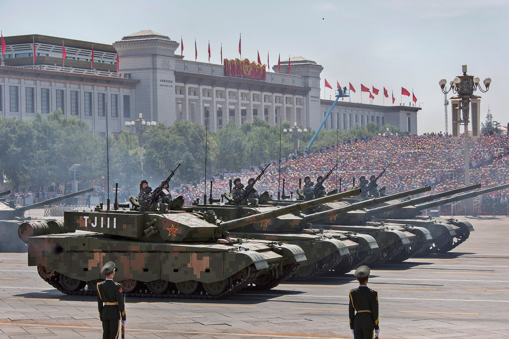

On March 13, 2023, at the annual convening of the government’s “two sessions,” China finalized a new [government budget](https://english.news.cn/20230315/4fdad960c6124600973b579b7ed09a8b/c.html) that will play a major role in shaping the trajectory of the world’s second-largest economy. Beijing also released new data on spending in 2022, which provides valuable insights into the country’s evolving spending priorities and its overall fiscal situation. Yet these budgets can be difficult to parse, and the topline figures only tell part of the story. This ChinaPower feature untangles the details behind China’s government budget.  

2023年3月13日，在一年一度的政府“两会”会议上，中国敲定了新的政府预算，这将对塑造世界第二大经济体的发展轨迹发挥重要作用。北京还发布了 2022 年支出的新数据，为了解中国不断变化的支出重点及其整体财政状况提供了宝贵的见解。然而，这些预算可能很难解析，而且最重要的数据只能说明部分情况。 ChinaPower 的这篇专题文章揭示了中国政府预算背后的细节。

**Key Takeaways 要点**

-   China’s 2023 general public budget projects revenue of RMB 23.6 trillion ($3.4 trillion) and sets spending at RMB 27.5 trillion ($4 trillion), resulting in an official deficit of nearly RMB 3.9 trillion ($564.1 billion).  
    
    中国2023年一般公共预算预计收入为23.6万亿元人民币（3.4万亿美元），支出为27.5万亿元人民币（4万亿美元），官方赤字接近3.9万亿元人民币（5,641亿美元）。
-   China’s official 2023 deficit is pegged at about 3 percent of Chinese GDP, but the full deficit—which accounts for other spending areas—is much larger, at around 7.4 percent of GDP.  
    
    中国官方预计 2023 年赤字将占中国 GDP 的 3% 左右，但全部赤字（包括其他支出领域）要大得多，约为 GDP 的 7.4%。
-   New data on China’s 2022 general public budget shows the government brought in less revenue than previously projected, largely due to declining land sales, which are a critical source of income for local governments.  
    
    中国2022年一般公共预算的新数据显示，政府收入低于此前预期，主要原因是土地出让金下降，而土地出让金是地方政府的重要收入来源。
-   China’s zero-Covid policies weighed on Chinese coffers. Spending on health and sanitation rose 17.8 percent in 2022—more than twice the growth rate of any other category.  
    
    中国的零新冠政策给中国国库带来压力。 2022 年，健康和卫生支出增长 17.8%，是其他类别增长率的两倍多。

## China’s General Public Budget  

中国一般公共预算

At the heart of China’s government budget is the general public budget. It includes revenue and spending by the central government and local governments, as well as transfers from the central government to local governments. The newly released budget projects general public budget revenue of RMB 23.6 trillion ($3.4 trillion) in 2023, a 3.5 percent increase from the previous year. Expenditure is set at RMB 27.5 trillion ($4 trillion), a 5.6 percent increase, leaving China with an official projected deficit of nearly RMB 3.9 trillion ($564.1 billion), up 15.1 percent from 2022.[1](https://chinapower.csis.org/making-sense-of-chinas-government-budget/#easy-footnote-bottom-1-8751)  

中国政府预算的核心是一般公共预算。它包括中央政府和地方政府的收入和支出，以及中央政府对地方政府的转移支付。新发布的预算预计，2023年一般公共预算收入将达到23.6万亿元人民币（3.4万亿美元），比上年增长3.5%。支出定为 27.5 万亿元人民币（4 万亿美元），增长 5.6%，中国官方预计赤字将接近 3.9 万亿元人民币（5,641 亿美元），比 2022 年增长 15.1%。 1

The 2023 budget does not include a detailed breakdown of spending across categories at the national level. It only provides a limited breakdown of a handful of categories at the central level, including general public services, foreign affairs, defense, public security, education, science and technology, stockpiling of grains and other materials, and interest on debt payments. These figures only provide part of the full picture since the lion’s share of spending in most of these categories takes place at the local level.  

2023 年预算不包括国家层面各类别支出的详细细目。它只提供了中央层面少数几个类别的有限细目，包括一般公共服务、外交、国防、公共安全、教育、科技、粮食和其他物资储备以及债务偿还利息。这些数字仅提供了整体情况的一部分，因为这些类别中的大部分支出都发生在地方层面。

A notable exception to this is the defense budget, since virtually all spending on the military takes place at the central level, not the local level. China’s [2023 defense budget](https://english.news.cn/20230305/a08b9b238c8040d18d2519fe75437a98/c.html) was set at RMB 1.55 trillion ($224.8 billion), a nominal 7.2 percent increase from the [2022 budget](http://eng.mod.gov.cn/xb/News_213114/TopStories/4906161.html) of RMB 1.45 trillion ($229.6 billion). This continues a recent trend that has seen nominal yearly percentage increases in the upper single digits.  

一个值得注意的例外是国防预算，因为几乎所有军事支出都发生在中央层面，而不是地方层面。中国2023年的国防预算定为1.55万亿元人民币（2248亿美元），比2022年的1.45万亿元人民币（2296亿美元）名义增长7.2%。这延续了最近的趋势，即名义年度百分比以较高个位数增长。

Even with steady increases, China still spends far less on defense than the United States. The U.S. Department of Defense’s [2023 budget](https://appropriations.house.gov/sites/democrats.appropriations.house.gov/files/Defense%20FY23%20Summary.pdf) rose 9.5 percent in fiscal year 2023, bringing American spending to $797.7 billion. While it lags behind U.S. military spending, China boasts the world’s second largest military budget and continues to widen its lead over other countries. Additionally, it is important to note that China’s official defense figures do not capture total spending on the military. [Actual defense spending](https://chinapower.csis.org/military-spending/) is estimated to be considerably higher.  

即使稳步增长，中国的国防开支仍然远低于美国。美国国防部2023年预算在2023财年增长了9.5%，使美国支出达到7977亿美元。尽管落后于美国的军费开支，但中国拥有世界第二大的军事预算，并继续扩大对其他国家的领先优势。此外，值得注意的是，中国的官方国防数据并未反映军事支出总额。实际国防开支估计要高得多。

China's actual defense spending is hotly debated. [Explore](https://chinapower.csis.org/military-spending/) our feature to learn about various estimates of Chinese defense spending and how they differ from China's official figures.  

中国的实际国防开支引发了激烈争论。探索我们的专题，了解中国国防开支的各种估算以及它们与中国官方数据的差异。

In addition to laying out spending figures for 2023, new budget data provides the closest look yet at spending in the 2022 general public budget. The data shows that China’s fiscal situation came under significant pressure amid economic headwinds and the heavy burden of China’s strict zero-Covid policies, which have since been lifted. China’s largest source of government revenue, value-added taxes, dropped by 23.3 percent from the previous year. This stemmed from tax rebates that were put in place to support Chinese businesses in the face of [weak domestic spending](https://www.cnbc.com/2023/01/30/chinas-6-trillion-consumer-market-is-digging-itself-out-of-a-slump.html) and sluggish economic growth. Revenue from taxes on property deeds likewise came in 22 percent below 2021 totals, and taxes on land value appreciation dropped 7.9 percent due to a slowdown in China’s property market.[2](https://chinapower.csis.org/making-sense-of-chinas-government-budget/#easy-footnote-bottom-2-8751)  

除了列出 2023 年的支出数据外，新的预算数据还提供了对 2022 年一般公共预算支出的最接近的了解。数据显示，在经济逆风和中国严格的“零新冠”政策的沉重负担下，中国的财政状况面临着巨大压力，而该政策此后已被解除。中国最大的政府收入来源增值税比上年下降23.3%。这源于在国内支出疲软和经济增长乏力的情况下为支持中国企业而实施的退税政策。由于中国房地产市场放缓，房产契税收入同样比 2021 年总额下降 22%，土地增值税下降 7.9%。 2

These declines were partially offset by increases in other categories, including a 20.3 percent increase in revenue from [consumption taxes](http://www.gov.cn/hudong/2019-12/04/content_5458247.htm), which are imposed on certain luxury or environmentally-damaging products such as some cars, cigarettes, and alcoholic beverages. In all, tax revenue in the general public budget was down 3.5 percent—a decrease of about RMB 612.2 billion ($90.9 billion) from the previous year.  

这些下降被其他类别的增长部分抵消，其中包括消费税收入增长 20.3%，消费税是对某些奢侈品或破坏环境的产品（如某些汽车、香烟和酒精饮料）征收的。总体而言，一般公共预算中的税收收入下降了 3.5%，比上年减少约 6122 亿元人民币（909 亿美元）。

While revenue fell, government spending on health and sanitation surged in 2022 as local governments were forced to pay for Covid-19 testing and other efforts to fight the spread of the virus. Total spending on health and sanitation was up 17.8 percent over the previous year—more than double the rate of increase of any other category. That is also notably higher than the 15.3 percent increase seen in 2020 as China faced the initial outbreak of the virus. China’s increased health spending during the pandemic is mirrored by other countries that took substantial measures to limit the spread of Covid-19. In [Australia](https://www.aihw.gov.au/news-media/media-releases/2021/november/rapid-growth-in-government-health-spending-during), which implemented a series of extended lockdowns throughout 2021 and 2022, spending on health goods and services grew by 7.1 percent, which is more than double Australia’s average annual growth rate on health expenditure.  

尽管收入下降，但由于地方政府被迫支付 Covid-19 检测费用和其他抗击病毒传播的费用，政府在健康和卫生方面的支出在 2022 年大幅增加。健康和环境卫生总支出比上年增长 17.8%，是其他类别增长率的两倍多。这也明显高于 2020 年中国刚爆发病毒时 15.3% 的增幅。中国在大流行期间增加了医疗支出，其他国家也采取了实质性措施来限制 Covid-19 的传播。澳大利亚在 2021 年和 2022 年实施了一系列延长的封锁，卫生用品和服务支出增长了 7.1%，是澳大利亚卫生支出年均增长率的两倍多。

High spending in one area requires making tradeoffs in other areas. Despite Beijing’s concerted efforts to promote developments in science and technology, government spending in this area rose only 3.9 percent in 2022—well below the pre-pandemic average. Some categories even saw spending slashed in 2022. Energy and environmental protection was hardest hit among the categories currently [listed](http://www.gov.cn/xinwen/2023-01/31/content_5739311.htm), with a 3.2 percent decrease from the previous year. Expenditure on culture, tourism, sports, and media (which are categorized together) also fell by 2 percent, and spending on urban and rural community development dropped 0.2 percent.  

某一领域的高支出需要在其他领域进行权衡。尽管北京齐心协力促进科技发展，但2022年政府在该领域的支出仅增长3.9%，远低于大流行前的平均水平。一些品类甚至在2022年支出大幅削减。目前列出的品类中，能源和环保受到的打击最为严重，比上年下降了3.2%。文化、旅游、体育、传媒支出下降2%，城乡社区建设支出下降0.2%。

The release of detailed 2022 data provides a more complete picture of how China’s government budget has evolved during the decade that Xi Jinping has been China’s leader. Buoyed by China’s rapid economic growth, the general public budget has ballooned significantly since Xi came to power in 2013. From 2013 to 2023, total expenditure grew 93.7 percent and revenue expanded 80.7 percent.  

2022年详细数据的发布，更全面地展示了习近平担任中国领导人的十年间中国政府预算的演变情况。受中国经济快速增长的推动，自2013年习近平上台以来，一般公共预算大幅增长。2013年至2023年，总支出增长93.7%，收入增长80.7%。

As spending has outpaced revenue each year, China has been left with a widening government deficit. In 2023 the official general public budget deficit is slated to reach RMB 3.88 trillion ($561.2 billion)—the highest level recorded in the general public budget.  

由于支出逐年超过收入，中国的政府赤字不断扩大。 2023年，官方一般公共预算赤字预计将达到3.88万亿元人民币（5612亿美元）——这是一般公共预算有记录以来的最高水平。

Not all parts of the budget have grown at the same pace. Between 2013 and 2022, spending on debt interest payments skyrocketed 271 percent, faster than any other major budget category. The increase reflects the growing strain China is coming under as it grapples with rising debt. China is by no means alone in this. In fiscal year 2022, [7.6 percent](https://www.fiscal.treasury.gov/files/reports-statements/mts/mts0922.pdf) of U.S. government outlays were towards interest payments on debt, and [22 percent](https://www.japantimes.co.jp/news/2023/02/10/business/bank-of-japan-time-bomb-debt/) of Japan’s 2022 budget was spent on dept redemption and interest payments. This number is expected to increase as the Bank of Japan raises long-term interest rates.  

并非预算的所有部分都以同样的速度增长。 2013 年至 2022 年间，债务利息支出飙升 271%，增速超过任何其他主要预算类别。这一增长反映出中国在应对不断上升的债务问题时所面临的压力越来越大。中国在这方面绝非孤例。 2022 财年，美国政府支出的 7.6% 用于债务利息支付，日本 2022 年预算的 22% 用于部门赎回和利息支付。随着日本央行提高长期利率，这一数字预计还会增加。

China’s spending on social issues has also risen substantially. Expenditure on social security and employment—one of China’s largest spending categories—rose 153 percent between 2013 and 2022. Importantly, however, growth in this category stalled in recent years amid budget constraints imposed by the pandemic. In 2021, spending on social security and employment grew less than 4 percent and in 2022 it grew 8.1 percent—well below the average pace of nearly 13 percent growth in the preceding eight years.  

中国在社会问题上的支出也大幅增加。社会保障和就业支出（中国最大的支出类别之一）在 2013 年至 2022 年间增长了 153%。然而，重要的是，由于疫情造成的预算限制，该类别的增长近年来陷入停滞。 2021年，社会保障和就业支出增长不到4%，2022年增长8.1%——远低于前八年近13%的平均增长速度。

Other categories, such as science and technology and defense, have also experienced high rates of growth over the last decade. Both have been major priorities under Xi Jinping. China’s high spending on science and technology has helped to fuel major national projects such as the [Chinese Space Station](https://chinapower.csis.org/chinese-space-station/), the core module of which was initially lofted into orbit in 2021. Spending on defense has also risen at a fast clip amid a major push to modernize [the People’s Liberation Army](https://chinapower.csis.org/tag/peoples-liberation-army/).  

其他类别，例如科学技术和国防，在过去十年中也经历了高速增长。两者都是习近平领导下的主要优先事项。中国在科技方面的高额支出有助于推动中国空间站等重大国家项目的发展，其核心舱最初于 2021 年送入轨道。在大力推动现代化的过程中，国防支出也快速增长人民解放军。

Other categories have lagged in comparison. Spending on foreign affairs increased just 37.4 percent over the 2013-2022 period—less than half as fast as spending on defense. Amid belt-tightening during the Covid-19 pandemic, spending on foreign affairs dropped nearly 17 percent in 2020 before dropping further in 2021 and 2022. Notably, however, spending on foreign affairs is set to recover somewhat in 2023 with an increase of over 12 percent.[3](https://chinapower.csis.org/making-sense-of-chinas-government-budget/#easy-footnote-bottom-3-8751)  

相比之下，其他类别则落后了。 2013 年至 2022 年期间，外交支出仅增长 37.4%，不到国防支出的一半。在 Covid-19 大流行期间勒紧裤腰带的情况下，外交支出在 2020 年下降了近 17%，然后在 2021 年和 2022 年进一步下降。但值得注意的是，外交支出预计将在 2023 年有所恢复，增幅超过 12%百分。 3

At first glance, the budget figures also seem to suggest sluggish growth in spending on transportation, but it is important to note that this does not reflect total spending on infrastructure. China has spent heavily on infrastructure in recent years, in part as a means of spurring economic growth. Much of this spending is obfuscated in various parts of local government budgets. For example, China has issued [special sovereign bonds](https://www.bloomberg.com/news/articles/2022-06-27/what-s-the-special-debt-china-uses-to-spur-economy-quicktake#xj4y7vzkg) to help [local governments](http://yss.mof.gov.cn/2020zyjs/202106/t20210629_3727285.htm) fund infrastructure and other projects. Unlike regular government spending, these bonds are earmarked for specific projects and are not reflected in the general public budget.  

乍一看，预算数据似乎也表明交通支出增长缓慢，但值得注意的是，这并不反映基础设施支出总额。近年来，中国在基础设施建设上投入巨资，部分是为了刺激经济增长。这些支出的大部分在地方政府预算的各个部分中都被混淆了。例如，中国发行了特别主权债券，帮助地方政府为基础设施和其他项目提供资金。与常规政府支出不同，这些债券专门用于特定项目，并不反映在一般公共预算中。

## China's Other Budgets 中国的其他预算

The general public budget is important, but it only tells part of the story. China has three additional national budgets: the government funds budget, the state capital operations budget, and the social insurance fund budget. In 2014, China’s Budget Law was [revised](http://www.npc.gov.cn/zgrdw/npc/zgrdzz/2014-10/23/content_1882582.htm) to include a stipulation that revenues and expenditures from all four budgets should be included to create a “full-caliber” budget. Each of these budgets contains different components of China’s fiscal portfolio, as outlined below:  

一般公共预算很重要，但它只能说明部分问题。中国增加了三项国家预算：政府性基金预算、国有资本经营预算和社会保险基金预算。 2014年，中国预算法修订，规定四项预算收入和支出全部纳入，形成“全口径”预算。每项预算都包含中国财政组合的不同组成部分，概述如下：

-   **Government Funds Budget:** This budget largely falls under the purview of local governments. Revenue is primarily financed through land sales, with additional revenue from central and local governments purchases of special bonds. Expenditure flows are focused on capital expenditures such as infrastructure projects. In 2023, this budget’s revenue is projected to be RMB 7.82 trillion ($1.13 trillion) and expenditure will be RMB 11.8 trillion ($1.71 trillion), resulting in a deficit of RMB 4 trillion ($578.6 billion).  
    
    政府资金预算：该预算主要属于地方政府的职权范围。收入主要来自土地出让，另外收入来自中央和地方政府购买专项债券。支出流主要集中在基础设施项目等资本支出上。 2023年，该预算收入预计为7.82万亿元人民币（1.13万亿美元），支出为11.8万亿元人民币（1.71万亿美元），赤字为4万亿元人民币（5786亿美元）。

-   **State Capital Operations Budget:** The state capital operations budget is managed by the State-owned Assets Supervision and Administration Commission and centers on the revenue and expenditure associated with China’s sprawling network of state-owned enterprises. In 2023, the state capital operations budget is projected to bring in revenue of RMB 535.84 billion ($77.5 billion) and its expenditure will stand at RMB 346.88 billion ($50.2 billion). With an additional RMB 27.5 billion ($4 billion) carried over from the previous year, there will be a resulting surplus of RMB 216.5 billion ($31.3 billion), all of which will be transferred to the general public budget.  
    
    国有资本运营预算：国有资本运营预算由国有资产监督管理委员会管理，重点关注与中国庞大的国有企业网络相关的收入和支出。 2023年，国有资本运营预算预计收入为5358.4亿元人民币（775亿美元），支出为3468.8亿元人民币（502亿美元）。加上上年结转275亿元人民币（40亿美元），结余2165亿元人民币（313亿美元），全部转入一般公共预算。

-   **Social Insurance Fund Budget:** The social insurance fund is managed by the National Council for Social Security Fund and is dedicated to meeting China’s social security needs. Income is generated from a subset of funds and the bulk of this is spent on costs related to pensions and medical insurance. In 2023, this budget’s revenue is projected to reach RMB 10.94 trillion ($1.58 trillion) and the expenditure will be RMB 9.8 trillion ($1.42 trillion), resulting in a surplus of RMB 1.1 trillion ($159.1 billion), which will be added to the fund’s overall capital.  
    
    社会保险基金预算：社会保险基金由全国社会保障基金理事会管理，致力于满足中国的社会保障需要。收入来自一部分资金，其中大部分用于与养老金和医疗保险相关的成本。 2023年，该预算收入预计将达到人民币10.94万亿元（1.58万亿美元），支出将为人民币9.8万亿元（1.42万亿美元），从而产生盈余1.1万亿元人民币（1,591亿美元），这将添加到基金的整体资本。

With the exception of the social insurance budget (which operates somewhat separately), the Chinese government has utilized transfers across these budgets to offset deficits in other areas. This has had the added effect of making it more difficult to analyze China’s fiscal situation.  

除社会保险预算（在某种程度上独立运作）外，中国政府利用这些预算的转移支付来抵消其他领域的赤字。这还增加了分析中国财政状况的难度。

For example, in 2023, China’s budget report calls for transferring RMB 1.9 trillion ($274.8 billion) into the national general public budget from other budgets and various carryover funds. This includes transfers of RMB 500 billion ($72.3 billion) from the government funds budget and RMB 216.5 billion ($31.3 billion) from the state capital operations budget. This shifting of funds helps to significantly reduce the official deficit of the general public budget. China states that its official general public budget deficit in 2023 will be RMB 3.88 trillion ($561.2 billion), but without transfers from other areas, the actual general budget deficit would total RMB 5.78 trillion ($836.1 billion).  

例如，2023年，中国的预算报告要求从其他预算和各类结转资金中将1.9万亿元人民币（合2748亿美元）划入国家一般公共预算。其中包括从政府基金预算中转移 5000 亿元人民币（723 亿美元），从国有资本运营预算中转移 2165 亿元人民币（313 亿美元）。这种资金转移有助于大幅减少一般公共预算的官方赤字。中国表示，2023年官方一般公共预算赤字将为3.88万亿元人民币（5612亿美元），但如果没有其他领域的转移支付，实际一般预算赤字总额将为5.78万亿元人民币（8361亿美元）。

When transfers between budgets are removed and China’s various budgets are consolidated into one total budget (excluding the social insurance fund budget), China’s fiscal situation appears significantly less healthy. China’s official 2023 deficit of RMB 3.88 trillion amounts to approximately 3 percent of China’s GDP. When the other budgets are accounted for, China’s total deficit climbs to 7.4 percent of GDP.  

当取消预算之间的转移支付并将中国的各项预算合并为一个总预算（不包括社会保险基金预算）时，中国的财政状况显得明显不太健康。中国2023年的官方赤字为3.88万亿元人民币，约占中国GDP的3%。如果算上其他预算，中国的总赤字将攀升至GDP的7.4%。

When China’s full budget deficit is tracked over time, it paints a picture of a rapidly worsening fiscal situation for China. In the past, surpluses in the government funds budget and state capital operations budget typically helped to offset deficits in the general public budget, but this changed significantly in 2020 as China spent heavily to offset the economic fallout from the Covid-19 pandemics.  

随着时间的推移追踪中国的全部预算赤字，可以看到中国财政状况迅速恶化。过去，政府基金预算和国有资本运营预算的盈余通常有助于抵消一般公共预算的赤字，但这种情况在2020年发生了重大变化，因为中国投入了大量资金来抵消Covid-19大流行的经济影响。

One key part of this has been the issuance of trillions of RMB worth of special purpose bonds. These fall under the government fund budget and were primarily created as a new vehicle for local governments to raise money for infrastructure projects and other special needs. Since 2020, China has authorized the issuance of roughly RMB 3.6 trillion ($520.7 billion) of these bonds each year.  

其中一个关键部分是发行了价值数万亿人民币的特殊目的债券。这些属于政府基金预算，主要是作为地方政府为基础设施项目和其他特殊需求筹集资金的新工具。自2020年以来，中国每年授权发行约3.6万亿元人民币（5207亿美元）的此类债券。

In 2022, China’s fiscal woes were compounded by a major slowdown in the country’s sprawling real estate sector. Land sales are a crucial source of revenue for many local governments. Data from China’s National Bureau of Statistics show that land sales dropped by [53 percent](https://www.wsj.com/articles/chinas-property-bust-compounds-economic-pain-11674123815) (in terms of area). According to China’s latest budget report, declining land sales led to a 20.6 percent drop in revenue within the government fund budget.  

2022年，中国庞大的房地产行业大幅放缓，加剧了中国的财政困境。土地出让是许多地方政府的重要收入来源。中国国家统计局的数据显示，土地出让金下降了53%（按面积计算）。根据中国最新的预算报告，土地出让金下降导致政府性基金预算收入下降20.6%。

China is not alone in facing a tough fiscal environment. Governments around the world have been challenged by the pandemic and the ensuing economic fallout. Yet China’s situation is worsening at a rapid pace. If its deficits continue to grow, Chinese leaders will be forced to grapple with increasingly tough decisions about how to increase revenue or cut spending—or both. 中国并不是唯一面临严峻财政环境的国家。世界各国政府都面临着疫情大流行和随之而来的经济影响的挑战。然而，中国的情况正在迅速恶化。如果赤字继续增长，中国领导人将被迫做出越来越艰难的决定，即如何增加收入或削减支出——或两者兼而有之。  

**Authors: 作者：**  

Brian Hart, Bonny Lin, Matthew P. Funaiole, Samantha Lu, Hannah Price, Matthew Slade  

布莱恩·哈特、林邦妮、马修·P·弗奈奥尔、萨曼莎·卢、汉娜·普莱斯、马修·斯莱德
