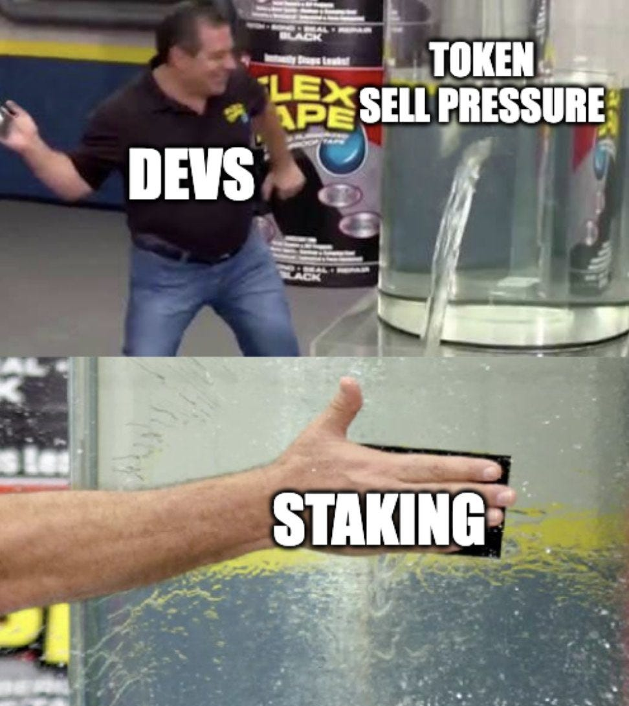

Recently, I was contacted by a member of the board of ApeCoin, which is the BAYC token’s equivalent of a board of directors I guess. They asked for some feedback on some proposal and I offered my thoughts on a call.

I wanted to write about some of the things discussed openly, since I thought they were interesting topics, but particularly because they were topics that “coin voting governance” is extremely poorly suited to properly solving.

Before I start: I don’t own any ApeCoin, nor am I short ApeCoin, I have owned BAYC at times in the past but don’t have any long or short exposure to any Yuga Labs ecosystem stuff currently. I’m not a financial advisor and it has in fact been long rumoured that I am actually an idiot.

Staking used to mean something. I think it was Peercoin that first launched a proof of stake protocol, so probably about ten years ago now. Since then, POS has become increasingly popular for new blockchains, with all the newer trendy ecosystems sitting on POS-ish chains.

For Peercoin and the POS networks that followed, staking had a purpose. Owners would offer their coins as collateral for the chance to validate blocks, and they would be rewarded for doing so. Staking, therefore, rewarded users risking collateral and doing work: participating in functions necessary to the continued operation of the network or protocol.

Somehow, over time, the word ‘staking’ has been repurposed and redefined. Instead of _receiving rewards for contributing to chain security with collateral at stake_, modern “staking” just seems to mean _idk we give you more coins as a reward if you don’t sell your current coins lol._

These modern staking mechanisms do not have any function in the ecosystem to which they belong. They don’t _do_ anything in any practical or technical sense. They don’t make an ecosystem more robust. They are a shell game, using the name of a different thing to obfuscate their actual purpose, which is to encourage less selling.

When POS protocols issue rewards to stakers, they are buying chain security. It’s a worthwhile use of equity. When DeFi projects offer liquidity mining programs, they are buying growth and TVL. Depending on how the program is designed, it can also be a worthwhile use of equity. Spending equity for things that makes the protocol more sustainable, larger or more secure seems worthwhile.

But these “staking” mechanisms (that do not do anything at all except pay users more coins for staking) are giving away equity for nothing except to reduce potential sellers’ liquidity.

If you don’t stake, your share of the network or protocol is inflated away by new emissions. Plus, staking has no risk! You can’t lose coins, because staking doesn’t do anything! So, lock up your coins! Secure them off-market today… In fact, we’ll pay you to do it!

Simply paying users for not selling, payment received in the same asset that they are not selling, seems like pretty late-stage in the games of ponzi creation.

OK quick ApeCoin fact-sheet.

There’s 1bn supply. No new coins can be minted or burned, so the total suppy will always be 1 billion APE.

Token ownership looks like this:

-   47% — ApeCoin DAO “Ecosystem Fund”
    
-   15% — Community airdrop
    
-   15% — Yuga Labs
    
-   14% — “Launch contributors” (investors?)
    
-   8% — Founders
    
-   1% — Charity
    

On the vesting side, it looks like generally there’s a one year lockup for Yuga Labs, Founders and Investors — but it does seem like there’s some exceptions to that, with some coins unlocked instantly and some after 6 months.

The remaining vesting schedule seems to range between 1 and 3 years after the cliff, with the entire supply 100% unlocked within 4 years.

Anyway. Back to the point.

There is a [proposal live](https://forum.apecoin.com/t/aip-5-staking-pool-allocation-ecosystem-fund-allocation/45) for a staking program for ApeCoin. It’s written by Animoca which seems to be some hybrid crypto gaming VC software company, and their founder is on the board of ApeCoin.

In the proposal author’s words, the goal of this proposal is: _to make ApeCoin the preferred token of web3_ _by_ _incentivizing early NFT adopters and existing and potential ecosystem participants to be participate in activities benefitting the APE Ecosystem_.

The proposal itself seems pretty convoluted but I can summarize it for you. The proposal basically says:

**We should pay 17.5% of the total supply of ApeCoin to people that stake their ApeCoin over the next three years. We should give them different % returns if they hold BAYC/MAYC/BAKC as well.**

It’s not clear to me how issuing APE to people that already have APE is “_incentivizing early NFT adopters and existing and potential ecosystem participants to be participate in activities benefitting the APE Ecosystem”_.

Isn’t it just paying people in ApeCoin to hold ApeCoin?

In fact, if we are being truly honest about this proposal, what it really means is “lets pay existing holders for not selling while the founder/investor/contributor unlocks happen, and also so we can fake some utility before any is actually built”.

The current valuation of ApeCoin is around 15 billion dollars. That means the DAO treasury holds around 7 billion dollars.

Animoca’s proposal suggests giving away $2.6 billion dollars (~37% of the DAO’s remaining tokens) for free to holders of APE over the next three years.

Since this APE staking doesn’t actually do anything practically or technically, it can be imagined simply as a bribe to not sell. It says _“we’ll give you more APE if you don’t sell your APE or BAYC!”_

The DAO is spending 37% of it’s remaining equity on this bribe, so it must consider the bribe important.

Consider that this equity could be spent on a lot of things: it’s currently valued at 2.6 billion dollars! Lots of value could be created for ApeCoin that could build a sustainable ecosystem as well as attract new, external capital.

From an outside perspective, it might appear that the DAO is spending over 1/3rd of it’s remaining equity in order to bribe people not to sell while the early contributor coins pass their early unlock phases.

But this seems more conspiracy-theory-like than a practical malicious strategy when you consider the supply/demand dynamic that will follow from this staking program.

There is currently ~15% of the supply liquid on the market. This inflation/emissions schedule will increase the amount of supply on the market by ~75% in only the first year. And yet I don’t believe that it will increase the demand for ApeCoin by 75%. Thus, the staking program in isolation could appear harmful to the financial interests of the locked-coin holding insiders.

But, ApeCoin does have a real problem: how does it get additional supply into the market so that impending founder and investor unlocks do not become the lion’s share of the liquid supply?

I personally believe it is good to spend this earmarked equity, but the equity should be spent on growth and progress towards their originally stated goal: becoming the currency of web3. It shouldn’t be spent just giving coins to people that already hold coins.

ApeCoin DAO’s remaining equity should be spent solving real problems for users.

I don’t know what it means to fulfill the mission of “becoming the main currency for web3” but I do know that there are existing ‘user needs’ within the NFT ecosystem that could be funded or built by ApeCoin DAO.

-   Why is OpenSea the primary exchange for Bored Apes? BAYC and MAYC traders have spent ~20,000 ETH on OpenSea fees in the last year. That’s >$60m leaving the ecosystem every year.
    
-   BAYC holders, or NFT holders generally, may want to obtain a line of credit on their NFT while retaining ownership. Can ApeCoin DAO create the primary NFT lending marketplace?
    
-   Why do Bored Ape users keep getting hacked? What educational resources are needed to help people self-custody more effectively? Could ApeCoin DAO launch an attractive custody service?
    
-   etc etc. I am sure the community can think of better ones than me.
    

The DAO’s equity should go towards building incremental value for APE ecosystem users and potential users. It should solve real problems that exist for users within the NFT community.

The equity should be spent acquiring and incubating utility, building revenue streams and creating a sustainable DAO.

I think there’s a reasonable argument that 15% ‘retail’ ownership is too small, and a staking program in the first year or so (while the only supply eligible for staking is retail) can increase that to more meaningful levels.

I can also see an argument for a 10-15 year emissions program: the APE token has no mint function, and cannot increase it’s own supply. If the DAO spends all of the APE in the first few years, it will have no more firepower to incentivise activity or acquire future value. Plus, you will achieve a wider and more desirable distribution over time by increasing the length of time someone must become an ecosystem participant. This incentivises future “_generations”_ of holders to maintain and grow the ecosystem too.

I can see an argument for why the BAYC NFTs **should** be the thing staked: to remove users having to choose between joining the community via buying a BAYC, or buying ApeCoin. Plus it’s maybe more likely that new people will be onboarded to the APE community through NFTs rather than fungible coins, since that is how it worked for everyone in the current APE community.

I can see an argument for why the BAYC NFTs **should** **not** be the thing staked: ApeCoin is a brand new entity, founded by the BAYC community but not actually directly attached to the NFTs anymore, outside of overlapping owners.

In reality, these arguments are not grounded in much reality, because it is difficult to say: what is the point of this staking program? What is the program trying to achieve?

The proposal says some nonsense about “incentivising participants to do stuff in the APE ecosystem” but the staking proposal itself appears detached from that goal.

If ApeCoin DAO wants the staking program’s goal to be **to acquire new members for the DAO**, then a credible staking program might include issuing ongoing rewards to NFT holders within the APE ecosystem. The APE ecosystem might even acquire other NFT collections and issue APE to these communities too.

If the staking program’s goal was to support the liquidity of the BAYC ecosystem, then APE emissions would be issued to those providing LP in APE/WETH markets, as well as those providing liquidity to NFTX-style pools and otherwise.

If the staking program’s goal was to simply pump prices, then it would require time-locking assets off market, giving higher rewards for longer time-period locks and strangling supply off-market for as long as possible.

Without the stated goal from the ApeCoin board on _what is the purpose of a staking program_ then it’s difficult to design a staking program that fulfils those goals. Getting more supply onto the market, bribing users to not sell, or providing “fake utility” are not credible goals for a staking program.

Personally, I would design a small program that incentivises introducing increasing amounts of new people to the Ape ecosystem over the next decade, and I would reward existing holders for their continued participation in the ecosystem. It is my personal belief that new users will be onboarded for the NFTs, rather than fungible assets, and thus rewards should be paid to the NFT asset holders rather than a fungible coin paying effectively an interest rate for holding it.

I would supplement this staking program with an aggressive, and much larger, program of purchasing value.

A multi-billion dollar organisation, which ApeCoin now is, needs to have a sufficiently long time-horizoned plan. There should be a good answer to the question: how do we turn this $7 billion of APE-denominated treasury assets into $100 billion of value over the next decade or two?

Yet the time horizon for crypto investors is not always very long. On average I imagine they don’t care much about what their token projects will be doing in 2 months, nevermind 10 years.

Thus, if you tell the community “hey, we decided there will be no staking program, and we are going to invest growth by paying builders to contribute to the ApeCoin DAO ecosystem” they will likely be very unhappy.

_I don’t get any coins for free anymore?? And **outsiders** get millions of dollars of coins?? Just for building a lending market?? Wtf???_

It’s unlikely retail investors rigourously consider the implications of Ohm-style supply inflation to existing holders, nor have they considered the k-factor knock-on effects of investor trust from seeing a price chart go down (even if the staking emissions meant holders are actually up overall).

Thus, governance over complex and multifaceted analytical issues is a strange environment. It quickly descends into politics.

I have extremely little faith that coin-voting communities of retail investors will vote for the best medium-term outcomes, and in fact will more likely vote for damaging medium-term outcomes. I read something today that said Sushi treasury went from $1bn to $30m in a year. I don’t know if that is exaggerated, or fictional, but think this will be a common story of many failed DAOs in time.

Staking mechanisms should be designed to support the goals of the ecosystem. They should be used to incentivise the parts of a product, community or network that requires people to do work or to take risk.

ApeCoin DAO has 7 billion dollars in it’s treasury. It should use it to incentivise people to take risks, do work, and grow the community — rather than giving it away to existing holders as an interest rate bribe for not selling.

Without utility or value capture, spending 37% of the treasury on staking emissions is not only worthless but could actually be actively harmful to the APE ecosystem’s long-term prospects.

We should’ve protested the repurposing of the term “staking” from being a reward for work in a consensus mechanism, with risk of losing collateral, into this current “idk just lock it off market to receive more coins risk-free lol” but it’s probably too late for that now. I imagine the Gensler-police are very pleased that the conflation has occurred, since the term is now inherently misleading and can mean several different things.

I really hope we don’t live in a world where the primary currency of the internet is called “ApeCoin” but I hope that I managed to keep that glaring bias out of this article and that this is relevant for any DAO finding itself in a similar position: lots of capital, good distribution and the opportunity to land-grab utility.

The Bored Ape community is famous in crypto for continually failing at secure self-custody.

In response, the ApeCoin board has suggested this that BAYC NFTs will actually ‘contain’ your APE tokens.

> _**How Staking Works for NFT Holders**_
> 
> _If a BAYC ecosystem NFT holder wants to stake in pool 2, 3, or 4 (depending on the NFT), they will pair the NFT with their ApeCoin to access the relevant staking pool. The NFT itself isn’t staked — it acts as the key to the “vault” holding the staked ApeCoin. The NFT holder retains the ability to sell the NFT. By default, if you sell an NFT that is actively staking ApeCoin, you are also selling the key to access the associated staked ApeCoin._
> 
> _To sell the NFT only, without the associated staked ApeCoin, the NFT seller would unstake the ApeCoin prior to listing the NFT._

This means, if you lose your BAYC, you lose your APE too!

You cannot spread your NFT and your APE coins into different wallets. It means if someone steals your BAYC, they don’t have to do anything extra to take your APE. The APE goes with the BAYC by default! Great!

It seems intentionally convoluted, and incurs more bad outcomes than good ones. Even forgetting that you had staked APE behind a particular NFT could be a huge financial error. Really bad design.

The ApeCoin board has also issued this statement:

> _**Why can’t I just stake a BAYC ecosystem NFT?**_
> 
> _We believe that everyone in web3 should have control of their assets. In order to provide NFT owners this right, the NFTs themselves will not be staked into the staking pools. Furthermore, by staking ApeCoin rather than the NFTs, the ApeCoin DAO incentivizes and fosters the long-term growth of the ApeCoin holder community._

This seems like straight-up double-speak. _Everyone should control their assets, so you can’t put this asset into the contract. But you can put these other assets into the contract!_

It actually makes so little sense that I can only conclude it’s treating users as dumb.

The market cap of APE is larger than BAYC, so it’s likely that _more_ assets would be in the contract if it is APE-only staking than if it were BAYC-only staking!

Anyway, what happens after three years of staking?

> _**What happens at the end of the three-year period of staking?**_
> 
> _A new AIP will need to be drafted and voted on to determine the future staking mechanism, putting this decision in the hands of the community. Ideally, by the end of the total staking period of 3 years, the DAO will have sustained revenue to keep incentivizing staking and rewarding ecosystem participants._

“Ideally”??? Surely it would be preferable to establish the revenue plans prior to the staking program, then? What if a credible plan for comparable revenue takes 5 years instead of 3? Designing a staking program without understanding a product and revenue plan that it is subsidising in the first place also seems pretty wild.

Not that it matters much anyway, because _staking_ in this scenario doesn’t do anything, it is just a bribe to remain a community member.

Oh also the current staking proposal includes $1.3bn of emissions in the next year (at current prices). This alone would create $700m of sell pressure from new tax obligations alone, assuming all holders were in a reasonably ‘western’ high-tax regime. Pretty cool.

I’ll stop writing now.
