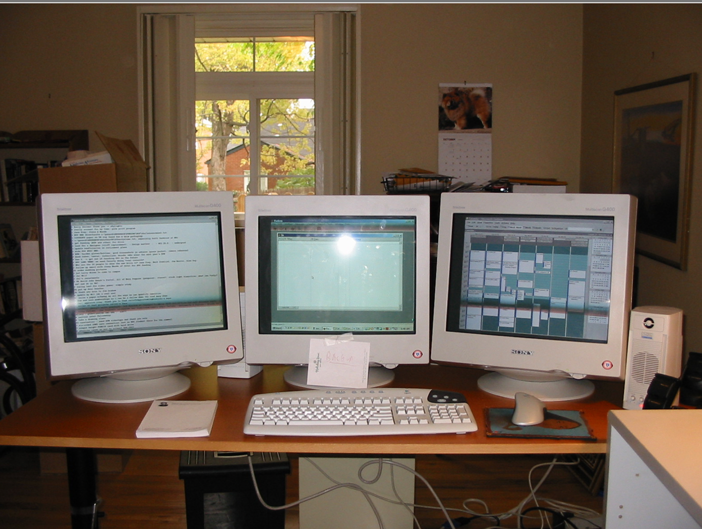

>  “时间是我们拥有的一切。或许有一天你会意识到，你拥有的时间比你想象的要少。” 这篇文章的背景是基于兰迪·波许（Randy Pausch）的一次演讲，他是卡内基梅隆大学（Carnegie Mellon University）的一名教授，以及虚拟现实领域的先驱。
>
> 这次演讲发表于2007年，当时兰迪·波许已经被诊断出患有晚期胰腺癌，生命只剩下几个月的时间。面对有限的时间，他决定分享自己的经验和智慧。
>
> 他在文中幽默的说到：“在时间管理上，我相信我有足够的资格来讨论在时间有限的情况下应该如何采取的行动。”
>
> 读完全文后，我的答案是，是的，你太有资格了。如果以后有人让我推荐关于时间管理的文章，我的答案当中一定会包含这一篇，我甚至忍不住地想将它内定为参考答案2024年年度10佳文章。
>
> 这篇文章给我的感受远不止有用，更多的是感动，和对波许字里行间中所流露出的人格魅力的敬佩。

谢谢，你们太客气了，但别忘了，“菜”还没上桌呢，先别急着给服务员小费。

在此，我要向加布（Gabe）和吉姆（Jim）表达我最诚挚的谢意，他们的介绍让我倍感荣幸。他们是我多年的老朋友，我在弗吉尼亚大学执教多年，对这所学校有着深厚的感情。这所学校的传统文化、历史沉淀以及无处不在尊重的氛围，让我无比敬仰，这也是我期望在我们的社会中得以传承的宝贵品质。弗吉尼亚大学的荣誉守则，尤其值得所有教育工作者深入研究，他们或许会感叹：“我们为什么不能做到这一点呢？”这个地方拥有太多值得我们珍惜和传颂的美好事物。

今天，我想和大家聊聊如何有效地管理时间。如你所知，我的经历颇为非凡。大约18个月前，我开始了与胰腺癌的斗争。我全力以赴，做了一切正确的事，但如我的医生所言，如果可以的话，这绝非你愿意选择的道路。因此，在这一点上，我相信我有足够的资格来讨论在时间有限的情况下应该如何采取的行动。

8月15号，这些是我的CAT扫描图像（如上图所示）。如果你浏览所有的图像，你会看到我的肝脏里有大约十二个肿瘤，当时的医生们给出了他们的诊断——我喜欢他们表达的方式：“你还剩三到六个月的健康时间。”这是一种乐观和积极的措辞，就像你在迪士尼的时候问：“公园什么时候关门？”——“公园一直开放到八点。”嗯，所以我还有“三到六个月的健康时间”。

那么，我们来算算时间：今天是三个月零十二天。所以在我的日程表上，今天并不一定要待在弗吉尼亚大学。我很高兴地说，我们正在接受姑息化疗（palliative chemo），如果效果持续，它还能为我争取到几个月的宝贵时间。我依然保持着相当不错的健康状况。今天加布也在现场，我就不做俯卧撑了，毕竟不想在他面前献丑。看加布那健美的身姿，真是让人羡慕！尽管昨天我才接受了化疗，但我仍然感觉良好——你们真应该尝试一下，那种经历真的很奇妙（译者注：作者在开玩笑）。但这确实引出了一个问题，我的时间是有限的——有人会问：“既然如此，你为何还要来发表这场演讲？”

（译者注：姑息化疗是一种针对无法治愈的癌症患者的治疗方法，旨在减轻症状、改善生活质量，而不是治愈疾病。它通过控制癌症的生长和扩散，帮助患者缓解痛苦和其他相关症状。）

我来这里发表演讲有很多原因。其中一个原因是我曾经承诺过，这是一个非常简单的理由。而且我身体上也能做到。另一个原因是，前往弗吉尼亚大学就像回到我自己的家一样。人们会说：“你不是应该把所有时间都用来陪伴家人吗？”但对我而言，今天我在这里，无论是在比喻上还是在字面上，都是在和家人共度时光，因为事实证明——你们中的许多人可能已经在我之前的演讲中看到过这张照片（如上图所示），这是我的侄子克里斯（Chris）和侄女劳拉（Laura）。我的侄女劳拉实际上已经是大四学生了……在这里，在杰斐逊（Jefferson）先生的大学。劳拉，你能站起来，让大家看看你长高了吗？看，她在那里。能有她在这所大学，我感到非常幸福。

（译者注：杰斐逊的大学指的是弗吉尼亚大学，这是一所位于美国弗吉尼亚州夏洛茨维尔的公立研究型大学。它由托马斯·杰斐逊于1819年创立，是他的三大成就之一。）

这张照片中的另一个人是克里斯，克里斯，你能站起来让大伙儿瞧瞧，你已经长得多么高大了吗？他们在许多方面都有所成长，不仅仅是身高。看到他们这样的成长，作为他们的叔叔，我感到非常欣慰。在座的有没有历史系的教师或者博士生？有没有研究历史的人？如果有来自历史领域的朋友，请在演讲结束后找一下克里斯。因为他目前正在威廉与玛丽学院（College of William & Mary）读大二，他对将来攻读历史博士学位很感兴趣，而且这里的历史博士学位无疑是全球顶尖的。所以在这里我要为我的侄子小小地宣传一下！让我们记住这个年轻人！

（译者注：威廉与玛丽学院（College of William & Mary）是位于美国弗吉尼亚州威廉斯堡的一所公立研究型大学。成立于1693年，是美国第二古老的高等教育机构，由英国国王威廉三世和玛丽二世共同授权成立。）

## 时间是我们最宝贵的资产

我们今天要讨论什么？我们要聊的——这不同于以往我的任何一次演讲。我们要讨论的一个极其务实的话题。我之所以愿意重返讲台，部分原因是因为加布以及其他许多教师向我反映，他们从我的分享中获得了许多实实在在的收益，了解到了如何更有效地提升工作效率，而我始终坚信：时间是我们最宝贵的资产。所以，今天的分享将非常务实。它将以一种启发性的方式激励你，提供一些切实可行的方法，帮助你在有限的时间内达成更多目标。我会详细讲解如何设定目标、如何节省时间、如何处理与上司的关系——最初这个主题是如何与你的导师相处，但我有意将其范围扩大，使其不仅限于学术领域。如何分配任务给他人，还有一些我认为值得推荐的特定技巧和工具，这些都能让你的日常更加高效。我们还将面对生活中的两大难题——压力和拖延。如果你能战胜拖延，那么你就已经走在了成功的道路上。

各位无需费心记笔记。我猜，如果有人的笔记本屏幕亮着，他们大概在忙着发即时消息或者处理邮件吧。如果你在听音乐，请戴上耳机，没关系的。因为本次演讲的所有内容，我都会上传到我的个人网站上。为了让大家更轻松地抓住重点，我会在那些我认为特别重要的幻灯片上加上红星标记。如果你看到有红星的幻灯片，请一定要留心。至于那些没有红星的幻灯片，嗯……你们可以稍微放松一些。

今天，我想先和大家探讨一个现象，那就是美国人在时间管理上的表现，远不如在金钱管理上的表现。我们似乎天生就懂得如何与金钱打交道，收入的多少在我们的文化中往往代表着一个人的地位和成功。然而，对于时间，我们却并没有给予同样的重视。我常常感到好奇，人们为何会轻易地让时间从指尖溜走。

我曾观察到一个现象：人们很少把时间和金钱放在同等地位去衡量，尽管它们之间有着密切的联系。记得我刚开始教书时，总会问学生们一个问题：“你们认为自己的时间每小时价值几何？”或者对那些职场人士：“你们的时间对公司而言，每小时又值多少钱？”许多人并未意识到，如果你年薪五万，公司为了聘用你，实际上可能要承担双倍的成本，包括供暖、照明和其他员工的开销。换言之，你每年拿到手的五万美元，公司可能需要创造十万美元的营收来支撑。如果你将自己的小时工资纳入考量，你就会对自己的价值有一个更清晰的认识。当你面临选择，比如“我是该自己编写软件，还是购买现成的，或者外包给别人？”时，清楚自己每小时的成本对决策有着重要影响。你会突然意识到，如果能节省三个小时，换算成金钱，那将是一笔巨大的节省！所以，试着将时间和金钱视为一物，这样你会更加珍惜时间。本杰明·富兰克林（Ben Franklin）早在很久以前就已经明白了这个道理。

（译者注：本杰明·富兰克林是一位美国的政治家、科学家、发明家和作家。他是美国独立宣言和美国宪法的签署者之一，对美国早期的政治和科学发展产生了深远影响。）

因此，你得像管理你的财富一样去管理时间。我知道，并非所有美国人都能妥善管理自己的资金，这也正是信用卡和房贷行业得以兴盛的原因。但大多数人至少能够理解，当你询问：“我能看一下你家的经济预算吗？”时，他们并不会对你投以异样的眼光。然而，当我提到“家庭预算”，你可能首先想到的是金钱，而我想说的，其实是你的家庭时间预算。在这个快节奏的时代，时间就是我们最宝贵的资产，我们应当像对待钱包里的钱一样对待我们的时间。

在卡内基梅隆大学娱乐科技中心的迎新会上，我总会对新生们说：“这里是个硕士课程，大家都得付全额学费。”每学期的费用大概是三万美元。我会告诉他们：“如果你来找我，说‘我觉得每年花六万美元读这个不值’，我会直接请你离开。我会把你赶出办公室。我甚至不会和你讨论这个问题。学生们私下里可能会说：“天哪，波许教授真是个难缠的家伙。”他们这么说，其实也没错。但我接下来会告诉他们：“因为金钱并非最关键的。未来的你，总有机会赚到更多的钱。但你所失去的这两年时光，是再也找不回来的。所以，如果你想和我讨论费用问题，我会请你出去；但如果你来找我，说‘我不确定这里是否值得我投入两年时光’，我会和你深入交流一整天，因为这关乎你的宝贵时间——这才是我们真正应该关注的重点。”

今天我要分享的许多建议，尤其适用于在座的本科生们——有多少人是本科生，请举手让我看看？很好，你们正值青春年华！这些建议，如果你熟悉《周六夜现场》（Saturday Night Live）里的汉斯和弗朗茨（Hans and Franz ），可以这样理解：“现在先听我说，将来你会明白的！”（Hear me now, but believe me later!）这些内容随着时间的推移会变得有意义，而且最棒的是，加布已经答应将这次演讲放到网上，让更多人能够观看。现在，人们可以通过网络观看视频，这真是个了不起的进步。

（译者注：《周六夜现场》是一档美国著名的深夜喜剧和综艺电视节目，自1975年起在NBC电视网播出。）

所以这些内容将来回想起来会更加有意义，当我提到你的老板时，如果你是学生，可以将其想象成你的学术导师；如果你是博士生，可以将其想象成你的博士导师；如果你是一个正在观看这个视频的小孩，那么可以将这个想象成你的父母，因为他们在某种意义上是你的“老板”。这次演讲的节奏非常快，我非常注重具体的技巧，我不太喜欢陈词滥调——虽然它们听起来不错，但它们并不能真正帮助我完成明天的工作。

在这个过程中，有一点很重要，那就是一个优秀的“小偷”（thief）胜过十个优秀的“学者”（scholars）。这句话中的“学者”二字，你大可替换成任何你所想的词汇。今天我要分享的内容，无一不受到这两部著作的深刻影响——凯西·柯林斯（Cathy Collins）的《教师的时间管理》（Time Management for Teachers ）以及《职业发展研讨会：掌控你的工作日》（Career Track Seminar: Taking Control of Your Work Day）。这两部作品对我影响深远，但我认为，将其中的精华提炼出来，以更精炼的形式呈现给大家，意义更为重大。

我喜欢谈论“时间饥荒”（The Time Famine）。我觉得这是个好词。在座的各位，有没有人觉得自己时间太多？好的，没人举手，太好了。我喜欢用“饥荒”这个词，因为它让人联想到非洲的饥荒。你可以试图通过空投食物来解决眼前的困境，但治标不治本，我们需要的，是深层次、系统性的解决之道。如果有人告诉你，他能在24小时内彻底解决你的时间问题，这无疑是天方夜谭，就像宣称一年内根除非洲的饥荒一样不切实际。我们需要的是长期规划和根本性的改变，因为我们面临的是一个系统性的问题——事务繁多，而时间宝贵且有限。

（译者注：时间饥荒是一个描述人们感觉自己没有足够时间完成所有任务和活动的心理状态。）

在我们深入探讨这个话题时，有一个关键点不容忽视：我们讨论的并不仅仅是如何管理时间。那种平淡无奇、老生常谈的时间管理话题，就像一杯索然无味的温牛奶。但如果我们换个角度，讨论的是如何远离病痛、如何避免生活中的压力和焦虑，这样的话题岂不是更能引起共鸣？

这些建议实际上是关于生活的智慧。它们指导我们如何调整日常行为和时间分配，以便我们能够拥抱更加快乐、更加精彩的生活。我在介绍中提到了乐趣，我很喜欢！因为如果能将快乐注入到学术研究中，那无疑是一种进步。如果你不能从中找到乐趣，那我们为何还要投入其中？这正是我想要探讨的核心问题。

人生苦短，如果你无法享受它……对于那些抱怨说：“嗯，我有份工作，但并不是真的喜欢”的人，我会反问：“为什么不尝试改变呢？” “但这会很辛苦。” —— “确实，那你就继续每天重复着不喜欢的工作吧。谢谢，再见。” 我们追求的根本，其实就是快乐。

以我孩子洛根（Logan）为例，他似乎是享受快乐的代名词。他似乎生来就不知道何为无趣。虽然，他那些充满活力的行为，对我们做父母的来说，有时确实让人头疼。但他全情投入，每一刻都活得精彩。他不懂何为平淡无奇，总是充满生机与活力。他就像那只永远充满活力的小跳跳虎，每当我想到生活的目标，就会想起洛根——我想要充分利用时间，但这只是手段，而非最终目的。我们的终极目标，是让生活充满欢乐。

根据那些深入观察并记录我们日常行为的研究者们的说法，一个典型的办公室职员每天会白白浪费近两小时的时间。他们的桌面堆满了杂物，经常找不到需要的文件，错过重要的约定，对会议准备不足，更难以集中精神工作。现在，如果我问大家，有没有人曾因为这些事情而感到困扰？请举手。看来我们都有过类似的经历！所以，这些烦恼并非个例，它们普遍存在于我们每个人的工作中，包括我自己。

我想与大家分享的观点，虽然听起来可能有些老生常谈，但请记住：成功并不意味着你擅长时间管理，恰恰相反，擅长时间管理才能让你成功。回顾我的职业生涯，我可以肯定地说，我的成功并非源自我比其他同僚更加聪明。放眼四周，我看到了像吉姆·科恩（Jim Cohoon ）这样的前同事们，我深知自己并非智力超群。在弗吉尼亚大学、卡内基梅隆这样的学府里，我见识到了众多才华横溢的学者，我不禁感叹：“这些人真是聪明绝顶！”我是如何跻身于这样的群体之中的呢？我自认为擅长的是那些元技能（meta-skills），因为如果你要与更优秀的人竞争，你就必须学会如何优化和提升自己已有的技能。

（译者注：元技能是指那些可以应用于多个领域和任务中的基本技能，如思维能力、学习能力、适应能力和创造力等。这些技能帮助个体学习其他技能，适应变化，并在多种环境中成功。）

首先，我们来谈谈目标、优先事项和计划。生活中每有新事物出现，我们必须自问：“我正考虑着手的这件事，我为何要去做？”

我周遭的人里，鲜有人能从根本出发，去思考他们的待办事项为何存在。我的孩子们在这方面表现得相当出色。我在家里听到的最多的就是：“为什么？”“为什么？”他们会不断地提问。终有一天，他们会停止追问，转而简单地接受：“好的，我会去做。”

所以，当你面对待办事项时，不妨深思：“我为何要进行这项工作？”、“我追求的是什么目标？”、“我为何能够成功完成它？”还有最关键的一问：“如果我选择不做，后果又会如何？”最令人欣慰的事莫过于，当你从待办事项中划掉某项任务时，没有人会因此上门把你抓走。这就是自由选择的力量，也是我们掌控时间、追求效率的关键所在。

上周，我巧妙地避开了一张超速罚单，这经历颇为有趣。那一刻，我仿佛体验到了英俊潇洒和金发碧眼的魅力。我向交警解释了我们刚刚搬家的种种缘由，他看着我，半开玩笑地说：“嘿，对于一个生命只剩下几个月的人来说，你气色真好！”我轻轻掀起衣服，露出了手术的疤痕，回应道：“外表光鲜亮丽，但内心的创伤却是无法言说的。”他愣了一下，然后匆匆返回了警车……所以这是我一次积极的与执法部门打交道的经历。警方从未因为我从待办事项清单上划掉某事而来找过我。这是多么令人振奋的事情啊，因为你赢得了时间，赢得了生活的主动权。

## 做正确的事情

在追求目标的道路上，我们需要铭记的一点是，许多人都致力于将事情做到完美。然而，我认为，过分追求完美可能带来风险。更为关键的是，我们要确保自己在做正确的事情。只要你能够妥善处理好那些真正重要的事情，哪怕不够完美，也远胜于将精力投入到错误的事情上，无论后者完成得多么出色。就像楼梯扶手的底部，无论怎样精心打磨，终究无人问津。这一点，值得我们时刻铭记。

卢·霍尔茨（Lou Holtz）曾提出一个颇具启发性的清单，名为“生命中必做的100件事”（Lou Holtz’s 100 things to do in his life）。他每周都会对照这份清单自问：如果我并未在这些事项上投入努力，那么我所做的其他事情又有何意义？这样的思考方式，无疑为我们提供了一个有力的视角。众所周知的80/20法则，有时也被称作90/10法则，但核心理念在于：在你的生活或待办事项中，只有少数事情会产生绝大部分的价值。例如，如果你是销售人员，那么你80%的收入很可能仅来自20%的客户。识别并专注于这些关键客户，才是你收入的主要来源。你必须明确区分哪些事情能够创造价值，哪些事情不能，并且要有勇气坚持自己的判断，将那些无关紧要的事情置于一边。这不仅是时间管理的智慧，更是通往成功的关键所在。

（译者注：80/20法则，又称帕累托原则，是一种经济学理论，指出在许多情况下，大约80%的效果来自20%的原因。这个原则广泛应用于时间管理、商业、生产力提升等领域，强调通过专注于最重要的因素来优化效率。）

需要记住的另一件事是，经验随着时间的积累而增长，它真的非常宝贵，而且没有捷径可以快速获得。良好的判断力来源于经验，而经验则来源于错误的判断。所以如果事情进展不顺利，那可能意味着你正在学到很多东西，以后会做得更好。顺便说一下，这也是为什么在美国社会，我们通常愿意为那些年纪较大、经历丰富的人支付更多的报酬，因为我们是在为他们的经验买单，我们知道经验是你无法伪装的东西。同时，不要忽视灵感（inspiration）的力量。

我的演讲还不到一个小时，我们就已经提到了第一个迪士尼的名言。沃尔特·迪士尼有很多伟大的名言，我尤其喜欢这一句：“如果你敢于梦想，你就能实现它。”（If you can dream it, you can do it）我的一些愤世嫉俗的朋友们会说，“呀-咿-呀-咿”……对此，我要说的是：闭嘴。梦想很重要，……我不知道沃尔特是否正确，但我告诉你这一点：如果你拒绝让自己去梦想，我知道你一定不会实现。所以灵感的力量在于它们为我们提供了迈向成就的第一步的方式。

沃尔特·迪士尼（Walt）不仅是一位梦想家，更是一位勤勉的实践者。迪士尼乐园（Disneyland） 的建设让我深感震撼，因为我深知打造一座主题公园的艰辛，而他们竟然在短短366天内，从无到有，建成了整个迪士尼乐园。试想，在一所州立大学完成一个项目需要多长时间？相比之下，迪士尼乐园的建设速度简直令人惊叹。当有人问及沃尔特：“你是如何做到在366天内完成的？”他只是淡定地回答到：“我们用好了每一天。”

所以再次强调，成功没有捷径，任何你想完成的事情都需要付出大量的努力。

## 计划很重要

计划非常重要，正如时间管理中常说的一句老话：“不制定计划就等于计划失败。”（Failing to plan is planning to fail）计划需要在多个层面上进行。我每天早上醒来时都会制定计划，我会想，今天我需要完成什么，这周我需要完成什么，每个学期我需要完成什么（作为一名学者，这是我的时间单元）。这并不意味着你被它束缚了！人们会说：“是的，但是事情变化太快了！我得改变计划！”我会说：“对！你得改变计划。但是没有计划你怎么能改变它呢！”以变化为借口不制定计划，只会让人陷入无所作为的境地。因此，制定一个计划，接受它可能会改变的事实，但是要有它，因为这样你才有开始的基础。

接下来让我们谈谈待办事项清单。现在，如果我要求大家展示，有多少人能够立刻拿出自己的待办事项清单呢？

不错，让我们来谈谈待办事项清单的精髓所在。关键在于，你得把大任务拆分成一系列小步骤。我曾在弗吉尼亚大学担任初级教职员工时，在待办事项清单上写下：“获得终身教职。”现在看来，那时的我真是天真！面对这个目标，我曾感到力不从心，认为自己难以实现。这让我想起了我的儿子迪伦（Dylan），他现在已经到了可以自己打扫房间的年龄。但他不喜欢这么做，克里斯在笑，因为我过去常拿这个故事开他的玩笑，但现在我有自己的孩子可以取笑了。迪伦会来找我说：“我收拾不了我的房间，东西太多了！”\[夸张地叹气\] 他还没到青春期，就已经会找借口了。我会问他：“那你能整理床铺吗？”他会回答：“可以。”接着我又问：“你能把衣服都放进洗衣篮吗？”他也会回答：“可以。就这样，一步步地，当他完成了三四项小任务后，我会告诉他：“看，迪伦，你已经把房间打扫干净了！”他会惊喜地回应：“我打扫了房间！”这样的成就感，让他感到自己充满了力量，而我们全家人也因此而感到快乐。

毋庸置疑，管理他人往往比自己亲力亲为要花费更多的时间，但这也是作为领导者的责任所在——无论团队成员的能力大小，我们的目标都是帮助他们成长。启动待办事项清单的秘诀在于，面对众多任务，先从最棘手的开始。有句古老的谚语这样告诫我们：“如果必须吞下青蛙，就别先盯着它瞧个没完；如果你必须吃三只青蛙，从最大的那只开始。”这张幻灯片蕴含的信息，是整个演讲中最为关键的部分（如上图所示）。

对于任务的分类，我们可以根据它们的紧迫性和重要性来划分：即将到期与不即将到期，重要与不重要。

如果你在阅读到这里后选择离开，我完全理解，因为接下来的内容可能相对轻松。这个观点并非原创，而是直接借鉴了史蒂芬·柯维在其著作《高效能人士的七个习惯》（the 7 Habits book）中提出的理论。设想一下你的待办事项清单，人们通常会按照一定的顺序来排列它们，或是简单地将它们堆砌在一起；有些人会尝试按照截止日期来排序，虽然这看起来更为精细且有所帮助，但其实这种方式仍然存在很大的问题。

（译者注：《高效能人士的七个习惯》是由史蒂芬·柯维所著的个人管理和自助类书籍。该书首次出版于1989年，主要探讨了个人效能提升的七个基本原则，帮助读者在私人和职业生活中取得成功。）

当我们审视这个四象限待办事项清单时，你可能会发现自己的任务被归类为“重要且紧迫”、“重要但不紧迫”、“不重要但紧迫”以及“不重要且不紧迫”（如上图所示）。在这四个象限中，你认为我们应该优先处理哪一个？左上象限的任务应该是你的首要之选！你们的理解和反应真是令人赞叹。而哪个象限的任务应该放在最后呢？显然是右下象限。这一点不言自明，第一象限的任务最为紧迫，第四象限的任务则可以暂时搁置。然而，根据我的经验，很多人在实际操作中却弄反了。他们通常会说：“我先处理第一象限的任务，然后我会转向那些‘紧迫但不重要’的事情。”当你真正将任务按照这个分类来排序时，你会发现一个令人惊讶的现象，因为我亲眼见过人们这样做，他们会说：“好的，这个任务虽然不重要，但它很紧迫，所以我得立刻着手处理。”

在时间管理的艺术中，最核心的秘诀莫过于此：当你完成了那些“重要且紧急”（Important and Due Soon）的任务之后，就该转向那些“不紧急但重要”的事项。紧急与否、重要与否——这是你需要做出的选择。当你开始关注那些“不紧迫但重要”（Not Due Soon and Important）的任务时，你会发现自己突然拥有了说“不”的勇气。对于那些“即将到期但无关紧要”（due soon and not important）的事情，你会果断地拒绝：“我不会去做它，因为它并不重要，这不是我该优先考虑的！”就这样，你为那些真正重要的事情腾出了时间，它们不再有机会变成紧急的任务，因为你早已在问题初露端倪时就将其解决。我妻子可能不会喜欢我用“扼杀在摇篮中”（killed it in the crib）这样的比喻，但事实就是，你通过这种方式解决了未来的问题，避免了时间的压力，因为它们从未真正成为紧急事项。突然之间，你就变成了那些总是显得从容不迫、仿佛拥有无限时间的智者，因为他们掌握了时间管理的真谛。

文书工作。你要知道，桌面上的杂乱无章会让你焦头烂额。想象一下，你的办公桌上堆满了各种文件，你需要的东西却怎么也找不到。每当你的目光落在那张桌子上，它仿佛在对你说：“你被我征服了！我的任务比你处理的要多得多，而且它们五彩斑斓、乱七八糟地摆满了整个桌面！”因此，我发现保持桌面的整洁至关重要。接下来我们会讨论这些文件应该如何归置。当你的桌面上只摆放着一份文件时，你会有种“哈哈，现在是决斗时刻！我和这唯一的一张纸”的感觉。在这种对决中，我通常都是胜者。

在时间管理的世界里，有一条金科玉律：每次只处理一份文件。当你收到一份文件，你审视它，你处理它，这条原则对于电子邮件尤其适用。在座的各位，我想大家都有电子邮箱——你们的收件箱里有多少封未读邮件？超过20封的请举手。看来我来得正是时候。记住，你的收件箱并非你的待办事项清单。我妻子已经明白，我需要保持收件箱的清爽。有时候，这仅仅意味着将邮件归档，并将真正需要处理的事项列入待办事项清单。请记住，待办事项清单是根据重要性来排序的，但在座的各位有没有人使用的电子邮件程序可以按下“按重要性排序”（Sort By Importance）的按钮？那些开发了对我们日常生活和工作效率至关重要的软件的工程师们，竟然忽略了这一点，真是令人难以置信。这并不是针对任何特定公司的言论，我认为这是整个行业的一个普遍现象。我只是觉得这一点非常有趣，值得我们深入思考。

在我认识的人中，大多数人的电子邮箱——哦，我得问一句：有多少人的邮箱里有超过100封未读邮件？哎，我不打算继续这个话题了，这实在是太让人沮丧！你应该打开邮箱，审视每封邮件然后决定：“我现在就读，或者我把它归档，并在我的待办事项中记录下来。”这一点至关重要，否则每次你打开邮箱，都会被海量的邮件所淹没，这和桌面上堆满杂乱文件没什么两样。

\[演讲者展示了一张自己和妻子婚礼当天的照片。\]（如上图所示）

你们可能都在想，这个标题和照片有什么关系。一个高效的文件管理系统绝对是必不可少的。我深有体会，因为我有幸娶到了世界上最了不起的女人，尽管她以前并不擅长整理文件。但现在她已经变得很擅长了！我们结婚后搬到一起生活，解决了所有普通夫妻会遇到的问题之后，我说：“我们需要一个专门的文件存放地，并且要按照字母顺序来整理。”她回答说：“那听起来有点强迫症……”我温柔地回答：“亲爱的，你说得对……”

记得有一次，我去了宜家（IKEA），带回了一个既宽敞又美观但价格不菲的仿红木大抽屉柜。我的妻子对它一见钟情，因为它的外观确实让人赏心悦目。而在我们的家中，为每一张纸片设立一个按字母顺序归档的专属角落，极大地增进了我们夫妻间的感情！因为从那以后，我们再也没有经历过这样的对话：“亲爱的，你把那个什么什么放哪儿了？”我们也不再因为对方将物品随意放置而感到恼火；每个物品都有它特定的归宿。

当你需要翻找重要的收据或其他文件时，你会意识到这一点的重要性。我们发现，无论是在婚姻生活中还是在工作环境中，建立一个文件系统都是极其有益的。即便你是独自一人，知道自己将物品放置的具体位置，也远胜于像个无头苍蝇一样四处乱撞，嘴里还念叨着：“它在哪里？我记得它是蓝色的……我读它的时候正在吃东西。”这不仅仅是一种文件管理的混乱，这简直是一场灾难！

常有朋友好奇地探询：“兰迪 （Randy），你的办公桌究竟是何种景象？”我妻子会这样描述：“这便是兰迪为了某次演讲而特意布置的办公桌。”关键所在，作为一个科技爱好者，我总是将工作台设在右侧，而电脑工作区则安排在左侧。我总是尽可能地将办公桌摆放在窗前，这样可以享受到自然光线的洗礼。这是一张旧照片，照片中的设备已经被先进的液晶显示器所取代，但我依然保留着它，因为在我眼中，设备的先进程度并不是最重要的，真正关键的是屏幕空间的大小。

关于这个话题，众多研究已经表明，多屏幕工作环境能够极大提升我们的效率。在座的各位中，有多少人的电脑桌面配备了不止一个显示器？看来情况不错，我们正逐渐迈向多屏幕的时代。我的亲身体验告诉我，从三个显示器减少到两个尚可接受，但如果只有一个显示器，我就会感到束手束脚。工作中需要处理的事务实在太多，正如人们所说，这就像是在家中宽敞的书桌上工作与在飞机上狭小的餐盘上努力工作之间的天壤之别。理论上，飞机上的餐盘空间足够应付所有工作需求，但实际上，它却显得如此狭小。

多个显示器非常重要，我马上会向你们展示我每个显示器上都有什么。长久以来，我和我的研究团队——如你所见的上图——在卡内基梅隆大学的实验室里（如上图所示），都深信多屏工作模式的优势。图中的凯特琳·凯勒赫（Doctor Kelleher），现在是凯勒赫博士，她在圣路易斯的华盛顿大学做出了杰出的贡献。我们每个人的工作环境都配备了三个显示器，而这样的成本几乎可以忽略不计。想想看，每年为员工增加一个显示器的费用，现在连他们年薪的百分之一都不到。那么为什不这样做呢？我给大家的建议是，你们都应该去找老板说：“我需要第二个显示器。没有它我就无法工作，是兰迪让我告诉你的。”因为它会提高你的生产力，而且所有的电脑都可以驱动两个显示器，所以为什么不呢？

我的三屏工作站上都陈列着哪些宝贝呢？（如上图所示）最左侧，是我的待办事项清单，里面罗列着形形色色的任务。我们每个人都有自己的小习惯，我个人的做法是简单地在任务前标上0到9的数字，并且使用一款可以根据这些数字快速排序的编辑软件，但最重要的是，任务是按照优先级来排列的。中间的屏幕，运行的是我的邮件程序。注意看我的收件箱——空空如也！我努力保持这一点，如果睡前看到收件箱是空的，我会睡得更香。一旦收件箱开始堆积邮件，我的脾气就会变得暴躁，所以我妻子有时会对我说：“我觉得你得清理一下收件箱了。”最右边的屏幕上，是一个日历。这是几年前的截图，但它展示了我的日常安排；我曾经的日程总是排得满满当当。最右边的屏幕上，是一个日历。这是几年前的截图，但它展示了我的日常安排；我曾经的日程总是排得满满当当。

至于你使用什么软件、哪款日历，或者你是否偏爱传统的纸质日程，我都不在意——重要的是，你需要有一个能够告诉你下周二下午两点你将身处何地的系统。因为即便你可以不依赖这样的系统生活，但你也会消耗大量脑力去记住这些琐碎的事务。我不知道你们怎么想，但我个人可没有多余的脑力去记忆那些本可以交给纸张或电脑完成的事情。

让我们再次聚焦于整体布局。说到桌子本身，不妨让我们拉近镜头，仔细观察（如上图所示）：我正忙于处理一件事情，同时，我桌上有一部扬声器电话——这是至关重要的工具。在座的各位，有多少人的办公桌上摆放着扬声器电话？好的，不错，但还有很多人没有。事实上，扬声器电话几乎是可以免费获得的，而我在电话中等待的时间可不少，这都因为我生活在一个典型的美国社会，常常听到这样矛盾的信息：“您的来电对我们至关重要。”这就像是最糟糕的虐待关系。试想，一个男子在你的第一次约会时就对你动手，然后还说：“我爱你，宝贝”。现代电话客服的体验大致如此。但扬声器电话的美妙之处在于，一旦按下扬声器功能，你就可以边打电话边做其他事情，如果需要等待七分钟，那就让它等吧，我则可以把它当作是有人在为我办公室播放音乐。这种体验，真是太贴心了。

在电话上装个计时器，这招真的很实用。想象一下，当班加罗尔那边终于有人接电话时，你可以轻松地告诉他们：“真的很开心能和您通话。哦，对了，如果你们那边有在做通话等待时间记录的话，我已经等了七个半分钟了。”记住，说这话时不要带情绪，就像是在陈述一个事实：“我想你们应该会追踪这类数据吧。”保持平和的语气，这样对方也不会对你产生负面情绪，反而可能会有些愧疚感。而这正是我们想要的效果。扬声器电话，这个小玩意儿真是太棒了！我敢说，这可能是你能够购买到的最有效的抗压力神器。如果我要开设瑜伽和冥想课程，我会说，我们当然会练习瑜伽和冥想，这些都非常有益，但同时，每个人还都应该配备一个扬声器电话。

除了扬声器电话，我们还能用什么来提升效率呢？让我们聊聊电话的使用。在我看来，电话是吞噬时间的无底洞。为了有效管理通话时间，我坚持一个原则：通话时保持站立。这不仅有助于锻炼身体，还能让你的思维更加敏捷。试着在通话开始时明确告知对方你的意图：“你好，苏（Sue），我是兰迪，我联系你是想讨论三个问题。”这样一来，你就为对话设定了明确的议程。当这三个问题解决后，你可以礼貌地说：“太好了，这就是我想要讨论的三个议题，和你交流非常愉快，期待下次再聊，再见。”然后迅速结束通话。记住，无论如何都不要放松，一旦你放松下来，时间就会不知不觉地流逝。

在你的书桌上放一件你迫不及待想要开始的事情，这样一来，电话结束时你就不会犹豫是“赶紧挂电话开始工作”还是“继续闲聊天”。通常情况下，你联系的那个人也乐于和你闲聊。这正是办公室时间悄悄溜走的原因。如果你是一名研究生……\[停顿\]好吧，如果你是研究生，你肯定对如何浪费时间了如指掌。有个明确的目标在等待，会让你更快地结束通话，所以培养这种自我约束的习惯至关重要。

挂断电话对许多人来说是一项挑战。但我从不为此烦恼，因为我从不过分拘泥于礼貌。我的姐姐，与我相识多年，对此总是报以会心一笑。当我想要结束通话时，我会直接表达我的意愿。我会告诉对方：“非常享受与你的对话，但我这边有学生正等着我。”作为一名教授，我相信总有学生在期待我的指导，这是一定的！偶尔，你可能会遇到电话推销员这样的尴尬局面。许多人对此不知道该如何是好，因为他们太过客气。但我对付电话推销员可是游刃有余，我会直接告诉他们我的想法！

若你是一位电话销售员，却误拨至我家，那你可真是打错了号码。我会这样回应：“我现在实在不方便讲话，不过你的家庭电话是多少？晚餐时分我给你回电如何？”宋飞（Seinfeld）就曾围绕这个话题有过一段精彩的单口相声。如果你想表现得更加戏谑一些，你可以说：“我确实很想和你详谈，不过在此之前，我手头上倒有几样东西想要卖给你！”好玩的是，他们从未察觉到你是在和他们开玩笑——真是让人哭笑不得。但如果你不得不挂断一个电话销售的电话，你应该怎么做呢？你应该边说边挂。比如这样说：“嗯，这个真的很有趣，我很愿意继续聆听——”想想看，这是何等的自谦啊！自己挂自己的电话！他们会意识到这一点，如果他们真的回拨过来，你就别接了！十年后，当人们回忆起这次谈话时，他们记得的可能就是自己挂断自己的电话这一幕了。

在电话沟通方面，我还有几个小建议。首先，尽量把电话集中在一起打。比如，在午餐前或者工作日结束前拨打，因为那时候人们往往更愿意做些别的事情，而不是继续和你闲聊天。我发现，尤其在上午11:50打电话，往往能将通话时间控制在10分钟以内。毕竟，再有趣的谈话也比不上一顿美味的午餐吸引人。我现在已经变得非常注重如何高效地使用电话和时间，所以我认为每个人都应该配备一副耳机。我不太关心时尚，所以……我没有选择蓝牙耳机，我有的是这种又大又难看的款式：“嗨，我是来自时代生活的朱莉（Julie） ！”

但这东西真的帮了大忙，尤其是在我现在这种时间紧迫的情况下。我每天有一个小时骑自行车锻炼，这是我骑车时的样子，你可以清楚地看到我戴着耳机，耳朵里还插着手机（如上图所示）。在这一个小时里，我骑车穿梭在邻里之间，一边锻炼一边处理电话中的工作，这样就不会占用我和妻子、孩子们相处的宝贵时间。没想到，我竟然能在骑车的同时还能自如地通话。真是令人惊叹的技能！当然，在气候温暖的地方这样做效果更佳，但我发现，即便在家里，戴上耳机也能让我更加高效——你可以一边打电话一边折叠衣物，这绝对是“一石二鸟”（twofor）的做法。我相信，电话配备耳机应该是标配，而在未来的某一天，当我们都植入了博格芯片（Borg），这些问题将不复存在。

（译者注：博格芯片指的是一种科幻设定中的技术，源自《星际迷航》系列，用于将生物体与机械部件结合，使其成为半机械人的集体意识的一部分。）

我的办公桌上还有哪些小物件呢？（如上图所示）我有一个地址印章，因为我实在是厌倦了手写地址。此外，还有一盒克里内克纸巾。如果你是一名教职员工，在办公室里放上一盒纸巾几乎是必不可少的。至少，如果你像我这样教学……你的办公室里难免会有流泪的学生。我发现了一个小技巧，可以在很大程度上缓和这种局面：我在纸巾盒的侧面写上课程编号，比如CS 352，当我递给他们纸巾时，我会特意展示这个标签。学生们接过纸巾，看到上面的课程编号，他们会有些惊讶地说：“哦……”我则会回应：“是的，这是为了课程准备的。你并不孤单！”所以，备有纸巾显得尤为重要。此外，我还会准备一些感谢卡。

现在，我想提一个可能会让人有些尴尬的问题，但请相信，我并无他意，这个问题能很好地说明一些事情。请举手告诉我，谁曾写过一封不求回报的感谢信？我不是指那种“你送了我一份礼物，我回赠你一张感谢卡”的情况。我指的是那种用笔、墨水和纸张亲手写下的感谢信，而非电子邮件。虽然电子邮件总比没有强，但它实际上并没有比没有好太多。有多少人在过去一周内亲笔写过感谢信？情况还不错，我在这里看到的比在其他地方要好，毕竟这里是弗吉尼亚大学，骑士精神依然存在。那么，有多少人在过去一个月内写过？又有多少人在过去一年内写过？看到还有不少人一年内没有举手，这意味着在座的各位的父母可能会在心里默默地说：“哦……我的孩子啊。”

## 感谢信

感谢信真的很重要。它们是一种非常具体的告诉别人你有多么感激他们的方式。我今天就带着感谢信来的，因为我计划在今天晚些时候寄出，感谢那些近期给予我帮助的人们。你说，“哦，天哪，你还有时间为这事儿？”而我会说，“是的，我有时间，因为这很重要。”即使在我目前的情况下，我也会抽出时间给人们写感谢信。即使你是一个狡猾的、逃避责任的家伙，你也应该写感谢信。正因为这样的行为在当今社会中显得格外稀有，当收到感谢信时，人们会更加深刻地记住你。如今，感谢信真正被重视的场合似乎只剩下求职面试了。应聘者有时甚至会给招聘人员发送感谢信，这或许反映了当今毕业生求职的迫切心情。但感谢信依然是一份美好的礼物，我鼓励你们所有人去当地的小店买一叠放在你的桌子上，当感激之情涌上心头时，你就能立刻拿起一张，写下你的心声。我自己的感谢卡就放在桌上，随时可用。

正如我之前所说，感恩之情不仅仅局限于卡片。记得当我荣获终身教职时，我大放血，邀请整个研究团队去迪士尼世界（Disneyworld ）畅游一周。我相信，慷慨的举动往往能够赢得人心。还有其他的吗？我办公室里有一个纸张回收箱，这不仅有助于保护地球，也让我的工作更加井然有序。每当我有一张即将丢弃的纸张，我就会把它放入回收箱中，几周后箱子满了，再将其送往回收站。实际上，我在这里所做的，就像是创建了一个可以恢复的Windows/Macintosh垃圾桶。在现实世界中，这样的设计同样实用！每月我都会翻检其中，寻找那些我以为不再需要，却又突然用得上的收据，这过程真是方便极了。我猜想，如果十年后我再次发表这样的演讲，我可能会说我直接将纸张放入自动扫描仪，因为在我看来，十年后，手中的文件若还是纸质的，那真是难以想象。但如果它们还是纸质的，我会毫不犹豫地将其放在桌面上，只听“嗞嗞”一声，文件已经被扫描，因为它触碰到了桌面。这类事情其实并不难实现。所以，我相信这就是未来的发展趋势。

在我的办公桌上，电话簿和便签本是必不可少的。尤其是那些五颜六色的便利贴，我简直无法想象没有它们的日子。窗外的风景也总能吸引我的注意——特别是那里的小狗。它总是提醒我，外面的世界正等着我和它一起嬉戏。结婚之后，我不仅拥有了一位妻子，还有了两只可爱的狗狗。让我们来聊聊这个小家伙\[他展示了一张他舒适地坐在沙发上，怀中抱着一只狗的照片。\]（如上图所示）。朋友们，你们能帮我在我和妻子之间的一个小辩论中站个队吗？请问有多少人会认为“狗狗不能在沙发上”？没有人举手吗？太棒了！但实际上，在我家狗狗是不被允许上沙发的。但有一天，我妻子突然进来了……不管怎样，非常感谢你们站在我这边，这让我感到很舒心。狗狗们虽然已经离我们而去，但它们在我们的心中和记忆中永远占有一席之地。我每天都在想念它们，它们依然是我生活中不可或缺的一部分。

我与大家分享了我的办公室打理之道以及我的工作方式，但这并非唯一正确的途径。我曾有幸遇到一位效率极高的助手，她的名字叫蒂娜·科布（Tina Cobb），她采用了一种与我截然不同的组织方法——她喜欢把东西在桌子上摊开。若你细想，会发现她的桌面虽然看似杂乱无章，实则有序可循：每一样物品都在她座位周围一臂之遥，宛如一个双手臂的章鱼。蒂娜的工作效率高得惊人。我从不轻易告诉别人如何改变他们的工作系统，尤其是当他们的系统已经行之有效时。蒂娜的效率远胜于我，因此我只能说，找到适合自己的方法才是关键。每个人都需要为自己寻找一个合适的系统，但关键在于思考，“是什么能让我工作得更有效率？”

## 办公室的日常管理

现在，我们来聊聊办公室的日常管理。在许多办公场所，员工们相互串门，结果往往是相互消耗精力。如果你的办公室里摆着一把柔软舒适的大椅子，那无异于给自己涂上黄油，然后赤身裸体地走进丛林，任由野兽攻击。我的建议是，将办公室布置得让你感到舒适，至于访客，提供适度的舒适度即可。所以，别再摆放那些诱人陷入懒散的大椅子了。过去，我的办公室里总是放着几把折叠椅，靠墙而立。这样一来，那些来找我聊天的同事，只能选择站立。而我同样会站立起来，因为我们都知道，只有坐下来的时候，会谈才会真正开始！但如果某个议题看起来需要我们投入更多的时间，我会非常绅士地走过去，优雅地展开折叠椅。这样的举止，无疑是绅士风度的体现！

在时间管理上，有人采取了别出心裁的方法：他们在办公室里摆了把椅子，却故意将前腿缩短了两寸，这样坐在上面的人就会不自觉地向前滑动。我并不推荐这种做法，但我第一次看到的时候觉得挺有意思的。

## 为自己制定日程表

为自己制定日程表。在这里，动词的使用至关重要：我们对待重要事务的态度不应是被动地“寻找”（FIND）时间，而应是主动地“创造”（MAKE）时间。通过有意识地放弃做其他事情，你便为做重要的事情腾出了时间。经济学中有一个概念，叫做“机会成本”（opportunity cost），值得我们铭记于心。做一件价值不高的事情，问题不在于这件事本身，而在于一旦投入了时间，那段时光就再也无法用于其他更有价值的事务。因此，如何避免被琐事占据生活？关键在于学会说“不”。

（译者注：机会成本是经济学中的一个概念，指放弃下一个最佳选择所造成的损失。换言之，当资源（如时间、金钱）用于某项活动时，就无法同时用于其他可能带来收益的活动，那么这个未能获得的收益就是机会成本。）

这真是个有趣的现象，我的小女儿克洛伊现在正处于一个成长的阶段，她刚刚学会了一个新词——“不”。现在，无论何时何地，她总是“不不不”地挂在嘴边。她要是来给我们上课，一定会讲得头头是道！我曾试探性地问她：“要不要来给大家讲一讲？”她果断回答：“不要！”好吧，那她就在家里开心地玩耍吧。我们大人其实都很讨厌说“不”，因为当别人向我们求助时，我们总希望能够表现得慷慨大方。所以，让我来教大家几种婉转拒绝的方法。

首先，你可以这样说：“我最近真的忙得不可开交，但我真的想要帮到你。如果你找不到其他人帮忙，我会挺身而出的。”或者，你也可以说：“我可以作为你的备选方案，但你还是应该继续寻找更合适的人选。”这时，你就可以看清对方的真面目了。如果他们一听到你的话，就高兴地说：“太好了，我找到救星了！”然后就此停止寻找，那么他们就是在利用你的好意。但如果他们回答：“这样我就放心了，我的压力瞬间减轻了不少，但我还是会继续寻找，尽量找一个对人家不那么麻烦的人选。”这样的人，往往会得到更多的支持与帮助。

回想起我在研究生院的时光，有一次我们四个人组织了一个“搬家派对”（moving party ），要搬运一大堆沉重的物件。按理说，这样的活儿至少需要十二个人，但那天却只有我们四个人。那真是漫长而艰辛的一天。从那以后，我给自己定了个规矩：每当有人邀请我帮忙搬家时，我都会先问：“你有多少东西需要搬？”他们告诉我后，我会说：“听起来大概需要八个人。如果你能找到其他七个人帮忙，那我也会加入。”就这样，我再也没有参与过在寒冷的匹兹堡一月份持续14个小时的“搬家派对”。

每个人的生活中都有起有落。而在时间管理这门艺术中，最为关键的一点就是，找到你最具创造力的时间段，并坚决地保护它。或许你需要在家中独自度过这段宝贵时光，但无论如何，都要坚守这块圣地。此外，找到你精力不济的时段也很重要。在这段时间里，你可以安排会议、电话、锻炼或是处理一些日常琐事，但做一些不需要你全力以赴的事情就好。每个人都有这样的时段，而且它们往往并不明显。我发现自己最为高效的时段竟然是在晚上十点到午夜之间，这听起来可能有些奇怪，但对我来说，那正是一天结束前能量最为集中的时刻。

## 工作中的干扰

接下来，让我们来聊聊工作中的中断（interruptions）问题。有些专业人士会用计时器和记事本来记录这类事情，他们的研究表明，一次工作中断通常耗时6到9分钟，之后你还需要额外的4到5分钟时间来重新集中注意力。如果你从事的是软件开发这类需要深度思考的工作，你可能永远都无法回到原来的工作状态，这样的成本是无法估量的。简单算一算，5次中断就能消耗你整整一个小时的时间。因此，我们必须寻找方法，既要减少中断的发生频率，也要缩短每次中断的持续时间。我个人非常喜欢的一个方法是，将电话沟通转换为电子邮件。如果你尝试联系我在卡内基梅隆大学的办公室，你会听到这样的录音：“你好，这里是兰迪，请通过电子邮件与我联系。”

在此，我假设在座的各位都使用电子邮件。那么，当收到新邮件时，有多少人的电脑会发出“叮咚”声或其他提示音？真的还有人这样做吗？你们这是怎么了？我很高兴计算机科学家们对这类小事通常一窍不通，因为多年来，所有的电子邮件程序默认设置都是在收到新邮件时发出提示音，我们把原本旨在减少干扰的技术转变成了新的干扰源。所以，关闭这些提示音是很有必要的。电子邮件的正确使用方式是，当你准备好了，再去查看，而不是像巴甫洛夫实验中的狗（Pavlov’s dogs） 一样，一听到铃声就条件反射地期待下一封邮件的到来。

（译者注：巴甫洛夫的狗是心理学实验中的一个著名案例，由俄罗斯生理学家伊万·巴甫洛夫提出。实验展示了经典条件反射的形成，即狗在没有食物的情况下仍会流口水，仅仅是因为听到了之前与食物同时出现的铃声。）

同样地，我们也应当尽量避免打扰他人。我会将事情积攒起来，为蒂娜（Tina）准备一个盒子，或者为我的科研团队会议准备一个盒子，把相关事项放入盒中。当盒子装满时，我会走到走廊的另一端，一次性地打断那个人，递上盒子说：“这是这周我为你准备的八项事宜。”那如何有效地控制时间，避免拖长会谈呢？因为人们往往希望能占用比你愿意给予的更多的时间。当有人打断你，问：“有几分钟时间吗？”你可以回答：“我现在正忙着呢。”这样既表明了你正在被打扰，也暗示了你会尽快处理，但之后还需回到原工作。或者你可以直接说：“我只有五分钟时间。”这样做的美妙之处在于，如果你愿意，你之后可以选择延长会谈时间。但当五分钟一到，你就可以明确地说：“我刚才说了只有五分钟，现在我必须得走了。”这是一种社交场合下非常得体的方式来界定互动的时间长度。

当你的办公室里有人迟迟不肯离去，而你已经暗示得足够明显，这时候，不妨尝试一些更直接的方法。首先，你可以站起身来，走向门口，这是一个非语言的信号，表明你希望结束当前的对话。然后，你可以对他们表示赞美，感谢他们的到访，并与他们握手。这是一种礼貌而明确的告别方式。如果对方依然没有离开的意思——这种情况通常发生在与我同族的人身上——那么你只需站在门口，继续你的离开动作。此外，我发现，当你在与人交谈时查看手表，会让对方感到不舒服。因此，我在办公室里放了一个大钟，并且将其置于访客视线之外的位置。这样，当我需要查看时间时，只需轻微地瞥一眼就行，既不会冒犯到访客，也能让我掌握时间信息。这是一种既礼貌又高效的沟通技巧。

## 时间日志

时间日志，这是我们每个人都应当重视的宝贵资源。你必须要了解你的时间都流向了何处。在一天中不断自我监督并及时更新记录，而不是等到晚上才反问自己：“我上午10点半到底做了些什么？”因为人的记忆往往是不靠谱的。我希望在未来五年左右，技术能够发展到可以自动生成时间日志，或者至少是某种形式的时间记录工具。但在那之前，我们需要自己手动记录。在手动记录时间日志时，具体的细节并不重要，重要的是当你填写它时，你可以将活动分类记录，你可以随意地进行，但最终你会得到大量关于你的时间分配的真实数据。这个过程总是充满了惊喜。就像那些做过财务预算的人一样，当你审视自己的时间日志时，你会惊讶地发现，“哇，我竟然在洗衣服上花了这么多时间。”或者在餐馆或其他事情上。而且你花的时间总是比你想象的要多。通过时间预算，你会意识到你的时间分配与你原先的想象大相径庭。

关于时间管理，我见过的最佳实践例子要数图灵奖得主弗雷德·布鲁克斯（Fred Brooks）的时间钟了。他不仅在计算机科学领域才华横溢，他的办公室里还摆满了各式各样的时钟。每当有人进去与他商谈，他会询问：“我们这次会议是讨论研究还是教学？”接着他会切换到相应的时钟开始计时，到了周末，他便能精确地掌握自己一周的时间分配。这位先生真是个天才！当我与学生们会面时——这同样适用于职场人士——我会问他们：“你的日程安排是怎样的？”每周你都有一系列固定的会议和活动，你需要审视这些安排，找出那些你可能会虚度的空闲时段。我敢说，仅凭观察，你就能预见到哪些时间会被浪费掉。\[他展示了一张详细的日程表。\]（如上图所示）例如，你可能有一节课安排在某个时间点，然后直到下一节课开始前，你有一段空档期，可能是一个小时或一个半小时。告诉你，这段时间正是最容易被浪费掉的宝贵时光！

我总是教导我的学生们，尝试创造一个“虚拟课堂”（fake class）。所谓的“虚拟课堂”，就是在那段时间里，选择图书馆的一个角落，独自坐在那里，只有你和你的书籍相伴，这样你就很有可能会专心学习。不要只是和朋友闲逛打发时间，而是把这段时间当作一个“虚拟课堂”，为自己营造一个私人的小自习室。这个方法简单易行，但当人们真正付诸实践时，它的效果却出奇的好。

当你记录了足够的时间日志数据后，你能从中分析出什么？我做了哪些并不需要亲自完成的事情？有哪些任务是可以委派给他人完成的？我每天都会自问，有哪些工作我可以交给别人去做？我姐姐听到这里又笑了，因为她知道在我们年轻时，这些工作都是由谁来完成的。我怎样才能更高效地利用时间？还有，我是如何无意中浪费了他人的时间的？随着你在时间管理上的技巧日益精进，你会逐渐意识到，时间管理实际上是一个需要团队协作的过程。

我期望所有人都能提升个人的效率，这并非出于一己私利，也不是与他人的竞争，而是关乎我们如何携手共进，共同达成更多的目标。随着你对时间日志的深入挖掘，你会逐渐发现，提升工作效率的目的并不是为了将自己塑造成一个工作狂，而是为了能够在下班后及时回家，与亲爱的家人共度美好时光。这样的状态，人们称之为“工作与生活的平衡”（work-life balanc）。

对于初入职场的青年教师而言，或许你们曾听闻过这样的传说：结婚之后，工作效率反而提高了。这听起来有些神秘，但实际上确实可能发生。我发现，自从步入婚姻的殿堂后，我的工作时间减少了，但完成的任务却更多。回想起在研究生院的日子，我总是好奇地观察到，那些最快完成博士学位的人往往是那些有家室之累的学者。我曾疑惑，这怎么可能？作为一个单身汉，我似乎拥有无尽的时间，但这正是问题所在。我总是以拥有无限时间的心态来对待工作，因此并未将时间视为宝贵资源。然而，当你有了家庭，你的伴侣可能会提醒你：“你每周在研究生院的时间最好不要超过40小时！”于是，当你走进办公室，你不再是闲散地消磨时光，而是真正投入到工作中。我发现自己和大多数人一样，一旦成家立业，对时间管理的看法便彻底改变——我们开始为真正的美好生活而努力！因为现在，如果我在工作中耗费太多时间，将会直接影响到家人的生活。

时间管理的艺术，有时能让我们以一种透彻的视角去审视事物，分辨出哪些事情是真正重要的，哪些又只是过眼云烟——这幅画面给我留下了深刻的印象。\[他展示了一张报纸上的照片。\]（如上图所示）我隐去了她的名字，但照片的说明处写道：某位孕妇正担忧建筑工地上的噪声会对她腹中的宝宝产生不良影响。然而，旁观者却忍俊不禁，因为这位忧心忡忡的母亲手里却夹着一根点燃的香烟。我们必须学会如何坚定地对自己说：“我要将时间和精力投入到真正重要的事务上，而不是纠结于那些无关紧要的小事。”虽然我并非医生，也不会在电视剧中扮演医生，但我敢肯定，如果我是那个胎儿，我会选择说：“妈妈，请把烟熄灭吧！噪音我还能忍受！”这正是时间管理的智慧所在，让我们专注于真正影响生活的关键因素，而非被那些表面的、次要的干扰所左右。

我想和大家分享一个关于效率与效能（effective versus efficient）的小故事。几周前，我本打算进行一场演讲，同时，我还想驾车前往夏洛茨维尔，给我妻子一个惊喜——她一直钟爱着的乐队“警察乐队” （The Police ）将要在那里演出，她喜欢他们已经很久很久了，那真是一支了不起的乐队。我们早已准备好了门票，我对她说：“亲爱的，既然我们都要往那边去，不如我也顺便履行我与加布之间的约定，去做一场关于时间管理的演讲。”她觉得这个主意不错，毕竟单程开车都需要三个小时，这样的话可以一举两得，效率颇高。然而，两天后，她提醒我：“亲爱的，我知道你准备演讲的习惯，在演讲前的几天，你会全身心投入。”经过一番讨论，她指出：“我们原本计划去那里享受二人世界，孩子们已经有了保姆照顾，但如果你还要准备演讲，那么我们的专属时光就会被打扰。”我沉思片刻，然后回答：“显然，我们应该保留我们的二人时光，我们去享受音乐会，我会另外找个时间，单独去演讲。”她惊讶地回应：“哇，原来答案这么简单！”

（译者注：效率通常指用最少的资源和时间完成任务的能力，是评价过程性能的一个重要指标。效能则是指达到预定目标的能力，更侧重于结果的有效性。）

正是如此！当你用正确的视角来审视问题时，你会意识到：“确实，我需要再次驾车前往，这是额外的成本。”但实际情况是，我和侄子克里斯托弗一同前往，我们一路交谈，我母亲也加入了我们，所以这段时间并非无用的空闲，没有任何损失。关键在于我们认识到，我们追求的不仅仅是效率，更重要的是成效和最优的整体结果。而且，值得一提的是，我们最终确实去看了警察乐队的演唱会，我在此要特别感谢加布和吉姆，因为是他们让我们得以成行！我的妻子非常开心。我在演唱会上开玩笑说：“她今天完全没注意到我！”但那真是一次美妙的体验，而且乐队成员本人非常迷人，他们绝对是迷人的绅士。

## 关于拖延

现在，让我们深入探讨一下拖延这个问题。有句古话说得好：“拖延是时间的窃贼。”？（Procrastination is the thief of time.）克服拖延并非易事，但对此我有些许独到的见解。我们拖延，往往并非因为懒惰。有时，人们会为自己的拖延找借口。他们会说：“嗯，如果我能拖延得足够久，说不定我就不必做这件事了。”这话不无道理，毕竟有时候运气确实会站在我们这边。还有一些人说：“哎，如果我现在就开始，我可能会把所有时间都耗在这上面。如果我给自己只留最后两天，那我一定能在两天内完成，这就是所谓的帕金森定律（Parkinson’s law）。”这话也有一定的真实性，但我认为关键在于要认识到，最后关头才开始行动其实代价极其高昂。它远比提前一步行动的成本要高得多。

（译者注：帕金森定律，是一个管理学概念，指的是“工作会膨胀至填满可用于其完成的时间”，意味着如果给定更多时间，人们往往会使工作更复杂化，从而消耗掉这些额外的时间。）

如果你有一份工作要完成，而且你还可以通过美国邮政来寄送，那么你就巧妙地避开了“天哪，我得赶紧用联邦快递”的焦虑。我个人非常喜欢联邦快递，它不仅支持了我们普遍的拖延习惯，还能在真正紧急的情况下，确保物品及时送达，这无疑是一项伟大的服务。但我认为，我们需要认识到，如果总是等到最后一刻才行动，那么压力就会随之产生。因为这样一来，你可能就联系不上对方，如果有谁恰好请假一天，你的全盘计划可能就会因此而泡汤。所以，我们必须努力避免这种状况的发生。

（译者注：美国邮政快递比联邦快递慢很多，这段话里的“美国邮政快递”意指寄快递的时间很充裕。）

另一件事是，截止日期真的很重要。我们每个人都或多或少地受制于各种截止日期。对于那些遥遥无期的任务，不妨假定一个的截止日期，并认真对待它。这样做的妙处在于，当你真正面临最后的冲刺时刻，即使稍微延后几天，也不会造成太大的影响，因此压力相对较小。面对拖延，关键是要找到重回正轨的方法，识别出你缺乏热情的真正原因。每当我发现自己在拖延时，背后总有一个深层次的心理因素。大多数时候，这种拖延源于对失败的恐惧——担心自己做得不够好而出丑，或是害怕最终无法成功。有时，这种恐惧还与向他人提出请求有关。面对这些心理障碍，我们需要找到合适的方法来克服它们，从而有效地管理时间，提高工作效率。

## 只要你敢于开口，美好的事情就会发生

在我的人生中，我所学到的最神奇的事情之一就是：只要你敢于开口，美好的事情就会发生。然而，这一切的前提，是你得迈出那一步，去勇敢尝试。

我很幸运地成为了“最佳父母奖”的得主，我有着一对非常了不起的父母。遗憾的是，我的父亲不久前离我们而去。\[他向我们展示了一张他与父亲及儿子一同乘坐单轨列车的照片。\] （如上图所示）这是我最喜欢的照片之一，因为我的父亲是一个非常聪明的人——我很少能给他惊喜或让他印象深刻，因为他太出色了！那次我们在迪士尼世界度假，单轨列车穿梭而过，我们正准备登车。我们注意到驾驶舱里，如图所见，除了司机外，竟有还有游客，这颇为罕见。我与父亲正讨论着这一奇景，但我其实知道这是怎么一回事——毕竟，我曾经为迪士尼提供过专业的咨询服务。

我父亲说：“那些人，应该是享有特权的VIP吧？” 我笑着回应：“其实有个小窍门，能让我们也能登上那个特别的驾驶舱。” 他好奇地追问：“哦？快告诉我是什么？” 我神秘地一笑：“跟我来，迪伦。” 我们走上前，我轻声对他说：“去问问那位工作人员，我们能不能坐到最前面去！” 当我们向工作人员提出请求时，他欣然同意，并为我们打开了通道。我父亲当场惊呆了……\[张口结舌\]！我得意地说：“看吧，我说过有个小窍门，但我没说它很难！” 有时候，事情就是这么简单，只需要你敢于开口。

## 委派的艺术

现在，让我们聊聊委派（delegation）的艺术。在这个协作共赢的时代，没有人能孤军奋战，有了他人的助力，我们能走得更远。但遗憾的是，许多人在委派任务时表现得不尽人意。他们将委派等同于推卸责任：“我忙不过来了，这个你来处理。” 之后却又对细节指手画脚，结果往往不尽如人意。真正的委派，是将权力和责任一并交给下属。你不应该这样指示：“去解决这个问题，但如果你需要花钱，你得回来征求我的同意。” 那不是赋予他们权力，那是告诉他们你不信任他们。

如果我信任你去做这项工作，我就得信任你到足以给你提供资源、预算、时间以及完成工作所需的一切，让他们感受到你满满的信任与支持。记住，委派之道，不在于推卸最苦最累的活，而在于亲力亲为，以身作则。所以当我们需要在演示前给实验室吸尘时，我会拿起吸尘器亲自做最脏最累的活，这样才能清楚地表明你能与团队共患难。

善待你的团队成员。人才是企业最宝贵的财富。如果你有幸领导一支团队，那就请用尊重和关爱去呵护每一位成员，助力他们的成长与发展。别小看了身边的员工和秘书，他们是你的坚强后盾。至少你应该这样做，因为如果你不这样做，他们会报复你。他们会狠狠地报复你，而你会自食其果，我则会为他们鼓掌。

我在台上侃侃而谈，而阿尔夫·韦弗（Alf Weaver）就坐在听众席中——这就像是在关公面前耍大刀。瞧，阿尔夫就在那边。阿尔夫·韦弗曾教导我，无论是指导同事还是布置下属任务，要想事情有所进展，就必须明确具体，他说：“你要指派明确的任务，确切的时间——‘星期四’太过笼统。‘星期四下午3点22分’这样的时间点才能让人重视。” 他稍作停顿，接着说：“记住，设定的奖惩必须是他们所关心的，而不是你自己的得失！”——要让被委托人说出：“如果我耽搁了时间，就麻烦大了！”。这一点至关重要，我们绝不能弄错。

## 激励他人

激励他人。我听说过的一个诀窍是，你要委派任务直到他们抱怨为止。我不确定是否真的要到他们抱怨的地步，但我发现委派不足确实是一个问题。人们通常渴望有更多的机会去做更多的事情，他们想要接受挑战，他们想要向你和他们自己证明他们有能力做得更多，那么就让他们去做。沟通必须清晰。很多时候，人们对他们的老板感到不满，只是因为存在误解。特别是在电子邮件的时代，通过邮件沟通已经变得非常容易。即使你们已经面对面交谈过，事后也应该发送一封简短的邮件来明确细节。这并不是说我们要像律师那样做，正如法官瓦普纳所说：“写下来才算数！”如果你记得《人民法庭》（People’s Court）的话，法官瓦普纳说过：“如果没有问题，那就无需担忧，这并不会耗费你太多时间；但若有问题，好吧，等一等，不会有问题的，因为有书面记录。”这就是魔法。不会有混淆，因为你不能对书面记录产生分歧。不要告诉人们你希望他们怎么做，而是告诉他们你希望他们完成什么。给他们目标，而不是程序。让他们用你想象不到的方式解决问题，给你惊喜。有时候，这些解决方案是令人震惊的。无论好坏，它们真的比你让他们按照你的方式去做要有趣得多。而且你知道吗，如果你在大学里工作，你的任务应该是让比你聪明的人——也就是你的学生——提出你从未想过的点子。

（译者注：《人民法庭》是一部描写法律主题的电视剧，通过模拟法庭审判过程展示各种案件的审理与判决。该剧旨在教育公众了解法律知识和司法程序。）

另一件事是，在管理工作中，我们不仅要分配任务，更要明确任务的优先级。常听到有人抱怨：“老板一下扔给我五个任务，怎么做得完？”我会反问：“那老板有没有告诉你，哪个任务最紧急？”——“嗯，似乎没有，但我可以去问。”了解任务的轻重缓急至关重要，五项任务中，哪些是当务之急？若无头苍蝇般乱撞，成功的几率微乎其微。委派的艺术，从不会因开始得太早而失效。各位，你们能否看出这两张照片的差别？\[他展示了两张与女儿的合影，一张中他正拿着奶瓶喂她，另一张女儿已自己握着奶瓶。\]（如上图所示）这是我心爱的女儿克洛伊，我对她的爱无以言表，但我希望她长大后成为一个出色的人，我知道，她越早自己拿奶瓶，就越好。社会学告诉我们，独立自主越早，成长的空间就越广阔。同时，我们也应警惕上行委派（upward delegation）的陷阱。

（译者注：行委派，又称为行动委派，是一种组织行为管理中的概念，指的是将任务、权力和责任从一位管理者或高级职员委派给下属员工的过程。此行为旨在提高工作效率并促进员工的成长与发展。）

在管理中，我们经常会遇到尝试委派任务却遭人推脱的情况。我曾见证过一次精彩的场景：一位秘书对上司说：“这事我做不来，您还是自己来吧。”上司没有多言，只是双手背后，轻轻后退一步，静静等待。不久，秘书沉吟后提出了一个新的解决方案。上司赞许地说：“太棒了！我真为你的创意感到骄傲。”这简单的后退一步，实则是一种激励的艺术。我们要鼓励那些我们希望看到的行为反复出现。

《一分钟经理》（One Minute Manager）中有个故事让我印象深刻，他讲述了人们是如何让虎鲸跳过圆环的。如果你以为他们会像现代美国办公室的经理那样，对虎鲸大吼：“跳过去！”而每当虎鲸不听从命令时就用棍子打它，那你就大错特错了。实际上，他们采用了一种非常巧妙的方法。如果你好奇具体细节，建议你去读一读这本书。现在我已经知道了其中的秘密，他们让虎鲸表演的方式确实令人称奇。

（译者注：《一分钟经理》是由肯·布兰查德和斯宾塞·约翰逊共同撰写的管理学书籍，提出了高效管理的简洁原则，包括一分钟目标、一分钟表扬和一分钟重新定向等技巧。）

你要强化那些你希望重复出现的行为。当人们做了你喜欢的事情时，表扬他们并感谢他们。这比任何金钱奖励或小奖牌都更有价值。人们真的很喜欢直接被告知：“谢谢你，我真心欣赏你的出色表现。” 同时，如果你不希望任务最终又回到你手中，就不要学习如何去做它们！我非常自豪，我不知道如何操作复印机和传真机，我也不打算去学。这绝对不是我打算如何度过我的剩余时间的方式。关于会议。一般的高管会把超过40%的时间花在会议上。我的建议是，当你有一个会议时，锁上门，拔掉电话，收走每个人的黑莓手机（BlackBerrys）。因为，如果一个会议值得我们参与，那它就值得我们全神贯注。如果一个会议并不值得我们投入时间，那我们也无需在其中虚度光阴。我对和六个心不在焉的人待在一个房间里没有兴趣。这样的会议效率极低，得不偿失。

在我看来，会议时长应严格控制在一小时内，除非有特殊情况。会议议程也是必不可少的，几年前我养成了一个好习惯，我会直接表明：“若无议程，我不参会。”这样一来，召集者在会议开始前就不得不认真思考我们聚集一堂的目的，否则就会陷入无意义的循环：“我们为什么在这里？”——“因为我们正在开会，这不都写在日历上了么。”这正是典型的呆伯特式荒谬场景（Dilbert moment）。

（译者注：呆伯特式荒谬场景，来自于漫画《呆伯特》（Dilbert），由Scott Adams创作，这个漫画通常描绘的是办公室文化中荒诞而又普遍存在的场景，常以讽刺和幽默的方式批评现代公司和管理的荒谬性。）

关于会议，最关键的一点——这也是我从《一分钟经理》（One Minute Manager）中学到的——就是进行一分钟的快速记录。会议结束时，应指定专人在一分钟内概括会议决策以及责任分配，并立即通过邮件通知所有人。若非如此，到了下周的周会，大家围坐一圈，却都在迷茫地问：“谁负责去做这件事？”这种做法极其低效。其实，只要进行简短的一分钟记录，就能高效地解决问题。

现在让我们谈谈科技的力量。身为计算机科学领域的一份子，常有人问我：“哪款神器能让时间利用更高效？”对于这样的问题，我并无定论，因为每个人的需求都是独特的。但我曾听到一位中佛罗里达大学（University of Central Florida）的清洁工说过一句我颇为赞同的话：“计算机确实变快了，但完成工作所花费的总时间却更长了。”（Computers are faster, they just take longer.）这简直是至理名言。换句话说，只选用那些真正有价值的科技，而价值的体现，最终在于它是否真正提升了我们的效率。而这，完全取决于你的工作方式，我们每个人都是不同的。

科技的飞速发展令人叹为观止。记得有一次，我在麦当劳点了份快乐儿童餐，服务员竟然问我：“要不要顺便买个手机？”还有一次，我到超市买16片美国奶酪，结果竟然还附赠了一套格罗利尔百科全书（Grolier’s Encyclopedia），这简直是买一送百的知识馈赠！然而，科技的进步也带来了一些令人哭笑不得的场面。\[此时，他播放了一段视频，一个男人愤怒地将键盘砸向电脑显示器。\]（如上图所示）

（译者注：格罗利尔百科全书是18世纪法国的一部百科全书，由丹尼·迪德罗和让·勒朗·达朗贝尔主编，该百科全书是启蒙运动的重要成果，试图汇集当时所有知识领域的知识。）

让我们只选择那些能助力我们生活的科技产品！科技之所以伟大，是因为它能让你以全新的方式去完成任务。如果科技仅仅是让我们的做事速度略有提升，那固然令人欣慰；但当它真正改变了我们的工作流程，那才是革命性的变革……记得几年前我在雕刻南瓜时\[展示一些他和朋友们雕刻南瓜的照片\]（如上图所示），这是我的好友F.M.，在她右膝边你可以看到一张图案，我们把这图案覆盖在南瓜上，然后用一把专门的小雕刻刀，就能雕刻出精美的作品，而我那些笨拙的作品与之相比，简直没法看。她的作品仿佛在“对月长啸”（howling at the moon），而她的丈夫Jeff和我都为之着迷。但我们决定用一种更具火人节（ burning man）精神的方式去尝试——我们拿起电钻，用它来雕刻南瓜！如果你发现某项技术真正改变了你的做事方式，那就大胆去用吧，因为结果会让你惊喜——看，电钻雕刻出的南瓜，每一个细节都是那么精致，美得让人赞叹不已。

（译者注：火人节是一个每年在美国内华达州的黑石沙漠举行的大型艺术和社区活动，以自我表达和社区协作为特点。）

## 永远不要删除你的电子邮件

让我们来聊聊电子邮件这个我们生活中不可或缺的组成部分。首先，我要告诉你的是：永远不要删除你的邮件，一封都不要。十年前，我就养成了保存所有邮件的习惯。有趣的是，历史学家们常常感叹：“现在的人不写日记了，我们无法了解他们的日常生活。”但我想说，错了！我们其实已经生活在一个全新的时代，我自己就是最好的证明。我所有的邮件都被妥善保存，并且可以轻松检索。如果我是一个值得研究的人物，那么历史学家可以通过我的邮件往来来了解我，这可比单纯研究我的日记内容丰富得多。

现在，我们可以探讨我这样做是否具有内省性（introspective），这关乎邮件内容的深度，但在数量上，这无疑是一笔宝贵的财富。你可以保存你的邮件，随时搜索，这实在是太神奇了，因为你可以随时找回五年前的记忆。所以，记住，永远不要删除你的电子邮件。

我还想分享一个关于电子邮件的小技巧。如果你想要某项任务得以完成，切记不要群发邮件给五个人，询问“有人能处理这个吗？”这样的做法往往会让每个人都想着：“我可以假装我没看到！”因为他们会认为：“其他四个人会处理这件事，我无需操心。”所以，你应该只把邮件发给一个人。但如果你想确保任务的完成，那就更应该找到那个能够胜任的人，明确告诉他具体要做什么、何时完成，甚至可以巧妙地抄送给他们的上司作为提醒。

此外，我还想谈谈关于邮件回复的问题。在我的教学生涯中，我曾与无数学生讨论过这个话题，因为他们常常在发送邮件后就坐等回复。我会告诉他们：“如果对方在48小时内没有回应，你完全可以催促他们。为什么可以这么做？因为如果他们在48小时内都没有回复，那么他们之后回复你的可能性几乎为零。”当然，也许不是绝对的零，但可能性微乎其微。所以，不妨开始催促他们吧。

让我们来聊聊如何与老板相处的艺术。有句话说得好：“要从下属的角度进行管理”。（Managing from beneath. ）因为似乎每个人对自己的老板都颇有微词。当你有老板时，记得把事情记录下来，确保沟通清晰无误。主动询问：“我们的下一次会议定在何时？您希望我在会议前完成哪些工作？”这样，你们之间就有了一份不成文的契约。“除了您，我还能向谁寻求帮助？因为我不想过多打扰您。”记住，老板期待的是成果，而不是借口。关于休假的建议。接听电话的人应该有两项选择：第一，“联系约翰·史密斯（John Smith），我现在不在办公室，如果有急事，他现在就能为您提供帮助。”或者，“等我回来再联系我。”为什么要这样做呢？这是因为，你肯定不愿意在假期结束后，面对一堆电话留言，每一条都在问：“兰迪，你能帮我解决这个问题吗？”而如果按照我的方法来操作，等你回到工作岗位时，你会发现大部分问题已经得到了解决。

让我们再聊聊另一个话题：如果你在度假期间还在查看电子邮件，那根本就不能算是真正的假期。请相信我，真正的假期是不会让你有机会触碰邮箱的。我可以整个周末都待在家里，一眼不看邮件，这就是我的放松方式。但如果我带着黑莓手机去了夏威夷，那我就不是在度假。我结婚的时候就知道这个道理——我和妻子在热气球中离开了婚礼现场，因为上面没有无线网络。我们度过了一个美好的蜜月，虽然一个月的时间还是觉得不够长——我告诉那时的院长吉姆·莫里斯（Jim Morris）：“一个月内我将无法接听电话。”吉姆回答说：“那可不行。”我反问：“为什么不行？”他说：“因为我付你工资，这就是‘不行’的原因。”我说：“好吧。那必须有一种方法可以联系到我？”他说是的。于是我说：“行，如果你打到我的办公室，你会听到电话答录机留言：‘嗨，我是兰迪，我在度假。为了这场婚礼，我请了39天的假。我们现在要去度一个月的蜜月。希望你对此不会有意见。但显然，我的老板有意见，他说我必须保持联系。所以，如果你真的需要找到我，可以这样做：我妻子的父母住在blablablabla镇，这是他们的名字，你可以通过电话查询服务找到他们的联系方式。如果你能说服我的新亲家，让他们相信你的紧急情况确实需要打扰他们女儿的蜜月，那么你就能从他们那里得到我们的联系方式。‘’”

最后，我想分享一些至关重要的生活建议。让我们用一些最有价值的智慧来结束这次讨论：关掉你的电视。研究数据显示，一个普通美国人每周要花上28个小时在看电视上。这几乎占据了一份全职工作的时间。如果你想让自己的生活重新拥有更多的时间，不必真的毁掉电视，只需简单地拔掉插头，把它塞进衣柜，再遮上一条毯子。试试看，你多久会开始觉得不安。

对于那些刚步入职场的青年教师或有小孩的父母来说，一定要学会用金钱换取时间。在孩子还小的时候，这是你应当花钱解决问题的时期。请人来帮你修剪草坪，处理那些你认为必要的事情，只要有机会，就用金钱来换取宝贵的时间，因为你真的没有足够的时间，养育小孩实在是太艰难了。还有一件事，那就是吃饭、睡觉和锻炼这三件事至关重要！你总能腾出时间来睡觉。因为一旦睡眠不足，生活的方方面面都会受到影响，一切都可能崩溃。

其他一般性建议：永远不要违背诺言，承诺了就要做到，但如有必要，也可重新协商。如果你承诺在周二中午完成某项工作，但到了周五你发现自己无法按时完成，那么你应该及时与对方沟通，解释情况，并询问是否可以延长截止日期。如果对方同意延期到周四，而实际上你周四就能完成，那么这不仅解决了你的问题，还给对方留下了余地。如果对方坚持原定的截止日期没有商量的余地，那么你应当坚守自己的承诺，即使这意味着你需要牺牲周末的时间来完成工作。如果不能正确地完成任务，那么即使完成了工作也是没有意义的，因此我们应该尽力确保有充足的时间来正确地完成工作。

请记住，大多数事情都是以通过/不通过来评判的。但人们往往花费太多时间在细节上——这正是“足够好”这个说法流行的原因。最重要的是，建立反馈机制。私下征求他人意见，因为如果有人愿意坦诚地告诉你哪里做得好，哪里需要改进，那么这份真诚比世上任何东西都更为宝贵。这里，我向大家推荐两本经典之作。肯尼斯·布兰查德（Kenneth Blanchard）和斯宾塞·约翰逊（Spencer Johnson）的《一分钟经理》（The One Minute Manager）还有斯蒂芬·R·柯维的《高效能人士的七个习惯》（The Seven Habits of Highly Effective People）虽然时间管理不是新兴领域，这两本书也已有些年头，但我依然强烈推荐它们。
## 时间是我们拥有的一切

按照传统，我们会以这样的话结束演讲：“这是我们今天讨论的要点。”但今天，我不会重复我们讨论过的内容，我想告诉你的是你现在就能付诸实践的行动指南。

第一件事：如果你还没有日程管理器或个人数字助理——比如Palm Pilot或其他类似的设备——马上去准备一个！将你的待办事项按照优先级排序，你可以采用四象限法（four quadrants），或者像我一样简单地标上从0到9的数字进行排序。同时，记录你的时间日志，如果你觉得这样做太费力，那么至少在接下来的一周里，记录一下你花在看电视上的时间。这是我送给你的小礼物（建议）。

（译者注：Palm Pilot是1990年代末至2000年代初由Palm公司开发的个人数字助理（PDA）设备。这些设备以其触摸屏功能和手写识别技术而闻名，是当时流行的移动计算解决方案之一。）

最后一件事是，一旦你有了日程规划器，就给自己设定一个从今天起30天后的闹钟——如果它发出“叮”的声音来提醒你也没关系！——然后在30天后再来回顾我们今天的谈话。到时候，你可以在网上找到这次谈话的内容，这要感谢加布的支持。然后问自己：“我做出了哪些改变？”如果我没有改变任何东西，那我们至少还是愉快地度过了这一小时。如果你做出了一些改变，那么你可能就会有更多的时间和你爱的人在一起。这很重要。时间是我们拥有的一切。或许有一天你会意识到，你拥有的时间比你想象的要少。
