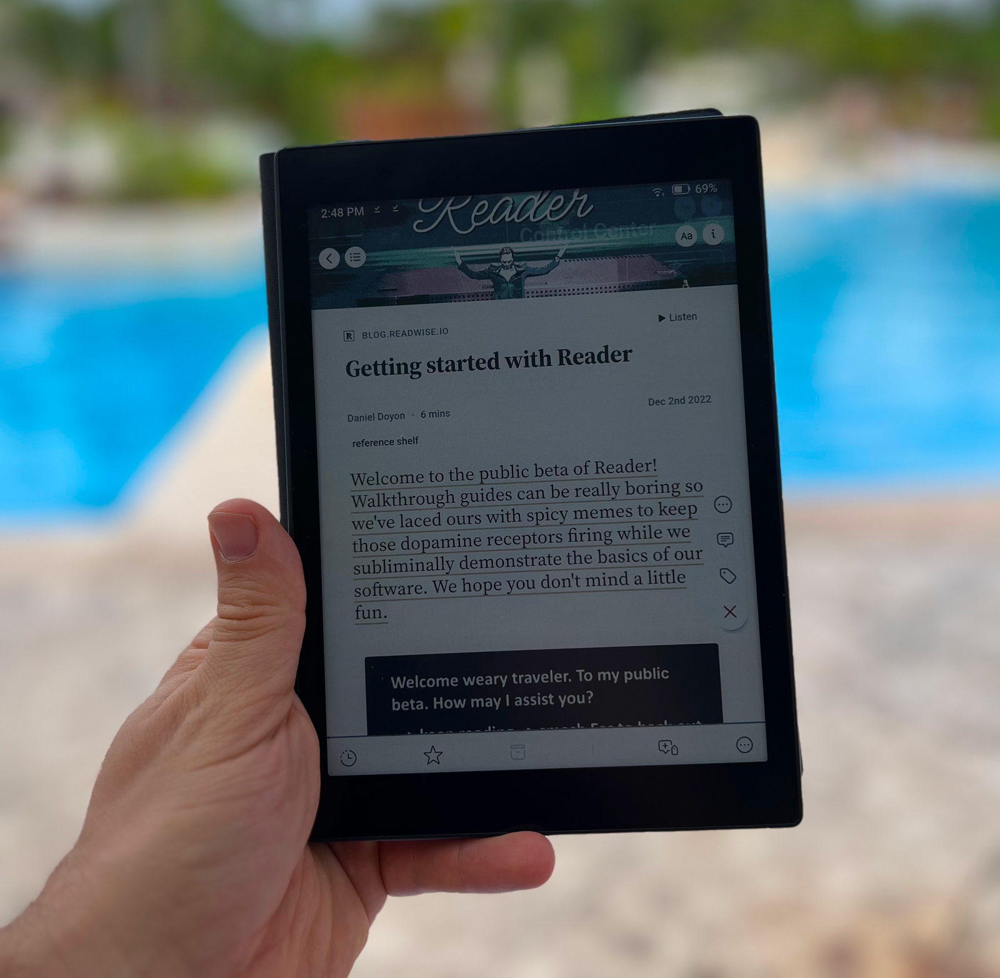
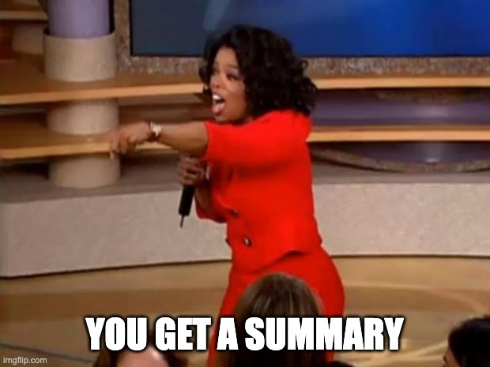
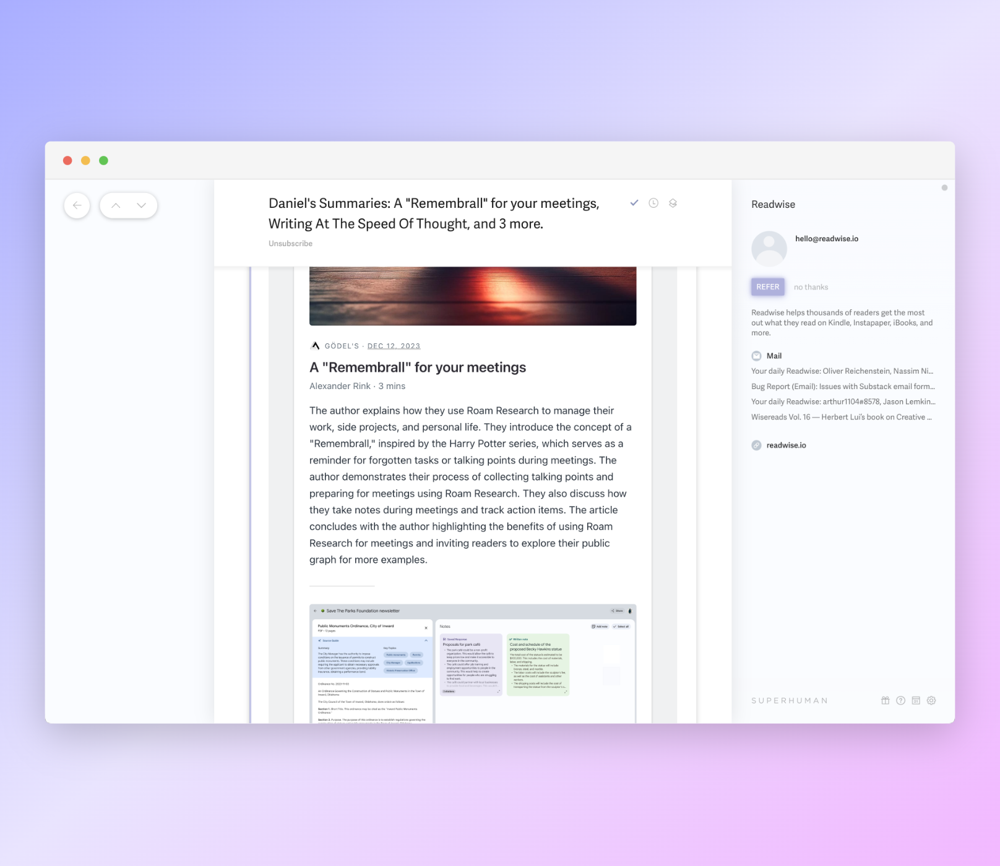
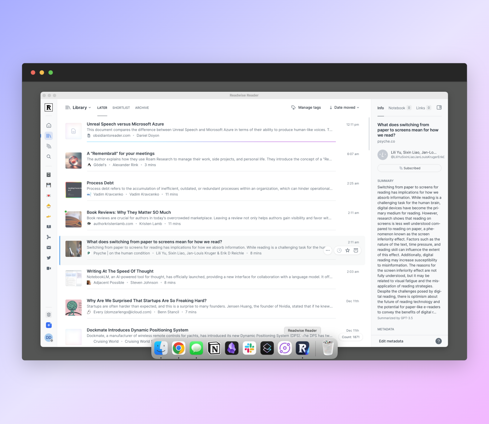
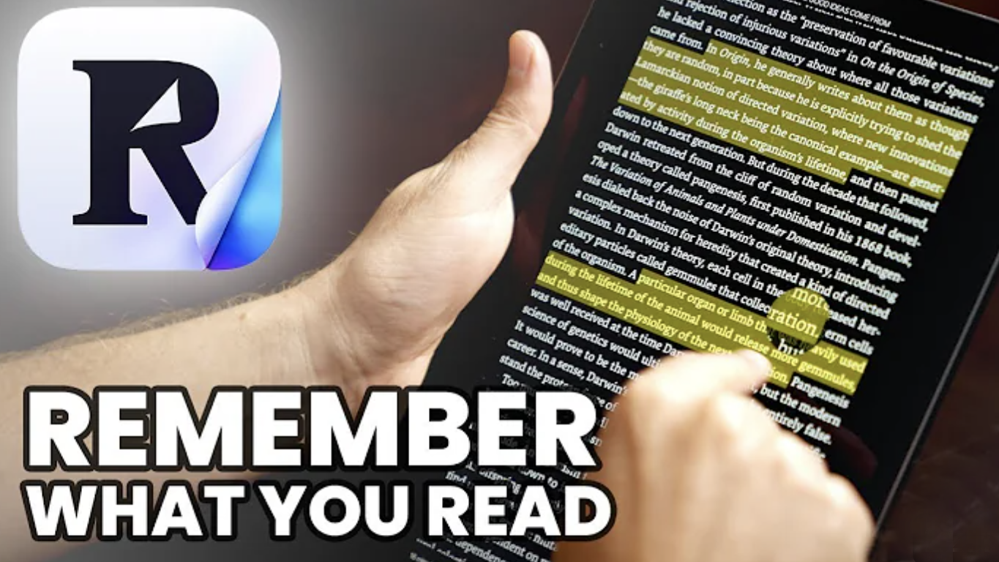
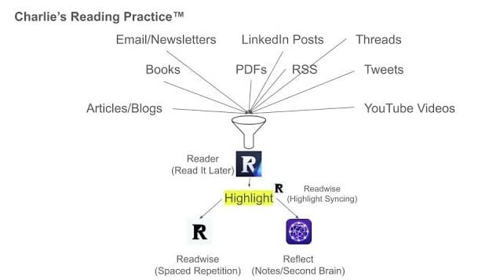
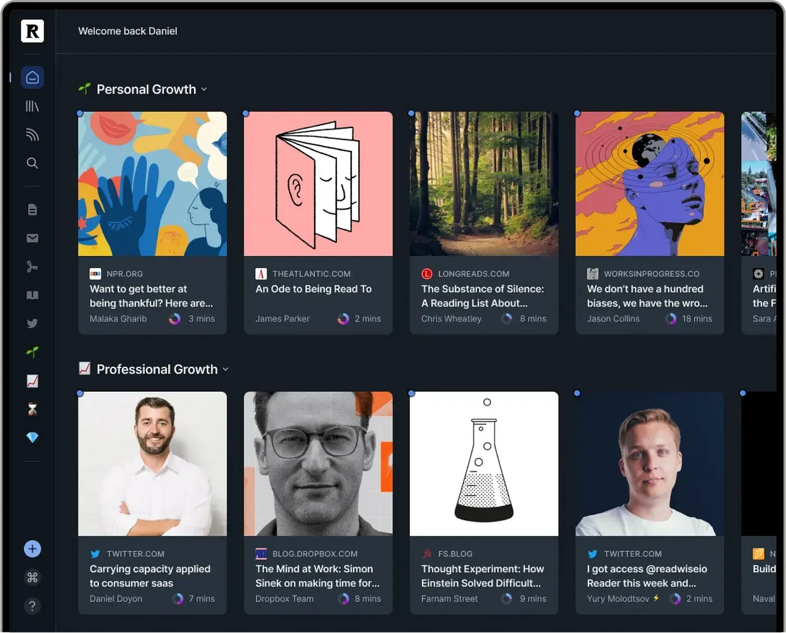
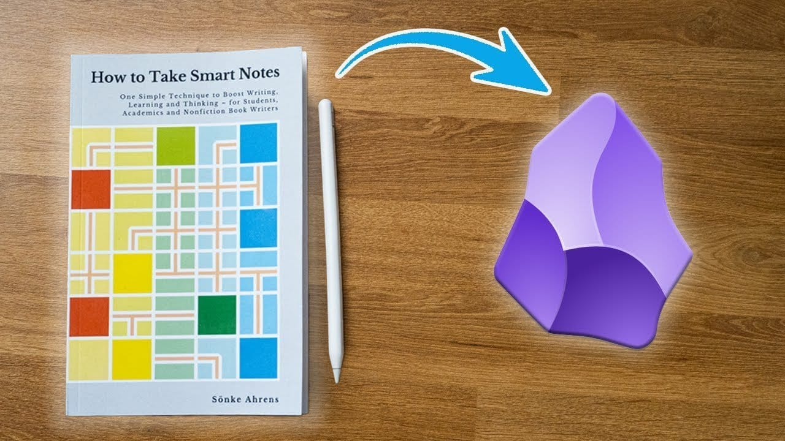

Hey all, 大家好，

I'm excited to _finally_ hit send on public beta newsletter #6 with our latest [Readwise Reader](https://readwise.io/read) updates 🙂  

我很高兴终于在公共测试版时事通讯 #6 上点击发送，其中包含我们最新的 Readwise 阅读器更新 🙂

_As a reminder, I write this newsletter every one to two months (usually) covering features we've just shipped, bugs we've recently fixed, and what we intend to work on next. I also share tips & tricks to help you get the most out of Reader. If you prefer to read these in-app, you can subscribe to the private RSS feed linked_ [_here_](https://readwise-community.ghost.io/2defd8e965b87487102ef0c6db1880/rss/)_._  

提醒一下，我（通常）每隔一到两个月写一次新闻通讯，涵盖我们刚刚发布的功能、我们最近修复的错误以及我们下一步打算做什么。我还分享了一些提示和技巧，以帮助您充分利用 Reader。如果您喜欢在应用程序内阅读这些内容，您可以订阅此处链接的私人 RSS 源。

It's been a long time – (four months, to be exact) – since we've sent one of these updates. In contrast, we previously averaged one update email every 3.5 weeks across both private & public beta. So why the wait here?  

自从我们发送其中一项更新以来，已经有很长一段时间了（确切地说是四个月）。相比之下，我们之前在私人测试版和公共测试版中平均每 3.5 周发送一封更新电子邮件。那么为什么要在这里等待呢？

Well, after hitting send on the last newsletter, we resolved to not send another until we'd shipped Reader's long-awaited performance refactor. Refactors are terrible, risky projects, and we decided to do whatever it'd take – including rotating all our frontend engineers into the effort – to just get it done.  

嗯，在点击发送最后一封新闻通讯后，我们决定在发布 Reader 期待已久的性能重构之前不再发送另一封新闻通讯。重构是可怕的、有风险的项目，我们决定不惜一切代价——包括让所有前端工程师投入工作——来完成它。

**As of today, I'm delighted to report that the performance refactor is officially shipped!** Depending on the power of your hardware and the number of documents in your account, you should notice speed increases of 2x to 100x across both the web app and mobile apps. In addition, countless complex bugs (like those encountered when multiple browser tabs were open), memory leaks, and edge cases should now be fixed.  

截至今天，我很高兴地报告性能重构已正式发布！根据您的硬件性能和帐户中的文档数量，您应该会注意到 Web 应用程序和移动应用程序的速度提高了 2 倍到 100 倍。此外，无数复杂的错误（例如打开多个浏览器选项卡时遇到的错误）、内存泄漏和边缘情况现在应该得到修复。

We're so glad that's behind us. Now we can resume building cool new features at our usual pace. Speaking of which, we already have product updates to share:  

我们很高兴这一切都在我们身后。现在我们可以按照平常的节奏继续构建很酷的新功能。说到这里，我们已经有产品更新可以分享：

-   **🚀 Performance Refactor** – As mentioned above, your web and mobile app experience should feel roughly 2x to 100x faster. Make sure you're using the newest version by hard refreshing the web app in your browser and downloading the latest mobile app (4.0) from your app store.  
    
    🚀 性能重构 – 如上所述，您的 Web 和移动应用程序体验应该感觉快了大约 2 倍到 100 倍。通过在浏览器中硬刷新 Web 应用程序并从应用程序商店下载最新的移动应用程序 (4.0)，确保您使用的是最新版本。
-   **🗯️ Unreal Speech TTS** – Text-to-speech got a huge upgrade with Unreal Speech's significantly more life-like models.  
    
    🗯️ Unreal Speech TTS – 文本转语音得到了巨大的升级，Unreal Speech 的模型更加逼真。
-   **🤏 Auto-Summarization** – Whenever you manually save a document to Reader, it'll now be automatically summarized by AI (currently GPT-3.5) at no extra cost as part of your subscription.  
    
    🤏 自动摘要 – 每当您手动将文档保存到 Reader 时，AI（当前为 GPT-3.5）现在都会自动对其进行摘要，作为订阅的一部分，无需额外付费。
-   **🪃 Summaries Email (beta)** – The automatically generated summaries in the bullet above also flow into a new, beautifully laid out email helping you read what you wanted to read, filter out the rest, and more.  
    
    🪃 摘要电子邮件（测试版）——上面项目符号中自动生成的摘要也会流入新的、布局精美的电子邮件中，帮助您阅读您想阅读的内容、过滤掉其余内容等等。
-   **💻 Native Mac App** – Last but not least, you can now install Reader as a native app on your Mac for fewer distractions and even more speed. Before you ask: yes, Windows will be coming shortly; and no, it's not an Electron wrapper.  
    
    💻 本机 Mac 应用程序 – 最后但并非最不重要的一点是，您现在可以将 Reader 作为本机应用程序安装在 Mac 上，以减少干扰并提高速度。在你问之前：是的，Windows 很快就会推出；不，它不是 Electron 包装器。

## Performance Refactor 🚀 性能重构🚀

We like to think of our users as the heroes each on an epic journey with our software as some kind of magical weapon to aid in those adventures. We're not the ones on a quest; you are. And our role is merely to help. Accordingly, we try hard to avoid what Steven Pinker calls _professional narcissism_ in these updates.  

我们喜欢将我们的用户视为英雄，每个人都在史诗般的旅程中，我们的软件是帮助这些冒险的某种神奇武器。我们不是那些有追求的人；你是。我们的作用只是提供帮助。因此，我们在这些更新中努力避免史蒂文·平克（Steven Pinker）所说的职业自恋。

With that in mind, here's all I'll say about this performance refactor:  

考虑到这一点，我要说的关于这次性能重构的全部内容如下：

Building a cross-platform app that only works online is easy. Building an offline-first app that only works when locally-installed is easy. Building an offline-first, cross-platform app that only works when locally-installed is medium. Building an offline-first, cross-platform app that works in a web browser without any local installation is _hard_.  

构建仅在线运行的跨平台应用程序很容易。构建一个仅在本地安装时才能运行的离线优先应用程序很容易。构建一个离线优先的跨平台应用程序，该应用程序仅在本地安装的情况下才有效。构建一个离线优先的跨平台应用程序，在没有任何本地安装的情况下在网络浏览器中运行是很困难的。

We built Reader to meet the requirements of the last sentence and our initial approach worked fine – that is, until we scaled the app to users with weak hardware and/or lots of documents. Under these conditions, the user experience could get annoyingly slow. To fix this, we had to rewrite the entire architecture of the app. This included over 36,000 modified lines of code, 520 edited files, 300 pull requests, 7 contributors, and a one-way trip to the forefront of client-side databases.  

我们构建了 Reader 来满足最后一句话的要求，并且我们最初的方法运行良好 - 也就是说，直到我们将应用程序扩展到硬件较弱和/或有大量文档的用户。在这些情况下，用户体验可能会变得非常缓慢。为了解决这个问题，我们必须重写应用程序的整个架构。其中包括超过 36,000 行已修改的代码、520 个已编辑的文件、300 个拉取请求、7 个贡献者以及前往客户端数据库最前沿的单程之旅。

If some of you are actually interested in the technical details, let me know and I'll try to persuade [Adam](https://twitter.com/lynchy010), [Hannes](https://twitter.com/eliias), and/or [Tristan](https://twitter.com/homsiT) to write a blog post.  

如果你们中的一些人确实对技术细节感兴趣，请告诉我，我将尝试说服 Adam、Hannes 和/或 Tristan 撰写博客文章。

In any case, refactors like these are risky because they don't always pay off, but fortunately this project delivered the performance we thought it would. We've since put the refactored app through ~2 months of internal and external QA and we think we've caught everything. That said, if you notice anything off, like a complex filtered view no longer returning the same list of documents, let us know by reporting a bug in-app and we'll promptly get it fixed.  

无论如何，像这样的重构都是有风险的，因为它们并不总是能带来回报，但幸运的是，这个项目提供了我们预期的性能。此后，我们对重构后的应用程序进行了约 2 个月的内部和外部 QA，我们认为我们已经掌握了所有内容。也就是说，如果您发现任何异常，例如复杂的过滤视图不再返回相同的文档列表，请通过报告应用程序内的错误来告知我们，我们将立即修复它。

My favorite part byproduct of this refactor – as a user? I can now use Reader on my commodity Android e-ink tablet to read in bed and on the beach.  

作为用户，我最喜欢这次重构的副产品？我现在可以在我的商用 Android 电子墨水平板电脑上使用 Reader 在床上和海滩上阅读。

This is not an endorsement but for those wondering, this is a Boox Tab Mini C which has an E Ink Kaleido screen  

这不是背书，但对于那些想知道的人来说，这是一个带有 E Ink Kaleido 屏幕的 Boox Tab Mini C

Although this refactor was a team effort with credit owed to each of [Artem](https://twitter.com/ArtemLitch), [Mitch](https://twitter.com/mitchelljustin0), [Mati](https://twitter.com/TucciMatias), and [Tristan](https://twitter.com/homsiT), special kudos goes to [Adam](https://twitter.com/lynchy010) for valiantly shouldering the burden of this project and to [Hannes](https://twitter.com/eliias) for overcoming some insane technical challenges during the final stretch.  

尽管这次重构是团队努力的结果，Artem、Mitch、Mati 和 Tristan 都应功劳，但特别值得赞扬的是 Adam 勇敢地承担了这个项目的重担，以及 Hannes 在最后阶段克服了一些疯狂的技术挑战。

## Unreal Speech TTS 🗯️ 虚幻语音 TTS 🗯️

When we initially added text-to-speech to Reader, the "neural nets" of Microsoft Azure, AWS Polly, and Google Cloud were state-of-the-art in web scale speech synthesis. Oh how far AI has come since then. Now the best text-to-speech models are nearly indistinguishable from human narrators and they're only getting better.  

当我们最初向 Reader 添加文本转语音功能时，Microsoft Azure、AWS Polly 和 Google Cloud 的“神经网络”在网络规模语音合成方面是最先进的。哦，从那时起，人工智能已经走了多远。现在，最好的文本转语音模型几乎与人类叙述者没有区别，而且它们只会变得更好。

Speaking of which, we just upgraded the text-to-speech in Reader to use one such next-generation model made by our friends at Unreal Speech. I think you'll agree the voices are significantly better than before.  

说到这里，我们刚刚升级了 Reader 中的文本转语音功能，以使用 Unreal Speech 的朋友制作的下一代模型。我想你会同意声音比以前好得多。

Here's a [quick Loom recording](https://www.loom.com/share/1099b05081cf451fb9961ce367ada5a5) I made demonstrating the two voices side-by-side.  

这是我用 Loom 制作的快速录音，并排演示了两种声音。

But wait, there's more: As part of this upgrade, we fixed the pitch of the voices when listening at slower and faster than 1.0x speeds, and we've restored text-to-speech functionality on long documents on Android.  

但等等，还有更多：作为此次升级的一部分，我们修复了以低于 1.0 倍的速度收听时的音调，并且我们恢复了 Android 上长文档的文本转语音功能。

A couple notes: Unlike Microsoft Azure, the makers of Unreal Speech are constantly responding to our feature requests. For example, if you note a weird pronunciation here or there or mistimed word boundaries, those should be steadily improving over time. Also, the Unreal model only works on English documents right now. For non-English documents, you can continue using Azure.  

有几点需要注意：与 Microsoft Azure 不同，Unreal Speech 的制造商会不断响应我们的功能请求。例如，如果您注意到这里或那里有奇怪的发音或不合时宜的单词边界，这些应该随着时间的推移而稳步改善。此外，Unreal 模型目前仅适用于英文文档。对于非英文文档，您可以继续使用 Azure。

Props to [Artem](https://twitter.com/ArtemLitch) for leading this switch and discovering the technologies to enable better sounding speeds and long-form Android TTS.  

感谢 Artem 领导了这一转变并发现了可实现更好的发声速度和长格式 Android TTS 的技术。

Over the summer, we shipped a summarization feature which enabled you to manually summarize any document by clicking the Ghostreader icon in the metadata panel or to automatically summarize all new documents by adding your OpenAI token. Now you don't need to do either. All your manually saved documents will be automatically summarized for you as part of your subscription.  

今年夏天，我们推出了摘要功能，使您能够通过单击元数据面板中的 Ghostreader 图标来手动摘要任何文档，或者通过添加 OpenAI 令牌来自动摘要所有新文档。现在你也不需要做任何事情。作为订阅的一部分，您手动保存的所有文档都将自动为您汇总。

Please note that auto-summarization doesn't apply to your Feed, but you can still use your OpenAI token to automatically summarize those if you wish.  

请注意，自动摘要不适用于您的 Feed，但如果您愿意，您仍然可以使用 OpenAI 令牌来自动摘要。

Props to [Hannes](https://twitter.com/eliias) for building this and [Tadek](https://twitter.com/tdkte) for getting it across the finish line.  

感谢汉内斯（Hannes）建造了这个，感谢塔德克（Tadek）冲过终点线。

## Summaries Email (Beta) 🪃  

摘要电子邮件（测试版）🪃

If you've saved a document to Reader in the past few days, you might have already received your first Summaries Email (working title). The Summaries Email digests newly added documents into a beautifully laid out newsletter reminding you of what you saved over the past 24 hours.  

如果您在过去几天将文档保存到阅读器，您可能已经收到第一封摘要电子邮件（工作标题）。摘要电子邮件将新添加的文档摘要为布局精美的时事通讯，提醒您过去 24 小时内保存的内容。

If you haven't received a Summaries Email already, try saving two documents real quick and wait until tomorrow morning.  

如果您还没有收到摘要电子邮件，请尝试快速保存两个文档，然后等到明天早上。

That's _what_ this feature is. But why?  

这就是这个功能。但为什么？

A few reasons:  有几个原因：

First, it's a common complaint that we save things to our read-it-later app only to never find the time to actually read them later. With this workflow, now even if you never get around to reading the whole article, at least you'll have gotten the gist. In other words, you'll somewhat read everything you hoped to.  

首先，一个常见的抱怨是，我们将内容保存到“稍后阅读”应用程序中，但后来却找不到时间真正阅读它们。有了这个工作流程，即使您现在没有时间阅读整篇文章，至少您已经了解了要点。换句话说，你会在某种程度上阅读你希望阅读的所有内容。

Second, not everything we save is actually worth reading in full, at least when considering how finite our time for reading actually is. But hope springs eternal, causing our reading queues to overflow with more documents than we'll ever actually get to. We've found that after reading the summary, letting go of "mid" documents becomes much easier. In other words, you'll filter out noise enabling you to focus on what's more important.  

其次，并不是我们保存的所有内容实际上都值得完整阅读，至少考虑到我们的阅读时间实际上是多么有限。但希望是永恒的，导致我们的阅读队列中充斥着比我们实际能读到的更多的文档。我们发现，阅读摘要后，放弃“中期”文档变得容易多了。换句话说，您将过滤掉噪音，使您能够专注于更重要的事情。

Finally, it's just nice to batch everything you saved the prior day into a ritual or routine. Rather than go down various rabbit holes throughout the day, you can save interesting links for later knowing you'll see them again tomorrow.  

最后，将前一天保存的所有内容批量整理为仪式或例行公事真是太好了。您可以保存有趣的链接，以便以后知道明天会再次看到它们，而不是整天陷入各种兔子洞。

We'll be improving this feature incrementally over the next few months including, likely, developing an in-app alternative. Until then, if you don't like email-based features, you can disable these Summaries Emails on the new [Product Emails](https://read.readwise.io/product-emails) page. You can also manage _this_ product update email and as well as Wisereads from the same preferences page.  

我们将在接下来的几个月内逐步改进此功能，包括可能开发应用内替代方案。在此之前，如果您不喜欢基于电子邮件的功能，可以在新的产品电子邮件页面上禁用这些摘要电子邮件。您还可以从同一首选项页面管理此产品更新电子邮件以及 Wisereads。

Props again to [Hannes](https://twitter.com/eliias) for developing this feature, [Jesse](https://twitter.com/jessebc) for his email templating, and [Tadek](https://twitter.com/tdkte) for getting it across the finish line.  

再次感谢 Hannes 开发了此功能，Jesse 制作了电子邮件模板，以及 Tadek 成功完成了这项功能。

## Native Mac App 💻 本机 Mac 应用程序 💻

Like I said above, building an offline-first, cross-platform app that only works when locally-installed is relatively easy compared to what we did. If it's so easy, prove it, am I right?  

正如我上面所说，与我们所做的相比，构建一个仅在本地安装时才有效的离线优先、跨平台应用程序相对容易。如果这么简单，请证明一下，对吗？

Sure, [Mitch](https://twitter.com/mitchelljustin0) made a native Mac app over last weekend, and he'll follow up with a Windows version soon.  

当然，Mitch 上周末制作了一款原生 Mac 应用程序，他很快就会推出 Windows 版本。

Download the Mac version here: [readwise.io/read/download](http://readwise.io/read/download)  

在此下载 Mac 版本：readwise.io/read/download

The native app is completely optional, but it's main benefits right now are (1) it's nice to read outside the distraction-laden browser and (2) it's even faster than the newly accelerated web app. Also, if your browser is causing issues with the web app for some random reason, you can always use this native app instead.  

本机应用程序是完全可选的，但它现在的主要好处是（1）在充满干扰的浏览器之外阅读很不错，（2）它甚至比新加速的网络应用程序更快。此外，如果您的浏览器由于某种随机原因导致网络应用程序出现问题，您始终可以使用此本机应用程序。

[Mitch](https://twitter.com/mitchelljustin0)'s "Not an Electron wrapper" T-shirt has a lot of people asking questions already answered by his shirt. That said, inquiring minds want to know: if not Electron, then what is it? It's Tauri, which is Rust, which means it's badass and, more importantly, it doesn't bundle up Chromium!  

Mitch 的“不是 Electron 包装器”T 恤引起了很多人的提问，他的 T 恤已经回答了这些问题。也就是说，好奇的人想知道：如果不是 Electron，那么它是什么？它是 Tauri，也就是 Rust，这意味着它很糟糕，更重要的是，它不捆绑 Chromium！

Props to [Mitch](https://twitter.com/mitchelljustin0) for spinning this up.  

感谢米奇的努力。

## Coming Up 🔜 即将到来🔜

-   **Pagination** – We were sooo close to shipping pagination on mobile last update. Then we needed to rotate [Artem](https://twitter.com/ArtemLitch) into the performance refactor instead. Now that that project is shipped, he'll pick up where he left off here.  
    
    分页——我们非常接近在上次更新时在移动设备上发布分页。然后我们需要将 Artem 转入性能重构。现在该项目已经交付，他将从这里继续。
-   **Readwise 1.0** – Last update, we had just gotten the ball rolling on recreating Readwise 1.0 functionality inside of Reader. Just like pagination, however, we needed to rotate [Mitch](https://twitter.com/mitchelljustin0) off this project and into the performance refactor. Now that that's over, he'll pick up where we left off.  
    
    Readwise 1.0 – 上次更新，我们刚刚开始在 Reader 中重新创建 Readwise 1.0 功能。然而，就像分页一样，我们需要将 Mitch 从这个项目中轮换到性能重构中。现在一切都结束了，他将从我们上次停下的地方继续。
-   **Folders** – While you can currently organize feeds and documents into groups using filtered views, this abstraction is one level too low for most folks. Especially old school RSS feed readers. We've massaged the information architecture to accommodate folder-based organization without introducing more complexity to the user interface that we're about to start building.  
    
    文件夹——虽然您目前可以使用过滤视图将提要和文档组织成组，但这种抽象对于大多数人来说太低了一层。尤其是老派的 RSS feed 阅读器。我们对信息架构进行了调整，以适应基于文件夹的组织，而不会给我们即将开始构建的用户界面带来更多复杂性。
-   **Summaries Email Upgrades** – As mentioned above, the Summaries Email is still quite basic. We have several enhancements in the works.  
    
    摘要电子邮件升级 – 如上所述，摘要电子邮件仍然非常基本。我们正在进行多项改进。

## Minor Improvements 🦐 小改进🦐

-   [Hannes](https://twitter.com/eliias), [Jesse](https://twitter.com/jessebc), and I started sending a weekly newsletter called Wisereads featuring the most highlighted content in Readwise over the past week alongside curated ebooks (with writing assistance from [Abi](https://twitter.com/amhulick) and [Cayla](https://twitter.com/caylafronhofer)).  
    
    Hannes、Jesse 和我开始发送名为 Wisereads 的每周时事通讯，其中包含过去一周 Readwise 中最突出的内容以及精选的电子书（在 Abi 和 Cayla 的写作帮助下）。
-   Although a constant work in progress, [Tadek](https://twitter.com/tdkte) shipped several parsing improvements to forwarded emails to make them render better in Reader better.  
    
    尽管这项工作一直在进行中，但 Tadek 对转发的电子邮件进行了多项解析改进，以使它们在 Reader 中呈现得更好。
-   As his first shipped feature, [Rasul](https://twitter.com/rasulkireev) added the ability to forcefully unsubscribe from email senders in the web app.  
    
    作为他的第一个发布功能，Rasul 添加了在网络应用程序中强制取消订阅电子邮件发件人的功能。
-   [Tristan](https://twitter.com/homsiT) improved the Gmail autoforwarding flow to better handle the automated authentication emails.  
    
    Tristan 改进了 Gmail 自动转发流程，以更好地处理自动身份验证电子邮件。
-   [Bruno](https://twitter.com/brvn0jm) added a new endpoint to the [Readwise 1.0 public API](https://readwise.io/api_deets#review) for fetching a user's Daily Review highlights. Now we just need someone to make a sick GPT using this.  
    
    Bruno 在 Readwise 1.0 公共 API 中添加了一个新端点，用于获取用户的每日评论亮点。现在我们只需要有人用它来制作一个病态的 GPT。
-   [Bruno](https://twitter.com/brvn0jm) added Google Docs as a new export target for your highlights setting us up to work with our friend Steven Johnson on his Google Gemini-powered writing tool [NotebookLM](https://notebooklm.google/).  
    
    Bruno 添加了 Google Docs 作为您的亮点的新导出目标，让我们能够与我们的朋友 Steven Johnson 合作开发他的 Google Gemini 支持的写作工具 NotebookLM。
-   [Mati](https://twitter.com/TucciMatias) added PDF snapshotting to the mobile apps.  
    
    Mati 在移动应用程序中添加了 PDF 快照。
-   [Mati](https://twitter.com/TucciMatias) added settings on both web and mobile to disable PDF color inversion in dark mode.  
    
    Mati 在网络和移动设备上添加了设置，以在深色模式下禁用 PDF 颜色反转。
-   [Bruno](https://twitter.com/brvn0jm) improved the Twitter integration to handle formatting such as bold & italics.  
    
    Bruno 改进了 Twitter 集成，以处理粗体和斜体等格式。
-   [Bruno](https://twitter.com/brvn0jm) added `published_date` as a variable to export templates such as Obsidian.  
    
    Bruno 添加了 `published_date` 作为变量来导出 Obsidian 等模板。

## Bug Fixes 🐛 错误修复🐛

-   Fixed massive Android crashing issue caused by our error monitoring SDK (Sentry)  
    
    修复了由于我们的错误监控 SDK (Sentry) 导致的大量 Android 崩溃问题
-   Fixed bug where the top status bar would incorrectly appear in reading view  
    
    修复了顶部状态栏错误地出现在阅读视图中的错误
-   Fixed bug with creating filtered views of a single feed subscription  
    
    修复了创建单个源订阅的过滤视图的错误
-   Fixed bug with adding PDFs to the mobile apps  
    
    修复了将 PDF 添加到移动应用程序时出现的错误
-   Fixed bug with subscribing to RSS feeds in the mobile apps  
    
    修复了在移动应用程序中订阅 RSS 源的错误
-   Fixed bug with saving invalid URLs to the mobile apps  
    
    修复了将无效 URL 保存到移动应用程序的错误
-   Fixed bug with some highlights not syncing from Reader to Readwise  
    
    修复了一些突出显示未从 Reader 同步到 Readwise 的错误
-   Fixed bug with missing book covers in Readwise 1.0 exports  
    
    修复了 Readwise 1.0 导出中缺少书籍封面的错误
-   Fixed bug with the Android bottom sheet closing too easily  
    
    修复了 Android 底部表单过于容易关闭的错误
-   Fixed bug with the mobile Table of Contents subheadings not opening correctly  
    
    修复了移动目录副标题无法正确打开的错误
-   Fixed bug with Print With Annotations feature for YouTube videos  
    
    修复了 YouTube 视频的“带注释打印”功能的错误
-   Fixed bug with PDF snapshot highlights not syncing to Notion properly  
    
    修复了 PDF 快照突出显示未正确同步到 Notion 的错误
-   Fixed bug with PDF reading positions not being properly saved  
    
    修复了 PDF 阅读位置未正确保存的错误
-   Fixed bug with PDFs not rotating properly  
    
    修复了 PDF 无法正确旋转的错误
-   Fixed bug where highlighting a PDF in the mobile apps would cause the PDF to scroll  
    
    修复了在移动应用程序中突出显示 PDF 会导致 PDF 滚动的错误
-   Fixed bug with Evernote exporting where updates to a note were not appearing (due to an issue caused by their updated API)  
    
    修复了 Evernote 导出时未出现笔记更新的错误（由于更新的 API 导致的问题）
-   Fixed regression with the highlight annotation bar on mobile where it wouldn’t hide properly when resuming reading  
    
    修复了移动设备上突出显示注释栏的回归问题，该栏在恢复阅读时无法正确隐藏
-   Fixed bug with Medium highlights duplicating in Readwise 1.0  
    
    修复了 Readwise 1.0 中中型突出显示重复的错误
-   Fixed bug with Pocket import sometimes not bringing in every document  
    
    修复了 Pocket 导入有时无法导入每个文档的错误
-   Fixed bug with EPUBs showing up as Articles in Readwise 1.0  
    
    修复了 EPUB 在 Readwise 1.0 中显示为文章的错误
-   Fixed bug with Ghostreader Q&A prompt  
    
    修复了 Ghostreader 问答提示的错误
-   Fixed bug with the keyboard sometimes not appearing when editing notes on Android  
    
    修复了在 Android 上编辑笔记时键盘有时不出现的问题
-   Fixed bug with ordering of PDF snapshot highlights in the Notebook  
    
    修复了笔记本中 PDF 快照亮点排序的错误
-   Fixed bug with saving [open.substack.com](http://open.substack.com/) links  
    
    修复了保存 open.substack.com 链接的错误
-   Fixed bug with undo button sometimes not displaying on Android  
    
    修复了 Android 上有时不显示撤消按钮的错误
-   Fixed bug with document tags list losing focus in the web app  
    
    修复了文档标签列表在 Web 应用程序中失去焦点的错误
-   Fixed bug with trying to snapshot a PDF starting on the left side of the mobile screen triggering the Table of Contents to open  
    
    修复了尝试从移动屏幕左侧开始拍摄 PDF 快照并触发目录打开的错误
-   Fixed bug with scrolling gestures on PDFs sometimes selecting text incorrectly  
    
    修复了 PDF 上滚动手势有时会错误选择文本的错误
-   Fixed bug with EPUBs sometimes setting reading progress to 100% while opening  
    
    修复了 EPUB 有时在打开时将阅读进度设置为 100% 的错误
-   Fixed bug with the top bar header not centering the page number on PDFs  
    
    修复了 PDF 上顶栏标题未将页码居中的错误
-   Fixed bug with long tweets not displaying images  
    
    修复了长推文不显示图像的错误
-   Fixed bug with and date types not working in Tana exports  
    
    修复了 和 日期类型在 Tana 导出中不起作用的错误
-   Fixed bug with document language picker not saving on Android  
    
    修复了 Android 上文档语言选择器未保存的错误
-   Fixed bug with Daily Digest failing to load for some users  
    
    修复了某些用户无法加载《每日文摘》的错误
-   Fixed issues with Twitter list digests not showing up properly  
    
    修复了 Twitter 列表摘要未正确显示的问题
-   Fixed bug with the mobile app share sheet not loading all tags into the list  
    
    修复了移动应用程序共享表未将所有标签加载到列表中的错误
-   Fixed bug with Home screen customization not scrolling on mobile  
    
    修复了主屏幕自定义无法在移动设备上滚动的错误
-   Fixed bug with long URLs overflowing off the screen on mobile  
    
    修复了移动设备上长 URL 溢出屏幕的错误
-   Fixed bug where double tapping to highlight a paragraph wouldn't trigger if the tap occurred too close to left edge  
    
    修复了如果点击距离左边缘太近则不会触发双击以突出显示段落的错误
-   Fixed bug with YouTube videos not being included in CSV exports  
    
    修复了 YouTube 视频未包含在 CSV 导出中的错误
-   Fixed bug with PDFs not loading properly on web  
    
    修复了 PDF 无法在网络上正确加载的错误

## Creator Content 📼 创作者内容📼

### Tiago Forte 蒂亚戈·福特

[Tiago Forte](https://twitter.com/fortelabs), the second brain thought leader responsible for bringing personal knowledge management to the mainstream, shares how he uses Readwise to populate [the single most valuable folder](https://www.youtube.com/watch?v=OlWomVta4DU) in his Evernote account.  

负责将个人知识管理带入主流的第二大脑思想领袖蒂亚戈·福特 (Tiago Forte) 分享了他如何使用 Readwise 填充他的 Evernote 帐户中最有价值的文件夹。

### Pillars of Productivity 生产力的支柱

Speaking of Tiago Forte, he and his team launched their new course [Pillars of Productivity](https://www.buildingasecondbrain.com/pop?utm_source=readwise&utm_medium=email) last month and already welcomed over 2250 people. One such "pillar of productivity" is a read-later app, which means one lesson is completely focused on teaching people how to use Reader as the primary example.  

说到 Tiago Forte，他和他的团队上个月推出了新课程 Pillars of Productivity，已经迎来了超过 2250 人。这样的“生产力支柱”之一就是稍后阅读应用程序，这意味着一堂课完全专注于教人们如何使用 Reader 作为主要示例。

### David Senra 大卫·森拉

Our friend, [David Senra](https://twitter.com/FoundersPodcast), has spent years documenting the wisdom of the world’s greatest entrepreneurs through his [Founder’s podcast](https://www.founderspodcast.com/). If you’re a fan of David's, you might consider [checking out David’s Founder's Notes](https://www.foundersnotes.com/accounts/signup/).  

我们的朋友大卫·森拉（David Senra）多年来通过其创始人的播客记录了世界上最伟大企业家的智慧。如果您是 David's 的粉丝，您可以考虑查看 David's 创始人笔记。

### Charlie Grinnell 查理·格林内尔

Learn how [Charlie Grinnell](https://twitter.com/CharlieGrinnell), digital marketing strategist for brands including Red Bull, Arcteryx. and Artizia, [absorbs and organizes all his knowledge](https://www.youtube.com/watch?v=mLGB-QA-TRk) with Reader and our Reflect integration.  

了解红牛、Arcteryx 等品牌的数字营销策略师 Charlie Grinnell 是如何做的。和 Artizia，通过 Reader 和我们的 Reflect 集成吸收和组织他的所有知识。

### MoneyXYZ 金钱XYZ

For our Chinese-speaking community, watch how Ray of MoneyXYZ [sets up his Reader workflow](https://www.youtube.com/watch?v=m0-8dJez7Rc) and makes use of our social links feature (11:04).  

对于我们的中文社区，请观看 Ray of MoneyXYZ 如何设置其阅读器工作流程并利用我们的社交链接功能 (11:04)。

### Simon Theakston 西蒙·塞克斯顿

In his latest blog post. Simon Theakston shares [how he uses Reader](https://medium.com/macoclock/how-i-use-readwise-reader-across-mac-ipad-and-iphone-58027ded89e7) across his desktop, iPad, and iPhone. We especially love his “life roles” tagging strategy.  

在他最新的博客文章中。 Simon Theakston 分享了他如何在台式机、iPad 和 iPhone 上使用 Reader。我们特别喜欢他的“生活角色”标签策略。

### Sergio 塞尔吉奥

Want to take more impactful annotations in 2024? Sergio will teach you how to [make smart notes that last a lifetime](https://www.youtube.com/watch?v=GRA_fwbdrtc).  

想要在 2024 年获得更有影响力的注释吗？塞尔吉奥将教您如何制作终生受益的智能笔记。

## Farewell 👋 再见👋

In previous updates, we posted roles for a [Growth Engineer](https://readwise.notion.site/Senior-Growth-Engineer-1ebdd33f714c45d49c5c46b347b5bc5a?pvs=4) and a [Generalist Startup Writer](https://readwise.notion.site/Generalist-Startup-Writer-3b9ab41974ba453cb52f9f411a0360f1?pvs=4). We're delighted to welcome [Rasul Kireev](https://twitter.com/rasulkireev) and [Abi Hulick](https://twitter.com/amhulick), respectively, to the team! We're also excited to share that [Mitch](https://twitter.com/mitchelljustin0) and [Fernando](https://twitter.com/_efedece_) are now officially with us full-time.  

在之前的更新中，我们发布了成长工程师和通才创业作家的角色。我们很高兴分别欢迎 Rasul Kireev 和 Abi Hulick 加入团队！我们还很高兴地告诉大家，米奇和费尔南多现在正式全职加入我们。

As mentioned in the intro, that refactor led to the longest we've gone between updates since working on Reader. Now that it's behind us, we're excited to resume shipping at our normal pace!  

正如简介中提到的，这次重构导致了我们自开发 Reader 以来最长的一次更新间隔。现在一切都过去了，我们很高兴能够以正常速度恢复运输！

Thank you again for your continued support and please reach out any time 🙏  

再次感谢您一直以来的支持，请随时联系🙏  

– Dan, Tristan, & the Readwise team  

– Dan、Tristan 和 Readwise 团队
