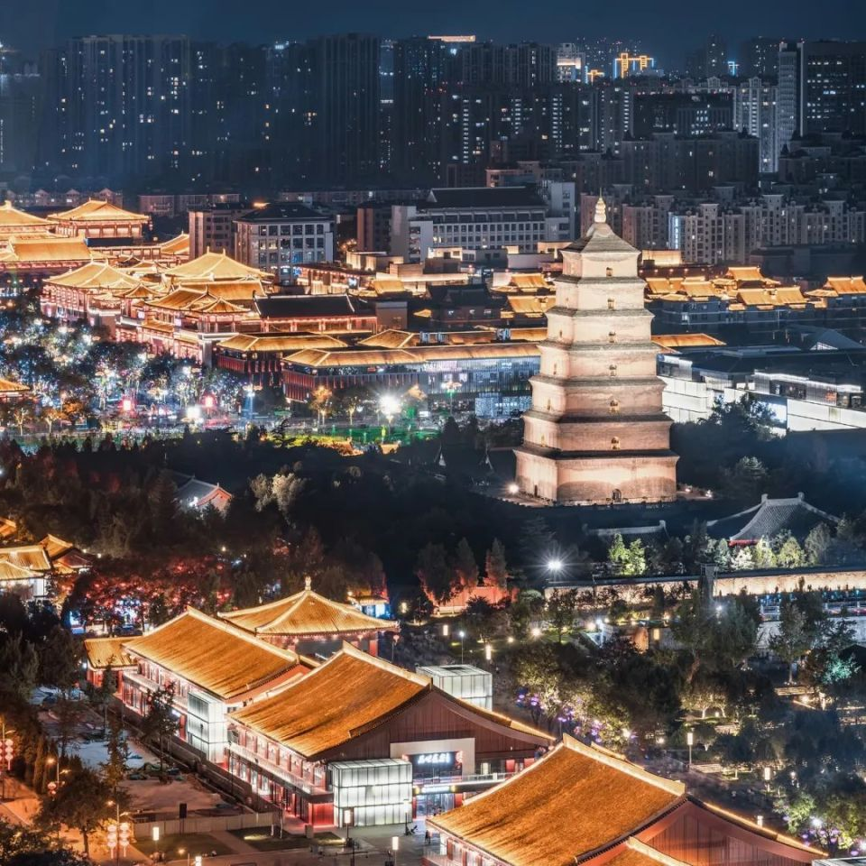

西安是一座幸运的城市。每隔一段时间，它就会迎来高光时刻，仅今年以来，中国-中亚峰会、《长安三万里》上映、比亚迪销量入榜全球前十、TFBOYS西安演唱会爆火，就让世人的目光一次次聚焦于此，这些往往是其它城市梦寐以求都得不到的城市形象曝光机会，却未必需要西安本身付出多大的努力。

在很多西安人心目中，不说在全国，至少在北方，西安肯定是最好的城市之一——之所以还有必要加上“之一”，只是因为有时候还需要考虑一下北京。

至于西北，西安人甚至不屑于自视为一座“西北城市”，至少看齐“新一线城市”，再说，西安难道不应该是“国际化大都市”吗？

可想而知，由此塑造起来的西安形象，助推这座城市吸引源源不断涌入的人才和游客，也让市民们对它产生了极强的认同，却也让客观评估这座城市的现状和问题变得更困难，因为不乏有人相信国内最好的城市就是西安，甚至不允许外地人说西安不好。

问题是，西安足够好了吗？ 

**西安的城市地位**

要了解西安有多重要，不能只是放在陕西省的地图上——实际上，对于陕西来说，这个省会大到不成比例，它的影响力也从来不局限于省内，这是两三千年来的客观事实。

这种重要性，也并不只是在经济层面，毕竟西安可是当过首都的城市。在陕西，一直流传着“西安差一票当选新中国首都、陕西话差一票成为国语”的说法，类似的传说当然别的地方也有，但在西安尤为津津乐道。

从国家定位也能看出这座城市在全国城市体系中的位置：西安的区号是两位数（029），这是仅有少数重点城市才有的殊荣，前些年也毫无悬念地入选了九大国家中心城市之一。

当然，从“中国-中亚峰会”来看，西安作为“一带一路”的起点，现在也有望取代乌鲁木齐成为中国面向中亚的窗口。

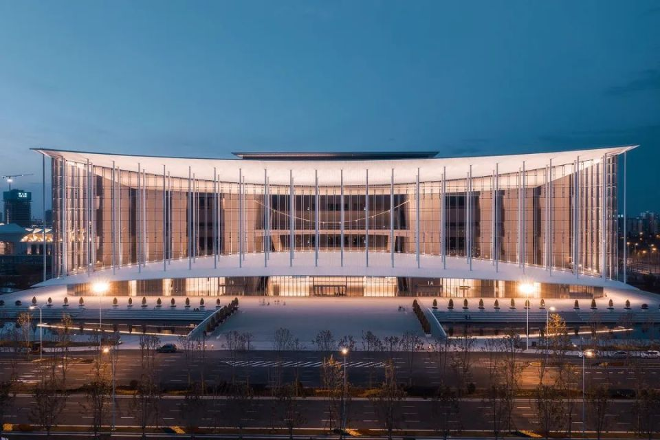

◎西安丝路国际会展中心

然而，如果把视野转向经济指标，就能发现一个不可回避的问题：西安得到的城市地位，实际上超出了它的经济实力。

在全国24个万亿GDP城市（2021年）中，西安总量、人均值两项指标双双垫底，8.19万元的人均GDP，还不到北京（18.40万）、上海（17.36万）、深圳（17.37万）的一半，也低于它一贯对标的竞争对手成都（9.45万）、重庆（8.69万），事实上，低于10万的只有这三个城市。

论战略地位、区域影响力、文化资源、科研实力，西安至少跟成都不相上下，甚至更有优势，它也因此一直以成都来对标，但成都的总人口几乎是西安的两倍，在各项重要指标上也几乎都以同样的优势领先。如今，成都的综合实力早已跻身全国十强，投资的大企业扎堆，西安非但没能追赶，差距还在拉开。

西安最适合对标的其实是郑州，西安全市人口和郑州差不多，但城区人口则多得多（2020年，西安城区人口928万，郑州仅534万），郑州人一般也都觉得“西安比我们这里高一档次”，然而，虽然西安近十年间常住人口、GDP总量、工业增加值等各方面的增速高于郑州，它在主要经济指标上仍落后郑州一个身位，资金总量被郑州追上，而财政收入更是还不到郑州的六成。

尽管如此，当初西安入选国家中心城市，似乎人们都觉理所当然（“西北总得有一个，那不是西安还能是谁？”），而郑州跻身入列时，连许多媒体都惊叹这是“最大的黑马”。

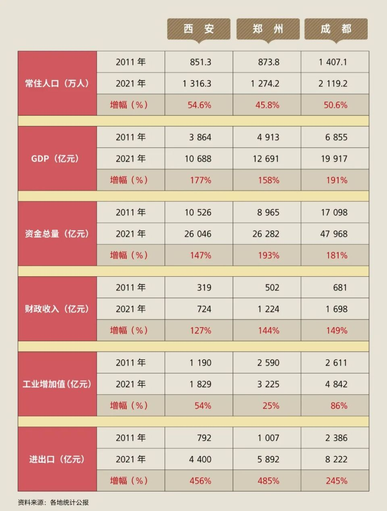

当然，成都、郑州作为两个人口大省的省会，所能调动的资源恐怕比西安多得多了，但像成都已经一直被诟病为“产业基础薄弱”，一对比数字，工业增加值还是比西安高得多了，增速也更快。

虽然也有人辩解说，西安的GDP被低估了至少三分之一，理由是大量的军工产业没有计入本地GDP，这个难以证实的说法姑且不论，问题是其它各项数字西安也谈不上很亮眼。

财政收入尤其值得注意，因为这是当地经济发展水平的直接反映，也涉及当地能有多大的财力推动城市建设。

西安2011-21年间的财政收入虽然增长了127%，但速度还是低于成都、郑州，总量也仅有724亿——这个数字还不到上海（7772亿）的十分之一，实际上，上海2021年的财政收入比河南（4354亿）、陕西（2775亿）两省总和还多。

今年上半年，陕西的个税收入196.4亿元，排全国第八，远高于GDP名次，其中西安就占了一半（97.94亿）。从现有的数字来看，西安的人均个税虽然距离北上深杭这些城市差距不小，也略低于成都，但比郑州、重庆还是高了一截。

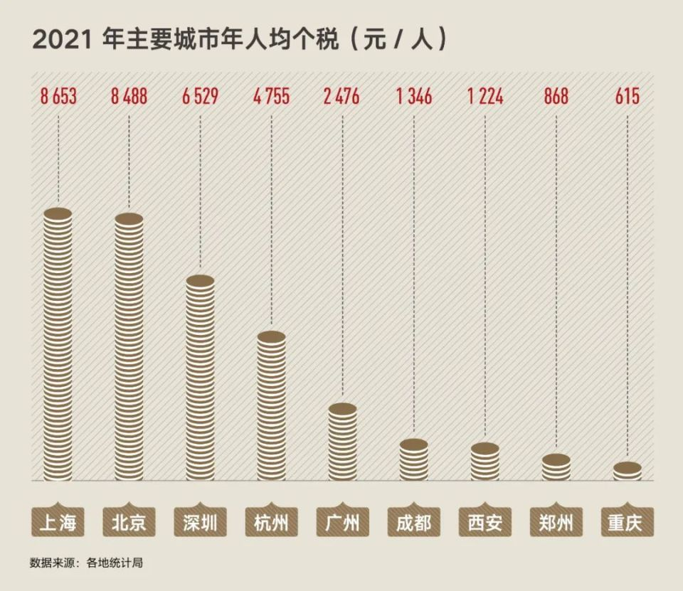

个税收入月度变化较大，很难准确预估，不过有一点是肯定的：个税收入高，说明当地经济发展势头不错，企事业单位效益好。

为什么西安的人均GDP不高，但缴纳的个税却不低？很大的原因之一在于，西安在国企等大型组织内领工资的人不少，而近两年一枝独秀的能源、新能源车等行业，又恰好利好西安，然而，这并不意味着西安的市场主体高度活跃。

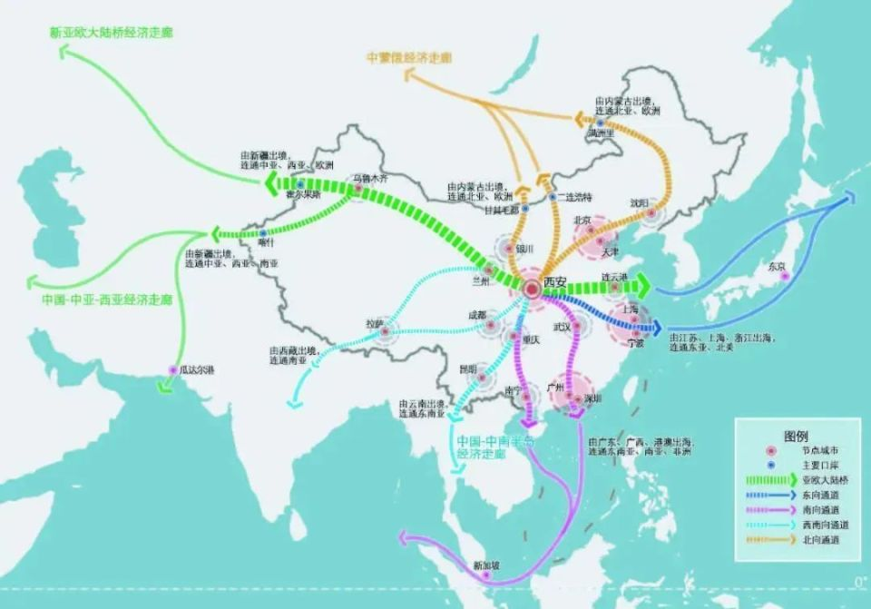

  

西安 欧亚大陆桥示意图

西安的战略位置非常好，扼守西北陆路咽喉，国家物流枢纽城市，西安除了不是港口型国家物流枢纽，入选4项（陆港型、空港型、生产服务型、商贸服务型），所获得的政策地位仅次于重庆（重庆5项兼具），成都、郑州乃至上海也都只入选2项，北京甚至只入选1项。

然而，西安2021年物流业（包括交通运输、仓储和邮政业）增加值仅为382.9亿，在全国城市中排名第20，占本地GDP的比重3.58%，无论是总量还是产业占比都是偏低的，与其获得的地位及政策支持力度不匹配。

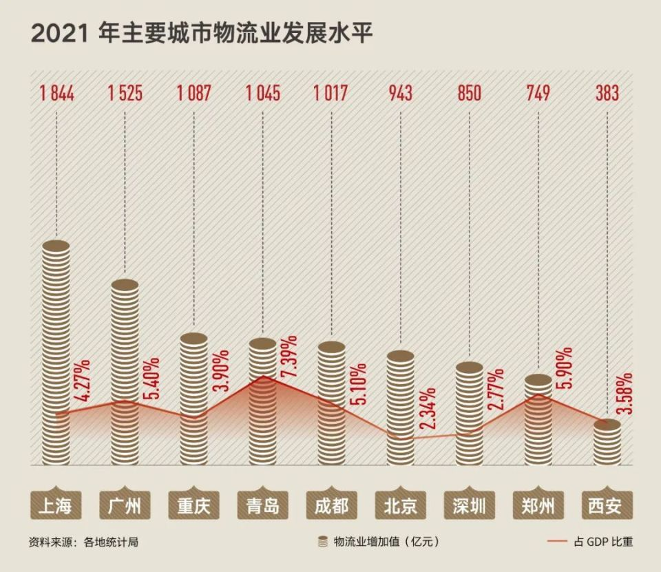

固然，这也是因为西安所在的西北区域本身制造业、商贸服务业不算发达，陆路运输的成本也偏高，但不论如何，作为一个物流枢纽城市，西安的潜力尚未真正发挥出来。  

这些数字可以揭示一个不可回避的严酷现实：西安多年来得到了一手好牌，也获得了相当多的光环，这让许多人对它产生了过高的评价，但它其实与发达城市仍有不小的差距。那么问题出在哪里？

**折叠城市**

在谈到西安这座城市时，有位本地朋友感叹说：“西安就像个戏台子，一波波的人来了又走了，留下的就是这个西安城。”

确实，有一点不可否认：国内恐怕没有哪座城市曾像西安这样见证了那么多兴衰起伏，在动辄上千年的时空尺度之下，一时的经济起落实在谈不上什么。

这种感知既给了西安人面对变局时具有某种特殊的镇定，心态很平，但也意味着像深圳那样“时间就是金钱”的效率观念难以普及开来，在这里，“致富光荣”四个字的魔力远不如在南方强。

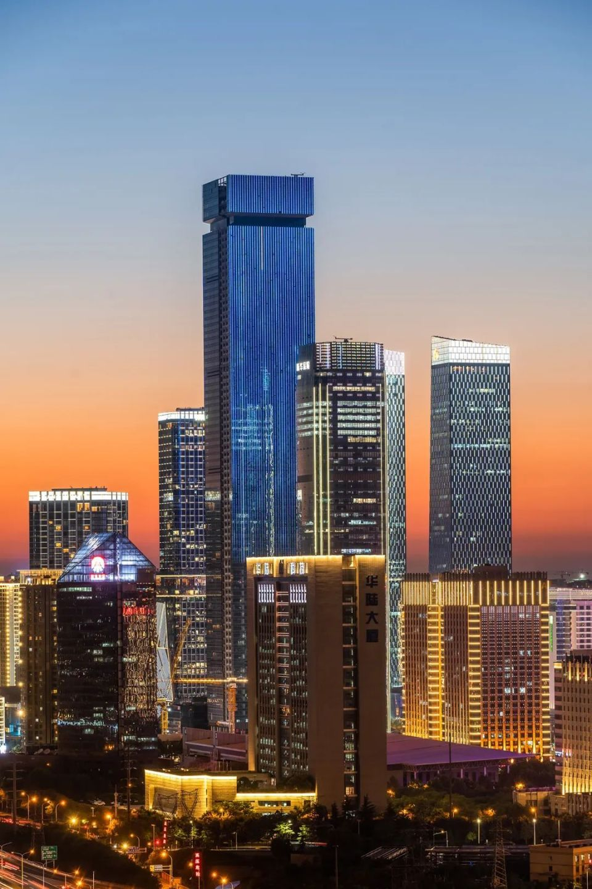

◎西安高新区CBD建筑群

对很多本地人来说，西安与其说是一个机会之地，倒不如说是一份继承下来的祖产，而他们需要做的就是继续靠它生活下去。

一位西安人感慨地说：“从小就听祖辈说：哪儿也不用去，这里是宝地，连日本人也没打过来。”西安人出了名的恋家，不少家族还有“女子不外嫁”这一不成文的规矩。

然而也因此，有位在西安生活多年的外地朋友说，他感觉“西安人的心态是：‘我就呆在这里，我也不出去，但我看不起外地，对本地非常引以为傲。就感觉他们很封闭。’”那几年里，他在就读的大学里感受到的本地风气是：权力的彰显感比在南方强，很看重字辈位份的秩序。

这不仅仅是西安这座城市如此，甚至在城市内部也这样：它是一座折叠城市，不同的群体生活在彼此的小圈子里，呈现为一个个隔离的大院，且已经形成代际传递。

很多人都说西安很像北京，包括那种“皇城自豪感”，按人均来算，西安烤鸭店密度甚至比北京更高，在这已生活了一辈子的一位老西安人说：“这边自我封闭强，人和人的交往少，像是个小北京。北方城市的感觉很突出，横平竖直，什么事都不能越界的感觉。”

◎西安长安立交航拍

像这样城市内部的功能板块划分，或许哪里都有一点，但在西安确实更为明显。

从二十多年前起，西安市民中就流传着这样的笑谈：四郊熟人相见的问候语各不相同，南郊的问：“考上了吗？”东郊的问：“发了吗？”西郊的问：“下岗了吗？”北郊的问：“出来了吗？”

因为南郊多高校，关心的是孩子教育；东郊大量的军工企业，拖欠工资是家常便饭，也就成了人们最焦虑的事；西郊被称为电工城，国企云集，效益不好时最怕下岗；而北郊的“道北”则长久以来是棚户区，寻衅滋事、打架斗殴都是家常便饭，游手好闲的年轻人进去的不少。

当然，经历了这些年的城市发展，西安也有了不小的变化，内部的版块在松动，流动性也逐步增强，但条块分割仍然处处可见：西安规划了星罗棋布的各种“开发区”，在上海，行政区和开发区的权责边界很分明，但在西安，开发区就约等于“小行政区”，医院、学校等都归它自己建，开发区变成硬生生制造出许多行政区。

高新区主体部分在行政上属于雁塔区，但又横跨了鄠邑区等等，占了全市30%多的GDP，级别也高，非常特殊。曾为大兴安岭火灾紧急生产鼓风机一战成名的陕鼓集团，高新区要逼它走，因为它交税是交给临潼区的。

大明宫地处未央区，但却归曲江管，因为曲江统筹整个西安的文旅，甚至都出了西安地界，连法门寺等市外景点也由它来管。

在西安从事法务工作很多年的一位朋友说，当地法院的辖区是按最早的行政区划分的，但行政区被割裂了，在有些地方就没有对应的法院。浐灞、曲江、港务区、经开这几个开发区不是主体，不能直接成为被告；但高新区、西咸新区特殊，可以成为主体。

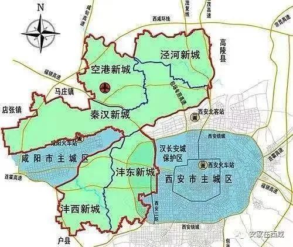

西咸新区示意图  

西咸新区在这方面最混乱，沣东（长安区）、沣西（秦都区）、秦汉新城（渭城区）、泾河新城（泾阳县）行政上属于不同区县，在那民事诉讼非常棘手。最别扭的是：三桥街道办理论上是未央区的，但应该找长安区法院，因为它划归沣东新城，而沣东又归长安区。

不仅城区如此，郊县也一样：原长安县改区之后，长安区的司机仍然不能过来，也不愿意过来；虽然老话说“金周至，银户县”，但周至县曾归宝鸡、咸阳，后归西安，所以至今没一寸高速公路和铁路，因为没人愿意投入，归属不定，加上水源保护，也不让多发展工业。

老西安人去延安、渭南坐什么车知道，但去周至、户县等地怎么坐车，绝大多数都不知道，且排斥周边县市的，对户县（现鄠邑区）的还不如对来自延安的客人热情。至于跨地域合作就更是了：差不多十年前，西安到咸阳的公交车线路第一天开通，刚进入咸阳地界，竟然就被封了。

这种跨地域合作的困难，部分也是因为利益难以协调。民间有个梗说是“西安省陕西市”，因为西安这个省会对陕西而言实在太大，大到万一西安直辖，那陕西就几乎不剩下什么了。正是在这种情况下，西安、咸阳在省的层面是有矛盾冲突的，当然更不可能西咸合并。

注意一下会发现，近两年来，“西安城市总体规划”在提到国家中心城市、大西安都市圈的核心城市、陕西省的首府时，开始突出“西安是陕西的西安”了。明确不会合并行政区、西咸打通道路之后，现在双方的跨地域合作比以前也畅通多了。

毫无疑问，西安要发展壮大，就不能只满足于省内独大，必须要开拓开放，破除内外部的壁垒。然而，它之所以是一座“折叠城市”，在很大程度上正是长年累月积累下来的：和东南沿海的一些城市不同，现代的西安不是自然生长出来的，而是一种明显国家主导的“植入式现代化”。

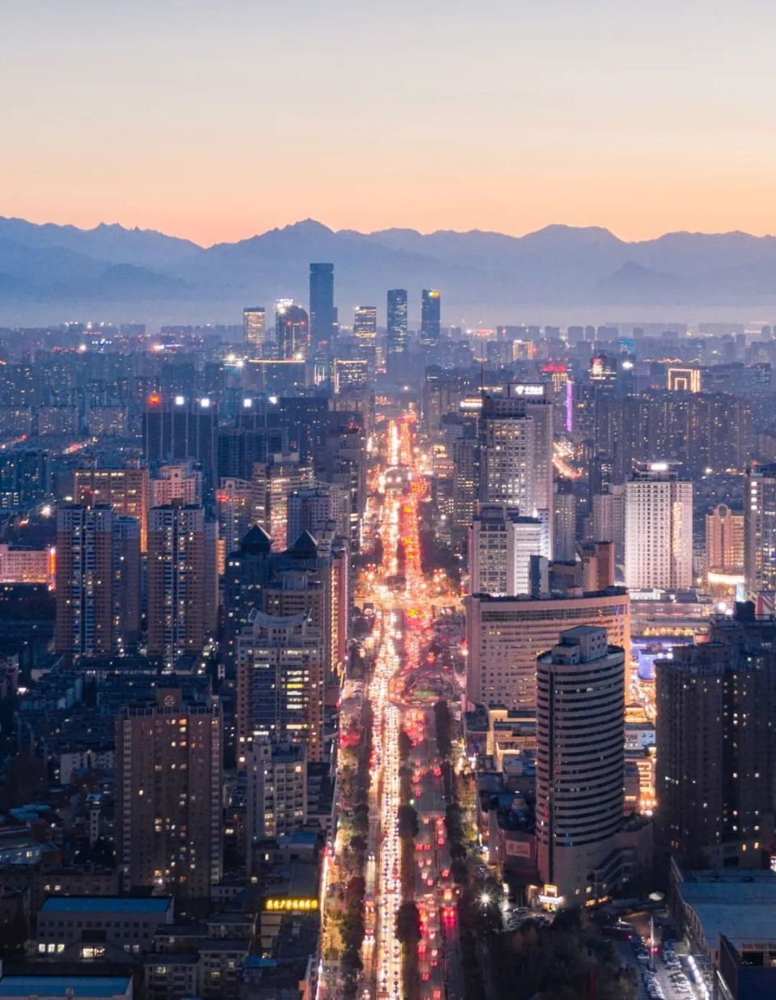

这是西北城市的普遍特征：由于深居内陆，在建国初期相对落后，其产业是国家政策安排下点状分布的，每个城市有一个自己的产业定位，但很难形成市场网络体系和商业生态，也就难以出现1+1>2的效应。

这一点至今如此，像前些年力争过来的三星一个项目就把城市的污染指标用光了，然而它只是一个点状的生产基地，没有形成产业配套体系。只有充分发挥市场作用，打通内部的阻隔，才能建立一个健康的经济生态。

**“靠市场”**

**还是“靠市长”？**

长久以来，这个问题的答案是显而易见的：西安的经济，不是靠市场，而是靠市长。

在西安访谈时，不同的人都向我证实了这么一点：当地政治气氛比较浓厚，各方面管得比较严。

相比起东部沿海地区，西安早先的现代工业基础其实较为薄弱，在快速工业化的过程中，整个城市经济也不那么依靠自发的市场经济，而是依靠强有力的政治力量推动。

其结果是，虽然城市外表看上去现代化了，但城市居民的现代意识提升慢一拍，很多人都觉得赚到钱不是靠自主技术，而是靠关系。  

在西安，每年GDP发展指标，是下任务的。相当讽刺的是，连市场主体每年递增多少，都有指标，那市场监管局完不成怎么办？就是放宽条件。甚至有人愕然发现自家民宅被三家企业注册为公司所在地了。

像这样的做法渗透到很多战略规划及其执行的过程当中，有一位技术人员抱怨说，他不时遇到一些根本不可能完成的目标，“这个目标怎么来的不知道，有什么好处不知道，要完成需要什么流程不知道，不完成有什么后果也不知道。”

当然，公平地说，西安也并非处处都这么计划经济导向，高新区、西咸新区就比较年轻有活力，然而总的来说，这里行政干预相当强，变着法子（例如派出工作组）督促、监管企业，而体制内力量越强，对体制外的挤压就越大，并且常常取决于“谁在做事”。

在这里，经常出现的状况是：不是制定战略去落实，而是找到什么样的人，就做什么样的事；有时想做的事，没有足够的人去做，但如果这个事你能干，那就都推给你干。甚至怎么干，也往往没有事先清楚的说明，而是“你先干”，但上面保留着随时干预、调整的权力。

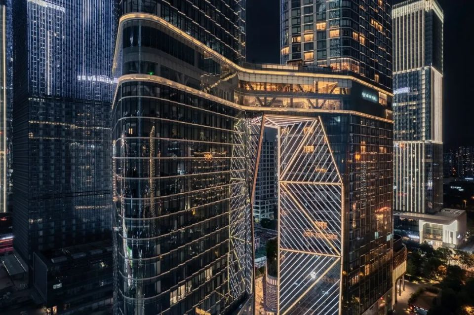

在实际运作中，权力比契约、交换往往起着更具决定性的作用，做什么都要上面有政策，在实践中则尤为依赖“能人”，但凡有一个合适的人能在合适的位子上，就能把那块资源盘活做好。

这会导致一种对“领导力”的特殊理解。有位南方来的营销专家说，他受聘于西安的一家公司后，按以往惯常的做派，对下属的营销团队说：“你们有想法，就放手去做，我全力支持。”结果，过后董事长找他问：“你怎么不拿主意？”他说：“团队有主意，不用我拿主意。”让他震惊的是，董事长说：“那你不称职啊。”

由于组织机构的运作都依赖“能人”来“拿主意”，内部不同部门之间的条块分割也就难免了，可想而知，这会造成很多相互打架的情形，协调起来很困难；在利益难以协调的情况下，领导就可能对你说：“你把四个矛盾的意见融合一下。”

一位本地朋友之前在上海工作、生活了十多年，回到西安三年，至今都有强烈的不适感。她回来先入职外企，本以为哪里的外企都应该差不多，结果发现也不是，内心受了不小冲击：

“在上海层层审核，很规范，在这边，差不多就出吧，领导甚至看都不看就发出去。究竟如何要看领导个人。这边员工做事也没有主动性，你不问，他也不说做完了。我也不理解他们为什么不服从管理，我提醒他‘你做错了’，都还没说你来改，他马上就是一副抗拒的姿态，搬出‘你当时怎么说’，开始甩锅，别人给他提了建议，但他就拒绝了。这样真的很多事都没法推进。”

这并不只是一两个人的“生冷憎倔”，而意味着组织内部的运作往往依靠权力，身处其中的个体也常常没有能力分辨批评是否出于善意或互利，而一概看作是强加的外部意志，不考虑问题的实质而凭借本能做出负面反应，但这就意味着组织和个体难以灵活调整，不断进步。

回头来看，西安这些年来的发展，搭乘了国家经济上升期的顺风车，极大地得益于“西部大开发”等一系列政策红利和老祖宗留下的文化遗产，资源禀赋极好，然而，也正是这种“幸运感”随之造成一种“不需要太多努力也能活得不错”的被动发展心态，进而让它满足于现状，看不到自身的不足。

不可否认，西安的未来，紧跟国家大势极为关键，毕竟地缘优势、战略定位对它的发展极为关键，它现有的城市地位也超出了自身的经济实力所应得的。如果不是作为“一带一路”的关键节点，像中欧班列等恐怕都难以借势。

不过，随之而来的是，这也会让西安更依赖政策指挥棒，洞察这一点的一位西安人说：“经济不行，那你就听话嘛，西安会跑得非常快。”

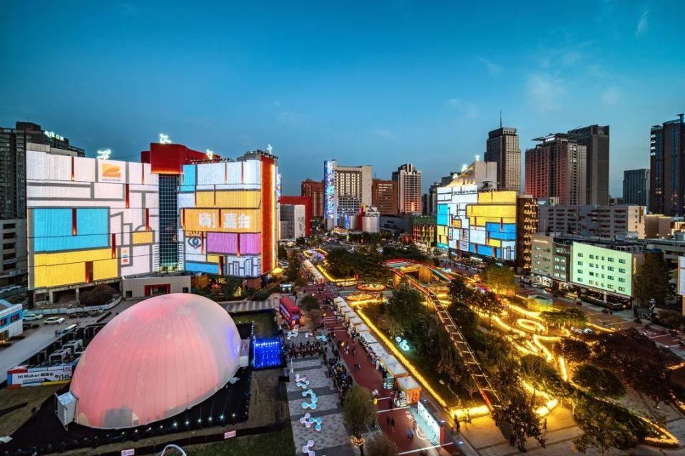

西安这些年经常拿成都对比，“追赶超越”的锦标赛模式，渗透到全市不同单位，哪怕是医院、高校，也都需要找一个对标的对象，每个月填表、学习，力争赶超。

然而这其实仍是一种计划经济的思维模式，各单位“各干各的”，却不那么注重整体的协调性，到头来又回到那个老问题：城市其实是复合的生态，真正的城市竞争靠的不是哪个单项的比拼，而是整体的生态，这就尤其要强化对外开放和协调、合作。

对西安来说，难就难在这里。

