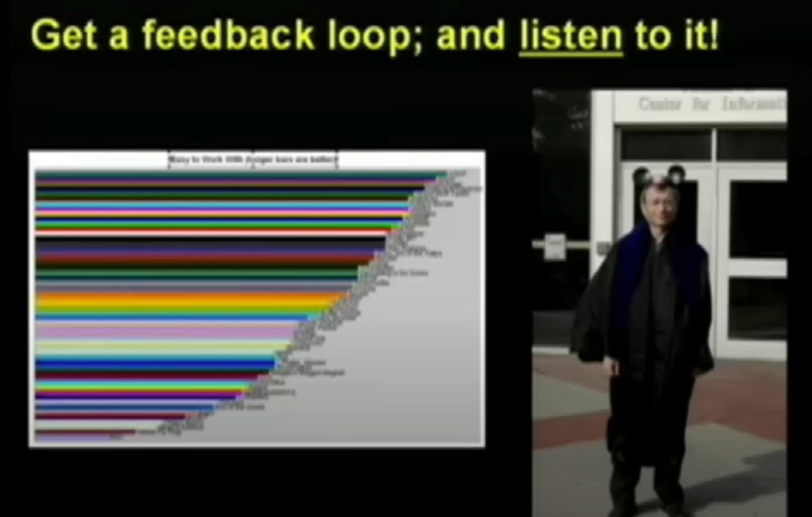

“我们无法改变手里的牌，但我们可以改变打牌的方式。” 兰迪·波许教授是一位在美国享有盛誉的计算机科学、人机交互及设计教授。然而，命运多舛，他的人生在2006年9月遭遇了重大转折，当时他被诊断出患有晚期胰腺癌。

面对生命的严峻挑战，波许教授始终保持着乐观的生活态度。2007年9月18日，他在卡内基梅隆大学做了一场题为“最后一课”的演讲，这场演讲也就是本篇文章的主要内容。

在演讲中，波许教授分享了自己一步步实现自己童年梦想的经历，讲述了他如何助力他人追梦，以及在这一过程中，他自己积累的许多宝贵经验和教训。 这篇文章的意义也远超题目本身，它不仅仅是关于如何实现你的梦想。更重要的是，它教会我们如何以正确的方式过好我们的生活。正如兰迪所说：“当我们的生活方式得当时，一切事情都会顺其自然地发生，梦想会自然而然地向你靠近。” 我非常喜欢Stripe创始人Patrick Collison在谈论产品质量时说过的一句话："美的东西能告诉你什么？它告诉你，制造它的人真的很用心"。 如果你观看这篇演讲的原视频，相信你同样会感受到兰迪的用心，无论是演讲本身，还是配合演讲的PPT展示，以及整个故事的编排，都经过了精心的策划和设计。 这场演讲也不只是一场精彩的讲话，更是一次美的体验——语言的美，故事的美，以及兰迪的人格魅力美。 祝阅读愉快～

2007年9月18日，兰迪·波许教授在卡内基梅隆大学的麦可诺密（McConomy）礼堂内，面对满堂的听众，发表了他的最后一堂演讲——《如何真正实现你的童年梦想？》（Really Achieving Your Childhood Dreams）。在这场演讲中，波许教授分享了他个人的童年梦想，探讨了如何助力他人追梦，以及他在人生旅途中所学到的一些教训。以下是波许教授演讲的完整文字记录……

能够来到这里真是太棒了。但英迪拉（Indira）没有告诉你们的是，这个系列讲座本来叫作“最后一课”。

如果你只剩下最后一次发言机会，你会讲些什么？我猜我会这样调侃：“该死，我好不容易才安排好了演讲场地，他们却自作主张地换了演讲的主题。”

各位在场的朋友，如果你们对我的故事背景还不太清楚，那就让我来简单说明一下。我父亲曾经告诉过我，当房间里存在一个明显的大象（问题）时，我们应该勇于面对它。

比如，如果我展示我的CAT扫描结果给你看，你会发现我的肝脏里大约有十几个肿瘤。我的医生告诉我，我可能只剩下三到六个月的健康时光。那是一个月前的事了，所以现在你们可以自己推算一下我剩余的时间。不过，幸运的是，我拥有世界上最好的医生。

嗯，反正事实就是这样。我们无法改变现实，但我们可以选择如何应对。我们无法改变手里的牌，但我们可以改变打牌的方式。

如果我看起来并没有像我应该表现出的那样沮丧或忧郁，很抱歉，让你们失望了。我必须坦诚相告，我并未选择逃避。我清楚自己的境遇，我和我的家人——包括我的三位孩子和爱人，最近搬到了弗吉尼亚州的切萨皮克，靠近诺福克的一个可爱房子里。我们之所以这么做，是因为我们相信那里将是我们家庭未来更好的归宿。

而另一个事实是，我目前的身体状况非常好。你们可能不信，但我真的状态很好。实际上，我比你们大多数人的身体状况都要好。

因此，如果你觉得自己快要哭了，或者想要同情我，请先来和我较量一番。等你真正了解我之后，或许你才有资格说同情我的话：）

好的，那么今天咱们聊点儿别的，癌症这个话题就先放一放。之前我已经说了不少，而且说实话，我对它也没什么兴趣。所以，如果您手头有草药补品或是什么疗法，就别往我这儿推荐了。

我们也不会谈论那些比实现你的童年梦想更重要的事情。我们不会谈论我的妻子。我们不会谈论我的孩子，尽管我现在状态很好，但我还做不到在谈论这些话题时不掉眼泪。

因此，让我们把这些话题搁置一旁，虽然它们确实更为重要。同时，我也不打算深入讨论灵性和宗教的话题。尽管我可以说，我最近有了一次类似于临终时的灵性体验，但事实上，我只不过是买了一台麦金塔电脑（Macintosh）而已。

【译者注：Macintosh是苹果公司推出的一系列个人电脑的品牌名称，于1984年首次推出，以其创新的图形用户界面为个人计算市场带来了革命性变化。】

现在，我知道我刚刚吸引了9%的听众的注意。那么，今天的演讲主题是什么呢？

今天，我想和大家聊聊我儿时的梦想，以及我是如何一步步实现它们的——我在这方面非常幸运——更重要的是，我相信自己不仅实现了个人的梦想，还帮助他人触碰到了他们的梦。作为一名教授，我积累了一些宝贵的经验教训。在今天的分享中，我将把这些经验传授给大家，希望能够助你在追梦路上的一臂之力，或是成为他人梦想的助力者。随着年岁的增长，你或许会发现，帮助他人实现梦想，其实是一件更加令人愉悦和满足的事情。

我的童年确实非常快乐，这可不是开玩笑的。当你翻看我家里的老相册时，你会发现一个很有趣的现象：你找不到一张我小时候不笑的照片，真的。这是多么令人欣慰的事情啊。

那是我们家的狗狗，对吧（如上左图所示）？谢谢。我手头正好有一张我在做梦的照片（如上右图所示）。我做过很多这样的梦，经历了很多次“梦醒时分”，你懂的，那是一个梦想容易生根发芽的时代。我出生于1960年，记得八、九岁时，看着电视上宇航员们登月的画面，感觉好像一切都能实现。这种感受，我们永远不该忘记。因为梦想的启发和赋予我们的可能性，实在是太大了。

我小时候都有哪些梦想呢？或许你们不会赞同我的梦想清单，但这恰恰就是我。比如说，体验一把零重力的感觉，成为一名国家橄榄球联盟的球员，在《世界图书百科全书》（World Book）上留下我的文章——说到这，你们大概已经能猜出我小时候是个什么样的书呆子了——或者成为像柯克船长那样的英雄人物。在座的各位中，有没有谁和我一样，有过这样充满幻想的童年梦想呢？我想在卡内基梅隆大学，可能很难找到这样的人吧。

我想在游乐园赢得那些大毛绒玩具，同时，我也希望成为一名迪士尼的创意工程师。

这些梦想并没有按照特定顺序排列，尽管我得说，除了头一个之外，其他梦想实现起来的难度似乎是越来越大。

让我们来谈谈我的第一个梦想——零重力体验（zero gravity）。如今，拥有具体的梦想是很重要的。我从未想过要成为一名宇航员，小时候的我戴着眼镜，别人告诉我，“宇航员是不允许戴眼镜的。”我就想着，“嗯，我并不是真的想要成为宇航员；我只是想体验那种漂浮的感觉。”

所以，还是个孩子的时候，我尝试了一种简易版的零重力体验（如上图所示），但效果并不理想。后来，我了解到NASA有一种名为“呕吐彗星”（vomit comet）的飞机，它原本是用来训练宇航员的。它通过沿抛物线轨迹飞行来模拟太空中的失重状态。在每次飞行的顶点，你将体验到大约25秒的失重状态。

【译者注：“Vomit Comet”（呕吐彗星）是一个非正式的名称，用来指代一种特殊改装的飞机，它能够通过执行抛物线飞行轨迹创造出短暂的失重环境。这种飞机被用来模拟太空中的零重力条件，通常用于宇航员的训练，也用于某些科学实验和娱乐体验。之所以被称为“Vomit Comet”，是因为在这种失重状态下，乘客可能会感到恶心甚至呕吐。】

NASA还有一个特别的项目，邀请大学生提交飞行提案，胜出者将获得真正的飞行机会。这听起来是不是很酷？我们组织了一支团队参赛，他们不仅赢得了比赛，还获得了飞行资格。我激动不已，因为我计划与他们同行……然而，现实给了我沉重一击，我遇到了第一个障碍——校方明确规定，教职员工不得与学生团队一同飞行。

我懂，这事儿让我特别失望，对不对？我心想：“毕竟我付出了这么多心血。”但我仔细阅读了相关资料，发现NASA有一个外联和宣传计划，允许学生从家乡带来一位本地媒体记者。这让我意识到，我可能还有机会。

现在我是一名网络记者，兰迪·波许。获取记者证其实很简单。所以我给NASA打了个电话，问：“我需要把一些文件传真到哪里？”他们问：“您打算传真什么文件给我们？”

我回答：“一份是我辞去教职顾问的辞职信，另一份是我作为记者的申请表。”

我回答说：“是的，但我们的项目是关于虚拟现实（virtual reality）的。我们计划带上许多VR头盔，让所有参赛的学生团队都能体验，所有真正的记者也都能拍摄到这一过程。”

对方听后笑着说：“哦，你这狡猾的家伙，确实有你的。”

事实上，我们确保了我们的承诺得以兑现，这也引出了我稍后在演讲中将提到的一个主题：带上你能提供的东西，因为这会让你更受欢迎。

如果你对零重力状态下的体验感到好奇，希望这里的音响效果能让您有所感受。

是的，你必须为自己的行为买单（You do pay the piper at the bottom）。这样，我童年的第一个梦想，就算是实现了，打个勾。

【译者注：这段话中的“You do pay the piper at the bottom"、”是一个成语，意思是最终必须承担后果或付出代价。在这里，它可能被用来幽默地表达实现童年梦想需要付出一些代价或努力。】

嗯，让我们来聊聊橄榄球。我曾梦想着能在美国国家橄榄球联盟（NFL）的赛场上一展身手。或许你们中许多人并不知情，其实我曾亲身参与过橄榄球比赛——是的，虽然我未能跻身NFL的殿堂，但从这个未能实现的梦想中，我获得的经验和教训，却远比我实现的其他梦想更为宝贵。

我九岁那年就加入了橄榄球队。在那个联盟里，我是年纪最小的孩子。而我有幸遇到了一位教练，名叫吉姆·格雷厄姆（Jim Graham）。他身高六尺四寸，曾在宾夕法尼亚州立大学担任中线卫。他是那种让人望而生畏的大块头，是个典型的老派教练。我的意思是，他甚至认为前传都是一种投机取巧的手段。

他第一天来训练的时候，你知道的，他是那么一个高大威猛的家伙。我们都怕得要死，但出乎意料的是，他手里一个橄榄球都没拿。

我们怎么可能没有橄榄球就进行训练呢？这时，另一个孩子开口了，他说：“不好意思，教练，我们没有橄榄球啊。”

格雷厄姆教练反问道：“对，在一场橄榄球比赛中，有多少名球员同时在场上呢？”

格雷厄姆教练接着问：“那在任何特定的时刻，有多少名球员能碰到橄榄球呢？”

教练点头说：“没错，所以我们今天要专注于其他21名球员在做的事情。”

这是一个非常好的故事，因为它全部关乎基本功，基本功，基本功，基本功。你必须先打好基础，否则那些高难度的动作都是空谈。

关于格雷厄姆教练，我还有一次难忘的经历。在一次训练中，他全程都在严格要求我。他不断地指出我的不足：“这么做不对，那样也不对。回去重做。这是你欠我的，波许！训练结束后，罚你做俯卧撑。”

训练结束后，另一位助理教练走过来对我说：“格雷厄姆教练对你要求很严格，是不是？”

他微笑着告诉我：“这其实是件好事。当你犯错时，如果周围再也没有人愿意指出，那才真的意味着他们对你失去了信心。”这个教训一直伴随着我，那就是：当你发现自己做得不好，却再也没有人愿意指出时，这实际上是一个危险的信号。那些愿意批评你的人，其实是在用行动告诉你，他们依然爱着你、在乎你、关心你。

继格雷厄姆教练之后，我又遇到了另一位教练，塞特利夫教练。他让我深刻感受到了热情的力量。他曾经做过这样的事：为了一次进攻，他会故意让球员们站在完全错误的位置。比如，让所有个子矮的球员去当接球手，这听起来简直荒谬。但我们只打一次这样的进攻，对吧？而且，对方队伍会完全摸不着头脑，因为当你只参与一次进攻，并且你还不在自己的常规位置上，那么自由发挥就意味着没有什么可失去的。天啊，这样的一次进攻，我们往往能彻底打乱对手的阵脚，取得意想不到的效果。

这种热情真的很美妙，直到今天，我仍然觉得在橄榄球场上最为自在。如果你看到我在走廊里走来走去，像是在思考解决问题，那是因为我从很小的时候就开始打橄榄球，并且为之训练，它已经成为了我的一部分，我也非常感激它能成为我生活的一部分，即便我没有实现在NFL打球的梦想，那也没关系。我可能获得了更有价值的东西。看看现在NFL发生的事，我甚至怀疑那些球员们是否真的过得幸福。

在Electronic Arts公司，我学到了一句我非常喜欢的话，它与这个话题息息相关：“经验是当你没有得到你想要的东西时所获得的东西。”（Experience is what you get when you didn’t get what you wanted）

【译者注：Electronic Arts（简称EA）是一家总部位于美国的全球领先的视频游戏公司，成立于1982年，以开发和发布广泛的高质量游戏而闻名，例如《FIFA》《战地》和《模拟人生》系列。】

这句话美得令人心动。橄榄球还给了我们另一个启示，当我们鼓励孩子们去参加橄榄球、足球、游泳等运动时，这其实是一个“幌子”（head fake）或“间接学习”的绝佳例证。我们并不是真的希望他们去学习如何打橄榄球，虽然像我这样能够拥有一个完美的投球球姿和熟练掌握砍伐阻挡技巧确实很不错。

但我们真正希望孩子们从中学到的，是团队合作、体育精神、坚持不懈等更为重要的品质。这些间接的学习经验至关重要，你应该时刻留意它们，因为它们无处不在。

嗯，这个简单。我小时候，家里的书架上就摆着《世界图书百科全书》。那会儿，这百科全书还是纸质版的，我们过去都看纸质书。后来，我在虚拟现实领域成了一个专家，虽然不是那种特别出名的，但也算是小有名气。所以，当《世界图书百科全书》的编辑部找到我，希望我写篇文章时，我就写了。如果你去你当地的图书馆，他们应该还有《世界图书百科全书》的藏书。在“V”字头下你会找到关于虚拟现实的条目，我的文章就在那里。

我只能说，自从被选为《世界图书百科全书》的作者之后，我现在更加相信维基百科是一个非常好的信息来源了，因为我亲身经历了传统百科全书的质量把关流程。

在某个时刻，你会意识到有些事情你是做不到的，那时你可能只想接近那些能够做到的人。

我的意思是，柯克船长几乎拥有了我们梦寐以求的所有品质。在我后来学习领导力的过程中，我领悟到了一个一直激励我的道理：柯克船长并不是星舰上最聪明的人。想想看，斯波克聪明绝顶，麦考伊是医术高超的医生，斯科蒂是杰出的工程师。你可能会感到好奇，“他究竟拥有怎样特殊的技能组合，能够让他不仅登上这艘星舰，还成为它的指挥官呢？”

显然，有一种被称为领导力的技能组合。无论你是否喜欢《星际迷航》这个系列，毫无疑问，通过观察柯克船长的行为，我们可以学到很多关于如何领导他人的东西。而且，他还有最酷的玩具。想想看，他有那个能和船沟通的设备。对于一个孩子来说，这真是太吸引人了。

我觉得这真是太壮观了。当然，现在我自己也拥有了一个，而且它更小巧。所以这感觉很棒。我实现了自己的梦想。詹姆斯·T·柯克的扮演者威廉·夏特纳写了一本书，我觉得这是一本相当酷的书。他是与匹兹堡的作家奇普·沃尔特合作完成的，沃尔特非常出色。他们一起写了一本探讨《星际迷航》科学基础的书，分析了其中哪些科学设想已经变成了现实。为了这本书，他们走访了全国顶尖的科研机构，考察了许多前沿科技。他们还来到了我们这里，研究我们的虚拟现实设备。为此，我们为他搭建了一个虚拟现实环境，看起来有点像《星际迷航》里的那样。我们启动了这个系统，把它设置成了《星际迷航》中的“红色警戒”模式。他非常配合我们的展示。不过，这并不是说他事先就预见到了这一幕。

能够见到童年时的偶像真的很酷，但当他亲自来到你的实验室，看看你在这里所做的酷炫研究时，那感觉更是特别，那绝对是一个难忘的时刻。

嗯，赢得那些毛绒动物玩具，对你来说或许看似普通，但当你还是个孩子，看到游乐园里那些高大强壮的人手里拿着大毛绒玩具，那种感觉就完全不同了，对吧？我有很多和赢来的毛绒玩具的合影。这里有一张，是我父亲和我赢得的一只玩具熊的合影。我赢过很多这样的毛绒玩具。我确实赢得了不少这样的玩具，我父亲也不例外，他也有自己的战利品，这点值得表扬。

是的，赢得毛绒玩具是我们整个家庭的一大乐趣。但我能想象那些怀疑论者会怎么说。在这个数字化的时代，他们会怀疑，那些熊玩具可能并不真的出现在我合影的照片里，或者我可能只是花了五块钱请人在主题公园的毛绒玩具旁边给我拍了张照片。面对这样的质疑，我该如何让人信服呢？我想到了一个办法，我可以拿出那些赢来的毛绒玩具给他们看。

在这里，有一些我珍藏的熊玩具。我们搬家到切萨皮克的时候，搬家卡车里没有足够的空间放这些玩具了。如果你在今天的活动结束时，想要带走一份属于我的小小回忆，欢迎前来领取。数量有限，赠完为止。

好的，下一个梦想，成为一名创意工程师。这个梦想实现起来可不容易，说实话，比起这个，体验零重力反而简单多了。记得我八岁那年，我们全家横跨整个国家去迪士尼乐园游玩，如果你看过电影《假期历险记》（National Lampoon's Vacation），就会发现我们的经历和电影里的情节有些相似。那次旅行，对我来说，简直是一场冒险。

这里有一些珍贵的老照片，照片中的我站在城堡前，还有我和爱丽丝游乐设施的合影。对于喜欢寻找故事中伏笔的朋友们，这些照片无疑是对我未来梦想的一种暗示。我当时就觉得，这简直是我经历过的最酷的地方。我没有简单地说，“哇，我想体验这个”，而是说，“我想创造出像这样的东西。”

于是我耐心等待，完成了在卡内基梅隆大学的博士学位，原以为这会让我具备做任何事情的资格。我满怀希望地迅速向沃尔特·迪士尼创意工程部门发送了申请信，然而，他们回复给我的却是一封非常有礼貌的拒绝信。

我的意思是，他们的回复是这样的——“我们已经仔细审阅了您的申请，但目前我们没有适合您特殊资质的职位空缺。”

想想看，你满心期待地从卡内基梅隆大学这样的地方发出申请，得到的却是这样的回复，这多少有点让人受挫。

但要记住，遇到障碍是有原因的。障碍的存在并不是为了阻止我们前进，而是为了让我们有机会证明，我们对某件事的渴望有多强烈。因为这些障碍是为了筛掉那些并不那么渴望的人，它们是为了阻挡其他人而存在的。

好的，让我们把时光轴快速拨到1991年。那时，我们在弗吉尼亚大学开发了一个虚拟现实系统，每天的运行成本仅为5美元，这在当时看来简直就是一项不可思议的壮举。回想起那些日子，作为一个初出茅庐的学者，我感到非常紧张。吉姆·弗利（Jim Foley）当时也在场，我特别喜欢讲这个故事。他认识我的本科导师安迪·范·达姆（Andy Van Dam）。在我第一次出席演讲的学术会议上，我害怕得要死，而这位用户界面领域的泰斗突然走过来，无缘无故地给了我一个巨大的熊抱，他说：“这是安迪给你的拥抱。”

【译者注：安迪·范·达姆是美国计算机科学家，专注于计算机图形学和人机交互领域，是布朗大学的教授。他在教育和研究方面做出了重要贡献，特别是在推动计算机图形学作为学术学科的发展上发挥了关键作用。】

就在那时，我心想：“好吧，或许我真的能做到。也许我确实属于这里。”

还有一个类似的故事，我们的虚拟现实系统在当时引起了巨大的轰动。因为那时候，人们普遍认为开发虚拟现实需要50万美元的投资，每个人都感到无比沮丧。然而，我们却用大约5000美元的零件拼凑出了一个完整的虚拟现实系统，让它运行起来。人们对我们的成就惊叹不已，他们说，“哦，天哪，这简直就像惠普公司在车库里创业的故事一样。这太了不起了。”

我正在做演讲，现场的气氛非常热烈。到了问答环节，一位名叫汤姆·弗内斯的先生走向了麦克风开始自我介绍。他是当时虚拟现实界非常有名的人物。我之前虽然没见过他本人，但他的名字我绝对是知道的。

当他提问时，我惊讶地回应道：“不好意思，您是说您就是汤姆·弗内斯吗？”

我随即说：“我很荣幸能回答您的问题，但在那之前，不知您是否愿意在明天和我共进午餐？”

这一瞬间充满了深意。是的，这里不仅有谦卑，还有一种让人难以拒绝的真诚邀请。

所以，想象一下，几年后创意工程团队正在秘密研发一个虚拟现实项目。这个项目是极其机密的，以至于即便宣传部门已经在电视广告中提及了虚拟现实景点，他们对外还是坚决否认其存在。可以说，创意工程部门这次在保密工作上做得非常到位。

这个项目是关于阿拉丁（Aladdin）游乐设施的，游客可以在那里乘坐魔毯，并通过头戴式显示器体验，这种视角有时也被称作“鳄鱼视角”（gator vision）。因此，我有幸参与了这个项目。项目刚开始不久，当他们开始在电视上播放相关广告时，我被指派去向国防部长汇报虚拟现实技术的最新进展。

【译者注：鳄鱼视角是指由佛罗里达大学（University of Florida）开发的一种计算机视觉系统，该系统用于运动场合中，对运动进行实时分析和追踪，增强了体育比赛的观看体验和分析质量。】

是的，弗雷德·布鲁克斯（Fred Brooks）和我一起被指派去向国防部长汇报工作，这正好给了我一个理由。于是我打电话给创意工程部门，我说：“听我说，我即将向国防部长介绍虚拟现实的发展情况。我需要你们提供一些资料，因为这可是世界上顶尖的虚拟现实系统之一。”

【译者注：弗雷德·布鲁克斯因其在软件工程和项目管理上的贡献而闻名，尤其是他的著作《人月神话》深刻影响了软件开发领域。】

他们起初有些犹豫，我便追问：“你们在公园里搞的那些爱国主义宣传，难道都是表面功夫吗？”

他们一开始显得有些迟疑，支支吾吾地回应说：“嗯，这个嘛……”但很快他们又补充说：“不过，我们的公关部门——由于这个项目还非常新，公关部门目前还没有准备好可以提供给你的视频资料，所以我会直接让你和该项目的开发团队沟通。”

因此，我开始通过电话与一个名叫乔恩·斯诺迪（Jon Snoddy）的人交谈，他是我遇到过的让我印象非常深刻的人之一，他负责带领那个团队，而他们取得的卓越成就也不足为奇了。

然后他寄给我一些资料，我们进行了简短的交流。在交谈中，我提到：“嘿，我不久后将去你们那边的区域参加会议。到时咱们能一起出来吃个午饭吗？”

我实际上是在对他撒个小谎，说我有正当理由去那个地区，这样看起来就不会显得我太过急切。但老实说，即使要跑到海王星那么远，我也愿意去和他共进午餐。

乔恩很爽快地回答说：“当然可以。”为了这次会面，我花了大约80个小时与世界上所有的虚拟现实专家进行交谈，询问他们：“如果你们有机会接触这个了不起的项目，你们会想要了解些什么？”

之后，我整理了所有这些问题，并且必须记住它们。但了解我的人都知道，我的记忆力其实并不好，但是我不能走进去像个傻子一样，支支吾吾地说，“嗨，这是第72个问题。”

我去了那里，和乔恩一起吃了一顿长达两个小时的午餐。乔恩肯定觉得我是一个非常了不起的人物，因为我所做的只是复述了弗雷德·布鲁克斯、艾万·萨瑟兰、安迪·范·达姆以及亨利·福克斯等人的观点。所以，当你转述聪明人的话时，自己听起来也会很聪明。

【译者注：弗雷德·布鲁克斯、艾万·萨瑟兰、安迪·范·达姆以及亨利·福克斯等人都是计算机科学领域的重量级人物。】

在我们愉快的午餐结束时，我用我们的行话提出了一个“请求”。我说：“你知道，我即将有一个公休假（sabbatical）。”他问：“公休假是什么？”

【译者注：sabbatical（公休假）在计算机和其他学术领域中指的是教职工被授权的一段时间（通常为一年），在此期间他们可以暂时脱离日常教学或行政职责，以专注于个人研究、学习新技术或进行其他专业发展活动。】

接着，我与他探讨了去他们那里工作的可能性。乔恩说：“嗯，这听起来很不错，不过你知道，你们的行业是向人们传递信息，而我们的行业则是保守秘密。”

而乔恩·斯诺迪之所以能成为乔恩·斯诺迪，就在于他随后说的话：“但我们会找到解决这个问题的办法的。”我真的很欣赏他这一点。

从乔恩·斯诺迪那里，我学到了很多东西，足以做一个一小时的演讲来分享。他告诉我的其中一点是：“如果你给别人足够的时间，他们最终会给你惊喜，让你刮目相看。”他还说：“当你对某人生气或感到不满时，很可能只是因为你没有给他们足够的时间。如果你能更有耐心，再多等一会儿，他们几乎总能给你带来意想不到的成果。”

这句话给我留下了深刻印象，我认为他在这一点上是绝对正确的。

简单来说，我们经过讨论后签订了一份法律合同。根据协议，我将自费前往，参与一个为期六个月的项目，然后我们将共同撰写并发表一篇论文——这可能是创意工程首次也是最后一次发表的论文。

我不能总是表现得和蔼可亲，因为我需要遵守我的承诺。而有时候，必须有人为此承担后果。

出乎意料的是，那位不幸要“上断头台”的人，竟是弗吉尼亚大学的一位院长。他的名字并不重要，我们就称他为院长沃默（wormer）吧。

在与院长沃默的一次会面中，我提出了我的公休假计划，并告诉他，“我已经成功说服创意工程团队让一位学者加入”，这在当时简直是破天荒的事情。如果没有乔恩的大胆决策，这样的合作根本不可能实现。毕竟，幻想工程是一个守口如瓶的组织。

院长沃默仔细检查了协议文件，然后提出了疑问：“这里写着他们将拥有你的知识产权。”我解释说：“是的，我们确实达成了发表论文的协议，但除此之外，没有其他知识产权的问题。我的工作并不涉及可以申请专利的内容。”

但他并不买账，他说：“嗯，但你将来可能会有专利，所以这个协议不成立了。你去让他们修改那个小条款，然后再来跟我谈。”

然后我对他说：“我希望你明白这件事对我有多重要。如果我们无法达成一致，我宁愿选择无薪休假，我也要去那里，完成这个项目。”

院长回应说：“你知道吗，我甚至可能不允许你这么做。毕竟，你的大脑里已经充满了知识产权，如果他们真的从你这里拿走了，这个风险我们也不能不考虑。”

在对峙中，意识到何时陷入了僵局，并及时退出，非常重要。

我试图缓和气氛：“我们先退一步，冷静思考一下。我们真的认为这是个好主意吗？”

我回应说：“好的，至少我们在这一点上达成了共识。”

接着我问：“这个决定真的需要你来做吗？如果涉及到知识产权问题，难道不是负责资助研究的校长的职责吗？”

我继续说：“如果他觉得没问题，你也觉得满意，那我也当然没有异议。”

就像《兔八哥》里的怀尔·E·科伊特一样，我发现自己站在了吉恩·布洛克（Gene Block）的办公室里。吉恩·布洛克是一位非常了不起的人物，于是我开始和他讨论我的计划：“让我们从宏观的角度来讨论这个问题，因为我不想再犹豫了。你认为这是个好主意吗？”

【译者注：Gene Block 是美国的一位教育家和大学行政人员，自2007年起担任加利福尼亚大学洛杉矶分校（UCLA）的校长。】

他回答说：“嗯，如果你问我这是否是个好主意，我只能说我不知道。但我看到我的一位明星教师现在正站在我的办公室里，他非常兴奋，所以请告诉我更多细节。”

这给所有行政人员上了一课。虽然他们表达的其实是同一个意思，但表达方式却大不相同。

另一种则是“嗯，我不知道，但我的一位明星教师现在正站在这里，他很兴奋，所以我想了解更多。”

他们都是在表达“我不知道”，但显然，表达方式有好有坏。

最终，我们克服了所有困难。我成功加入了创意工程，一切都进展得很顺利，结局非常美好。

有时候，我们所面临的障碍，并非是物理上的障碍，而是人与人之间的隔阂。

所以我参与了阿拉丁项目，其壮观程度简直令人难以置信。让我来介绍一下我的侄子克里斯托弗和那个设备。在这个项目中，参与者将坐在一个类似摩托车的装置上，体验仿佛乘着飞毯的奇妙感觉，同时，他们会佩戴一个设计巧妙的头戴式显示器。这个显示器由两个主要部分组成，它的设计非常巧妙，只有一顶小帽子会直接接触用户的头部，而所有昂贵的技术组件都安装在帽子的上方。这样的设计允许我们以极低成本大量生产帽子，因为除了帽子本身可以根据需要定制外，其他技术组件是通用的。

我真的很喜欢创意工程这个地方。它非常壮观，一切都如我梦想中那般美好。我特别喜欢模型工作室，那里的人们在巨大物理模型上工作，模型的大小就像这个房间一样。那是一个你可以四处走动，获得灵感的不可思议的地方。

我总是回想起当初去那里的时候，人们问我：“你觉得期望值设得太高了吗？”

我会回答说：“你看过电影《查理和巧克力工厂》吗？“在电影中，吉恩·怀尔德饰演的威利·旺卡告诉小男孩查理，他要把整个巧克力工厂送给他。

他说：“有没有人给你讲过一个小男孩突然得到了他所有想要的东西的故事？”查理的眼睛瞪得大大的，他回答说：“没有，那个小男孩后来怎么样了？”

吉恩·怀尔德微笑着说：“他从此过上了幸福的生活。”

所以，我认为在阿拉丁虚拟现实项目上工作是一个千载难逢的机会，我坚信这一点。这个项目不仅改变了我的人生，而且让我深入到了真实世界的人机交互领域。大多数研究人机交互的人都是在理论中打转，他们大多是拥有博士或硕士学位的学者。但除非你真正置身于实际场景中，否则你的工作并不能算是真正的实践，对吧？

而且最重要的是，我从乔恩·斯诺迪那里学到了如何将艺术家和工程师聚集在一起工作，这无疑是最宝贵的经验。

我们发表了一篇论文，这本身在学术界并不算是什么重大事件。但在撰写这篇论文的过程中，创意工程的同事们提议说：“让我们在论文中加入一张通常会在杂志上使用的大幅图片吧。”而接受这篇论文的国际计算机图形与交互委员会对此的反应，就像遇到了一个大丑闻一样，他们质疑说：“他们真的允许你这样做吗？”

【译者注：Siggraph 是一个专注于计算机图形和交互技术的国际会议，每年由ACM SIGGRAPH组织举办，被广泛认为是计算机图形领域的顶级会议之一。】

实际上，并没有规定说不可以这样做。因此，我们按原计划发表了这篇论文。令人惊讶的是，从那以后，Siggraph的论文在第一页上使用彩色图片逐渐成为了一种传统。所以，我以自己的小方式改变了世界。当我六个月的合同期满时，他们来找我，问我：“你想长期从事这个工作吗？你可以留下来继续做。”

但我回答说：“不。”这是我人生中少数几次让我父亲感到非常惊讶的时刻。他惊讶地问：“你说什么？”

他继续说：“这是你一直追求的东西，现在机会就在眼前，你却要放弃——这是为什么？”

我的办公桌抽屉里常备着一瓶Maalox（一种抗酸药），因为这里工作压力特别大。虽然总的来说，创意工程并不是一个压力很大的地方，但我所在的实验室情况有些不同。实验室的负责人乔恩中途离开了，那段时间实验室的氛围有点像苏联，有些动荡不安。尽管如此，最终的结果还是相当不错的。如果他们当时对我说，“要么留下来，要么永远不要再踏进这座大楼”，我也会选择离开，哪怕放弃学校的终身教职的职位。

但幸运的是，他们对我很友好，给了我一个两全其美的方案。我基本上成了创意工程的一名每周工作一天的顾问，这样的情况我持续了大约10年。这也是作为教授的一个优势，因为你可以在进行学术研究的同时，参与到实际的工作中去。

我继续为像迪士尼探险世界（DisneyQuest）这样的项目提供咨询服务。其中包括虚拟丛林巡游（virtual jungle cruise），以及我认为是我做过的最好的互动体验——加勒比海盗，它在迪士尼探险世界中表现得非常出色。

【译者注：迪士尼探险世界主要提供虚拟现实体验和互动游戏。该公园最初于1998年在佛罗里达州奥兰多开业，后因参观人数下降和技术老化于2017年关闭。】

这些项目都是我童年的梦想，而且我对自己所做的一切感到非常满意。

那么问题来了，我如何才能帮助别人实现他们童年的梦想呢？我很高兴自己成为了一名教授，还有什么地方比大学更能让人实现童年的梦想呢？或许在Electronic Arts公司工作也是一个不错的选择，但我不确定。

一切都始于一个非常具体的时刻，当时我遇到了一个名叫汤米·伯内特（Tommy Burnette）的年轻人。当我还在弗吉尼亚大学时，他找到我，表示对我的研究小组感兴趣。我们讨论了这件事，他告诉我：“哦，我有一个童年的梦想。”

当他们坦诚分享自己的梦想时，你几乎可以触摸到那些梦想的轮廓。我问他，“汤米，你的童年梦想是什么？”

他回答说：“我想参与下一部《星球大战》电影的制作。”

【译者注：1977：星球大战：新希望 A New Hope、1980：星球大战Ⅱ：帝国反击战The Empire Strikes Back、1983：星球大战Ⅲ：绝地归来 Return Of The Jedi、1999：星战前传Ⅰ：幽灵的威胁The Phantom Menace、2002：星战前传Ⅱ：克隆人的进攻 Attack Of The Clones、2005：星战前传Ⅲ：西斯的复仇Revenge Of The Sith】

说到这里，我们需要明确一下时间点。汤米现在就在这里，这是哪一年的事情呢？嗯，那是他上大二的那年。

好的，那是在1993年。我对汤米说：“你知道的，他们可能不会再拍那些电影了。”\[笑声\]

汤米作为本科生，后来又作为职员，与我合作了很多年。当我搬到卡内基梅隆大学时，我的团队的每个成员都从弗吉尼亚大学搬到了卡内基梅隆大学，只有汤米没有来，因为他找到了一个更好的工作机会，而且他确实参与了那三部电影的制作。

我对他说，“这很好，但你知道，一次只帮助一个人效率有点低。”

了解我的人都知道，我非常注重效率。于是我思考，“我能更高效地做这件事吗？我能设计一种方式，让一群人一起去追求他们的童年梦想吗？”

因此，我去了卡内基梅隆大学，我创建了一门叫做“构建虚拟世界”（Building Virtual Worlds）的课程。

这门课程是面向所有专业学生的基础课程。我想问问在座的各位，有多少人曾经参与过类似的实践活动？看来有些人已经有过类似的经验了。对于那些还没有参加过的同学，不用担心，这门课程很简单。我们有50名学生，他们来自大学里的各个专业。在课程中，学生们会被随机分配到一个4人小组里，并且每隔两周会更换新的小组。每个小组需要在两周的时间里合作完成一个项目，包括规划、制作和最终的展示。展示结束后，我会重新组织团队，让每个学生与3位新的队友一起开始新的项目。通过这样的方式，在一整个学期中，每个学生将有机会参与并完成五个不同的项目。

在我们开设这门课程的第一年，我们面临的挑战之大简直难以言表。我之所以开设这门课，纯粹是出于一种尝试，想看看我们是否能够成功。我们刚刚掌握了在3D图形上进行纹理映射的技术，虽然制作出的内容看起来还算可以，但你知道，按照现在的标准，我们使用的计算机性能真的很弱。

不过我心想，“那就试试看吧。” 在我新加入的大学，我打了几个电话，表达了我的想法，“我希望这门课程能够吸引更多人，因此我计划将其设为可以跨学科选修的课程。” 让我惊喜的是，仅仅24小时，这门课程就已经成功地在五个不同的院系里开课了。我爱这所大学。我的意思是，它真是一个神奇的地方。

后来，学生们问我：“那我们到底该制作些什么内容呢？” 我回答说：“见鬼，我也不知道。你们想做什么就做什么吧。但是有两条规矩：不准搞射击暴力，也不准搞色情内容。” 我这么规定，并不是因为我对这些内容有什么特别的反感，而是因为，你懂的，虚拟现实领域里这类东西已经够多的了，对不对？

你会惊讶地发现，当你把这些选项排除在外时，有多少19岁的男孩会完全想不出点子。\[笑声\]

不管怎样，我还是开始了这门课程的教学。在第一次作业中，学生们用了两周时间交上了他们的作品，结果让我大感意外。他们的作品质量远远超出了我的预期。我虽然借鉴了创意工程虚拟现实实验室的方法，但对本科生能做到什么程度并没有把握，何况他们使用的设备也相对简陋。然而，他们第一次作业的表现却非常出色，以至于我——作为一名有着十年教龄的教授，一时也不知道该如何是好。

于是，我给我的导师安迪·范·达姆打了一个电话。我说：“安迪，我刚刚给学生们布置了一个为期两周的作业，他们交上来的成果让我非常满意，如果按照这个水平，我可能会给他们所有人都打A。老师，您觉得我应该怎么办呢？”

安迪沉思了一会儿，然后他告诉我：“你明天回到课堂上，直视学生们的眼睛，告诉他们，‘你们做得很好，但我知道你们有能力做得更好。’”

这确实是一条很好的建议，因为它的意思是，我显然还不确定该如何设定标准，无论我将标准定得过高还是过低，都可能对学生们不公正。

而且，对于学生来说，这个建议同样很有帮助，因为他们真的照做了，那个学期，我们的课程慢慢变成了一项秘密活动。有时候，我走进一个本该只有50名学生的教室，却发现里面挤了95个人。这是因为到了我们展示作品的日子，不仅有学生，还有他们的室友、朋友、甚至父母——我教书以来还是头一次有家长来听课。这种情况让我既感到荣幸又有些紧张。

这件事就像滚雪球一样，越滚越大，我们突然有了一个特别的想法：“我们得把这个过程分享给大家。” 如果说我在教学过程中领悟到了什么，那就是分享。所以我说：“我们得在学期末搞一个成果展示，我们需要办一场大型展览。”

我们预定了现在用于演讲的这个场地，麦可诺密（Mcconomy）。这个房间对我来说充满了美好的回忆。我们选择它并不是因为我们觉得能坐满这个大房间，而是因为这里配备了唯一一套可用的音视频设备。这里就像个动物园，到处都是电脑和其他设备。

然后我们真的把这个场地坐满了，不仅仅是座位，连过道上都站满了人。我永远也不会忘记，当时的院长吉姆·莫里斯就坐在舞台上的某个位置，我们不得不稍微调整一下他的位置。房间里的能量是我从未感受过的，校长杰瑞·科洪也在场，他也感受到了这种氛围。他后来把这比作俄亥俄州立大学橄榄球赛前的动员会，只不过这是在学术界的场合。他走过来，问了一个非常恰当的问题。

他说：“在你们开始之前，我有个问题，这些人都是从哪里来的？”他又问：“观众席上的同学，都是来自哪些系的？”

我们就这个问题进行了调查，结果发现参与者来自校园内的所有系。我对此感到非常高兴，因为我刚加入这个校园。我的新上司也是新来的，他很快就以一种非常具体的方式意识到，这所大学有着将所有人团结起来的力量，这让我们感到非常振奋。

所以我们举办了一场全校性的展览。在展览中，人们进行了各种表演。他们穿上了戏服，我们通过投影技术，让观众可以看到演员们在头戴设备中所体验到的虚拟世界。现场还有很多大型的道具，非常壮观。其中一个人正在模拟白水漂流的场景，这一幕是对经典电影《E.T.》的致敬。实际上，我曾告诉他们，如果他们不能复现电影中孩子们骑着自行车飞跃月球的那个经典镜头，我会给他们不及格。我得说，这可不是开玩笑，这是真实发生的事情。

我想向你们重现一下当时的场景，如果能把这里的灯光调暗一些，那效果会更好。不过，看来这不太可能。

这是一堂非比寻常的课程，汇聚了校园里最聪明、最有创造力的学生们。能够参与其中，本身就是一种乐趣。他们对待舞台表演的态度也极为认真。

这成为了校园里一年一度的一大盛事，人们甚至愿意为此排队等待。这种情况让我感到非常荣幸，同时也给参与的孩子们带来了一种激动人心的体验——为那些对活动充满期待的观众进行表演。我认为，能够让别人感到兴奋和快乐，是你能给予某人最好的体验之一，这是一种极其宝贵的经历。

我们总是尽力让观众们参与到活动中来，不论是使用荧光棒，打沙滩排球，还是模拟开车，这些都是我们尝试的互动方式，非常酷炫。事实上，这项技术之前在洛杉矶《蜘蛛侠3》的首映礼上就已经使用过，它允许观众们能够实际控制屏幕上的一些内容，这种体验非常棒。

虽然我没有每一年教学时的合影，但我尽力找出了所有能找到的照片。能够在这大约十年的时间里教授这门课程，对我来说既是特权也是荣誉。不过，天下没有不散的筵席，我大概在一年前结束了这门课程的教学。人们经常会问我，我最难忘的时刻是什么。

我不知道是否每个人都有一个最难忘的时刻，但我确信，我永远不会忘记的一刻是这样的。那是一个滑轮溜冰忍者（roller-skating ninja）的世界，在这个世界里，我们有一个规则：所有的表演内容都必须现场实时直播，而且得确保它们能够正常运作。一旦出了岔子，我们就得尴尬地切换到事先准备好的备份录像带上。

所以我们的忍者在舞台上表演滑轮滑冰，但不幸的是，这个世界的运行并没有像预期的那样平稳。突然间，一切都呼啦一下崩溃了。

我走上前去，我记得应该是史蒂夫·奥迪亚（Steve Audia），对吧？他现在在哪儿呢？好吧，史蒂夫在哪儿呢？啊，我的好朋友，史蒂夫·奥迪亚。要论现场反应，他真是棒极了，对不对？

我对史蒂夫说：“史蒂夫，很抱歉，你的世界出现了崩溃，我们不得不切换到录像带。”

他抽出忍者剑，大声说：“我感到耻辱！哇！”然后戏剧性地倒在了地上。

我觉得这个场景特别有说服力，在我教授这门高科技课程的十年里，我最喜欢的时刻就是这次精彩的即兴演出。当录像带放完，灯光重新亮起时，他躺在那里一动不动，然后他的队友们把他拖下了场。

这真是一个非常棒的时刻。而这门课程的核心意义就在于团队合作。过去人们常说：“是什么造就了一个好的世界？”

我得告诉他们，“虽然我不能提前透露什么，但我可以通过他们展示前的肢体语言来判断他们创造的世界是否出色。如果他们彼此站得很近，那通常意味着他们创造的世界是成功的。”

这门课真是个开天辟地的活儿。我就不拿那些复杂的细节来烦你了，但老实说，这活儿可真不简单。当我从卡内基梅隆大学娱乐技术中心（ETC）退出时，我获得了一个奖项，我认为这是对我工作的象征性认可。如果你想做任何创新的事情，就难免会成为众矢之的，你必须忍受这些。我的意思是，所有可能出错的事情，几乎最后都会出错，但好的一面是，人们会从中获得很多乐趣。

当你拥有一件十年来一直视为宝贝的东西，将它交出去无疑是世界上最难的事情，我唯一能给你的建议是，找一个比你更出色的人来接手。这也正是我选择的做法。

在我的虚拟现实工作室里，曾经有一个年轻人。他的名字叫杰西·谢尔（Jesse Schell）。你不需要在他身边待太久，就会感受到他身上散发出的强大力量。在卡内基梅隆大学，我有两个非常自豪的成就。第一个成就是，我说服了杰西卡·霍金斯（Jessica Hodgins）和杰西·谢尔来到这里，加入我们的教师队伍。当我有机会把这些工作交接给杰西时，我感到非常兴奋。事实证明，我的选择是正确的。杰西不仅接过了我的工作，还把它们做得更加出色。

然而，这仅仅是一个开始。我们并未就此止步，而是更进一步，共同打造了一个我称之为“梦想成真工厂”（dream fulfillment factory）的奇迹。在学校的支持与鼓励下，我和唐·马里尼（Don Marinelli）携手，从无到有，打造了这个大胆的项目。这是一个本不应被尝试的疯狂想法，因为所有有理智的大学都不会去做这样的事情。但正因为如此，我们才抓住了一个巨大的机会，得以创造出一些真正特别的东西。

娱乐技术中心（ETC）的核心，是让艺术家和技术专家在小团队中合作，共同创造新事物。我们提供为期两年的专业硕士学位课程。唐和我都是ETC的成员。虽然我们的个性和背景截然不同，但我们都有着共同的理念和目标。我们热爱创新，喜欢用新的方式去做事。实际上，我们两个在学术界都有点不适应。我过去常说，我作为学者感到不安，因为我来自一个重视实际工作胜过学术研究的家族。

但我想强调的是，卡内基梅隆大学可能是唯一能孕育出像ETC这样创新项目的地方，至少到目前为止是唯一的地方。

好的，这张照片是唐的主意，哈哈。我们喜欢把这张照片称为“唐·马里尼利弹吉他，兰迪·波许弹键盘”。

在ETC，我们确实强调了左脑和右脑（理性思维和创新思维）的结合，这种方式非常有效。

唐是个充满激情的人。我们曾经共用一个办公室，虽然起初它很小，但我们一用就是六年。了解唐的人都清楚，他对工作总是充满热情。鉴于我现在的状况【译者注：作者患胰腺癌】，有人便开玩笑地问我：“以你现在的情况，你有没有想过，将来会去天堂还是地狱？”我幽默地回答：“我也说不准。但如果真有地狱，那么和你一起共用办公室六年，恐怕已经算是对我的惩罚了。”当然，这只是一种幽默的说法，我相信唐会理解并原谅我的玩笑。

和唐共用办公室，就像和一场充满活力的龙卷风共处一室。这里充满了能量，让人永远猜不到下一刻会发生什么。但你可以放心，总会有激动人心的事情发生。唐是个充满创意和热情的人，对ETC的成功做出了巨大的贡献。如果我们要量化这份成功，唐无疑会占据其中的绝大部分。他完成了大部分工作，提出了大部分想法。我们之间的合作非常默契，可以说是一种阴阳互补，但更像是“阴”与“阳”的结合。唐的贡献值得赞扬，我也毫不吝啬地将这份荣誉归于他。因为ETC是一个了不起的地方，现在由他负责运营，并且他正在带领它走向世界。我们一会儿会谈到这个。

想要准确表达出ETC的独特魅力，实在不是一件容易的事。这情形就像是你尝试向一个从未目睹过太阳马戏团的人描述它的奇妙之处。不管你如何描述，都似乎难以避免误差。你可能只是简单地告诉他们它类似一个马戏团，但别人接着就会好奇地问起老虎、狮子的数量，或是空中飞人表演的细节。然而，这些问题并没有真正触及太阳马戏团的精髓。

当我们谈论ETC提供的硕士学位课程，你会发现它与你以往见过的任何硕士课程都大不相同。这个课程的特色在于通过动手实践来学习。具体来说，学生们会在创造虚拟世界的过程中，首先完成五个项目，之后继续完成三个项目。在这个学习过程中，学生们几乎所有的时间都是在小团队中度过的，他们将一起动手制作东西，而不是仅仅通过阅读书本来获取知识。

唐和我对于仅仅通过书本学习的方式不太感兴趣。毕竟，攻读硕士的学生已经在本科阶段花了四年时间在书本学习上了。我们认为，到了硕士阶段，学生们应该已经读过足够多的书了。卡内基梅隆大学完全放手，让我们自主运作，这是我们能够成功的关键所在。我们不必向上级院长汇报工作，而是直接向教务长汇报。这一点对我们来说非常好，因为教务长非常繁忙，几乎没有时间来好好监管我们。

我们拥有明确的权限去打破常规。我们的教育模式完全是基于项目实践的，这种方式既紧张又充满乐趣。此外，我们还安排了实地考察活动。每年一月的春季学期，我们会组织一年级的50名学生，前往皮克斯（Pixar）动画工作室进行参观学习。除了皮克斯，我们还会带领学生参观工业光魔（Light and Magic）等顶尖公司。而如果有像汤米这样的内部人士在这些公司担任领导，那么安排学生参观就变得轻而易举了。

【译者注：汤米是作者的学生，也就是之前提到的那位实现了自己梦想并参与制作星球大战电影的同学。】

所以我们的做事方法非常独特。学生们参与的项目种类繁多，其中很大一部分我们称之为“教育娱乐”（Edutainment）。我们与纽约消防部门合作，开发了许多产品。例如，我们制作了一个网络模拟器，专门用于消防员的培训。这个模拟器运用了类似于视频游戏的技术，以一种互动和吸引人的方式，教授人们实用的知识和技能，效果相当不错。

还有一些公司做了些不寻常的事，他们向我们提供了书面承诺，声明“我们承诺雇用你们的学生”。我这里有艺电公司（EA）和动视公司（Activision）等的承诺书。到目前为止，我们共有五份这样的书面协议，对吧，安德鲁（Drew）可能更清楚具体有多少，但我猜是五份。据我所知，没有其他学校能够获得企业方面如此正式的书面承诺，这无疑是一个重大的声明。这些协议还都是长期协议，也就是说，这些公司已经同意，甚至在我们还未招收学生之前，就会雇用他们作为暑期实习生。这不仅是对我们教育项目质量的一种肯定，也是对我们极大的信任。

正如我所说，唐现在充满了激情和创造力，我这样讲是对他美好品质的一种赞美。他正在做的一些事情让我感到非常惊叹。他今晚不在这里，因为他在新加坡，那里即将开设一个新的ETC校园。实际上，澳大利亚已经有一个ETC校园，而且韩国很快也会有一个。因此，ETC正在逐渐成为一个全球性的现象。

我认为这对所有其他大学来说传达了一个非常强烈的信号。卡内基梅隆大学是唯一能够做到这一点的大学，这是毫无疑问的。我们现在需要做的，就是将这个模式推广到全球范围。

ETC项目取得的另一项显著成就，是培养了学生们的专注力——哦，我听到了学生们紧张的笑声。我忽略了这些条形图带来的深远影响。在构建虚拟世界的课程中，我们每两周都会收集一次同行的反馈，并把所有反馈整合到一个大型电子表格里。到了学期末，每位学生平均在五个不同的项目中与三个队友合作。这样，每个人就积累了15个数据点，这在统计学上是有意义的，为我们提供了可靠的信息。

学期末时，你会得到一张条形图，它显示了你与他人合作的难易程度排名，以及你相较于同龄人的表现。这样的反馈，实在难以忽视。尽管有些人设法对其视而不见，但大多数人看到后都会感叹：“哇，我得加把劲了。我需要开始思考在这些项目中我与他人的沟通方式。”激发学生的自我反思能力，无疑是教育者能给予学生的最宝贵的礼物。

ETC的确是一个了不起的机构。但即便如此，即便唐将其影响力扩展到全球，我们的教学模式本质上仍然是劳动密集型的。我们不是一次培养一个学生，也不是一次培养一个小团队，而是每个校园同时培养50或100名学生，如果有四个这样的校园，那么就是200或400名学生。然而，我真正想做的，是创造出一种可以无限扩展的教育模式，一种能够让数百万人甚至数千万人利用它来追逐他们梦想的工具。我知道，这样宏伟的目标可能让我看起来有些疯狂，就像“疯帽匠”（Mad Hatter.）一样。

【译者注：Mad Hatter（疯帽匠）是来自路易斯·卡罗尔的著名童话《爱丽丝梦游仙境》中的一个角色，以其古怪和荒诞的行为而闻名。这个角色常常与“疯狂的茶会”场景联系在一起。】

爱丽丝（Alice）项目是我们长期研究的成果，它采用了一种创新的方式来教授计算机编程。在这个项目中，孩子们通过创作电影和游戏来学习编程技能。这其实是一种巧妙的“幌子”——我们再次使用了这个概念。最理想的教学方法是让学生在以为自己正在学习其他知识的同时，实际上已经掌握了新的技能。在我的整个职业生涯中，我一直在采用这种教学方法。

我们使用的“幌子”是让孩子们认为自己只是在制作电影和视频游戏，而实际上他们在学习编程。这个编程学习工具已经被下载超过一百万次，并且有八本教科书专门围绕它编写。目前，美国有10%的大学已经在使用这个工具。但请期待，更好的功能将在下一个版本中呈现。

我，像摩西一样，能够预见到一个美好的未来，虽然我可能不会亲自到达那里，但这并不重要。因为我能清晰地看到那个愿景：数百万的孩子在享受乐趣的同时学习一些困难的东西。这真是一件非常酷的事情，我会很乐意接受这样的遗产。

我们计划在2008年推出新版本的软件。如果用户想要明确知道自己正在学习Java语言【译者注：一种编程语言】，那么我们的软件将会教授Java。如果用户不关心这一点，他们可能只会觉得自己在编写电影剧本。我们还计划整合历史上最畅销的电脑游戏《模拟人生》中的角色。所有的这些新特性都已经在我们的实验室中进行了测试，所以技术上的风险非常低。虽然我没有足够的时间在这里感谢爱丽丝团队的每一位成员，但我特别想要提及丹尼斯·科斯格罗夫（Dennis Cosgrove）。他是构建这个新版本的负责人，并且从项目开始就一直全身心投入，可以说这个项目就像他的孩子一样。如果有人想知道未来几个月应该联系谁以获取爱丽丝项目的更新，那么我建议他们联系万达·丹（Wanda Dann）。哦，他就在这里，请站起来，让在场的每个人都认识一下你。

接下来，我将谈论更多关于凯特琳·凯勒赫（Caitlin Kelleher）的事情。她已经获得了博士学位，目前在华盛顿大学工作，她计划将我们的工作提升到一个新的水平，并将其扩展到中学教育中。因此，我们有一个宏伟的愿景，我希望能够通过爱丽丝项目让我在某种程度上实现永生。

好的，现在我们来探讨讲座的第三部分，也就是我们从前面的讨论中学到的教训。我们不仅分享了我自己的梦想，还讨论了怎样帮助他人去实现他们的梦想。在这一过程中，我们发现确实存在一些关键的因素，这些因素对于帮助一个人实现自己的梦想至关重要。

首先，我想谈谈父母、导师和学生的角色。我非常幸运，因为我出生在一个由两位杰出人物组成的家庭。这张照片是在我的母亲70岁生日时拍摄的。我母亲不仅在年龄上超过了我，还在生活的许多方面为我树立了榜样。

这一张照片则是我父亲在80岁生日时的留影，那天他勇敢地尝试了坐过山车。他自豪地向我展示了他的勇敢和才华，因为在那一天，他还赢得了一个大熊作为奖品。

我的父亲是一个充满活力的人，与他一起做的每件事都充满了冒险和乐趣。尽管我不清楚那个包裹里究竟装着什么，但我能感觉到它一定非常特别。除了曾经扮演过圣诞老人，带给人们欢乐之外，我父亲还做了很多非常有意义的事情，帮助了许多人。比如，我父母资助了泰国的一所学校，这使得每年大约有30名原本无法上学的孩子得以继续他们的学业。我和我的妻子也深度参与了这个项目，并且我相信，每个人都应该尽自己所能去帮助他人。

但我关于我父亲最美妙的一个故事是——很遗憾，他在一年多前去世了——在整理他的遗物过程中，我们意外地发现了一些珍贵的东西。我父亲曾在二战期间参与了突出部战役（Bulge）的战斗，而在我们翻看他的遗物时，我们惊讶地发现他曾荣获铜星勋章（Bronze Star Medal），以表彰他的英勇行为。这件事我母亲竟然完全不知情。在他们长达50年的婚姻生活中，父亲从未提及过这段荣誉。

【译者注：突出部战役，又称阿登战役，是第二次世界大战中发生于1944年12月至1945年1月的一场关键战役。铜星勋章是美国军事勋章，授予在战斗中表现出英勇或功绩显著的军人。这是美国军队的第四高等级战时勋章。】

我的母亲是那种无论何时都会给予你爱的人，哪怕在你最不理智的时候，比如拽她的头发，她依然会爱你。关于我母亲，我想分享两个美好的故事。我在这里攻读博士学位期间，参加了一场名为理论资格认证的考试。我可以肯定地说，那次考试是我人生中除了化疗以外最痛苦的经历之一……\[笑声\]

我对母亲抱怨说这次考试非常难，感觉非常糟糕。她只是轻轻靠近我，拍了拍我的胳膊，然后安慰我说：“亲爱的，我们理解你的感受。但想想你父亲，在你这个年纪的时候，他正在战场上与德国人作战呢。” \[笑声\]

在我获得博士学位之后，我母亲总是喜欢这样向别人介绍我：“这是我的儿子，他是个博士，不过不是那种给人看病的博士。” \[笑声\]

这些幻灯片的会有点黑。不过让我带你们回到我高中时代的一个决定。那时，我执意要给我的卧室换上新装。我梦想着将房间变成一艘潜水艇，外加一节电梯。说到这儿，你们可能会问，这有什么好的？

妙就妙在，我的父母竟然允许我这么做了，他们也并没有因此而生气。而且，我粉刷的卧室至今还保持着原样。如果你有机会去我父母的家，你仍然可以看到它。如果你们中已经有人做了父母，而你们的孩子想要粉刷他们的卧室，我建议你们允许他们这么做，就当作是帮我一个忙，好吗？一切都会好起来的。至于房子将来的转卖价格，就别太担心了。

除了我们的父母，还有很多人在我们的成长和学习过程中给予了我们帮助，包括我们的老师、导师、朋友和同事。提到安迪·范·达姆，我该从何说起呢？当我在布朗大学读大一的时候，他正好在休假，但我经常听到关于他的各种传说。他被描述得像个神话中的人物，具体来说，像一个半人马，但是一个非常易怒的半人马。尽管他不在学校，但每个人都对他的缺席感到遗憾，同时又因为他的离开而感到松了一口气。直到我开始为安迪工作，我才理解了其中的原因。到了大二，我成为了他的助教。那时，我还是一个相当自负的年轻人。有一次，我去安迪老师的办公室寻求帮助，那时已经是晚上九点了，但安迪仍然在接待学生，这是我对他的第一个印象——他是一位非常尽职的教授。

我满怀激情地走进去，心想我准备好了要去改变世界。那里有很多孩子正等待着帮助，还有很多其他的事情需要去做。然后，安迪以他荷兰人特有的方式拥抱了我——他是荷兰人，对吧？他用的是那种荷兰式的拥抱，手搭在我的肩膀上，我们一起散步。他对我说：“兰迪，我得告诉你，有人觉得你傲慢。这真的很遗憾，因为这可能会限制你未来能够取得的成就。”

这是一种多么巧妙的批评方式，不是吗？他没有直接说你是个混球，而是换了一种说法：“人们就是这么看待你的。”他还补充说，“这样做的问题在于，它会限制你将来能够达到的成就。”

当我逐渐深入了解安迪，他给我的批评和建议也变得更加坦率和直接。关于安迪的故事，我可以说上一个月，但今天我想要分享的是，我在布朗大学毕业之际，从未想过要继续深造。在我们家族里，读研究生并不是一个常见的选择，这对我来说几乎是不可想象的。

通常情况下，人们会开始寻找工作，不是吗？然而，安迪却建议我：“不要急于找工作，你应该去攻读博士学位，成为一名教授。”

他回答我：“因为你是个出色的推销员，任何聘用你的公司都可能让你去做销售。既然如此，你为什么不选择去推广一些更有价值的东西，比如教育呢？”

安迪可以说是我遇到的第一位老板。我很幸运，在我的职业生涯中遇到了很多优秀的老板。至于那个红圈，它画得似乎有点远了。艾尔的名字应该放在这里。我不太清楚那边具体发生了什么。他可能正在网上观看这场直播，心里暗自想：“天哪，他还在尝试，但就是达不到目标！“

我并不想过多地谈论我遇到的那些出色的老板，除了要强调他们真的都非常优秀之外。我知道在这个世界上，有很多人不幸地遇到过糟糕的上司，而我却没有这样的经历，对此我感到非常感激。每一位我曾向其汇报工作的人，都给我留下了深刻的印象，他们都是非常了不起的人。

但我们不仅从老板那里学习，我们还从学生那里学习。我认为有史以来最有价值的一个启示来自于凯特琳·凯勒赫——不好意思，是凯特琳·凯勒赫博士，请原谅我刚才的口误——她刚刚在这里完成了她的学业，并且即将在华盛顿大学开始她的新工作。她注意到了爱丽丝这个项目，认为它提供了一种更简单的学习编程的方法。然后她提出了一个问题：“是的，但它为什么能引起人们的兴趣呢？”

我回答说：“嗯，可能是因为我有一种强迫性的性格。我喜欢指挥那些小玩具兵，让它们按照我的指令行动，我觉得这挺有趣的。”

接着她提出了不同的看法：“不，我们应该把编程看作是一种讲故事的活动。”她在这方面做了很多出色的工作，特别是她发现对于中学女生来说，如果将编程介绍为一种讲故事的活动，她们会更愿意学习如何编写计算机软件。因此，可以说凯特琳·凯勒赫博士的论文提供了有史以来最有价值的一个洞见。

科洪（Cohon）校长，在我向他透露即将进行这次演讲的消息时，他嘱咐我：“别忘了分享享受生活的乐趣，因为那正是你留给我的印象。”

我回应道，“我会的，但这无异于让鱼儿去讲述水的重要性。”坦白说，我天生就是个乐天派。好吧，我正面临生命的终结，但我依然选择以乐观的心态，享受生活中的每一刻，因为除此之外，也没有其他办法了，不是吗？

接下来，我想给出的建议是，你必须问自己：我是乐观向上的跳跳虎（tigger），还是忧虑悲观的屹耳（eeyore）？在跳跳虎与屹耳的辩论中，我的选择不言而喻。

【译者注：跳跳虎和屹耳是《小熊维尼》中的两个角色。跳跳虎是一只活泼跳跃的老虎，代表乐观和活力；而屹耳是一只忧郁的小驴，通常代表悲观和消极。】

永远不要失去孩童般的好奇心。这太重要了，这是推动我们前进的动力。助人为乐，帮助他人。丹尼·普罗菲特（Denny Proffitt）在这方面堪称楷模。他所传授的知识，我穷尽一生也难以企及。他以身作则，教会了我如何管理一个团队，如何关心他人。

M.K. 海莉——我有一个理论，来自大家族的人往往更优秀，因为他们不得不学会如何与人相处。M.K. 海莉，她自己就是来自一个拥有20位兄弟姐妹的家庭，这真是令人难以置信。她总是乐观地说，“将不可能变为可能，这本身就充满了乐趣。”

我初到创意工程部时，她成为了给我下马威的人之一。她直言不讳地问我：“我听说你加入了阿拉丁项目，你有什么能耐？”

她不以为然地回答说：“教授先生，这个头衔虽然响亮，但并不是我想问的。我真正想问的是，‘你到底能做些什么？’”

我曾提到过，我来自一个工薪阶层的家庭。在我们家，我们总是保留那些对我们来说有价值和意义的物品。这些年来，我就一直珍藏着我的校队夹克。当我还在研究生院的时候，我常常穿着它。我的一个朋友，杰西卡·霍金斯，曾经问我：“你为什么要穿这件校队夹克呢？”

我环视周围那些智慧超群却并非运动员的同学们，带着一丝自豪回答：“因为我有这个资格。”

杰西卡觉得这真是太逗了，于是有一年，她为我做了这个破旧的兰迪小布偶。这个小家伙也穿着一件迷你版的校队夹克。它成了我至爱的收藏。对于你生活中的自恋狂来说，这是一份完美的礼物。

忠诚是双向的。在人生旅途中，我有幸遇到了许多杰出的人物。在弗吉尼亚大学，我认识了一个叫丹尼斯·科斯格罗夫的年轻人。他年轻时遇到了一些事，有一次我无意中与一位院长谈起了他。这里需要说明的是，不是之前提到的那位院长。不管怎样，这位院长似乎对丹尼斯有成见，我始终搞不懂为什么，因为丹尼斯是个好小伙子，但出于某种原因，这位院长就是看他不顺眼。

最终，我坚定地说，“不，我要为丹尼斯担保。”那人质疑道，“你连终身教职都还没获得，就敢说你要为这个大二或大三的学生担保？”他那时应该是大三学生。我回答说，“没错，我要为他担保，因为我坚信他的潜力。”

院长回应说，“我会记住你今天的话，等你申请终身教职的时候。”

我说，“成交。”但忠诚是双向的。我是说，那是不知道多少年前的事了，但正是这个丹尼斯·科斯格罗夫在推动爱丽丝项目的发展。这些年来，他始终与我并肩作战。

你知道的，如果我们只能派一个人乘坐太空探测器去见外星物种，我会选择丹尼斯。

在卡内基梅隆大学演讲，不可能不提到一个非常特别的人，那就是莎朗·伯克斯（Sharon Burks）。我跟她开玩笑说，“嗯，如果你退休了，那活着也就没什么意思了。”

莎朗是如此出色，简直无法用言语描述，对于我们所有得到她帮助的人来说，这种感觉简直无法形容。

我喜欢这张照片，因为它让她和希尔在一起了，希尔也很棒，因为他给出了我听过的最好的建议，我觉得所有的年轻女性都应该听听。

希尔是这样说的：“我摸索了很久，但最终我明白了。对于对你有浪漫意图的男人，判断起来其实很简单。别听他们怎么说的，而要看他们怎么做的。就是这么简单，就是这么直白。”

回想起我单身岁月的点点滴滴，我不禁感慨：“真是一语惊醒梦中人。”

永不言弃。我曾被布朗大学拒之门外，成了候补名单上的一员。我坚持不懈地每天致电询问，直到他们忍无可忍，终于决定放我一马，让我成为了他们中的一员。

在卡内基梅隆大学，我同样面临了研究生院的闭门羹。我的导师安迪曾悉心指导我，他说：“去读研究生吧。你会进入卡内基梅隆大学的。我所有的杰出学生都选择了卡内基梅隆大学。”然后，嗯，接下来的故事你可能已经猜到了。

他信心满满地对我说：“你会轻松进入卡内基梅隆大学的，绝对没问题。”他或许忘了，进入这个国家顶尖的博士项目的竞争已经变得异常激烈，而且他也不知道，我竟然会在GRE考试上遭遇滑铁卢。他的信任基于对我的了解，但按照我的模拟考试成绩来看，这其实是一个非常愚蠢的想法，所以我没有被卡内基梅隆大学录取。这个故事，直到今天我才第一次讲出来。没有人知道，直到这一刻。

【译者注：GRE（Graduate Record Examinations）是美国用于研究生入学的标准化考试，主要由想要申请研究生院、商学院和各类研究生专业的学生参加。】

我被卡内基梅隆大学拒之门外，那时我还是个有点烦人的小孩。我走进安迪的办公室，把拒绝信扔在他的桌子上。我说，“我只是想让你知道，你在卡内基梅隆大学的推荐信究竟有多大的分量。”

话音未落，他的手已经伸向了电话，坚定地说：“这件事，我会摆平的。”

我连忙拒绝，“不，不，不，我不想这么做。这不是我做人的原则。也许，其他研究生院会愿意给我一个机会。”

他看着我，认真地说：“听着，卡内基梅隆大学是你命中注定要去的地方。”他提出了一个方案：“我跟你打个赌。你可以去参观其他的学校。”毕竟，其他学校都向我敞开了大门。他继续说：“去吧，去实地看看，如果你真的觉得那些学校都不适合你，那时候，你会允许我给尼科打电话吗？”尼科就是尼科·哈伯曼（Nico Habermann）。

【译者注：尼科·哈伯曼是一位计算机科学家，以其在计算机科学教育和研究领域的贡献而知名。他还曾在美国国家科学基金会（NSF）担任计算机和信息科学与工程局的负责人。】

然后我说：“好的，就这么定了。”之后，我访问了其他几所学校，具体是哪些我就不点名了，比如伯克利、康奈尔——它们那种冷淡的态度让我感到有些沮丧，于是我对安迪说：“看来，我可能真的得去找份工作了。”他立刻回答说：“不，你不需要去找工作。”说完，他马上拿起电话，用荷兰语开始交谈。

他挂断电话后，说，“尼科说，如果你认真的话，明天早上8点到他办公室去。”

对于那些了解尼科的人，这真的很吓人。所以第二天早上8点不到，我就在准时出现在尼科·哈伯曼的办公室里，他和我谈话，坦白说，我觉得他并不太热衷于这次会面。我觉得他根本不感兴趣。

我回答：“因为安迪给你打了电话？” 接着我又说，“自从你录取我之后，我获得了一项来自海军研究办公室的奖学金，这是一项非常有声望的奖学金。我获得了这份荣誉，但当初申请时，我的资料里并没有提到这一点。”

尼科说，“奖学金，钱？我们有的是钱。” 缺钱已经是上个时代的事情了。他又说：“我们并不缺钱。你为什么会认为奖学金对我们来说会很重要呢？” 说这话时，他目光如炬地盯着我。

有些时刻会改变你的人生，如果在十年后回顾往事，你能意识到那是那些时刻之一，那么你是幸运的。但是要在那一刻就知道这一点，尤其是当尼科目光如炬地盯着你的灵魂时……我说，“我并不是在说钱的事。这只是一种荣誉。全国只有15个人获得了这个奖项，我确实觉得这是一种荣耀，会是一种有价值的认可，如果这显得过于自信，请接受我的道歉。”

那么，我们该如何让别人愿意帮助我们呢？毕竟，一个人的力量是有限的，我们需要他人的帮助才能到达目的地。我坚信因果报应，相信善有善报。我认为，通过真诚待人、坦诚相待，我们能够赢得他人的帮助。对我来说，我更愿意选择一个真诚的人，而不是一个只追求潮流的人。因为潮流是短暂的，真诚是长久的。

当你犯错时，要道歉，并专注于他人，而不是自己。我在想，我该如何给出一个实际的例子来说明这一点呢？我们手头上有没有一个将关注点放在他人而不是自己身上的例子？如果有，能不能拿出来分享一下？

看，昨天是我妻子的生日。如果说有哪个时刻我本可以理所当然地成为焦点，可能就是这最后一次讲座了。但事实上，我感到有些遗憾，因为我妻子并没有过上一个像样的生日。我想，如果现场有500个人的话…..

要记住，障碍的存在是为了检验我们的奉献精神。它们把我们和那些并不真心想要实现自己童年梦想的人区分开来。

所以，不要轻言放弃。有句老话说得好：“最好的黄金往往埋藏在最糟糕的粪坑底部。”

史蒂夫没有告诉你的是，我在Electronic Arts公司度过了一个相当长的假期。我在那里待了48小时，他们对ETC非常满意。我们的表现非常出色，成了他们的宠儿。后来有人私下里对我说：“顺便提一句，我们正计划向南加州大学（USC）捐赠800万美元，用来建立一个与你这里相似的项目。我们希望你能协助他们启动这个项目。”

【译者注：这里的背景应该是，他们想说服说服Electronic Arts公司对他们的项目进行投资，但这个说服过程却耗费了相当长的时间。】

接着，史蒂夫走过来问道：“他们说什么了？哦，天啊。”

让我引用一位名人的话：“这件事，我会摆平的。”他真的做到了。史蒂夫一直是个了不起的伙伴，我们无论是在个人关系还是专业合作上都非常好。他无疑是利用游戏资产来帮助数百万孩子接受教育的先驱，这真是太了不起了。但是，你知道，我完全可以在那个长达48小时的假期结束后就离开，但那样做是不对的。而当你做了正确的事情时，好的结果往往就会随之而来。

【译者注：这里引用的是作者之前提到的，他的导师所说过的话——“这件事，我会摆平的。”】

建立一个反馈循环，并倾听它。这个反馈循环可以是像我这样使用书呆子式的电子表格，也可能只是一个值得尊敬的人向你传达的重要意见。但真正的挑战在于倾听这些反馈。

谁都会遭遇批评，但难得的是能有人说出，“哦，天哪，你说得对”，而不是立刻辩解“不不不，真正的原因其实是……”——这样的情形我们都不陌生。

当人们给你反馈时，我们应该珍惜并善用它。要心怀感激。当我获得终身教职时，我带着我的整个研究团队去迪士尼世界玩了一周，弗吉尼亚的另一位教授说，“你怎么能这么做呢？”

我说，“这些人刚刚拼尽全力帮我得到了人生中最好的工作。我为什么不能这么做呢？”

不要抱怨，只管加倍努力。这是棒球运动员杰基·罗宾逊（Jackie Robinson）的一张照片。即使在面对观众的侮辱和歧视时，他依然坚守合同中的一条原则——不抱怨，不对外表现出不满。

擅长某事，这会让你变得有价值。努力工作。正如史蒂夫提到的，我提前一年获得了终身教职。初级教员过去常对我说，“哇，你这么早就获得了终身教职。你的秘诀是什么？”

我说，“这很简单。你可以在任何一个星期五晚上的10点钟打电话给我，打到我的办公室，我会告诉你答案。”

努力在每个人身上发现他们最好的一面。就像我提到的，乔恩·斯诺迪曾经告诉我，你可能需要等待很长时间，有时甚至要好几年，但最终，人们会向你展示他们好的一面。只需耐心等待，不管这需要多久。没有一个人是彻头彻尾的坏人。每个人都有好的一面。只需持续等待。它终将显现。

并且要做好准备。因为运气往往是准备和机遇相遇的地方。（Luck is truly where preparation meets opportunity)。

所以今天的演讲是关于我的童年梦想，帮助他人实现梦想，以及我从中得到的一些教训。

这不只是关于如何实现你的梦想。更重要的是，它涉及到如何以正确的方式过好你的生活。当你的生活方式得当时，一切事情都会顺其自然地发生，梦想也会自然而然地向你靠近。

这场演讲其实不是为你们准备的。它是为我的孩子准备的。

